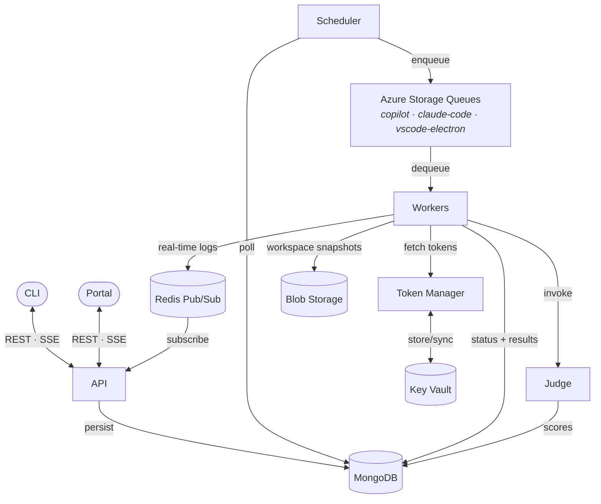
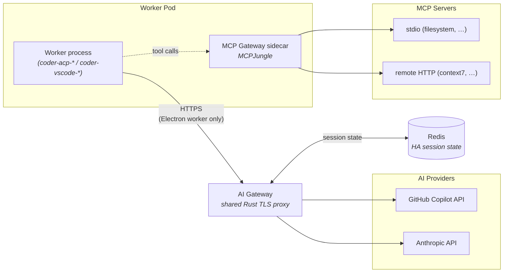

# Scope Core

> **Measure the agentic coding experience. Across agents. Across product surfaces. At scale.**

**Scope Core** measures the agentic experience of AI agents on Microsoft product surfaces at scale and drives their optimization, delivered as a self‑service, Kubernetes‑native platform supporting surfaces such as Skills, MCP, VS Code Extensions, and MS Learn, and observed across VS Code Copilot, GitHub Copilot CLI, and Claude Code CLI.

## Key Features

- **Self-service** — Any team member can submit runs, edit criteria, manage scenarios and personas, and inspect results through the Portal or CLI without operator involvement. The CLI maintains feature parity with the Portal so power users and CI/CD pipelines have first-class access too.
- **API-first** — Every Scope feature is exposed through a documented REST API (the Portal and CLI are just clients), enabling full integration with external systems, custom dashboards, and automation pipelines.
- **Centralized queue scheduling** — A dedicated [scheduler](apps/scheduler/) ([docs](docs/architecture/queue-scheduler.md)) decouples request ordering from message delivery. MongoDB stores priority and pause/resume state; Azure Storage Queues are kept deliberately shallow so scheduling decisions take effect within seconds and re-prioritization is always possible.
- **Run priorities** — Every request carries a root-level `priority` field (default `0`, higher dispatched first). Priority is editable on `pending` and `paused` requests via single and bulk REST endpoints, with a Portal UI offering −10…+10 presets and ±1/±5 increments.
- **Out-of-band (OOB) request support** — Because the scheduler dispatches by priority on every tick, OOB requests submitted with a high priority jump ahead of the pending queue and reach a worker on the next dispatch — without disturbing in-flight work or requiring a separate execution path.
- **Low-dimensional feature-space MDP modelisation** — Runs are aggregated into a Markov Decision Process state-transition graph over composite criteria state vectors. The space can be projected to any chosen subset of criteria to produce a sub-MDP, and start states are derived from extracted prompt features.
- **Cross-scenario analysis** — Combining **prompt-feature extraction** (stored on `TaskPromptDocument` and used to type the MDP start nodes), the **criteria DAG** as a trajectory ontology, and the **MDP** built across all runs makes it possible to compare agent trajectories across heterogeneous scenarios in a common state space rather than per-scenario in isolation.
- **Test variations support** — *Upcoming.* Compare a baseline profile against alternate profiles to analyse the impact of skills, extensions, and documentation changes on coding-agent outcomes.
- **Experiment analysis** — *Upcoming.* Dedicated experiment-level analysis (grouping runs into experiments and comparing them as cohorts) is not yet implemented.

## Components

| Component | Description |
|-----------|-------------|
| **API** (`apps/api`) | Express.js REST API — orchestrates runs, manages criteria CRUD, streams logs via SSE |
| **Judge** (`apps/judge`) | Evaluates completed runs against a criteria DAG using the Copilot SDK |
| **Portal** (`apps/portal`) | React 19 + Vite web UI for managing runs and editing the criteria DAG |
| **CLI** (`apps/cli`) | Commander + Ink TUI for submitting runs, streaming logs, and CI/CD automation |
| **AI Gateway** (`apps/gateway`) | Rust TLS-intercepting HTTP proxy with a plugin architecture — captures HAR traffic from Electron-based agents to upstream AI providers |
| **MCP Gateway** | Per-worker [MCPJungle](https://github.com/mcpjungle/MCPJungle) sidecar that aggregates stdio + remote MCP servers behind a single streamable HTTP endpoint, enabling ACP workers to use stdio-only servers (see [docs/architecture/mcp-gateway.md](docs/architecture/mcp-gateway.md)) |
| **Scheduler** (`apps/scheduler`) | Per-worker-type queue depth scheduler that drips requests from MongoDB into Azure Storage Queues |
| **Token Manager** (`apps/token-manager`) | Centralized GitHub token storage, validation, and round-robin distribution (Azure Key Vault / Lowkey Vault) |
| **coder-acp-copilot** | GitHub Copilot agent worker (ACP SDK) |
| **coder-acp-claude-code** | Claude Code agent worker (ACP SDK) |
| **report-generator** | Post-run evaluation report generator (Copilot SDK) |
| **model-scanners** | Feature detection for Copilot and Anthropic models |
| **version-checkers** | Poll for new releases of agents/tools (`acp-copilot`, `claude-code`, `vscode-electron`) |

## Architecture

For the full system overview, see [docs/architecture/overview.md](docs/architecture/overview.md).

### Run lifecycle



### Worker pod egress

Each ACP worker pod ships an **MCP Gateway** sidecar ([MCPJungle](https://github.com/mcpjungle/MCPJungle)) that aggregates stdio + remote HTTP MCP servers behind one streamable HTTP endpoint. The Electron worker additionally routes its HTTPS traffic through the shared **AI Gateway** (Rust TLS proxy) to record HAR transcripts of upstream Copilot/Anthropic calls — the gateway persists per-worker session state to Redis so multiple replicas can run for HA.



## Quick Start

### Prerequisites

- Node.js 22+
- [pnpm](https://pnpm.io/)
- Docker & Docker Compose — on macOS, [OrbStack](https://orbstack.dev/) is recommended over Docker Desktop (faster, lighter)
- [GitHub CLI](https://cli.github.com/) (`gh`) with authentication

### Run locally

```bash
pnpm install
GITHUB_TOKEN=$(gh auth token) pnpm docker:dev:copilot
```

This starts all core services (MongoDB, Redis, Azurite, API, Judge, Token Manager) plus the Copilot worker, report generator, and **portal** — with hot reload. Edit any source file and the running service restarts automatically.

### Accessing the Portal

Once the services are running, open the portal in your browser:

```
http://localhost:5100
```

Or use the convenience command to open it automatically:

```bash
pnpm open:portal
```

> **Worktree note:** In a [git worktree](#git-worktree-support), ports are offset for isolation so the portal may run on a different port (e.g. `5103`). Check `PORTAL_PORT` in your `.env` file for the actual port, or just run `pnpm open:portal` — it reads `.env` and opens the correct URL.

### Enabling the Portal AI features (optional)

The portal has three AI-assisted flows — criteria prompt generation,
prompt-feature extract/generate, and task-prompt generate/variation. They
need a chat-completions backend. Resolution order in
[`apps/api/src/llm-token.ts`](apps/api/src/llm-token.ts) — first source
that returns a credential wins, with no automatic failover at request
time:

| # | Source | Trigger |
|---|--------|---------|
| 1 | Azure AI Foundry via env vars | `AZURE_AI_INFERENCE_ENDPOINT` + `AZURE_AI_INFERENCE_API_KEY` (recommended for local dev, set in `.env.local`) |
| 2 | Azure AI Foundry via Token Manager | `azure-ai-foundry` key at Portal `/secrets/keys/new` (recommended for integration / prod) |
| 3 | GitHub Models via env var | `GITHUB_MODELS_API_KEY` |
| 4 | GitHub Models via Token Manager | `github-models` key at `/secrets/keys/new` |
| 5 | Bare GitHub token | `GITHUB_TOKEN` (slow public fallback) |

Foundry always beats GitHub Models, and env vars beat the Token Manager
within each backend. See
[`ENV_VARIABLES.md`](ENV_VARIABLES.md#llm-configuration-portal-ai-features)
for the full table and the no-failover semantics.

Quick local setup with Foundry:

```bash
cp .env.local.example .env.local
# fill in AZURE_AI_INFERENCE_ENDPOINT (must end in /models),
# AZURE_AI_INFERENCE_API_KEY, and LLM_MODEL
docker compose up -d --force-recreate --no-deps api
```

> Compose only re-reads `env_file:` on container **create**, so
> `docker compose restart api` won't pick up `.env.local` edits — use
> `--force-recreate` (or restart the whole stack).

Each AI call logs the resolved provider, e.g.

```
[llm-token] inference provider: source=azure-ai-foundry via=azure-ai-foundry-env endpoint=… model=gpt-4.1-mini
```

If nothing is configured the portal renders a single actionable error
("LLM not configured … register a key at /secrets/keys/new …"). See
[`ENV_VARIABLES.md`](ENV_VARIABLES.md#llm-configuration-portal-ai-features)
for full variable docs.

### Other useful commands

```bash
# Start only infrastructure services (MongoDB, Redis, Azurite, Lowkey Vault)
pnpm docker:up:infra

# Run individual services locally (after starting infra)
pnpm dev:api
pnpm dev:portal
pnpm dev:token-manager
pnpm dev:coder-acp-copilot
pnpm dev:coder-acp-claude-code
```

### VS Code Shortcuts

The repo includes `.vscode/launch.json` and `.vscode/tasks.json` for common dev workflows:

| Shortcut | Action | What it runs |
|----------|--------|-------------|
| **F5** | Start Debugging | `GITHUB_TOKEN=$(gh auth token) pnpm docker:dev:copilot` |
| **Run Task → Open Portal** | Open portal in browser | `pnpm open:portal` |

**F5** injects your GitHub token automatically via `gh auth token` and starts Docker Compose with hot reload.

To bind **Open Portal** to a key (e.g. F6), add this to your user keybindings (`Cmd+K Cmd+S` → JSON):

```json
{ "key": "f6", "command": "workbench.action.tasks.runTask", "args": "Open Portal" }
```

### Hot Reload with Docker Compose

The `docker:dev:*` commands use [Docker Compose Watch](https://docs.docker.com/compose/how-tos/file-watch/) to sync source files into containers:

```bash
pnpm docker:dev:claude-code    # Core + Claude Code + Report Generator + Portal
pnpm docker:dev:copilot        # Core + Copilot + Report Generator + Portal
pnpm docker:dev:portal         # Core + Portal (Vite HMR)
pnpm docker:dev:all            # All services
```

| Change | Reload Time |
|--------|-------------|
| Service source (`apps/*/src`) | ~1-2s (tsx watch restart) |
| Shared package (`packages/shared/src`) | ~2-3s (tsc recompile + tsx restart) |
| Portal source (`apps/portal/src`) | Instant (Vite HMR) |
| Config files (`config/`) | ~1-2s (tsx watch restart) |
| Dependencies (`package.json`, lockfile) | Full rebuild (~30-60s) |

### Git Worktree Support

Docker Compose works seamlessly in [git worktrees](https://git-scm.com/docs/git-worktree). The `scripts/worktree-env.ts` script runs automatically before every `docker:*` / `pnpm docker:*` command and assigns each worktree a unique port offset so multiple stacks can run in parallel without conflicts.

- **Main repo**: offset 0 — base ports used as-is (e.g. API on 3100, MongoDB on 27100)
- **Worktrees**: offset 1–99 — ports are shifted (e.g. offset 1 → API on 3101, MongoDB on 27101)
- The offset is persisted in a `.port-offset` file inside each worktree and reused across restarts.

No manual configuration is needed — just run `pnpm docker:dev:copilot` from any worktree.

### Docker Access for Agents

Worker containers mount the host Docker socket by default, enabling agents to run Docker commands during Build/Test gate scenarios. This is the local development equivalent of the kubedock sidecar used in Kubernetes.

**How it works:**
- The host's Docker socket is mounted into the worker container
- `DOCKER_HOST=unix:///var/run/docker.sock` is set automatically
- The `node` user is granted socket access via `group_add`

**Platform configuration:**

| Platform | Configuration | Notes |
|----------|--------------|-------|
| Docker Desktop (macOS/Windows) | Works out of the box | Default socket path and GID 0 |
| Docker Engine (Linux) | Set `DOCKER_GID=$(stat -c '%g' /var/run/docker.sock)` | Socket GID varies by distro |
| Podman (macOS) | Set `DOCKER_SOCK=/run/podman/podman.sock` | Socket path inside Podman VM |

Environment variables (set in `.env` or inline):
- `DOCKER_SOCK` — Path to Docker-compatible socket (default: `/var/run/docker.sock`)
- `DOCKER_GID` — GID of the socket file for group access (default: `0`)

**Example: Submit a gated run with Docker operations:**

```bash
# Start the stack
GITHUB_TOKEN=$(gh auth token) pnpm docker:dev:copilot

# From another terminal, submit a run
npx tsx apps/cli/src/index.ts run submit \
  -m "Run 'docker run -d --name test-pg -e POSTGRES_PASSWORD=test postgres:16-alpine' then verify with 'docker exec test-pg psql -U postgres -c SELECT 1'. Remove the container when done." \
  -w coder-acp-copilot \
  -c "Agent successfully ran a Docker container and queried it" \
  --max-iterations 1 \
  --gates '[{"gate":"select","maxIterations":1},{"gate":"build","promptText":"Pull the postgres:16-alpine Docker image and start a container","maxIterations":1},{"gate":"test","promptText":"Verify the container responds to a query via docker exec","maxIterations":1}]' \
  -u http://localhost:3100 \
  --no-stream
```

> **Note:** In Kubernetes, kubedock provides `localhost` port-forward access to spawned containers. In Compose, spawned containers are accessible via Docker network names or published ports (`-p`) instead. Agents using `docker exec` for verification (the common case) work identically in both environments.

> **Note:** Container cleanup (`purgeContainers`) is disabled in Compose (controlled by `KUBEDOCK_ENABLED` env var, only set in K8s manifests). Orphaned containers from local dev runs must be cleaned up manually with `docker rm`.

### Environment Variables

See [ENV_VARIABLES.md](ENV_VARIABLES.md) for a full reference of configurable environment variables.

## CLI

The CLI is the primary interface for interacting with Scope. Show available commands with:

```bash
pnpm cli --help
```

It is organized into subcommand groups (`run`, `agent`, `criteria`, …). Use `--help` at any level to discover options:

```bash
pnpm cli run --help
pnpm cli run submit --help
pnpm cli agent --help
pnpm cli agent version list -i coder-acp-copilot
pnpm cli criteria --help
```

### Submitting a run

```bash
# Submit with explicit model and agent version
pnpm cli run submit -m "Create a Hello World API" -w coder-acp-copilot \
  --model claude-sonnet-4 --agent-version copilot-0.0.415

# Model and agent version are required; if omitted the API auto-selects:
# - model: uses the agent's defaultModel (set by model scanner)
# - agent version: uses the latest active version (by registration date)
```

### Managing agent versions

```bash
# List active versions for an agent
pnpm cli agent version list -i coder-acp-copilot --status active

# JSON output for scripting
pnpm cli agent version list -i coder-acp-copilot -o json
```

## Configuration

Personas, scenarios, criteria, and prompt features are stored in **MongoDB** as the source of truth — they can be exported/imported as YAML for portability and version control. The `config/` directory contains the canonical YAML examples:

| Directory | Purpose |
|-----------|---------|
| `config/criteria/` | Evaluation criteria forming a DAG (consumed by the Judge) |
| `config/personas/` | Reviewer personas (e.g. `demanding-senior`, `friendly-senior`, `vibe-coder`) |
| `config/scenarios/` | Benchmark scenario / task definitions |
| `config/prompt-features/` | Feature flags tracking what capabilities agents request |
| `config/lowkey-vault/` | Lowkey Vault import templates for local dev |
| `config/traits.yaml` | Trait dimensions (personality, experience, verbosity, type) |

## Documentation

The [`docs/`](docs/README.md) directory contains architecture and research documentation:

| Path | Contents |
|------|----------|
| `docs/architecture/` | System design — app design, criteria provider, DB migrations, token manager, skills |
| `docs/research/` | Research spikes — delta storage, real-time data flow |

## Deployment

Scope Core is a Kubernetes-native application deployed via [FluxCD](https://fluxcd.io/) GitOps. The `deploy/` directory contains Kustomize base manifests and environment overlays that FluxCD reconciles automatically.

Infrastructure provisioning (AKS cluster, Azure resources) is managed in the [scope-mt-infra](https://github.com/growth-ecosystems/scope-mt-infra) repository.

## Project Structure

```
scope-core/
├── apps/
│   ├── api/                                    # REST API + SSE
│   ├── cli/                                    # CLI (commander + ink TUI)
│   ├── gateway/                                # AI Gateway — Rust TLS proxy with plugin architecture
│   ├── judge/                                  # Criteria DAG evaluator
│   ├── portal/                                 # React + Vite web UI
│   ├── scheduler/                              # Queue-depth scheduler (MongoDB → Azure Queues)
│   ├── token-manager/                          # Token storage / validation / distribution
│   ├── model-scanners/
│   │   ├── anthropic/                          # Anthropic model scanner
│   │   └── copilot/                            # Copilot model scanner
│   ├── version-checkers/
│   │   ├── acp-copilot/                        # Copilot ACP version polling
│   │   ├── claude-code/                        # Claude Code version polling
│   │   └── vscode-electron/                    # VS Code Electron version polling
│   └── workers/
│       ├── coder-acp-claude-code/              # Claude Code worker (ACP)
│       ├── coder-acp-copilot/                  # Copilot worker (ACP)
│       └── report-generator/                   # Report generation worker
├── packages/
│   ├── shared/                                 # Shared library (types, models, queue/blob/redis clients)
│   ├── copilot-driver-ext/                     # VS Code extension exposing Copilot Chat over HTTP
│   ├── db-migrations/                          # MongoDB migration framework (mongo-migrate-ts)
│   ├── github-auth/                            # GitHub OAuth / device-code utilities
│   ├── model-scanning/                         # Shared model scanning logic
│   └── version-checking/                       # Version comparison utilities
├── config/
│   ├── criteria/                               # Evaluation criteria YAML definitions
│   ├── personas/                               # Reviewer persona configurations
│   ├── scenarios/                              # Benchmark scenario definitions
│   ├── prompt-features/                        # Prompt feature flag definitions
│   ├── lowkey-vault/                           # Lowkey Vault import templates (local dev)
│   └── traits.yaml                             # Trait dimensions
├── deploy/
│   ├── base/                                   # Kustomize base manifests (services + workers)
│   ├── overlays/                               # Environment overlays (integration, preview, prod)
│   ├── image-automation/                       # FluxCD ImageUpdateAutomation + ImagePolicy
│   └── pr-envs/                                # PR preview environments
├── docs/                                       # Architecture & research documentation
├── infra/                                      # Bicep infrastructure (CI/CD identity, etc.)
├── scripts/                                    # Utility scripts
├── docker-compose.yml
└── package.json
```
