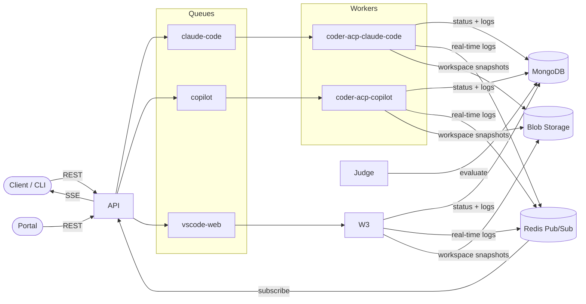

# Scope

**Scope** is a Kubernetes-native platform for benchmarking AI coding agents. It orchestrates coding tasks across multiple agent workers, evaluates results using a criteria DAG, and provides real-time log streaming — all backed by MongoDB, Redis, and Azure Storage Queues. The application is deployed via FluxCD GitOps with Kustomize overlays and runs on AKS.

## Components

| Component | Description |
|-----------|-------------|
| **API** | Express.js REST API — routes requests to workers, streams logs via SSE |
| **Judge** | Evaluates completed runs against a criteria DAG using Copilot SDK |
| **Portal** | React web UI for managing and inspecting runs |
| **CLI** | Command-line interface for submitting runs, managing criteria, and more |
| **coder-acp-claude-code** | Claude Code agent worker (ACP) |
| **coder-acp-copilot** | GitHub Copilot agent worker (ACP) |
| **report-generator** | Generates evaluation reports from completed runs |

## Architecture



## Quick Start

### Prerequisites

- Node.js 22+
- [pnpm](https://pnpm.io/)
- Docker & Docker Compose — on macOS, [OrbStack](https://orbstack.dev/) is recommended over Docker Desktop (faster, lighter)
- [GitHub CLI](https://cli.github.com/) (`gh`) with authentication

### Run locally

```bash
pnpm install
GITHUB_TOKEN=$(gh auth token) pnpm docker:dev:copilot
```

This starts all core services (MongoDB, Redis, Azurite, API, Judge, Token Manager) plus the Copilot worker, report generator, and **portal** — with hot reload. Edit any source file and the running service restarts automatically.

### Accessing the Portal

Once the services are running, open the portal in your browser:

```
http://localhost:5100
```

Or use the convenience command to open it automatically:

```bash
pnpm open:portal
```

> **Worktree note:** In a [git worktree](#git-worktree-support), ports are offset for isolation so the portal may run on a different port (e.g. `5103`). Check `PORTAL_PORT` in your `.env` file for the actual port, or just run `pnpm open:portal` — it reads `.env` and opens the correct URL.

### Other useful commands

```bash
# Start only infrastructure services (MongoDB, Redis, Azurite)
pnpm docker:up:infra

# Run individual services locally (after starting infra)
pnpm dev:api
pnpm dev:portal
pnpm dev:coder-acp-copilot
pnpm dev:coder-acp-claude-code
```

### Hot Reload with Docker Compose

The `docker:dev:*` commands use [Docker Compose Watch](https://docs.docker.com/compose/how-tos/file-watch/) to sync source files into containers:

```bash
pnpm docker:dev:claude-code    # Core + Claude Code + Report Generator + Portal
pnpm docker:dev:copilot        # Core + Copilot + Report Generator + Portal
pnpm docker:dev:portal         # Core + Portal (Vite HMR)
pnpm docker:dev:all            # All services
```

| Change | Reload Time |
|--------|-------------|
| Service source (`apps/*/src`) | ~1-2s (tsx watch restart) |
| Shared package (`packages/shared/src`) | ~2-3s (tsc recompile + tsx restart) |
| Portal source (`apps/portal/src`) | Instant (Vite HMR) |
| Config files (`config/`) | ~1-2s (tsx watch restart) |
| Dependencies (`package.json`, lockfile) | Full rebuild (~30-60s) |

### Git Worktree Support

Docker Compose works seamlessly in [git worktrees](https://git-scm.com/docs/git-worktree). The `scripts/worktree-env.ts` script runs automatically before every `docker:*` / `pnpm docker:*` command and assigns each worktree a unique port offset so multiple stacks can run in parallel without conflicts.

- **Main repo**: offset 0 — base ports used as-is (e.g. API on 3100, MongoDB on 27100)
- **Worktrees**: offset 1–99 — ports are shifted (e.g. offset 1 → API on 3101, MongoDB on 27101)
- The offset is persisted in a `.port-offset` file inside each worktree and reused across restarts.

No manual configuration is needed — just run `pnpm docker:dev:copilot` from any worktree.

### Environment Variables

See [ENV_VARIABLES.md](ENV_VARIABLES.md) for a full reference of configurable environment variables.

## CLI

The CLI is the primary interface for interacting with Scope. Show available commands with:

```bash
pnpm cli --help
```

It is organized into subcommand groups (`run`, `agent`, `criteria`, …). Use `--help` at any level to discover options:

```bash
pnpm cli run --help
pnpm cli run submit --help
pnpm cli agent --help
pnpm cli agent version list -i coder-acp-copilot
pnpm cli criteria --help
```

### Submitting a run

```bash
# Submit with explicit model and agent version
pnpm cli run submit -m "Create a Hello World API" -w coder-acp-copilot \
  --model claude-sonnet-4 --agent-version copilot-0.0.415

# Model and agent version are required; if omitted the API auto-selects:
# - model: uses the agent's defaultModel (set by model scanner)
# - agent version: uses the latest active version (by registration date)
```

### Managing agent versions

```bash
# List active versions for an agent
pnpm cli agent version list -i coder-acp-copilot --status active

# JSON output for scripting
pnpm cli agent version list -i coder-acp-copilot -o json
```

## Configuration

The `config/` directory contains YAML-based configuration for the evaluation system:

| Directory | Purpose |
|-----------|---------|
| `config/criteria/` | Evaluation criteria definitions (used by the Judge DAG) |
| `config/personas/` | Judge personas (e.g. `demanding-senior`, `friendly-senior`) |
| `config/scenarios/` | Benchmark scenario definitions |
| `config/traits.yaml` | Trait dimensions (personality, experience, verbosity, type) |

## Documentation

The [`docs/`](docs/README.md) directory contains architecture and research documentation:

| Path | Contents |
|------|----------|
| `docs/architecture/` | System design — app design, criteria provider, DB migrations, token manager, skills |
| `docs/research/` | Research spikes — delta storage, real-time data flow |

## Deployment

Scope is a Kubernetes-native application deployed via [FluxCD](https://fluxcd.io/) GitOps. The `deploy/` directory contains Kustomize base manifests and environment overlays that FluxCD reconciles automatically.

Infrastructure provisioning (AKS cluster, Azure resources) is managed in the [scope-mt-infra](https://github.com/growth-ecosystems/scope-mt-infra) repository.

## Project Structure

```
scope-mt-app/
├── apps/
│   ├── api/                          # REST API + SSE
│   ├── cli/                          # CLI (commander + ink TUI)
│   ├── judge/                        # Criteria DAG evaluator
│   ├── portal/                       # React + Vite web UI
│   ├── model-scanners/
│   │   ├── anthropic/                # Anthropic model scanner
│   │   └── copilot/                  # Copilot model scanner
│   ├── token-manager/                # Token management service
│   └── workers/
│       ├── coder-acp-claude-code/    # Claude Code worker (ACP)
│       ├── coder-acp-copilot/        # Copilot worker (ACP)
│       └── report-generator/         # Report generation worker
├── packages/
│   ├── shared/                       # Shared library (criteria graph, MongoDB, Redis, etc.)
│   ├── db-migrations/                # Database migration scripts
│   └── model-scanning/               # Model scanning library
├── config/
│   ├── criteria/                     # Evaluation criteria YAML definitions
│   ├── personas/                     # Judge persona configurations
│   ├── scenarios/                    # Benchmark scenario definitions
│   └── traits.yaml                   # Trait dimensions
├── deploy/
│   ├── base/                         # Kustomize base manifests
│   ├── overlays/                     # Environment overlays (integration, preview, prod)
│   ├── image-automation/             # FluxCD image automation
│   └── pr-envs/                      # PR preview environments
├── docs/                             # Architecture & research documentation
├── scripts/                          # Utility scripts
├── docker-compose.yml
└── package.json
```
