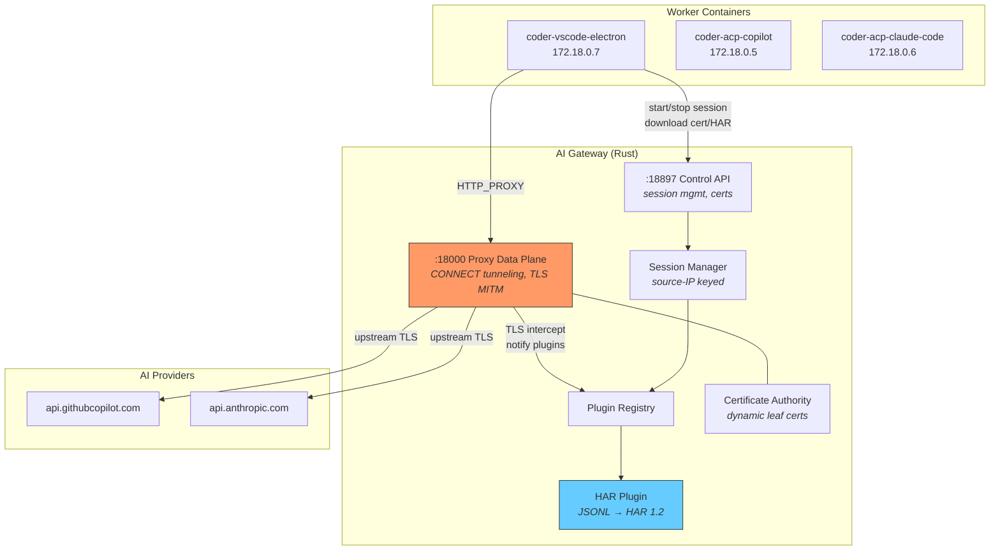
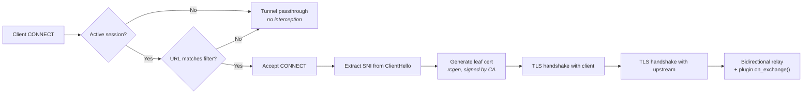
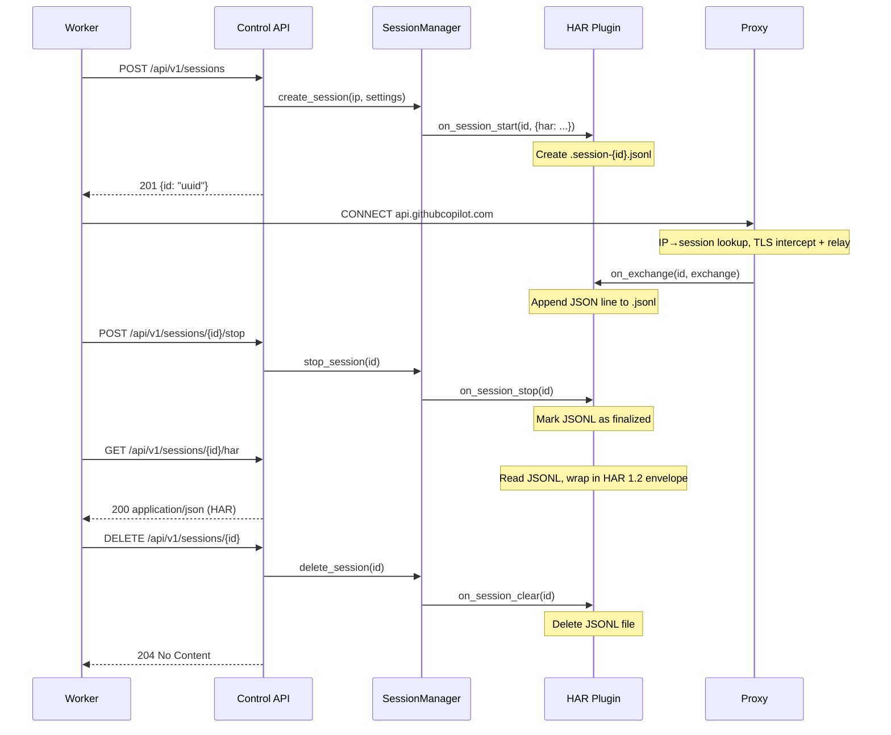

# AI Gateway

The AI gateway is a shared Rust TLS-intercepting proxy that sits between coding agent workers and upstream AI providers (GitHub Copilot, Anthropic). It replaces per-worker DevProxy sidecars with a single centralized service, reducing memory usage and enabling a plugin architecture for traffic inspection and modification.

**Source:** [`apps/gateway/`](../../apps/gateway/)

## Architecture



## Session Identity

Sessions are keyed by **source IP** (`peer_addr.ip()`). Each worker container has a unique IP on the Docker/Kubernetes network, so the gateway automatically associates both API calls and proxy traffic with the correct session.

- **Docker Compose**: each container gets a unique IP on the bridge network
- **Kubernetes**: each pod gets a unique IP
- **No custom headers needed** — source IP is used everywhere

## Control API

The REST API runs on port **18897** and provides session management plus plugin endpoints:

| Endpoint | Method | Purpose |
|----------|--------|---------|
| `/healthz` | `GET` | K8s liveness/readiness health check |
| `/api/v1/cacert` | `GET` | Download the CA certificate (PEM) |
| `/api/v1/sessions` | `POST` | Create a session → returns `{ id }` |
| `/api/v1/sessions` | `GET` | List all sessions |
| `/api/v1/sessions/{id}` | `GET` | Session status |
| `/api/v1/sessions/{id}/stop` | `POST` | Stop recording, finalize plugin data |
| `/api/v1/sessions/{id}/har` | `GET` | Download the HAR file |
| `/api/v1/sessions/{id}` | `DELETE` | Delete session and clean up |

Sessions are identified by a **UUID** returned from `POST /api/v1/sessions`. The gateway also maintains a reverse index from source IP to session ID, so the proxy data plane can associate traffic with the correct session without custom headers.

### Session Create

```json
POST /api/v1/sessions
{
  "plugins": {
    "har": {
      "redactSensitiveHeaders": true
    }
  }
}
→ 201 Created
{
  "id": "550e8400-e29b-41d4-a716-446655440000"
}
```

Each key under `plugins` maps to a registered plugin name. The value is passed to that plugin's `on_session_start`. Unrecognized plugin keys are ignored.

## Proxy Data Plane

The proxy runs on port **18000** and handles three types of traffic:

1. **CONNECT tunneling with TLS interception** — for HTTPS traffic matching URL filters. The proxy accepts the CONNECT request, performs a TLS handshake with the client using a dynamically generated leaf certificate, connects to the upstream with real TLS, and relays traffic bidirectionally while notifying plugins of each exchange.
2. **CONNECT passthrough** — for HTTPS traffic not matching URL filters, or when no session is active. Traffic is tunneled without interception.
3. **Plain HTTP forwarding** — for unencrypted HTTP requests (rare in production).



### TLS Certificate Generation

- On startup, the gateway generates (or loads from `/certs/`) a self-signed CA key pair
- For each intercepted TLS connection, a leaf certificate is generated for the SNI domain using `rcgen`, signed by the CA
- Leaf certs are cached in an in-memory LRU cache (~1000 entries, 24h TTL)
- Workers download the CA cert via `GET /api/v1/cacert` and install it as `NODE_EXTRA_CA_CERTS`

## Plugin Architecture

The proxy core knows nothing about HAR, metrics, or any specific observation format. All traffic observation is handled by **plugins** — Rust trait objects registered at startup.

```rust
#[async_trait]
pub trait ProxyPlugin: Send + Sync {
    fn name(&self) -> &str;
    fn on_session_start(&self, session_id: &SessionId, settings: &Value);
    fn on_exchange(&self, session_id: &SessionId, exchange: &HttpExchange);
    fn on_session_stop(&self, session_id: &SessionId);
    fn on_session_clear(&self, session_id: &SessionId);
    fn api_routes(&self) -> Option<axum::Router> { None }
}
```

Plugins are registered in `main.rs` at startup. The `PluginRegistry` broadcasts events to all registered plugins.

### HAR Plugin

The HAR plugin is the first built-in plugin. It captures HTTP traffic as HAR 1.2 files using disk-based buffering.

**Lifecycle:**



**Key behaviors:**

- **Disk-based buffering**: Each session writes to a JSONL file (`/har-output/.session-{ip}.jsonl`), one JSON line per HTTP exchange. No in-memory accumulation.
- **Sensitive header redaction**: When `redactSensitiveHeaders` is `true` (default), headers like `authorization`, `x-github-token`, `x-api-key`, `cookie`, and `set-cookie` are redacted at write time. Secrets never touch disk.
- **On-the-fly HAR assembly**: `GET /proxy/har` reads the JSONL file and wraps the entries in a HAR 1.2 envelope. No separate `.har` file is stored.
- **Idempotent reads**: The JSONL file can be read multiple times (safe for retries). It is deleted on session cleanup (next `on_session_start` or idle reap).

### Timestamps

All HAR timestamps are in **UTC**. The `startedDateTime` field uses RFC 3339 format with millisecond precision and `Z` suffix (e.g. `2026-04-28T08:25:03.123Z`).

| Field | Source | Format |
|-------|--------|--------|
| `startedDateTime` | `chrono::Utc::now()` at request start | RFC 3339, ms precision, `Z` suffix |
| `time` | `send + wait + receive` | Milliseconds (float) |
| `timings.wait` | `Instant::elapsed()` at response headers received (TTFB) | Milliseconds (float) |
| `timings.receive` | `elapsed_ms - wait_ms` | Milliseconds (float) |

RFC 3339 is a strict subset of ISO 8601 — the key difference is that RFC 3339 **requires** a timezone offset (the gateway always uses `Z` for UTC), while ISO 8601 allows omitting it. The `to_rfc3339_opts(SecondsFormat::Millis, true)` call in `writer.rs` enforces the `Z` suffix rather than `+00:00`.

## Session Lifecycle

| Event | Trigger | What happens |
|-------|---------|--------------|
| **Create** | `POST /api/v1/sessions` | Assign UUID, clear any existing session for this IP, create new session, notify plugins |
| **Active** | Proxy traffic from session IP | IP→session lookup, TLS interception + plugin `on_exchange()` |
| **Stop** | `POST /api/v1/sessions/{id}/stop` | Mark session inactive, notify plugins to finalize |
| **Delete** | `DELETE /api/v1/sessions/{id}` or idle timeout | Delete session state, notify plugins to clean up temp files |
| **Passthrough** | Traffic from IP with no active session | Forward directly, no interception, no plugin notification |

Idle sessions are reaped after a configurable timeout (default: 5 minutes). Max concurrent sessions: 100.

## TypeScript Client

Workers interact with the gateway through the `GatewayClient` class in `packages/shared/src/devproxy/gateway-client.ts`. The `createProxyClient()` factory in `packages/shared/src/devproxy/index.ts` selects between `GatewayClient` and `DevProxyClient` based on the `PROXY_BACKEND` env var:

| `PROXY_BACKEND` | Client | Description |
|-----------------|--------|-------------|
| `gateway` (default) | `GatewayClient` → adapter | Shared Rust gateway, HAR downloaded via HTTP |
| `devproxy` | `DevProxyClient` → adapter | Legacy .NET DevProxy sidecar, HAR from filesystem |

Both adapters converge on `extractHarMetadata()` from `packages/shared/src/har/extract-metadata.ts` to produce the same `HarCollectionResult` (harFilePath, tokenUsage, tool calls, AI call count).

## Project Structure

```
apps/gateway/
├── Cargo.toml
├── Dockerfile                  # Multi-stage: builder → dev (cargo-watch) → alpine runtime
├── src/
│   ├── main.rs                 # Entry point, CLI args, signal handling
│   ├── config.rs               # Configuration (ports, URL filters, cert paths)
│   ├── session.rs              # Source-IP session manager
│   ├── plugin.rs               # ProxyPlugin trait + PluginRegistry
│   ├── api/
│   │   ├── server.rs           # Axum REST API on :18897
│   │   └── routes.rs           # /healthz, /api/v1/sessions, /api/v1/cacert
│   ├── ca/
│   │   └── generator.rs        # CA key pair generation + leaf cert signing (rcgen)
│   ├── filters/
│   │   └── url_matcher.rs      # Glob-based URL matching (urlsToWatch)
│   ├── plugins/
│   │   └── har/
│   │       ├── plugin.rs       # HarPlugin: impl ProxyPlugin
│   │       ├── writer.rs       # HAR 1.2 JSON serializer
│   │       └── types.rs        # HAR data model (serde)
│   └── proxy/
│       ├── handler.rs          # CONNECT tunneling + plain HTTP forwarding
│       └── tls.rs              # TLS interception, dynamic cert generation
└── tests/                      # 44 unit + 14 integration tests
```

## Configuration

```yaml
urlsToWatch:
  - "https://api.githubcopilot.com/*"
  - "https://api.anthropic.com/*"
port: 18000
apiPort: 18897
harOutputDir: /har-output
certDir: /certs
logLevel: info
defaultPluginSettings:
  har:
    redactSensitiveHeaders: true
```

## Docker Compose

The gateway runs as a shared service in Docker Compose, available to all workers:

```yaml
gateway:
  build:
    context: ./apps/gateway
    target: dev
  ports:
    - "18000:18000"
    - "18897:18897"
  healthcheck:
    test: ["CMD", "wget", "-q", "--spider", "http://localhost:18897/proxy"]
    interval: 5s
    retries: 10
```

Workers connect via `HTTP_PROXY=http://gateway:18000` and `DEV_PROXY_API_URL=http://gateway:18897`.

## Kubernetes Deployment

The gateway runs as a standalone Deployment (not a sidecar) in the `scoped` namespace:

- **2 replicas** for high availability
- **Service** with `sessionAffinity: ClientIP` (10 min timeout) — ensures a worker's API calls and proxy traffic hit the same gateway pod
- **Resources**: 100m CPU / 128Mi memory (requests), 500m CPU / 512Mi memory (limits) per pod

Workers that use the gateway (currently VS Code Electron) have their DevProxy sidecar **removed entirely**. The worker pod drops from 3 containers to 1, and proxy URLs point to the gateway Service:

```yaml
env:
  - name: PROXY_BACKEND
    value: "gateway"
  - name: DEV_PROXY_API_URL
    value: "http://gateway-service.scoped.svc.cluster.local:18897"
  - name: HTTP_PROXY
    value: "http://gateway-service.scoped.svc.cluster.local:18000"
```

**Manifests:** [`deploy/base/gateway.yaml`](../../deploy/base/gateway.yaml), [`deploy/base/gateway-config.yaml`](../../deploy/base/gateway-config.yaml)

## Future Plugins

| Phase | Plugin | Purpose |
|-------|--------|---------|
| 1.b | Copilot Token Refresh | Auto-refresh expired Copilot tokens (#669) |
| 1.c | CAPI HMAC Signing | Sign requests with HMAC for Copilot API |
| 2.b | Rate Limiting | Budget-aware rate limiting for Claude Code (#659) |
| 3 | Metrics | Prometheus `/metrics` — request counts, latency, bytes, error rates |
