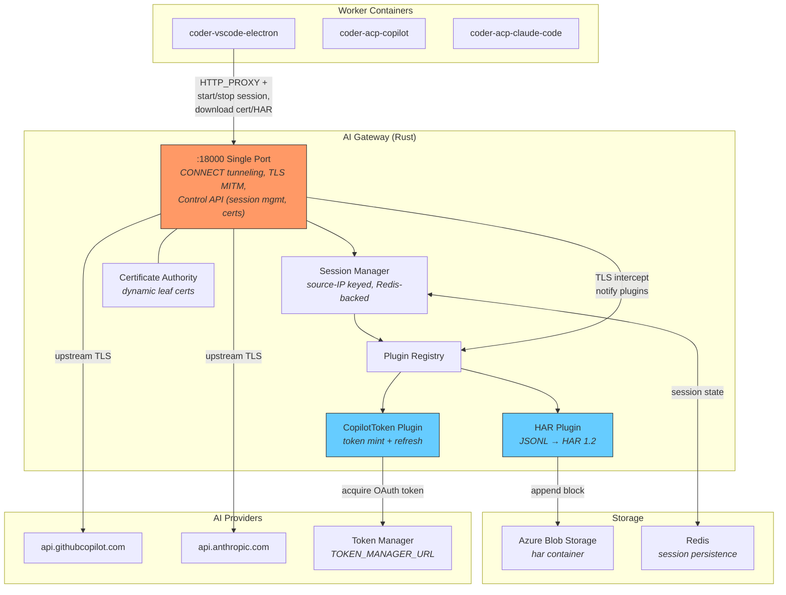
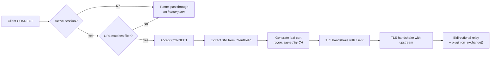
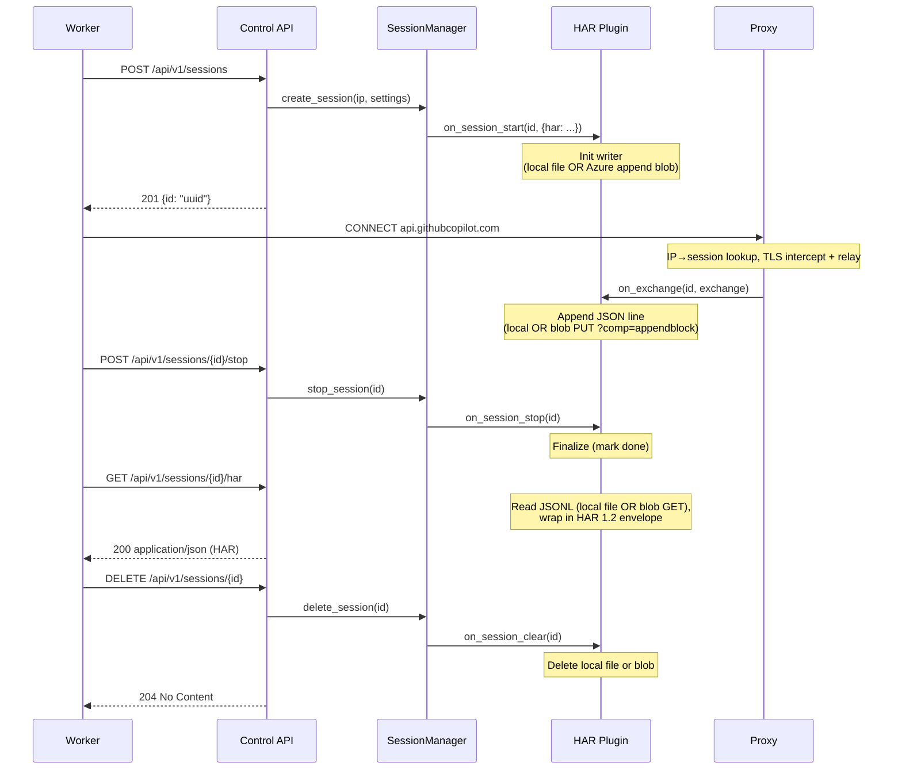
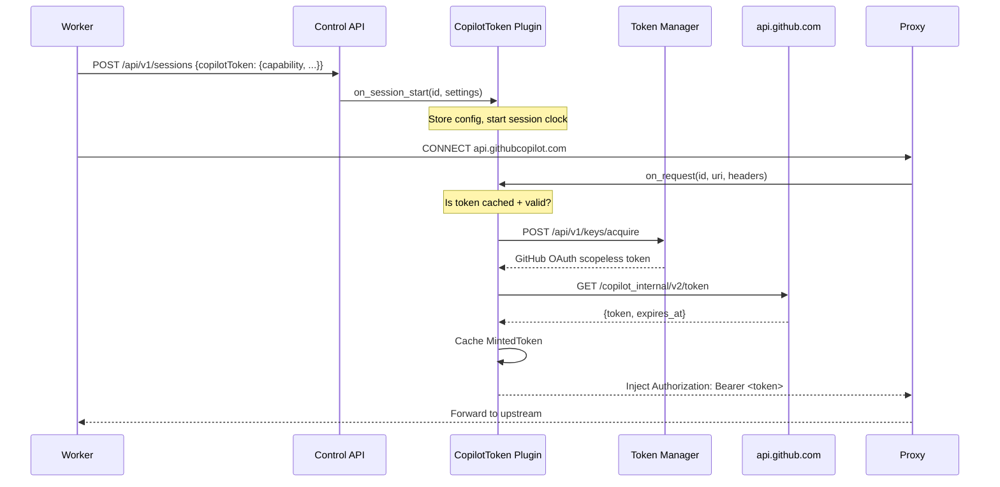
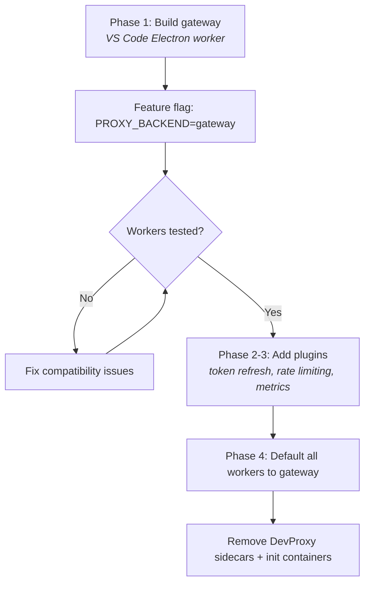

# AI Gateway

The AI gateway is a shared Rust TLS-intercepting proxy that sits between coding agent workers and upstream AI providers (GitHub Copilot, Anthropic). It replaces per-worker DevProxy sidecars with a single centralized service, reducing memory usage and enabling a plugin architecture for traffic inspection and modification.

**Source:** [`apps/gateway/`](../../apps/gateway/)

## Motivation

The platform previously used [Microsoft DevProxy](https://github.com/dotnet/dev-proxy) (a .NET tool) as a per-worker sidecar to intercept HTTPS traffic and record HAR files. This had several drawbacks:

| Issue | Detail |
|-------|--------|
| **Image size** | `ghcr.io/dotnet/dev-proxy:2.1.0` pulls ~200 MB; requires .NET runtime |
| **Init container** | Needs a busybox init sidecar to fix UID 1000 volume permissions |
| **Sidecar sprawl** | 3 containers per worker (DevProxy + init + MCP gateway) × N workers |
| **Control API surface** | Only exposes start/stop recording + cert download; no hooks for real-time inspection |
| **Opacity** | Closed-source plugin model (HarGeneratorPlugin DLL); hard to extend or debug |

The Rust gateway replaces all of these with a **single shared service** (~23 MB alpine image, no init containers), using source-IP-based sessions to isolate traffic per worker.

## Architecture



## Session Identity

Sessions are keyed by **source IP** (`peer_addr.ip()`). Each worker container has a unique IP on the Docker/Kubernetes network, so the gateway automatically associates both API calls and proxy traffic with the correct session.

- **Docker Compose**: each container gets a unique IP on the bridge network
- **Kubernetes**: each pod gets a unique IP
- **No custom headers needed** — source IP is used everywhere

## Control API

The REST API is served on the same port as the proxy (**18000**) and provides session management plus plugin endpoints:

| Endpoint | Method | Purpose |
|----------|--------|---------|
| `/health` | `GET` | K8s liveness/readiness health check |
| `/api/v1/cacert` | `GET` | Download the CA certificate (PEM) |
| `/api/v1/sessions` | `POST` | Create a session → returns `{ id }` |
| `/api/v1/sessions` | `GET` | List all sessions |
| `/api/v1/sessions/{id}` | `GET` | Session status |
| `/api/v1/sessions/{id}/stop` | `POST` | Stop recording, finalize plugin data |
| `/api/v1/sessions/{id}/har` | `GET` | Download the HAR file |
| `/api/v1/sessions/{id}` | `DELETE` | Delete session and clean up |

Sessions are identified by a **UUID** returned from `POST /api/v1/sessions`. The gateway also maintains a reverse index from source IP to session ID, so the proxy data plane can associate traffic with the correct session without custom headers.

### Session Create

```json
POST /api/v1/sessions
{
  "plugins": {
    "har": {
      "redactCredentials": true
    }
  }
}
→ 201 Created
{
  "id": "550e8400-e29b-41d4-a716-446655440000"
}
```

Each key under `plugins` maps to a registered plugin name. The value is passed to that plugin's `on_session_start`. Unrecognized plugin keys are ignored.

## Proxy Data Plane

The proxy runs on port **18000** and handles three types of traffic:

1. **CONNECT tunneling with TLS interception** — for HTTPS traffic matching URL filters. The proxy accepts the CONNECT request, performs a TLS handshake with the client using a dynamically generated leaf certificate, connects to the upstream with real TLS, and relays traffic bidirectionally while notifying plugins of each exchange.
2. **CONNECT passthrough** — for HTTPS traffic not matching URL filters, or when no session is active. Traffic is tunneled without interception.
3. **Plain HTTP forwarding** — for unencrypted HTTP requests (rare in production).



### TLS Certificate Generation

- On startup, the gateway generates (or loads from `/certs/`) a self-signed CA key pair
- For each intercepted TLS connection, a leaf certificate is generated for the SNI domain using `rcgen`, signed by the CA
- Leaf certs are cached in an in-memory LRU cache (~1000 entries, 24h TTL)
- Workers download the CA cert via `GET /api/v1/cacert` and install it as `NODE_EXTRA_CA_CERTS`

## Plugin Architecture

The proxy core knows nothing about HAR, metrics, or any specific observation format. All traffic observation is handled by **plugins** — Rust trait objects registered at startup.

```rust
#[async_trait]
pub trait ProxyPlugin: Send + Sync {
    fn name(&self) -> &str;
    fn on_session_start(&self, session_id: &SessionId, settings: &Value);
    /// Called before each request is forwarded upstream. Plugins may mutate
    /// headers (e.g. refresh/inject credentials). Default is a no-op.
    async fn on_request(&self, session_id: &SessionId, uri: &Uri, headers: &mut HeaderMap) -> Result<()> { Ok(()) }
    fn on_exchange(&self, session_id: &SessionId, exchange: &HttpExchange);
    fn on_session_stop(&self, session_id: &SessionId);
    fn on_session_clear(&self, session_id: &SessionId);
    fn api_routes(&self) -> Option<axum::Router> { None }
}
```

Plugins are registered in `main.rs` at startup. The `PluginRegistry` broadcasts events to all registered plugins.

### HAR Plugin

The HAR plugin captures HTTP traffic as HAR 1.2 files. It supports two storage backends selected at gateway startup:

| Backend | Condition | Storage |
|---------|-----------|--------|
| **Local** (`LocalWriter`) | `harBlob` absent from config | JSONL file on pod-local disk (`outputDir`) |
| **Blob** (`BlobWriter`) | `harBlob` section present + `BLOB_STORAGE_URL` env var set | Azure append blob in configured container |

In Kubernetes the blob backend is always used (workload identity credentials, `BLOB_STORAGE_URL` set by FluxCD substitution). In Docker Compose, `AZURE_STORAGE_USE_EMULATOR=true` + `BLOB_STORAGE_URL=http://azurite:10000/devstoreaccount1` point at the Azurite sidecar.

**Lifecycle:**



**Key behaviors (HAR plugin):**

- **JSONL buffering**: Each session writes one JSON line per HTTP exchange — either to a local file or an Azure append blob depending on the configured backend.
- **Blob retry**: `BlobWriter` retries append operations up to 20× with exponential backoff, with a per-operation timeout controlled by `plugins.har.appendTimeoutSecs` (default 120 s). If the timeout fires, the session is marked hard-failed and subsequent proxied requests receive a 502.
- **Sensitive header redaction**: When `redactCredentials` is `true` (default), headers like `authorization`, `x-github-token`, `x-api-key`, `cookie`, and `set-cookie` are redacted at write time. Secrets never reach storage.
- **On-the-fly HAR assembly**: `GET /api/v1/sessions/{id}/har` reads the JSONL source (local file or blob download) and wraps entries in a HAR 1.2 envelope. No separate `.har` file is stored.
- **Idempotent reads**: The JSONL source can be read multiple times (safe for retries). It is deleted on session cleanup (`DELETE /api/v1/sessions/{id}` or idle reap).

### Copilot Token Plugin

The Copilot Token plugin (`plugins/copilot_token`) automatically mints and refreshes short-lived GitHub Copilot session tokens for each intercepted request, injecting them as `Authorization: Bearer <token>` headers before traffic reaches the upstream AI provider.

**Lifecycle:**



**Session settings (passed under `"copilotToken"` key):**

| Field | Type | Default | Description |
|-------|------|---------|-------------|
| `refreshBufferSecs` | int | `120` (env: `COPILOT_TOKEN_REFRESH_BUFFER_SECS`) | Seconds before expiry to proactively refresh |
| `targetHosts` | string[] | `["api.githubcopilot.com", ...]` | Hosts to inject token on |
| `maxSessionDurationSecs` | int | `3600` (env: `COPILOT_MAX_SESSION_DURATION_SECS`) | Max session lifetime; requests are rejected after this |

The Token Manager URL is **not** a session setting — it comes from the `TOKEN_MANAGER_URL` environment variable (set in the gateway deployment, not per-session).

**Key behaviors:**

- **Lazy minting**: Token is only acquired on the first request to a target host — no prefetch on session start
- **Cache with buffer**: A cached token is considered expired `refreshBufferSecs` before its actual expiry, ensuring a fresh token is always in flight
- **Max session duration**: If the session age exceeds `maxSessionDurationSecs`, `on_request` returns a hard error (prevents indefinite token churn for stale sessions)
- **Retry with backoff**: Both Token Manager and GitHub API calls are retried independently using exponential backoff. Defaults: 3 retries, 500ms initial backoff (configurable via `COPILOT_TOKEN_MINT_RETRIES`, `COPILOT_TOKEN_MINT_BACKOFF_MS`)
- **Plugin-only**: The plugin is enabled per-session. Workers that don't pass `copilotToken` settings are unaffected

**Example session create with token minting:**

```json
POST /api/v1/sessions
{
  "plugins": {
    "har": { "redactCredentials": true },
    "copilotToken": {
      "refreshBufferSecs": 120,
      "targetHosts": ["api.githubcopilot.com"],
      "maxSessionDurationSecs": 3600
    }
  }
}
```

**Client module structure:**

```
clients/
├── copilot_token/mod.rs   # mint_copilot_token() — calls api.github.com
└── token_manager/mod.rs   # acquire_github_token() — calls Token Manager
```

Each client is a thin async function that accepts a `reqwest::Client` and a URL, returns an `anyhow::Result`, and is tested independently with wiremock. The minter (`plugins/copilot_token/minter.rs`) orchestrates the two-step flow and owns the retry logic.

### Timestamps

All HAR timestamps are in **UTC**. The `startedDateTime` field uses RFC 3339 format with millisecond precision and `Z` suffix (e.g. `2026-04-28T08:25:03.123Z`).

| Field | Source | Format |
|-------|--------|--------|
| `startedDateTime` | `chrono::Utc::now()` at request start | RFC 3339, ms precision, `Z` suffix |
| `time` | `send + wait + receive` | Milliseconds (float) |
| `timings.wait` | `Instant::elapsed()` at response headers received (TTFB) | Milliseconds (float) |
| `timings.receive` | `elapsed_ms - wait_ms` | Milliseconds (float) |

RFC 3339 is a strict subset of ISO 8601 — the key difference is that RFC 3339 **requires** a timezone offset (the gateway always uses `Z` for UTC), while ISO 8601 allows omitting it. The `to_rfc3339_opts(SecondsFormat::Millis, true)` call in `writer.rs` enforces the `Z` suffix rather than `+00:00`.

## Session Lifecycle

| Event | Trigger | What happens |
|-------|---------|--------------|
| **Create** | `POST /api/v1/sessions` | Assign UUID, clear any existing session for this IP, create new session, notify plugins |
| **Active** | Proxy traffic from session IP | IP→session lookup, TLS interception + plugin `on_exchange()` |
| **Stop** | `POST /api/v1/sessions/{id}/stop` | Mark session inactive, notify plugins to finalize |
| **Delete** | `DELETE /api/v1/sessions/{id}` or idle timeout | Delete session state, notify plugins to clean up temp files |
| **Passthrough** | Traffic from IP with no active session | Forward directly, no interception, no plugin notification |

Idle sessions are reaped after a configurable timeout (default: 5 minutes). Max concurrent sessions: 100.

## TypeScript Client

Workers interact with the gateway through the `GatewayClient` class in `packages/shared/src/devproxy/gateway-client.ts`. The `createProxyClient()` factory in `packages/shared/src/devproxy/index.ts` selects between `GatewayClient` and `DevProxyClient` based on the `PROXY_BACKEND` env var:

| `PROXY_BACKEND` | Client | Description |
|-----------------|--------|-------------|
| `gateway` (default) | `GatewayClient` → adapter | Shared Rust gateway, HAR downloaded via HTTP |
| `devproxy` | `DevProxyClient` → adapter | Legacy .NET DevProxy sidecar, HAR from filesystem |

Both adapters converge on `extractHarMetadata()` from `packages/shared/src/har/extract-metadata.ts` to produce the same `HarCollectionResult` (harFilePath, tokenUsage, tool calls, AI call count).

## Project Structure

```
apps/gateway/
├── Cargo.toml
├── Dockerfile                  # Multi-stage: builder → dev (cargo-watch) → alpine runtime
├── src/
│   ├── main.rs                 # Entry point, CLI args, signal handling
│   ├── config.rs               # Configuration (ports, URL filters, cert paths)
│   ├── session.rs              # Source-IP session manager
│   ├── plugin.rs               # ProxyPlugin trait + PluginRegistry
│   ├── api/
│   │   ├── server.rs           # Axum REST API (same port as proxy)
│   │   └── routes.rs           # /health, /api/v1/sessions, /api/v1/cacert
│   ├── ca/
│   │   └── generator.rs        # CA key pair generation + leaf cert signing (rcgen)
│   ├── clients/
│   │   ├── copilot_token/mod.rs  # mint_copilot_token() — GitHub Copilot token API client
│   │   └── token_manager/mod.rs  # acquire_github_token() — Token Manager API client
│   ├── filters/
│   │   └── url_matcher.rs      # Glob-based URL matching (urlsToWatch)
│   ├── plugins/
│   │   ├── copilot_token/
│   │   │   ├── plugin.rs       # CopilotTokenPlugin: impl ProxyPlugin
│   │   │   └── minter.rs       # Orchestrates token acquisition + retry logic
│   │   └── har/
│   │       ├── plugin.rs       # HarPlugin: impl ProxyPlugin
│   │       ├── storage.rs      # LocalWriter (disk JSONL) + BlobWriter (Azure append blob)
│   │       ├── writer.rs       # HAR 1.2 JSON serializer
│   │       └── types.rs        # HAR data model (serde)
│   └── proxy/
│       ├── handler.rs          # CONNECT tunneling + plain HTTP forwarding
│       └── tls.rs              # TLS interception, dynamic cert generation
└── tests/                      # 90 unit + 18 integration tests
```

## Configuration

```yaml
urlsToWatch:
  - "https://api.githubcopilot.com/*"
  - "https://api.anthropic.com/*"
port: 18000
certDir: /tmp/scope-gateway/certs
logLevel: info
plugins:
  har:
    outputDir: /tmp/scope-gateway/har-output   # used by LocalWriter only
    appendTimeoutSecs: 120                     # BlobWriter hard timeout
  copilotToken: {}                             # gateway-level config (token URL via env)
defaultSessionPluginSettings:
  har:
    redactCredentials: true
# When present, enables BlobWriter for HAR storage.
# BLOB_STORAGE_URL env var must also be set.
harBlob:
  containerName: "har"
```

**Environment variables consumed by the gateway:**

| Variable | Required | Description |
|----------|----------|-------------|
| `BLOB_STORAGE_URL` | When `harBlob` is configured | Full URL of the Azure Storage account (e.g. `https://<account>.blob.core.windows.net`) |
| `TOKEN_MANAGER_URL` | For Copilot token injection | URL of the Token Manager service |
| `AZURE_STORAGE_USE_EMULATOR` | Docker Compose only | Set to `true` to use Azurite instead of Azure |
| `AZURITE_BLOB_HOST` / `AZURITE_BLOB_PORT` | Docker Compose only | Azurite host and port |
| `REDIS_HOST` / `REDIS_PORT` / `REDIS_PASSWORD` | When Redis session persistence is wanted | Session store connection details |

## Docker Compose

The gateway runs as a shared service in Docker Compose, available to all workers:

```yaml
gateway:
  build:
    context: ./apps/gateway
    target: dev
  ports:
    - "18000:18000"
  healthcheck:
    test: ["CMD", "wget", "-q", "--spider", "http://localhost:18000/health"]
    interval: 5s
    retries: 10
```

Workers connect via `HTTP_PROXY=http://gateway:18000` and `DEV_PROXY_API_URL=http://gateway:18000`.

## Kubernetes Deployment

The gateway runs as a standalone Deployment (not a sidecar) in the `scoped` namespace:

- **2 replicas** for high availability
- **Service** with `sessionAffinity: ClientIP` (10 min timeout) — ensures a worker's API calls and proxy traffic hit the same gateway pod
- **Resources**: 100m CPU / 128Mi memory (requests), 500m CPU / 512Mi memory (limits) per pod

Workers that use the gateway (currently VS Code Electron) have their DevProxy sidecar **removed entirely**. The worker pod drops from 3 containers to 1, and proxy URLs point to the gateway Service:

```yaml
env:
  - name: PROXY_BACKEND
    value: "gateway"
  - name: DEV_PROXY_API_URL
    value: "http://gateway-service.scoped.svc.cluster.local:18000"
  - name: HTTP_PROXY
    value: "http://gateway-service.scoped.svc.cluster.local:18000"
```

**Manifests:** [`deploy/base/gateway.yaml`](../../deploy/base/gateway.yaml), [`deploy/base/gateway-config.yaml`](../../deploy/base/gateway-config.yaml)

## Future Plugins

| Phase | Plugin | Status | Purpose |
|-------|--------|--------|---------|
| 1.b | Copilot Token Refresh | ✅ Shipped (#724) | Auto-mint and refresh Copilot session tokens |
| 1.c | CAPI HMAC Signing | Planned | Sign requests with HMAC for Copilot API |
| 2.b | Rate Limiting | Planned | Budget-aware rate limiting for Claude Code (#659) |
| 3 | Metrics | Planned | Prometheus `/metrics` — request counts, latency, bytes, error rates |

## Migration Strategy

The gateway coexists with DevProxy via the `PROXY_BACKEND` env var:



**Current status (Phase 1.b):** VS Code Electron worker uses the gateway with Copilot token minting enabled (via `TOKEN_MANAGER_URL`). Other workers (ACP Copilot, ACP Claude Code) still use DevProxy sidecars. Both paths converge on the same `extractHarMetadata()` pipeline, so HAR output is identical regardless of backend.
