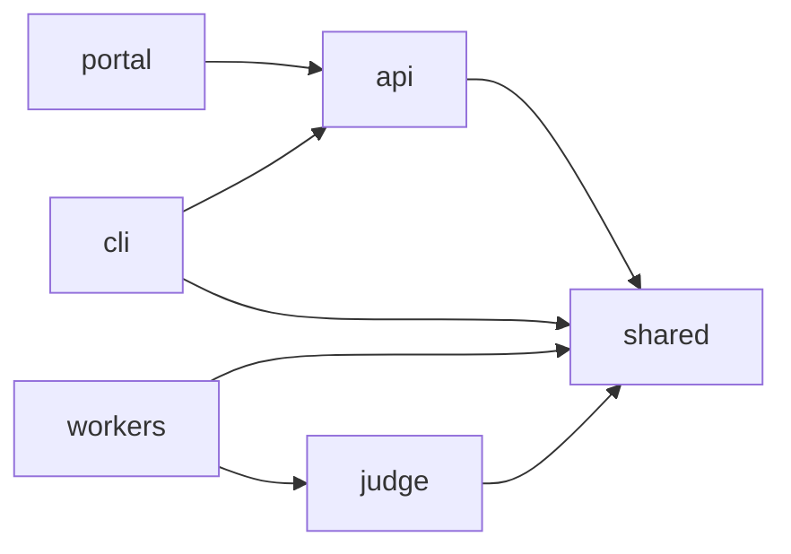
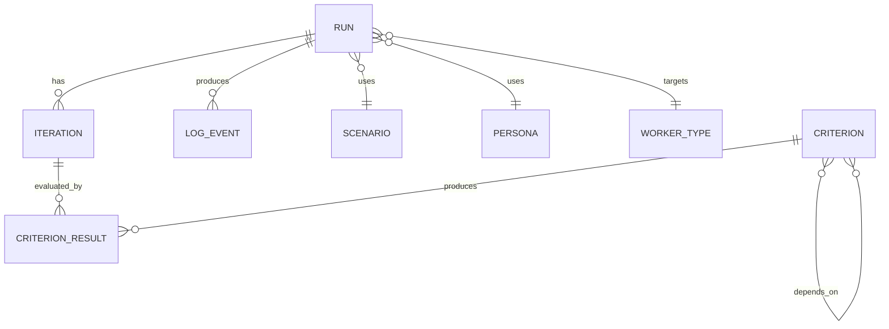
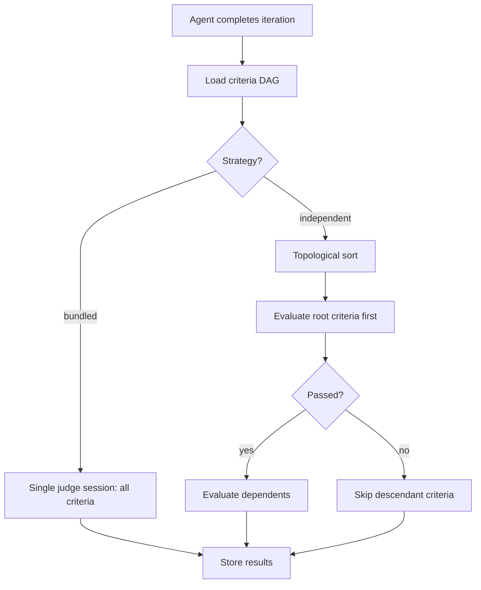

# Application Design

> **Status:** Seed document — expand as the application evolves.

This document describes the internal design of the Scope application layer (`scope-mt-app/`).

## Package Architecture

Scope uses a **pnpm workspaces** monorepo. Packages share types and utilities via the `shared` package.



| Package | Responsibility |
|---------|---------------|
| `api` | REST API (Express), SSE log streaming, run management, criteria CRUD |
| `cli` | Command-line interface for submitting tasks, streaming logs, managing runs |
| `portal` | Vue.js web UI for run management, insights, criteria graph editing |
| `judge` | Evaluation engine — executes criteria against agent output |
| `shared` | Types, database models, queue/blob/redis clients, config loaders |
| `workers/*` | Coding agent adapters — each implements the same interface for a different agent |

## Data Model

Runs are the central entity:



- **Run** — A single benchmark execution: one scenario + one persona + one worker
- **Iteration** — A coding agent turn within a run (agent may iterate multiple times)
- **Criterion** — An evaluation check (e.g., "has a working Express server"). Criteria form a DAG (directed acyclic graph) with dependencies.
- **CriterionResult** — Pass/fail result of evaluating a criterion against a specific iteration

### Typed prompts, AGENTS.md, and size-based storage

Task prompts live in a single `task-prompts` collection that is now **typed** and
shared by two prompt kinds:

- `TaskPromptDocument.type?: 'task' | 'agents.md'` — absent ⇒ `'task'` (backward
  compatible; existing docs are untouched).
- **`_id` is the content hash.** `computeTaskPromptId(text, type?)` hashes the
  trimmed text for `task` (or absent) — identical to the legacy hash, so every
  existing task prompt keeps its `_id` — and namespaces non-task types as
  `hash(type + '\n' + text)` so an AGENTS.md prompt never collides with a task
  prompt of the same text. `findOrCreate` deduplicates on this hash.
- **Body storage is decided by size, not type.** A prompt body at/under
  `PROMPT_INLINE_MAX_BYTES` (default 16 KB, UTF-8) is stored inline as `text`;
  larger bodies are uploaded to blob (`prompts/{promptId}.txt`) and the doc carries
  `contentBlobUrl` with no inline `text`. Exactly one of `text` / `contentBlobUrl`
  is set. `resolvePromptText(doc)` returns the inline body or downloads the blob, so
  callers (feature extraction, the worker text endpoint) get plain text regardless
  of location.
- **Prompt features are typed the same way.** `PromptFeatureDocument.type?:
  'task' | 'agents.md'` (absent ⇒ `'task'`); feature extraction selects only
  features of the prompt's type.

### Experiment grouping and AGENTS.md delivery

To support GEPA-style optimization (see `apps/gepa-optimizer`), the request carries:

- `RequestDocument.experimentId?: string` — groups the seed request and every
  candidate request of one optimization run. Filterable (`?experimentId=`) and
  groupable (`groupBy=experiment`). A sparse index on `requests.experimentId`
  serves both grouping and lineage queries.
- `RequestDocument.agentsMdPromptId?: string` — set when the create-request body
  includes `agentsMd` (raw text); the API `findOrCreate`s an `agents.md`-typed
  prompt and stores its id. Before the run starts, the shared queue-processor
  resolves the text (downloading from blob if needed) and writes
  `<workspace>/AGENTS.md` once (constant for the whole run). It **fails the run**
  if the prompt id is set but cannot be resolved — never silently runs the baseline.
- `RequestDocument.agentsMdParentIds?: string[]` — best-effort lineage edges
  (`[]`/absent = root, `[p]` = mutation, `[i, j]` = merge) for callers that know
  parentage at submit time. The GEPA optimizer instead reconstructs lineage
  post-hoc from the engine's parent indices.

**Scoring is not persisted.** The GEPA metric (fraction of criteria passed,
aggregated across turns) is derived by the optimizer from `run.turns[].criteriaResults`
and never stored in Scope — it is algorithm-specific. If ever persisted it would be
named (e.g. `metrics.gepaCriteriaPassRateMeanTurns`) and live on `RunState`.

## Judge Pipeline

The judge evaluates coding agent output against criteria. Two strategies are supported:

| Strategy | Behavior |
|----------|----------|
| `bundled` | All criteria evaluated in one judge session (faster, less granular) |
| `independent` | Criteria evaluated separately in topological order following the DAG; descendants of failed criteria are skipped (slower, more accurate) |



## Queue Pattern

Each worker type has a dedicated Azure Storage Queue. The API resolves the target queue via **version-aware routing**: when a run is submitted, the API looks up the selected (or latest active) agent version and uses its registered `queueName` to route the message.

```
AgentVersion.queueName  →  Azure Storage Queue  →  Worker pods (0→N via KEDA)
```

Currently all versions of an agent share a single queue (e.g., `queue-coder-acp-copilot`). When multi-version deployments are introduced, each version will have its own queue, and KEDA will scale each version independently.

### Run submission flow

1. User submits via Portal or CLI with: **task**, **criteria** (required), **worker**, **model** (required), and optionally **agentVersion**
2. API resolves `agentVersion`: explicit selection → validate active; omitted → latest active by `createdAt`
3. API resolves `model`: explicit → validate against `supportedModels`; omitted → `defaultModel`
4. API looks up `AgentVersion.queueName` and routes message to that queue
5. `agentVersion` and `model` are persisted on the `RequestDocument`

Profile fan-out mode is also supported for comparative runs:

1. User selects a base `profileId` (optionally pinned via `profileId@version`) and a `profileVariations[]` array of profile spec strings to compare against (e.g. `["def456", "ghi789@2"]`)
2. API parses each spec, validates every variation upfront, then expands one submit call into multiple requests under one shared `submissionId`
3. Each expanded request resolves configuration from its variation profile; unpinned specs resolve to `latestVersion`
4. Expanded requests persist `profileId` and `profileVersionId` on each `RequestDocument` for indexing and traceability

## Real-Time Log Streaming

Workers publish log events to Redis Pub/Sub channels keyed by run ID. The API subscribes and relays them as Server-Sent Events (SSE) to CLI and Portal clients.

## Criteria System

Criteria are reusable evaluation rules stored in the database and optionally defined in `config/criteria/*.yaml`. They support:

- **DAG dependencies** — criterion A can depend on criterion B (B must pass before A is evaluated)
- **AI-generated prompts** — natural language behavior descriptions can be converted to evaluation prompts via LLM
- **Traits** — reusable labels for filtering and composition (e.g., `has_azure`, `has_node`)

See [`ENV_VARIABLES.md`](../../scope-mt-app/ENV_VARIABLES.md) for related configuration options.

## OpenAPI Documentation

The REST API exposes an auto-generated **OpenAPI 3.1** spec built with [Zod](https://zod.dev/) schemas and [`@asteasolutions/zod-to-openapi`](https://github.com/asteasolutions/zod-to-openapi).

| Endpoint | Description |
|----------|-------------|
| `GET /openapi.json` | Raw OpenAPI 3.1 specification (JSON) |
| `GET /api-docs` | Interactive Swagger UI |

### Schema organization

Zod schemas live in `packages/shared/src/schemas/` (16 files, ~78 schemas) so they can be reused by the API, CLI, and workers. Each entity has separate **input** (what the client sends) and **response** (what the API returns) schemas.

OpenAPI route registrations live in `apps/api/src/openapi/routes/` — one file per resource group. The registry and generator are in `apps/api/src/openapi/registry.ts`.
