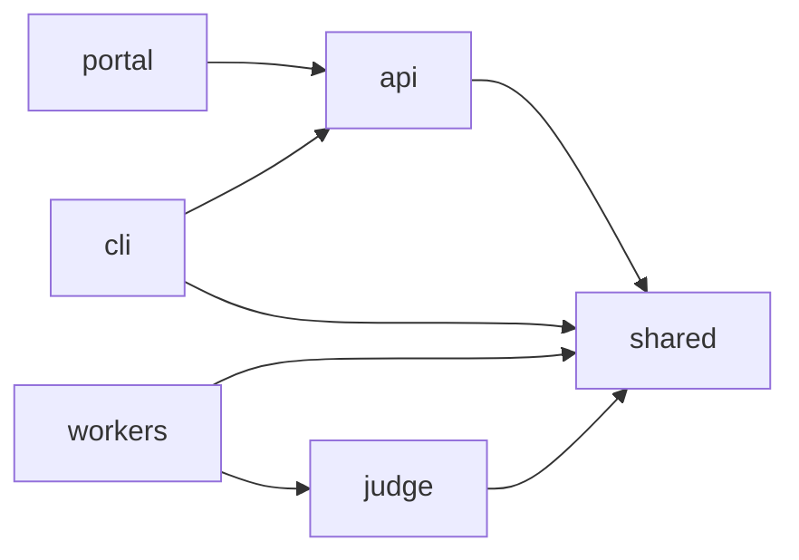
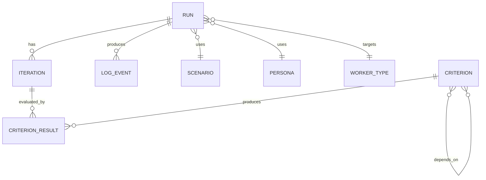
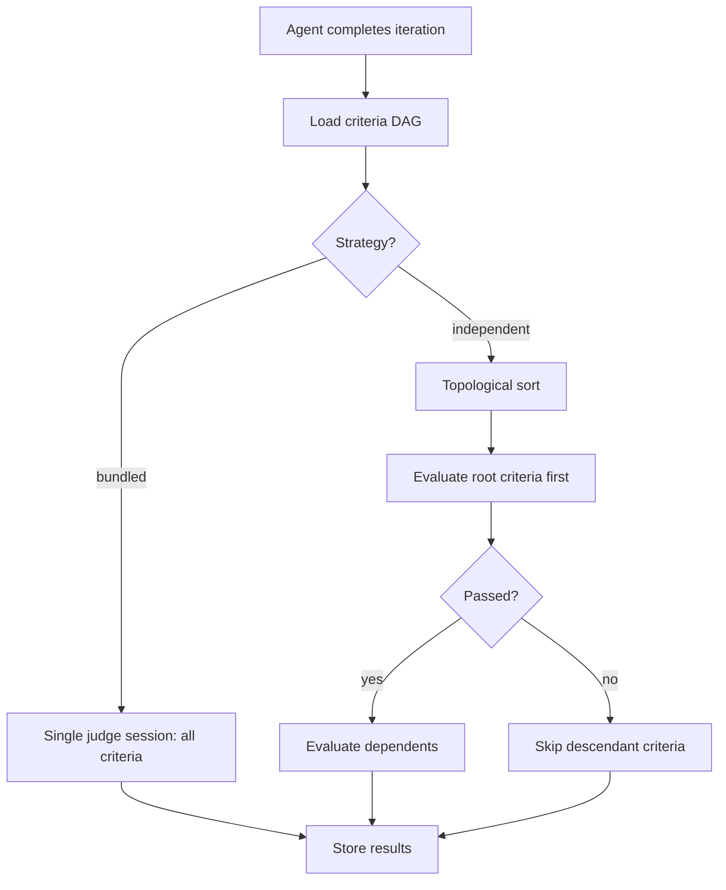

# Application Design

> **Status:** Seed document — expand as the application evolves.

This document describes the internal design of the Scope MT application layer (`scope-mt-app/`).

## Package Architecture

Scope MT uses a **pnpm workspaces** monorepo. Packages share types and utilities via the `shared` package.



| Package | Responsibility |
|---------|---------------|
| `api` | REST API (Express), SSE log streaming, run management, criteria CRUD |
| `cli` | Command-line interface for submitting tasks, streaming logs, managing runs |
| `portal` | Vue.js web UI for run management, insights, criteria graph editing |
| `judge` | Evaluation engine — executes criteria against agent output |
| `shared` | Types, database models, queue/blob/redis clients, config loaders |
| `workers/*` | Coding agent adapters — each implements the same interface for a different agent |

## Data Model

Runs are the central entity:



- **Run** — A single benchmark execution: one scenario + one persona + one worker
- **Iteration** — A coding agent turn within a run (agent may iterate multiple times)
- **Criterion** — An evaluation check (e.g., "has a working Express server"). Criteria form a DAG (directed acyclic graph) with dependencies.
- **CriterionResult** — Pass/fail result of evaluating a criterion against a specific iteration

## Judge Pipeline

The judge evaluates coding agent output against criteria. Two strategies are supported:

| Strategy | Behavior |
|----------|----------|
| `bundled` | All criteria evaluated in one judge session (faster, less granular) |
| `independent` | Criteria evaluated separately in topological order following the DAG; descendants of failed criteria are skipped (slower, more accurate) |



## Queue Pattern

Each worker type has a dedicated Azure Storage Queue. The API enqueues messages to the correct queue based on the target worker. KEDA monitors queue depth and scales workers from 0 to N.

```
queue-coder-acp-claude-code  →  coder-acp-claude-code pods (0→N)
queue-coder-acp-copilot      →  coder-acp-copilot pods (0→N)
```

## Real-Time Log Streaming

Workers publish log events to Redis Pub/Sub channels keyed by run ID. The API subscribes and relays them as Server-Sent Events (SSE) to CLI and Portal clients.

## Criteria System

Criteria are reusable evaluation rules stored in the database and optionally defined in `config/criteria/*.yaml`. They support:

- **DAG dependencies** — criterion A can depend on criterion B (B must pass before A is evaluated)
- **AI-generated prompts** — natural language behavior descriptions can be converted to evaluation prompts via LLM
- **Traits** — reusable labels for filtering and composition (e.g., `has_azure`, `has_node`)

See [`ENV_VARIABLES.md`](../../scope-mt-app/ENV_VARIABLES.md) for related configuration options.
