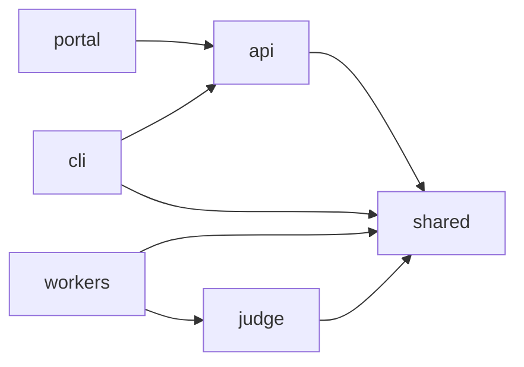
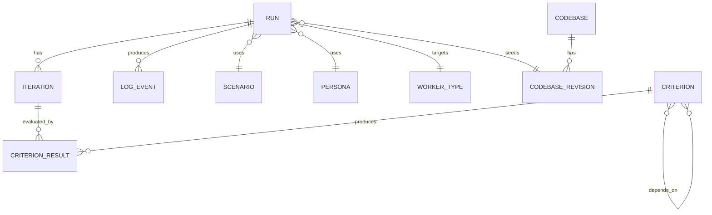
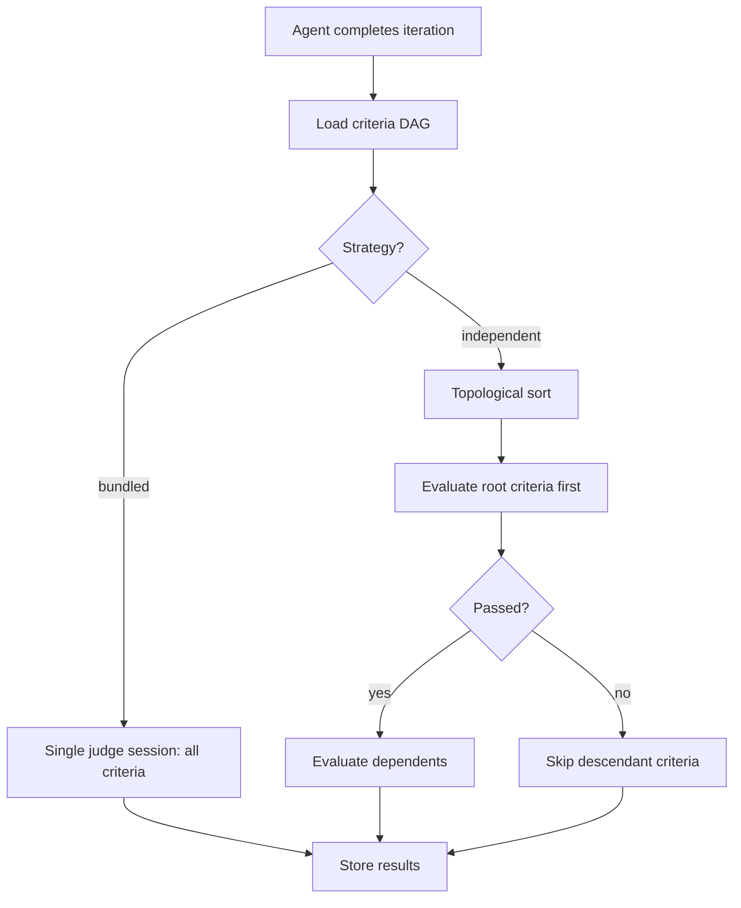

# Application Design

> **Status:** Seed document — expand as the application evolves.

This document describes the internal design of the Scope application layer (`scope-mt-app/`).

## Package Architecture

Scope uses a **pnpm workspaces** monorepo. Packages share types and utilities via the `shared` package.



| Package | Responsibility |
|---------|---------------|
| `api` | REST API (Express), SSE log streaming, run management, criteria CRUD |
| `cli` | Command-line interface for submitting tasks, streaming logs, managing runs |
| `portal` | React web UI for run management, insights, criteria graph editing |
| `judge` | Evaluation engine — executes criteria against agent output |
| `shared` | Types, database models, queue/blob/redis clients, config loaders, codebase/skill stores and clients |
| `workers/*` | Coding agent adapters — each implements the same interface for a different agent |

## Data Model

Runs are the central entity:



- **Run** — A single benchmark execution: one scenario + one persona + one worker
- **Iteration** — A coding agent turn within a run (agent may iterate multiple times)
- **Criterion** — An evaluation check (e.g., "has a working Express server"). Criteria form a DAG (directed acyclic graph) with dependencies.
- **CriterionResult** — Pass/fail result of evaluating a criterion against a specific iteration
- **Codebase** — Mutable first-class project entity in `codebases`, with a unique slug, source type (`git` or `archive`), optional GitHub source/default branch, revision counter, latest revision pointer, and soft-delete metadata.
- **CodebaseRevision** — Immutable snapshot in `codebase-revisions`. Every Git resolution or archive upload creates a fresh UUID revision with the next per-codebase `revisionNumber` and canonical `{slug}@r{N}` ref.

## Judge Pipeline

The judge evaluates coding agent output against criteria. Two strategies are supported:

| Strategy | Behavior |
|----------|----------|
| `bundled` | All criteria evaluated in one judge session (faster, less granular) |
| `independent` | Criteria evaluated separately in topological order following the DAG; descendants of failed criteria are skipped (slower, more accurate) |



## Gates — multi-phase evaluation pipeline

Runs execute through a hard-coded, ordered sequence of **gates**: `Select → Build
→ Test → Run → Deploy`. Each gate runs the per-iteration coding + judge loop
against the **same** workspace, with its own prompt, its own subset of criteria,
and its own iteration budget. Gates run **stop-on-failure**: when a gate exhausts
its budget without passing, downstream gates are recorded as `skipped`.

- A request carries an optional `gates: GateConfig[]` (`{ gate, promptId, criteria,
  maxIterations? }`). When absent, the request is normalised to a single **Select**
  gate built from the legacy `scenario.criteria` + `maxIterations` + `taskPromptId`
  — so existing requests behave identically.
- Criteria declare a `gates: GateId[]` compatibility list (empty = all gates); the
  list is **downward-closed** along the DAG (a parent is compatible with at least
  every gate its children are).
- Prompts are **typed** (`type: PromptType`, one literal per gate); a gate's prompt
  must have `type === gate`. The Select gate's prompt is the request's task prompt.
- For non-Select gates the judge can inspect captured command output via the
  `read_tool_outputs` tool, not just the workspace files.
- Per-gate outcomes are persisted on the request as `gateSummaries:
  GateRunSummary[]`; each `ConversationTurn` is tagged with its `gate`.

The orchestration lives in `runGatedLoop` (`packages/shared/src/judge/gated-loop.ts`),
which wraps the per-gate `runMultiTurnLoop`. See the full
[gates design doc](../design/gates.md).

## Queue Pattern

Each worker type has a dedicated Azure Storage Queue. The API resolves the target queue via **version-aware routing**: when a run is submitted, the API looks up the selected (or latest active) agent version and uses its registered `queueName` to route the message.

```
AgentVersion.queueName  →  Azure Storage Queue  →  Worker pods (0→N via KEDA)
```

Currently all versions of an agent share a single queue (e.g., `queue-coder-acp-copilot`). When multi-version deployments are introduced, each version will have its own queue, and KEDA will scale each version independently.

### Run submission flow

1. User submits via Portal or CLI with: **task**, **criteria** (required), **worker**, **model** (required), and optionally **agentVersion**, a **codebase** selection, record-only **`observations`** criteria, and/or a per-gate **`gates`** configuration (see [Gates](#gates--multi-phase-evaluation-pipeline))
2. API resolves `agentVersion`: explicit selection → validate active; omitted → latest active by `createdAt`
3. API resolves `model`: explicit → validate against `supportedModels`; omitted → `defaultModel`
4. API looks up `AgentVersion.queueName` and routes message to that queue
5. `agentVersion` and `model` are persisted on the `RequestDocument`

When a codebase is selected, the API resolves the submitted spec (`codebaseRevisionId`, `{slug}@r{N}`, or bare `{slug}`) before enqueueing. Bare archive slugs resolve to the latest existing revision; bare Git slugs resolve the default branch at submit time and create a new immutable revision. The resolved revision UUID is stored as `RequestDocument.codebaseRevisionId`, and workers seed the workspace from that revision after setup and before skills extraction.

Profile fan-out mode is also supported for comparative runs:

1. User selects a base `profileId` (optionally pinned via `profileId@version`) and a `profileVariations[]` array of profile spec strings to compare against (e.g. `["def456", "ghi789@2"]`)
2. API parses each spec, validates every variation upfront, then expands one submit call into multiple requests under one shared `submissionId`
3. Each expanded request resolves configuration from its variation profile; unpinned specs resolve to `latestVersion`
4. Expanded requests persist `profileId` and `profileVersionId` on each `RequestDocument` for indexing and traceability

## Real-Time Log Streaming

Workers publish log events to Redis Pub/Sub channels keyed by run ID. The API subscribes and relays them as Server-Sent Events (SSE) to CLI and Portal clients.

## Portal Shell

The Portal desktop shell uses a persistent left navigation sidebar. It defaults to the compact icon rail, and users can expand it to show navigation labels; the choice is stored in `localStorage` under `scope:layout:sidebar-expanded`. Mobile navigation remains a sheet-based menu with labels always visible.

## Criteria System

Criteria are reusable evaluation rules stored in the database and optionally defined in `config/criteria/*.yaml`. They support:

- **DAG dependencies** — criterion A can depend on criterion B (B must pass before A is evaluated)
- **AI-generated prompts** — natural language behavior descriptions can be converted to evaluation prompts via LLM
- **Traits** — reusable labels for filtering and composition (e.g., `has_azure`, `has_node`)
- **Gate compatibility** — a `gates: GateId[]` list controls which [gates](#gates--multi-phase-evaluation-pipeline) a criterion may be selected for (empty = all); the list is downward-closed along the DAG
- **Criterion kind** — `kind: "gate" | "observation"` distinguishes criteria that gate the agent from record-only observations. Observation criteria can optionally set `taxonomyElementId` to one of the hard-coded observation dimensions; run detail derives dimension grouping by joining each per-turn `observationResults[].criterionId` back to the criterion metadata.
- **Kind** — `kind: "gate" | "observation"` (default `gate`). **Gate** criteria steer the coding agent through the gate DAG. **Observation** criteria (issue #1156) are record-only: they produce a boolean + evidence per iteration, never feed back to the agent, never pass/fail a gate, and never enter the gate DAG. Dependencies may only reference same-kind criteria.
- **Taxonomy classification** — observation criteria carry an optional `taxonomyElementId` from a hard-coded enum of the three R&A Readout quality dimensions (`dimension:idiomatic-use`, `dimension:dependency-currency`, `dimension:configuration-correctness`). Classification is static/design-time, not per-run.

Observation evaluation happens off the coding-agent critical path in the `pp-taxonomy` post-processor (see [post-processing](post-processing.md)). A run carries the chosen `observations: string[]` (observation-criteria ids); each evaluated turn stores `observationResults: CriterionResult[]` (same shape as gate `criteriaResults`). Dimension grouping is derived at read time by joining `criterionId` → criterion `taxonomyElementId`.

See [`ENV_VARIABLES.md`](../../scope-mt-app/ENV_VARIABLES.md) for related configuration options.

## Codebase System

Codebases are reusable source snapshots that can be attached to run submissions. The shared package owns the core types (`CodebaseDocument`, `CodebaseRevisionDocument`, `CodebaseConfig`), stores, resolver, API client, and worker seeder. The API exposes CRUD, Git resolution, archive upload, and archive-download proxy endpoints; workers use `CodebaseClient` to fetch a normalized root-level tar.gz and extract it into the run workspace.

Two MongoDB collections back the feature:

| Collection | Purpose |
|------------|---------|
| `codebases` | Mutable codebase metadata, slug uniqueness, source type/source, `revisionCounter`, `latestRevisionId`, and soft deletion |
| `codebase-revisions` | Immutable revisions addressed by UUID or `{slug}@r{N}`, with Git/archive provenance and the normalized archive URL |

See [Codebases Architecture](codebases.md) for revision addressing, blob storage naming, REST endpoints, and worker seeding details.

## OpenAPI Documentation

The REST API exposes an auto-generated **OpenAPI 3.1** spec built with [Zod](https://zod.dev/) schemas and [`@asteasolutions/zod-to-openapi`](https://github.com/asteasolutions/zod-to-openapi).

| Endpoint | Description |
|----------|-------------|
| `GET /openapi.json` | Raw OpenAPI 3.1 specification (JSON) |
| `GET /api-docs` | Interactive Swagger UI |

### Schema organization

Zod schemas live in `packages/shared/src/schemas/` (16 files, ~78 schemas) so they can be reused by the API, CLI, and workers. Each entity has separate **input** (what the client sends) and **response** (what the API returns) schemas.

OpenAPI route registrations live in `apps/api/src/openapi/routes/` — one file per resource group. The registry and generator are in `apps/api/src/openapi/registry.ts`.
