# Authentication & RBAC

> **Status:** Proposed — implementation plan. Revised: 2026-09-18.

## Problem

Scope currently has no authentication or authorization. The API, Portal, and CLI allow
any caller to read, submit, mutate, or delete every run and catalog resource.

Scope needs authentication and authorization that support shared work without treating
documents as belonging to individual users:

1. Authenticate every human caller (API, Portal, and CLI) with Microsoft Entra ID.
2. Keep identity-provider verification behind a pluggable abstraction so other OIDC
   providers can be added without changing callers.
3. Make **projects** the access boundary for project-scoped data. An account can belong
   to any number of projects and have a different role in each one.
4. Provide a narrowly scoped **platform administrator** role for global platform
   administration. Platform administration must not implicitly grant access to a
   project's contents.
5. Keep anonymous/public access out of scope. An anonymous principal has no permissions.

> **Primary milestone:** authenticate users across the Portal, API, and CLI, then enforce
> platform and project access consistently. This includes Scope-issued personal access
> tokens (PATs) for non-interactive CLI and API automation. A v1 PAT is a credential
> for its issuing Scope user, not an independent role or authorization grant.

> **Token Manager is not user identity.** It stores provider credentials that coding
> agents consume. This work does not reuse or extend its `accounts` or `keys` schema; it
> only follows its MongoDB, Key Vault, and External Secrets infrastructure patterns.

---

## Authorization model

### Scope boundaries

There are two independent authorization scopes:

| Scope | Role | Capabilities | Does not grant |
|---|---|---|---|
| Platform | `admin` | Manage global feature flags, agents, models, and secrets; list all projects; delete any project; manage RBAC for any project; manage platform-admin assignments. | Access to project-scoped data or settings unless the user also has a role in that project. |
| Project | `user` | Read, create, update, and delete runs, statistics, reports, insights, prompts, criteria, features, and codebases in that project. | Other project resources, project membership administration, or another project's data. |
| Project | `admin` | Everything a project user can do, plus all other project resources and that project's settings and membership/RBAC. | Global platform administration or another project's data. |

An authenticated account has no project access until it is a member of a project. The
same account can, for example, be a project `user` in two projects and a project `admin`
in three others.

Every authenticated account can create a project. Project creation atomically creates a
`project_memberships` record assigning its creator the `admin` role for that project.
Projects are platform data, not user-owned documents: the creating user gains access
through this explicit membership, not through an `ownerId`.

### Global platform resources

**Feature flags, agents, models, and secrets are platform resources.** They have no
read-only access level: a caller must be a platform administrator to list, read, create,
update, or delete any of them. In particular, a project role never makes an agent, model,
feature flag, or secret visible.

`secrets` includes the provider credentials and related secret-management surfaces
currently exposed through the Token Manager. It does not include a caller's Entra access
token or other user-session material.

### Project resources

All non-platform user-facing data is project-scoped. Project roles authorize the
following resource classes:

| Resource class | Project `user` | Project `admin` |
|---|---|---|
| Runs, attempts, logs, snapshots, archives | Full CRUD | Full CRUD |
| Statistics and analytics | Full CRUD/read of all project aggregates | Full CRUD/read of all project aggregates |
| Reports and insights | Full CRUD | Full CRUD |
| Prompts and criteria | Full CRUD | Full CRUD |
| Features and codebases, including revisions | Full CRUD | Full CRUD |
| Profiles, personas, scenarios, skills, skill revisions, report templates | — | Full CRUD |
| MCP servers and extensions | — | Full CRUD |
| Project metadata and project memberships | — | Full CRUD, except project deletion |

“Full CRUD” means all API methods supported for that resource, not merely read access.
The authorization policy does not distinguish a document's creator from another member
of the same project.

Project deletion is deliberately platform-admin-only. A project admin may update the
project's metadata and RBAC, but may not delete the project.

### Platform administrators do not bypass project membership

A platform administrator can list and inspect metadata for every project, delete any
project, and update the RBAC membership of any project. That is sufficient to add
themselves as a project admin when operationally necessary.

It does **not** permit that administrator to list, read, create, update, or delete
project-scoped resources merely because they are a platform admin. Project-content
requests always require a membership in the target project, including requests made by
platform administrators.

### No ownership, visibility, or general document sharing

This design deliberately does **not** include:

- `ownerId`, `ownerType`, document creator authorization, or a legacy `"system"` owner;
- `visibility: "private" | "shared"`, global sharing, or per-document ACLs;
- a general sharing mechanism for arbitrary project documents.

Every project-scoped document carries one immutable `projectId`; authorization normally
derives solely from the caller's membership for that `projectId`. The authenticated
run/report sharing link below is the sole, explicit exception.

### Authenticated run and report sharing links

A project member with read access to a run or report may create a **read-only sharing
link** for that specific run or report. The recipient must authenticate to Scope, but
does not need membership in the source project. The link grants neither a platform role
nor a project role and does not make the project or resource discoverable in lists.

Links use an opaque, random 256-bit capability. Scope stores only a hash, with the
following metadata:

```ts
interface SharedLinkDocument {
  _id: string;
  resourceType: "run" | "report";
  resourceId: string;
  projectId: string;
  tokenHash: string;
  createdByUserId: string;
  expiresAt: Date;
  revokedAt?: Date;
  createdAt: Date;
}
```

The Portal link places the capability in the URL fragment, for example
`/runs/<id>#share=<capability>`, so it is not sent to the web server or included in
referrer headers. The Portal sends it to the API in `X-Scope-Share-Link` alongside the
recipient's normal `Authorization` bearer token. The API must redact this header and
the fragment-derived value from logs, audit detail, diagnostics, and support bundles.

The API validates the authenticated recipient, token hash, resource type and ID,
expiry, and revocation state before allowing the read. Links expire after 30 days by
default and may not exceed the configured `SHARE_LINK_MAX_TTL`. The creator or a project
admin may revoke a link at any time. A link is never accepted by a create, update,
delete, membership, list, or platform-resource route.

A run link permits read-only access to that exact run and the attempts, logs, snapshots,
and archives required to render its details. It does not grant access to reports,
insights, or any other run. A report link permits only that exact report and its
rendering artifacts; it does not grant access to the parent run, sibling reports, or
other insights.

---

## Current state

| Component | Today | Relevant files |
|---|---|---|
| API | Express has no API authentication middleware. Routes are registered through `apiRoute()`, which also feeds the OpenAPI registry. | [apps/api/src/index.ts](../../apps/api/src/index.ts), [apps/api/src/openapi/api-route.ts](../../apps/api/src/openapi/api-route.ts) |
| Data model | Requests/runs do not yet have project authorization. The proposed project organization design introduces `projectId`; no ownership fields are required by this design. | [packages/shared/src/schemas/request.ts](../../packages/shared/src/schemas/request.ts), [data-organization-projects.md](data-organization-projects.md) |
| CLI | Commands use the centralized `apiFetch()` facade but do not yet implement interactive CLI login or API-side authorization. | [apps/cli/src/utils/api-client.ts](../../apps/cli/src/utils/api-client.ts) |
| Portal | The Portal has an MSAL authentication MVP and centralized token injection, but the API does not yet verify tokens or enforce roles. | [apps/portal/src/contexts/AuthContext.tsx](../../apps/portal/src/contexts/AuthContext.tsx), [apps/portal/src/lib/api-client.ts](../../apps/portal/src/lib/api-client.ts) |
| Projects | The proposed `projects` model currently organizes data but does not yet define or enforce membership. This document supplies that access layer. | [data-organization-projects.md](data-organization-projects.md) |

Coder workers write run state directly to MongoDB and do not call the API. The
report-generator worker does call the API to read a run and write reports/insights, so it
must ship with the project authorization path. The scheduler uses MongoDB and Storage
Queues directly and needs no API credential today.

---

## Authentication architecture

```mermaid
flowchart TB
    subgraph Clients
        CLI[CLI<br/>device-code flow]
        Portal[Portal SPA<br/>auth-code + PKCE]
    end

    subgraph IdP[Microsoft Entra ID]
        OIDC[OIDC / OAuth2<br/>JWKS, token endpoint]
    end

    subgraph API[API service]
        MW[authn middleware<br/>verify JWT via AuthProvider]
        RBAC[platform + project authz]
        Routes[Routes apiRoute&#40;&#41;]
        Users[(users)]
        Memberships[(project_memberships)]
        PATs[(personal_access_tokens)]
    end

    CLI -->|Entra access token or Scope PAT| MW
    Portal -->|access token| MW
    MW -->|verify sig/aud/iss/exp| OIDC
    MW -->|JIT upsert| Users
    MW -->|hash lookup + live user| PATs
    RBAC --> Memberships
    RBAC --> Routes
```



### 1. Pluggable identity-provider abstraction

`packages/shared/src/auth/` defines a backend-side `AuthProvider` interface. It
verifies an access token and returns identity only; it never interprets IdP roles or
groups.

```ts
export interface VerifiedIdentity {
  idp: string;
  idpTenant: string;
  idpSubject: string;
  email?: string;
  emailVerified?: boolean;
  name?: string;
}

export interface AuthProvider {
  readonly id: string;
  verifyAccessToken(token: string): Promise<VerifiedIdentity>;
}

export interface AuthClientConfig {
  provider: string;
  authority: string;
  clientId: string;
  scopes: string[];
  audience: string;
}
```

The initial `EntraIdAuthProvider`:

- validates multi-tenant Entra tokens with cached JWKS, keyed by `(tenant, kid)`;
- verifies RS256 signature, issuer, audience, `exp`, and `nbf`;
- extracts `oid`, `tid`, verified email where available, and display name;
- uniquely identifies an IdP account by `(idp, idpTenant, idpSubject)`, never email;
- uses `jose`, not a server-side MSAL dependency.

Entra tenant restriction is configured at the App Registration. Scope does not use Entra
App Roles or group claims for authorization.

```text
AUTH_PROVIDER=entra
AUTH_AUTHORITY=https://login.microsoftonline.com/common
AUTH_API_CLIENT_ID=<api-app-id>
AUTH_CLIENT_ID=<public-client-id>
AUTH_SCOPES=api://<api-app-id>/access_as_user
AUTH_BOOTSTRAP_PLATFORM_ADMINS=entra:<tid>/<oid>,entra:<tid>/<oid>
AUTH_BOOTSTRAP_TENANTS=<tid-1>,<tid-2>
```

There is no API-side synthetic principal, `X-Dev-User`, `DEV_USER`, or
`AUTH_ENABLED` bypass. Local development uses a real IdP or a standards-compliant local
Entra emulator configured through the same provider interface.

### 2. Users, platform roles, and project memberships

Scope owns authorization in MongoDB. The IdP proves an identity; Scope maps it to a
stable internal user ID and role records.

```ts
export type Action = "read" | "write" | "delete" | "admin";
export type Permission = `${string}/${string}:${Action}`;
export type PlatformRole = "admin";
export type ProjectRole = "user" | "admin";

export interface UserDocument {
  _id: string; // Scope-owned UUID
  idp: string;
  idpTenant: string;
  idpSubject: string;
  email?: string; // advisory only
  emailVerified?: boolean;
  name?: string;
  platformRole?: PlatformRole;
  createdAt: Date;
  updatedAt: Date;
  lastLoginAt?: Date;
  disabledAt?: Date;
}

export interface ProjectMembershipDocument {
  _id: string;
  projectId: string;
  userId: string; // users._id
  role: ProjectRole;
  createdAt: Date;
  updatedAt: Date;
  createdByUserId: string;
}
```

The database has a unique identity index on `(idp, idpTenant, idpSubject)` and a unique
membership index on `(projectId, userId)`. It indexes `projectId` and `userId` for the
membership lookups used by lists and route guards.

JIT provisioning creates a user with no platform role. Bootstrap identity tuples may
promote a user to platform admin only when the verified tenant appears in
`AUTH_BOOTSTRAP_TENANTS`. Bootstrap is promote-only; removal from configuration does not
silently demote an existing admin. Email is never a bootstrap key.

Platform-admin assignment and removal are explicit audited administrative operations.
There are no per-user permission additions/removals: platform roles and project
memberships are the complete v1 authorization model.

### 3. Personal access tokens for CLI and API automation

Scope issues personal access tokens (PATs) to let a signed-in user authenticate the CLI
or a non-interactive API client without an Entra browser/device-code flow. A v1 PAT is
**global and user-equivalent**:

- it authenticates only as its issuing `users._id`;
- on every request, Scope reloads that user's current disabled state, platform role, and
  membership for the route's target project;
- “global” means the credential is not itself restricted to a selected project: it
  receives the full set of the issuing user's **current** effective permissions, but
  never grants additional project memberships or bypasses project-content guards;
- it has no embedded, copied, snapshotted, delegated, or elevated permissions;
- it immediately reflects a user's disablement, demotion, or removal from a project;
  revoking or expiring the token invalidates that credential.

PATs are not service credentials and cannot be created for another user, assigned to a
project, given an independent role, or used for Scope internal service-to-service
authentication. They do not change the platform/project role matrix or the
authenticated run/report sharing-link model.

```ts
interface PersonalAccessTokenDocument {
  _id: string; // opaque token ID; safe to show as a token-list identifier
  userId: string; // users._id, immutable
  secretHash: string; // keyed HMAC-SHA-256 of the high-entropy secret
  note: string; // short, user-only label; never authorization data
  expiresAt: Date;
  revokedAt?: Date;
  lastUsedAt?: Date;
  createdAt: Date;
  updatedAt: Date;
}
```

Creation generates a versioned, recognizable value such as
`scope_pat_v1_<token-id>_<random-secret>`, where the random secret contains at least
256 bits from a cryptographically secure generator. The API returns the complete
plaintext value **once**, only in the successful creation response. It never stores or
audits that plaintext, and cannot return, export, or re-display it later. The token ID
is not a secret; the random secret is.

Scope stores only `secretHash`, calculated as an HMAC with a dedicated PAT hashing key
kept in Key Vault and delivered through External Secrets. Authentication parses and
validates the fixed format, looks up the token by ID, calculates the HMAC for the
presented secret, and compares hashes in constant time. It rejects malformed, unknown,
revoked, expired, and user-disabled tokens with `401`; it must not reveal which
condition failed. A successful authentication updates `lastUsedAt` best effort without
retaining the credential. The PAT hashing key is not an API signing key or a
service-to-service credential.

A user supplies a short note and expiration date on creation. The note is user-visible
metadata only: trim it, require non-empty text, enforce a small configured maximum
length, and never render it as HTML. `expiresAt` is required, must be in the future,
and may not exceed `PAT_MAX_TTL`. There is no non-expiring PAT in v1. Deletion revokes
the token immediately by setting `revokedAt`; the record is retained for audit and
operational reconciliation rather than physically deleted. A user can view and revoke
only their own token records. Neither project nor platform administrators receive an
endpoint to list or recover another user's PATs.

The self-service API is deliberately small:

```text
GET    /api/v1/users/me/personal-access-tokens
POST   /api/v1/users/me/personal-access-tokens
DELETE /api/v1/users/me/personal-access-tokens/:tokenId
```

List responses return only `_id`, `note`, `createdAt`, `expiresAt`, `lastUsedAt`, and
`revokedAt`; creation additionally returns `token` once; delete returns no token value.
These routes require ordinary user authentication and operate only on the authenticated
`/users/me` identity. They are not project routes and must not accept `userId` as a
query, path, or body selector.

### 4. Permission resolution

Route code authorizes on permissions, while two context-specific resolvers derive those
permissions from platform and project roles.

```ts
const PROJECT_USER_PERMISSIONS: Permission[] = [
  "scope/run:read", "scope/run:write", "scope/run:delete",
  "scope/statistic:read", "scope/statistic:write", "scope/statistic:delete",
  "scope/report:read", "scope/report:write", "scope/report:delete",
  "scope/insight:read", "scope/insight:write", "scope/insight:delete",
  "scope/prompt:read", "scope/prompt:write", "scope/prompt:delete",
  "scope/criteria:read", "scope/criteria:write", "scope/criteria:delete",
  "scope/feature:read", "scope/feature:write", "scope/feature:delete",
  "scope/codebase:read", "scope/codebase:write", "scope/codebase:delete",
];

const PROJECT_ADMIN_PERMISSIONS: Permission[] = ["scope/*:admin"];

const PLATFORM_ADMIN_PERMISSIONS: Permission[] = [
  "scope/feature-flag:admin",
  "scope/agent:admin",
  "scope/model:admin",
  "scope/secret:admin",
  "scope/project:admin",
  "scope/user:admin",
];
```

`PROJECT_ADMIN_PERMISSIONS` is resolved only after the caller's membership in the target
project is verified. It can never satisfy a platform permission. Likewise, platform
permissions can never satisfy a project-resource guard.

Wildcard semantics remain explicit:

- `*` is allowed only in the resource position;
- `admin` implies `read`, `write`, and `delete` on the same resource;
- namespace and action are never wildcards;
- a permission on one resource never satisfies another resource's guard;
- the empty/anonymous permission set satisfies nothing.

The mandatory negative tests include that a platform admin's `scope/project:admin` does
not authorize `scope/run:read`, and that a project-admin permission does not authorize
`scope/agent:read`.

### 5. API authentication and authorization

Global middleware runs before route registration:

1. Leave only `/health`, `/ready`, `/about`, `/openapi.json`, and `/api/v1/version`
   public.
2. Extract `Authorization: Bearer <token>`. A missing token attaches the non-persisted
   `anonymous` principal with no permissions.
3. Identify a Scope PAT by its fixed prefix; otherwise verify an IdP access token.
   IdP verification JIT-upserts its user record and rejects a disabled user with `403`.
   PAT verification resolves its issuer from `personal_access_tokens` and returns `401`
   for a disabled issuer, just as it does for an invalid, expired, or revoked PAT.
4. Attach the authenticated principal, including the Scope user ID and platform role.
   Membership is loaded by the route guard for its requested project, not trusted from a
   client header or token claim.
5. Verify Scope internal tokens as described in [service-to-service auth](#7-service-to-service-auth);
   re-check user liveness and membership on the internal-token path too, returning
   `403` when that authenticated internal request no longer has a live authorized user.

`ApiRouteConfig` gains declarative authorization fields:

```ts
interface ApiRouteConfig<...> {
  auth?: boolean; // true by default
  platformPermissions?: Permission | Permission[];
  projectPermissions?: Permission | Permission[];
  projectId?: (req: TypedRequest) => string | undefined;
}
```

- `platformPermissions` invokes the platform resolver. It is required for feature
  flags, agents, models, secrets, and platform-level project operations.
- `projectPermissions` obtains `projectId` from the required `?projectId=` query
  parameter for root routes or from a parent document loaded server-side for child routes,
  resolves the caller's membership for that exact project, and then evaluates the requested
  project permissions.
- A route may require one context only. Routes that need both—for example, a platform
  admin changing a membership for a project they do not belong to—use an explicit
  platform project-RBAC guard, never a project-content guard.

The required `?projectId=` query parameter selects a root resource's target project; it
never grants access. A project-scoped create validates membership first and then sets
`projectId` from that validated target. Child resources derive their project from the
parent. The API never accepts `ownerId` or visibility fields.

All project-scoped list queries add a project membership predicate. A single-resource
read, mutation, stream, or derived-data request resolves its parent `projectId` and
checks membership before reading a blob, snapshot, archive, or related collection.
For the exact run/report read routes and their explicitly permitted display children, a
valid authenticated sharing link is an alternative to membership. Callers without
membership or a valid link receive `404` to avoid disclosing project content.
If a caller presents a valid link to a run or report and attempts any non-read operation
on that linked resource, the API returns `403`; the capability establishes that the
resource is known but grants read only.

### 6. Project access and RBAC management

The project API has three distinct classes of operation:

| Operation | Required authorization |
|---|---|
| Create a project | Any authenticated account; creator becomes project admin atomically. |
| List/inspect projects | Project member sees their projects; platform admin sees all project metadata. |
| Read or change project-scoped content | Membership in that project with the resource permission; platform admin alone is insufficient. |
| Update project metadata or that project's memberships | Project admin for that project, or platform admin. |
| Delete a project | Platform admin only. |

Project membership endpoints must identify the project in the path:

```text
GET    /api/v1/projects/:projectId/members
PUT    /api/v1/projects/:projectId/members/:userId
DELETE /api/v1/projects/:projectId/members/:userId
```

They support `user` and `admin` membership roles only. A platform administrator may use
these endpoints for every project, including to add themselves as an admin; they do not
gain project-content access until that membership write completes.

`GET /api/v1/users/me` returns the caller's identity, platform role, and project
memberships (project ID, name, and role). Platform-user administration routes require
`scope/user:admin`; they manage platform-admin assignment and user disablement. All role
and membership changes take effect on the next request.

Run and report sharing-link endpoints are project-member routes:

```text
POST   /api/v1/requests/:requestId/share-links
GET    /api/v1/requests/:requestId/share-links
DELETE /api/v1/requests/:requestId/share-links/:linkId
POST   /api/v1/reports/:reportId/share-links
GET    /api/v1/reports/:reportId/share-links
DELETE /api/v1/reports/:reportId/share-links/:linkId
```

Creating or listing links requires the corresponding run/report read permission in the
source project. Deleting a link requires its creator or a project admin. The capability
is returned only when it is created; later list responses expose metadata but never the
capability value or hash.

### 7. Service-to-service auth

Every internal caller uses its own narrow service identity: a per-service signed JWT or
an `INTERNAL_API_KEY_<NAME>` value compared in constant time with an explicit service
name. There is no shared all-powerful key.

Services that operate on a user's project data—including the report-generator—act
on behalf of the initiating user:

- The API mints a short-lived asymmetric Scope internal JWT with `sub = users._id`,
  `iss = "scope-api"`, `aud = "scope-internal"`, an expiry of at most five minutes, and
  a `jti`.
- The token carries no platform or project permissions. The downstream verifier
  re-resolves the live user, disabled state, and membership for the target `projectId`.
- The API private key and per-service keys are held in Key Vault; verifiers receive only
  the internal JWT public key.
- The report queue message carries `projectId` with the request/report IDs. It does not
  carry an owner ID because runs and reports are not user-owned.

The external IdP token and IdP verification configuration terminate at the API. They are
never sent to downstream services.

### 8. CLI and Portal

The API client refactor is delivered: CLI and Portal call sites use centralized
`ky`-backed clients with token-provider and re-auth seams. Direct `fetch` remains only
for the documented external release check and unauthenticated readiness probe.

CLI authentication supports both MSAL device code for interactive use and Scope PATs
for automation. The primary documented `SCOPE_TOKEN` flow is a Scope PAT, sent as the
normal bearer credential. For compatibility, `SCOPE_TOKEN` may also supply an existing
Entra bearer token, which follows the normal IdP verification path rather than bypassing
authentication. The variable takes precedence over a locally stored interactive
credential, is never persisted by the CLI, and is redacted from errors, debug archives,
telemetry, and command output.

The CLI provides:

- `scope auth login/logout/status/whoami` using MSAL device code and a Scope
  `SecretStore`, backed by `cross-keychain` with a warning-backed `0600` file fallback
  where no system keyring exists;
- `scope auth token create --note <note> --expires-at <RFC3339-date>` to call the
  self-service creation endpoint as the current authenticated user, display the returned
  token once, and tell the user to store it securely;
- `scope auth token list` to show only token metadata, and
  `scope auth token delete <token-id>` to revoke a token after explicit confirmation
  (with a non-interactive confirmation flag for CI);
- project-aware commands and a project selector/explicit project option.

PAT-aware CLI requests use the same `apiFetch()` facade and `Authorization` handling as
interactive requests. A `401` for a PAT reports an authentication failure without
distinguishing expiration from revocation or invalidity; it must never echo the supplied
value. PAT creation is intentionally not an input/output shortcut for shell pipelines:
the CLI does not write the secret to a config file, logs, diagnostics, or history-like
artifact.

The Portal authentication MVP provides MSAL redirect login, token acquisition, a route
guard, and sign-in/sign-out UI. Once API authorization is available, its auth context
must use `/api/v1/users/me` and expose the active project role. It must:

- show all project content only when the active project membership permits it;
- expose project-admin resources (including MCP servers and extensions) only to a
  project admin;
- expose feature flags, agents, models, secrets, global project administration, and
  platform-user administration only to a platform admin;
- avoid treating platform admin as sufficient for the selected project's content.

The authenticated user's **Profile** page includes a **Personal access tokens**
subsection. It lists only that user's PAT metadata (note, token ID, created, last-used,
expiration, and revoked/active state), provides a create dialog with the required short
note and expiration date, and provides a delete/revoke action per token. Immediately
after successful creation, a one-time disclosure panel displays the plaintext PAT with
copy control and an explicit warning that it cannot be viewed again. Closing or
navigating away from that panel clears the value from Portal state. The normal list,
subsequent reloads, and deletion confirmation never contain the secret. This
self-service Profile capability is available to every authenticated user and is
independent of platform role or active-project membership.

The existing Portal toggle is a rollout gate that disables the client feature wholesale
and fabricates no principal. It must be removed before API enforcement is declared
complete; the API itself never has an authentication bypass.

### 9. SSE and derived data

`EventSource` cannot attach Authorization headers, so Portal and CLI use fetch-based
streaming for live logs. It sends the normal bearer header and authorizes the parent run
through its `projectId` before starting the stream. A valid run sharing link also permits
this read-only stream for that run only. A query-token fallback, if retained, must be
short-lived, stream-only, and scrubbed from all logs.

Snapshots, archives, attempts, logs, reports, insights, and analytics are always
authorized through their project's parent entity. No secondary-storage read occurs
before the project authorization check.

### 10. Security audit and secrets

The API writes append-only `security_audit` records to MongoDB and emits Prometheus
counters for successful/failed login, logout, onboarding, PAT creation/revocation and
successful/failed authentication, platform-role changes, project membership/role
changes, user disablement, service-key use, cross-project administration, sharing-link
creation/revocation/access, and on-behalf-of token minting. PAT audit events include
only the actor/issuer user ID, token ID, and expiration; the private note is never
copied to audit records, logs, metrics, diagnostics, or support bundles. Metrics use
bounded outcome labels and never token IDs, notes, or values.

For security-sensitive operations, failure to persist the Mongo audit event fails the
operation closed; metrics are best effort. Audit detail is structured and redacted:
plaintext PATs, token hashes, bearer credentials, refresh tokens, private keys, and
service keys are never written. Request logging, exception serialization, OpenAPI
examples, support bundles, and CLI/Portal diagnostics must apply the same redaction.
Retention is an explicit policy decision.

Public IdP JWKS are fetched and cached. Private signing keys and per-service credentials
and the dedicated PAT hashing key live in Azure Key Vault and are synchronized through
External Secrets. CLI refresh tokens live in the local SecretStore; Portal tokens live
in the browser's MSAL cache. PAT plaintext values are held only by their caller, not by
Scope after the creation response.

---

## Data migration

The project data-organization design provides one immutable `projectId` on every
project-scoped entity. This authorization design adds no owner, visibility, or sharing
fields to those documents; it stores run/report sharing links separately.

The RBAC migration:

1. Creates the `users` collection and its unique identity index.
2. Creates `project_memberships` with unique `(projectId, userId)`, plus `projectId` and
   `userId` lookup indexes.
3. Creates `personal_access_tokens` with a unique `_id` index, an index on `userId` for
   self-service listing, and an `expiresAt` index for operational expiry cleanup. It
   stores only the keyed secret hash and lifecycle metadata; it must not use a TTL index
   that would erase revoked-token audit evidence.
4. Creates `shared_links` with a unique `tokenHash` index and indexes on
   `(resourceType, resourceId)` and `expiresAt`.
5. Creates or migrates `projects` and project-scoped `projectId` indexes according to
   [data-organization-projects.md](data-organization-projects.md).
6. Files legacy project-scoped data into the Default project without attempting to infer
   a document owner or membership from historic data.
7. Lets a platform administrator explicitly establish memberships for the Default
   project before granting anyone access to legacy project content.

Migration must be CosmosDB-compatible. In particular, it uses supported compound indexes
and avoids unsupported partial-index assumptions.

---

## Implementation plan

### Phase 0 — foundations

1. **Auth abstraction in shared.** Add `AuthProvider`, Entra verification, principals,
   platform/project role types, permission resolver, and tests for token verification,
   wildcard rules, and scope separation.
2. **Users, projects, and memberships migration.** Add user platform role,
   `project_memberships`, `personal_access_tokens`, `shared_links`, indexes, and the
   project backfill. Provision the dedicated Key Vault PAT hashing key. Do not add
   `ownerId` or `visibility`.

### Phase 1 — authentication

3. **API authentication middleware.** Verify real tokens, JIT-provision users, bootstrap
   platform admins from identity tuples, enforce disabled users, and attach principals.
   Add fixed-format PAT lookup, keyed hashing, constant-time comparison, expiration and
   revocation checks, and live role/membership resolution.
4. **User and project-RBAC APIs.** Implement `/users/me`, platform-user administration,
   project membership APIs, and self-service PAT list/create/revoke APIs with audited
   lifecycle changes and secret-redaction tests.
5. **CLI authentication and automation.** Add device-code flow, `SecretStore`, login
   commands, PAT create/list/delete commands, `SCOPE_TOKEN` PAT validation, and project
   selection.
6. **Portal authentication and Profile completion.** Replace claim-derived UI identity
   with `/users/me`; add the self-service Personal access tokens subsection with
   one-time secret disclosure; remove the Portal rollout gate before production API
   enforcement.

### Phase 2 — authorization enforcement

7. **Route guards and OpenAPI.** Add platform/project authorization fields to
   `apiRoute()`, 401/403 documentation, and route-level tests.
8. **Project-resource scoping.** Require membership for every project-scoped list,
   read, write, delete, analytics, and derived-data endpoint. Apply the user/admin
   resource matrix exactly.
9. **Platform-resource scoping.** Protect feature flags, agents, models, and secrets
   with platform-admin-only guards for every method; no read-only role exists.
10. **Service-to-service migration.** Move report generation to project-aware,
    on-behalf-of tokens and ship it with project-resource enforcement.
11. **Sharing links and SSE authorization.** Add authenticated, read-only run/report
    sharing links, then move log streaming to authenticated fetch streams and parent
    project checks.

### Phase 3 — hardening and operations

12. **Security audit and metrics.** Add `security_audit`, counters, PAT lifecycle and
    authentication events, redaction tests, and explicit retention.
13. **CLI support package.** Add `--debug-zip` using the existing redacting API client
    logging sink.
14. **Deployment.** Configure Entra applications, Key Vault/External Secrets,
    service-specific credentials, and metrics scraping.
15. **Documentation.** Update architecture, API/CLI skills, environment variables, and
    operational runbooks.

---

## Acceptance scenarios

| # | Scenario | Expected result |
|---|---|---|
| 1 | Anonymous caller requests a protected route | `401`; anonymous receives no permissions. |
| 2 | Any authenticated account creates a project | Project is created and the creator is its project admin. |
| 3 | A user is a member of projects A and B and an admin of C, D, and E | `/users/me` reports all five memberships and the correct independent role for each. |
| 4 | Project user accesses runs, statistics, reports, insights, prompts, criteria, features, or codebases in their project | All supported read/write/delete methods succeed. |
| 5 | Project user accesses an MCP server or extension in their project | `403`. |
| 6 | Project admin accesses MCP servers, extensions, profiles, or project membership settings in their project | Supported methods succeed. |
| 7 | Caller accesses project content without membership or a sharing link | `404`, including logs, snapshots, reports, analytics, and other derived endpoints. |
| 8 | Platform admin lists projects and changes RBAC on a project they do not belong to | Succeeds; they can add themselves as project admin. |
| 9 | Platform admin accesses a run in a project they have not joined | `404`; platform role alone is insufficient. |
| 10 | Platform admin accesses feature flags, agents, models, or secrets | All supported methods succeed. |
| 11 | Non-platform-admin accesses feature flags, agents, models, or secrets | `403` for list, read, create, update, and delete; no read-only exception exists. |
| 12 | Project admin attempts to delete their project | `403`; a platform admin can delete it. |
| 13 | Report generator handles a report for a project where the initiating user has membership | It can read/write only through an on-behalf-of token that resolves that user's current membership. |
| 14 | User is disabled or loses project membership while an internal token remains unexpired | The next request is rejected; the service re-resolves liveness and membership. |
| 15 | Expired, tampered, wrong-audience, or wrong-issuer access token | `401`. |
| 16 | Role or membership change | Takes effect on the next request and writes a redacted audit event. |
| 17 | A project member shares a run or report link with an authenticated non-member | The recipient can view only the exact linked resource read-only; it is absent from lists and grants no project membership. |
| 18 | A link recipient updates/deletes a linked resource or reads an unrelated resource | `403` for an attempted write and `404` for unrelated or unlinked project content. |
| 19 | The creator or project admin revokes a sharing link | The recipient's subsequent request returns `404`, even before the original expiry. |
| 20 | A user creates a PAT with a valid short note and expiration | The token is returned once; its list entry contains only metadata and Scope retains only its hash. |
| 21 | A user presents their PAT after a platform-role or project-membership change | The next request has exactly the user's newly effective access; it cannot retain the prior access or gain any new independent privilege. |
| 22 | A PAT is expired, revoked, malformed, unknown, or belongs to a disabled user | The authentication-failure response is indistinguishable `401`; no secret appears in that response, audit event, log, metric, or diagnostic. |
| 23 | A user or platform administrator lists another user's PATs or requests a previously created plaintext value | The API has no such route or value to return; only the issuing user can list/revoke their own metadata. |
| 24 | CLI uses `SCOPE_TOKEN` containing a Scope PAT | CLI uses it as the bearer credential without saving or displaying it; an existing Entra bearer token remains compatible through normal IdP verification. |
| 25 | User creates a PAT from the Portal Profile page | The one-time disclosure can be copied then is cleared on close/navigation; reloads and token deletion never reveal it. |

---

## Decisions

| Decision | Choice | Rationale |
|---|---|---|
| Authorization location | Scope database, not Entra roles/groups | Keeps authorization portable across IdPs and under Scope administration. |
| Primary access boundary | Project membership | Shared work is authorized at the project level; documents are not individually owned. |
| Platform role | One `admin` platform role | Global administration is intentionally narrow and separate from project access. |
| Project roles | `user` and `admin`, many memberships per account | Models an account's different responsibilities across projects. |
| Platform admin/project relationship | No implicit project-content access | Limits global-admin blast radius while permitting RBAC recovery by self-assignment. |
| Global platform resources | Feature flags, agents, models, secrets require platform admin for every method | These sensitive global resources have no read-only role. |
| Project deletion | Platform admin only | Prevents accidental or local deletion of a project container. |
| Document ownership/sharing | Omit ownership, visibility, and generic ACLs; retain authenticated read-only links for runs and reports only | Project membership is the normal collaboration model; the narrow link capability supports intentional external review without granting a project role. |
| Service access | Per-service identity plus short-lived on-behalf-of user token | Keeps services least-privilege and preserves project authorization downstream. |
| CLI/API automation | Expiring, revocable Scope PATs that are global and user-equivalent | Allows non-interactive use while every request retains the issuer's live platform role and project memberships. |
| PAT privilege model | No scopes, project binding, delegation, or independent roles in v1 | Prevents a token from becoming a copied, stale, or elevated authorization grant. |
| PAT storage and disclosure | Dedicated keyed hash at rest; plaintext returned only at creation | Limits a database compromise and avoids recovery, logging, or accidental redisclosure of the bearer secret. |
| Bootstrap admin identity | Verified `(idp, tenant, subject)` tuple | Email is mutable and unsuitable for authorization. |
| Anonymous access | No permissions | Public/demo mode requires a separate explicit design. |

---

## Open questions

1. **Future fine-grained/scoped tokens (explicitly out of v1):** A future design may
   add optional project, resource, or action restrictions. Any such restriction must
   intersect with—not exceed—the issuing user's live effective permissions and must
   preserve the platform/project boundary and authenticated sharing-link rules.
2. **SSE fallback:** confirm fetch streaming works through every supported proxy. Retain a
   query-token fallback only where unavoidable and only with short-lived,
   stream-specific credentials.
3. **Audit retention:** choose and document the security-audit retention period, verifying
   CosmosDB TTL support or scheduling pruning where it is unavailable.
