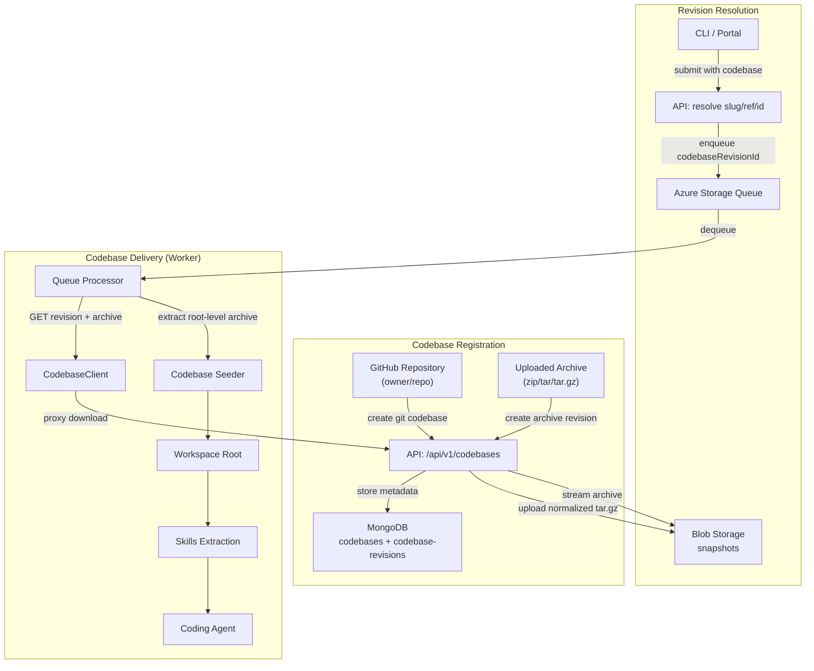
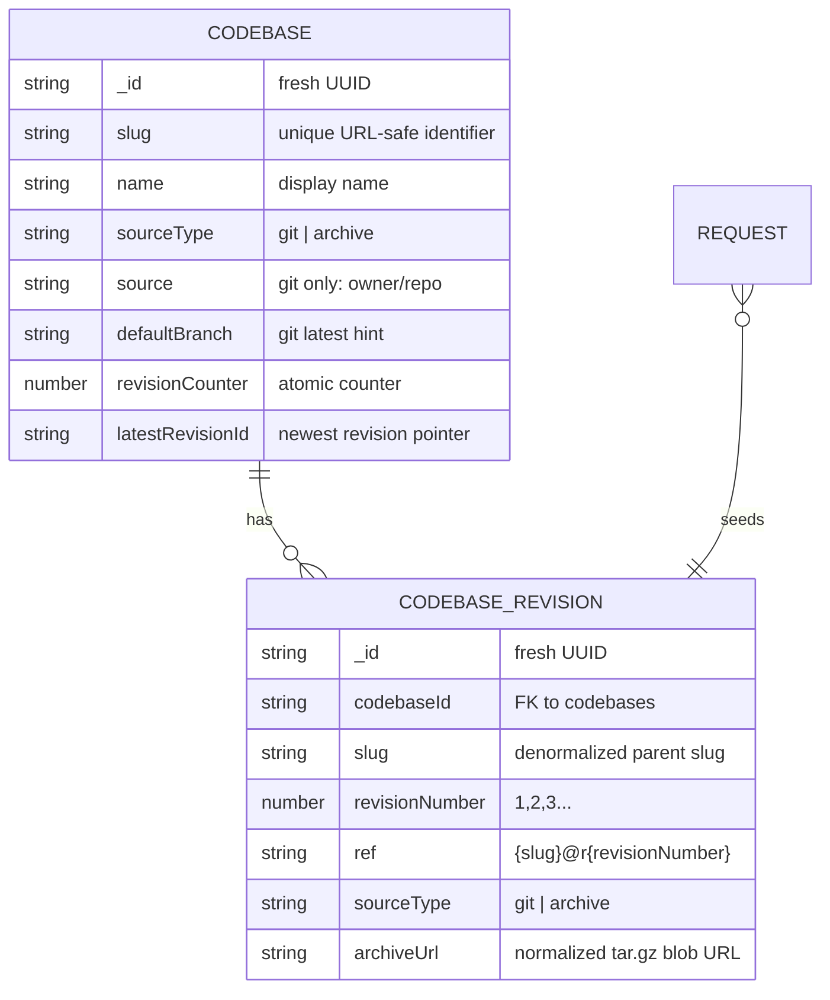
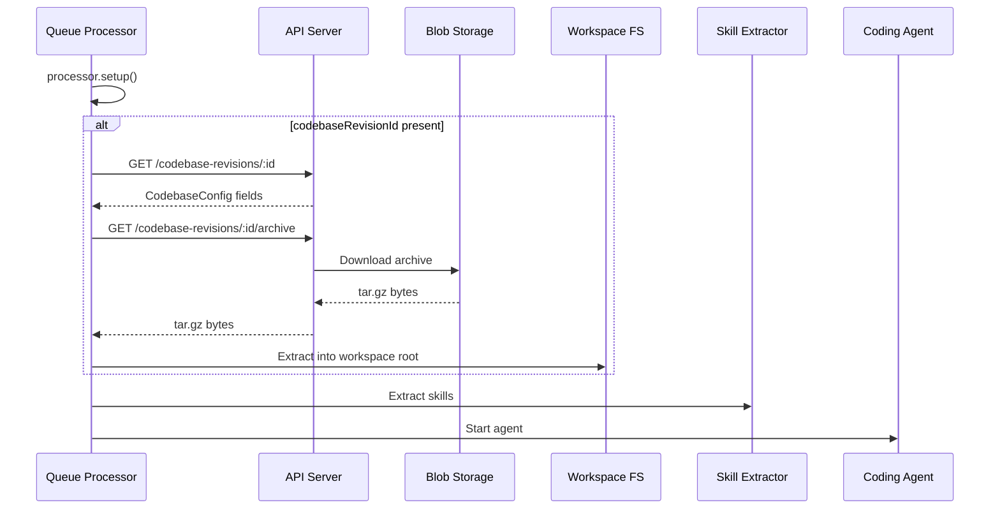

# Codebases Architecture

> **Status:** Current as of June 2026.

Codebases are first-class source snapshots that let benchmark runs start from a real project tree instead of an empty workspace. They support GitHub repositories and user-uploaded archives, and both source types share the same immutable, sequentially numbered revision model. Revisions are deduped against the codebase's latest revision: a Git resolution whose commit SHA is unchanged, or an archive upload whose content hash matches, reuses the existing revision.

## Overview



Codebase revisions are **not content-addressed**, but uploads/resolutions that produce no change are deduped against the codebase's latest revision. A Git resolution whose resolved commit SHA matches the latest revision, or an archive upload whose `contentSha256` matches the latest revision, reuses that revision instead of creating a redundant one. Any actual change creates a new revision with the next sequential `revisionNumber`. Existing revisions are never mutated.

## Data Model



- **Codebase** — Mutable metadata in the `codebases` collection. It has a fresh UUID `_id`, a unique `slug`, display `name`, optional `description`, `sourceType`, Git-only `source` (`owner/repo`) and `defaultBranch`, `revisionCounter`, `latestRevisionId`, optional `creator`, timestamps, and optional `deletedAt` for soft deletion.
- **CodebaseRevision** — Immutable snapshot in the `codebase-revisions` collection. It has a fresh UUID `_id`, `codebaseId`, denormalized `slug`, sequential `revisionNumber`, canonical `ref`, `sourceType`, provenance fields, `archiveUrl`, optional size/file metadata, optional `creator`, `resolvedAt`, and `createdAt`.
- **Request.codebaseRevisionId** — Optional foreign key to `CodebaseRevisionDocument._id`. When present, workers seed the run workspace from that revision before the agent starts.

Revision numbers are assigned by atomically `$inc`-ing `codebases.revisionCounter` in `CodebaseStore.allocateRevisionNumber()`. The store then builds the uniform `ref` as `{slug}@r{revisionNumber}` for both Git and archive revisions and advances `latestRevisionId`.

`resolvedCommitSha` (Git) and `contentSha256` (archive) are provenance only — they are not part of the revision `_id` and not part of the `ref`. Each is compared against the latest revision during resolution/upload so an unchanged commit or identical archive reuses the existing revision, but neither is otherwise an identity key.

## Revision Addressing

Codebase revisions can be addressed in three forms:

| Form | Meaning |
|------|---------|
| Raw revision UUID | Look up `CodebaseRevisionDocument._id` directly |
| `{slug}@r{N}` | Look up the specific revision number for a codebase slug |
| `{slug}` | Resolve the latest revision; for Git codebases, submit-time resolution creates a new revision from the default branch |

`parseCodebaseRevisionRef()` accepts `{slug}@r{N}` and bare `{slug}`. Inputs containing `@` but not the `@r{N}` shape are invalid.

## Lifecycle

### 1. Registration

Codebases are created through `POST /api/v1/codebases`. Git codebases are created from JSON metadata: they require a `source` in `owner/repo` form and may include a `defaultBranch` hint. Archive codebases are created **atomically with their first revision**: the create request must be `multipart/form-data` and include the `archive` file alongside the metadata fields. The API creates the codebase and then its first revision in the same request; if the archive is missing or fails to materialize into a revision, the just-created codebase is hard-deleted (rollback) and a `400` is returned. This guarantees an archive codebase never exists without at least one revision. Subsequent revisions are added through `POST /api/v1/codebases/:id/upload`.

The codebase store derives a URL-safe slug from `slug` or `name`, ensures uniqueness by appending `-2`, `-3`, and so on, and initializes `revisionCounter` to `0`. Soft-deleted codebases still reserve their slugs so historical refs remain stable. The rollback path uses `CodebaseStore.hardDelete()` instead of a soft delete, so a codebase that failed its atomic create leaves no reserved slug behind.

### 2. Resolution

Git revisions are resolved by `CodebaseResolver.resolveGit()`. The resolver mirrors `SkillResolver`'s GitHub auth model: it uses the configured static token or the same round-robin token provider, and it currently targets GitHub repositories only.

For `requestedRef` values that are empty or `"latest"`, the resolver uses the codebase's `defaultBranch` or fetches the repository default branch through the GitHub API. It resolves the ref to an exact commit, then compares that commit SHA with the codebase's latest revision: if they match, the existing revision is returned unchanged (no tarball download, no upload, no new revision). Otherwise it downloads the GitHub tarball at that commit, normalizes it, uploads the archive, and creates a new incremental revision.

Archive revisions are created by `CodebaseResolver.createArchiveRevision()`. The resolver hashes the uploaded bytes into `contentSha256` for provenance, then compares it with the codebase's latest revision: if they match, the existing revision is returned unchanged (no normalization, no upload, no new revision). Otherwise it normalizes the archive, uploads the normalized tar.gz, and creates a new incremental revision.

Both methods return a `{ revision, deduplicated }` result. The resolve (`POST /codebases/:id/revisions`) and upload (`POST /codebases/:id/upload`) endpoints surface this to clients: a newly created revision responds `201` and a reused one responds `200`, and the JSON body carries a `deduplicated` boolean. The Portal and CLI use it to show a distinct "no changes — reused existing revision" message instead of implying a new revision was created.

### 3. Archiving

All codebase revision content is stored as a normalized root-level tar.gz in the shared `snapshots` container:

```
codebase-revisions/{codebaseId}/{revisionId}.tar.gz
```

The key is based on the immutable revision UUID, not the revision number or provenance hash. This prevents concurrent creates from overwriting each other's archive bytes.

Both Git tarballs and uploaded archives are normalized by `normalizeToRootTarGz()`: the input is extracted, a single top-level wrapper directory is unwrapped when present, and the contents are re-archived at the root. Workers can therefore extract every revision directly into the workspace root without `--strip-components` logic.

### 4. Delivery (Worker)

When a worker dequeues a request, `QueueProcessor` runs setup first so the worker-specific `workspacePath` is available. If `RequestDocument.codebaseRevisionId` is set, it then:

1. Creates a `CodebaseClient` using `SCOPE_MT_API_URL`
2. Resolves the revision via `GET /api/v1/codebase-revisions/:id`
3. Downloads the archive via `GET /api/v1/codebase-revisions/:id/archive`
4. Extracts the archive into the workspace root with `seedCodebaseToWorkspace()`

This happens **after** `processor.setup()` and **before** skills extraction, so skills can overlay the seeded project tree. Seeding is a hard prerequisite: missing API configuration, revision lookup failures, download failures, or extraction failures fail the run instead of silently starting from an empty workspace.



## REST API

Codebase routes are registered in `apps/api/src/routes/codebases.ts`.

| Method | Path | Purpose |
|--------|------|---------|
| `GET` | `/api/v1/codebases` | List non-deleted codebases, newest first |
| `POST` | `/api/v1/codebases` | Create a codebase. Git: JSON metadata. Archive: `multipart` with the `archive` file, creating the codebase plus its first revision atomically (rolls back on failure) |
| `GET` | `/api/v1/codebases/:id` | Fetch one codebase by `_id` |
| `PATCH` | `/api/v1/codebases/:id` | Update mutable metadata (`name`, `description`, `defaultBranch`) |
| `DELETE` | `/api/v1/codebases/:id` | Soft-delete a codebase and delete its revisions |
| `GET` | `/api/v1/codebases/:id/revisions` | List revisions for a codebase, newest first (`limit` 1–200, default 50) |
| `POST` | `/api/v1/codebases/:id/revisions` | Resolve a new Git revision from `requestedRef` / latest |
| `POST` | `/api/v1/codebases/:id/upload` | Upload an archive as a new archive revision (`multipart` field `archive`) |
| `GET` | `/api/v1/codebase-revisions/:id/archive` | Download the normalized tar.gz archive through the API proxy |
| `GET` | `/api/v1/codebase-revisions/:id` | Fetch one codebase revision by `_id` |

The archive-download proxy route is registered before the generic revision `/:id` route so `/archive` is not captured as part of the revision id.

## Run Integration

Run submission accepts either an already-resolved `codebaseRevisionId` or a `codebase` spec:

- Raw revision UUID
- `{slug}@r{N}`
- Bare `{slug}`

`resolveCodebaseSpec()` resolves the selection before enqueueing. Raw revision ids and `{slug}@r{N}` refs are validated as existing revisions. Bare archive slugs resolve to the latest existing revision and fail if no archive has been uploaded. Bare Git slugs resolve the default branch at submit time; if the resolved commit SHA still matches the latest revision the existing revision is reused, so repeated submissions against an unchanged branch share one revision and only advance when the branch moves.

The resolved `_id` is persisted as `RequestDocument.codebaseRevisionId` and included in `CreateRequestInputSchema` / `RequestResponseSchema`.

### Run archive bundling

When a run is downloaded (`GET /api/v1/requests/:id/archive` or the per-attempt variant), the seeding codebase is included so the archive is a self-contained record of the exact starting point the agent worked from:

- The revision document is fetched via `codebaseRevisionStore` and embedded in `run.yaml` under a `codebase:` block (ref, source, `resolvedCommitSha`, file count, size, and provenance).
- The revision's normalized snapshot is bundled as `{runId}/codebase.tar.gz`.
- In `run.yaml`, the `codebase.archiveUrl` is rewritten to the relative bundled path (`codebase.tar.gz`), mirroring how HAR/chat URLs are rewritten; the original blob URL is preserved under `codebase.archiveBlobUrl`.

This is implemented in `packRunIntoTar()` (`apps/api/src/archive-har.ts`); `apps/api/src/routes/requests/archive.ts` attaches the revision before packing.

## Migration and Indexes

Migration `020-create-codebase-indexes.ts` creates the indexes used by codebase lookup and revision listing:

| Collection | Index | Purpose |
|------------|-------|---------|
| `codebases` | `{ slug: 1 }` unique | Slug lookup and uniqueness |
| `codebases` | `{ createdAt: -1 }` | Newest-first list queries |
| `codebases` | `{ deletedAt: 1 }` | Active vs. soft-deleted filtering |
| `codebase-revisions` | `{ ref: 1 }` unique | Canonical ref lookup |
| `codebase-revisions` | `{ codebaseId: 1 }` | Revisions by parent codebase |
| `codebase-revisions` | `{ codebaseId: 1, revisionNumber: -1 }` | Latest revision and newest-first revision lists |

The migration's `down()` intentionally skips dropping indexes; indexes should be removed manually if needed.

## CLI and Portal

The CLI exposes `codebase` commands for managing codebases and revisions. The Portal provides `CodebaseList`, `CodebaseDetail`, and `CodebasePicker` UX for browsing codebases, resolving/uploading revisions, inspecting revisions, and selecting a codebase for run submission. `CodebaseDetail` mirrors the skills detail layout: a single card on the left shows the selected revision's provenance and snapshot (with a "Download archive" button via the `/codebase-revisions/:id/archive` proxy), and a right sidebar holds a codebase-level Details card plus a clickable Revisions list. Selecting a revision in the sidebar is reflected in the URL (`/codebases/:id` for latest, `/codebases/:id/revisions/:revisionId` for a specific one), so individual revisions stay deep-linkable and default to the latest. These management surfaces mirror the skills workflow at a high level: register an entity, create immutable revisions, and attach a resolved revision to a run.

## Key Files

| File | Purpose |
|------|---------|
| `packages/shared/src/types/codebase.ts` | Codebase, revision, source-type, and runtime config types |
| `packages/shared/src/codebases/codebase-store.ts` | Mutable codebase store, slug uniqueness, soft delete, revision counter |
| `packages/shared/src/codebases/codebase-revision-store.ts` | Immutable revision store and `{slug}@r{N}` lookup |
| `packages/shared/src/codebases/codebase-revision-id.ts` | Slug and ref build/parse helpers |
| `packages/shared/src/codebases/codebase-resolver.ts` | GitHub resolution, archive upload handling, blob key naming |
| `packages/shared/src/codebases/codebase-archive.ts` | Archive extraction and root-level tar.gz normalization |
| `packages/shared/src/codebases/codebase-client.ts` | Worker-side API client for revision resolution and archive download |
| `packages/shared/src/codebases/codebase-seeder.ts` | Worker workspace seeding |
| `apps/api/src/routes/codebases.ts` | REST endpoints for codebases, revisions, uploads, and archive proxying |
| `apps/api/src/archive-har.ts` | Run archive packing, including `codebase.tar.gz` bundling and `run.yaml` codebase block |
| `apps/portal/src/pages/CodebaseDetail.tsx` | Codebase page mirroring the skills layout: selected revision card on the left, sidebar Details + clickable deep-linkable Revisions list, archive download |
| `apps/api/src/utils/codebase-helpers.ts` | Blob container naming and submit-time codebase spec resolution |
| `apps/api/src/routes/requests/index.ts` | Run submission integration and `codebase` spec handling |
| `packages/shared/src/queue/queue-processor.ts` | Worker seeding hook before skills extraction |
| `packages/db-migrations/src/migrations/020-create-codebase-indexes.ts` | MongoDB indexes for codebases and revisions |

## Acceptance Scenario (end-to-end proof)

The headline proof exercises every layer through one real run: a **git** codebase
for `pamelafox/pamelafox-site` is imported, its latest revision resolved, and a
"migrate this site to Astro" run submitted with that revision selected. The worker
seeds the fresh workspace with the snapshot **before** the agent starts, the agent
migrates the real files, and the run is considered successful only when the Judge
passes a criterion asserting the result uses the Astro framework.

`scripts/acceptance-codebase-astro.sh` drives this as a **Ralph loop** — it
re-runs import → resolve → submit → wait → judge until the "uses Astro" criterion
is green (or a max-iteration cap is hit), printing diagnosis hints for the new
code paths (seeding, archive normalization, revision resolution, submit wiring) on
each failed iteration. It requires a live stack (`pnpm docker:up:infra` +
`pnpm docker:dev:copilot`), `jq`/`curl`, and an `ASTRO_CRITERION_ID` for the
"uses Astro" criterion:

```bash
ASTRO_CRITERION_ID=<criterion-id> SCOPE_API_URL=http://localhost:5108 \
  scripts/acceptance-codebase-astro.sh
```
