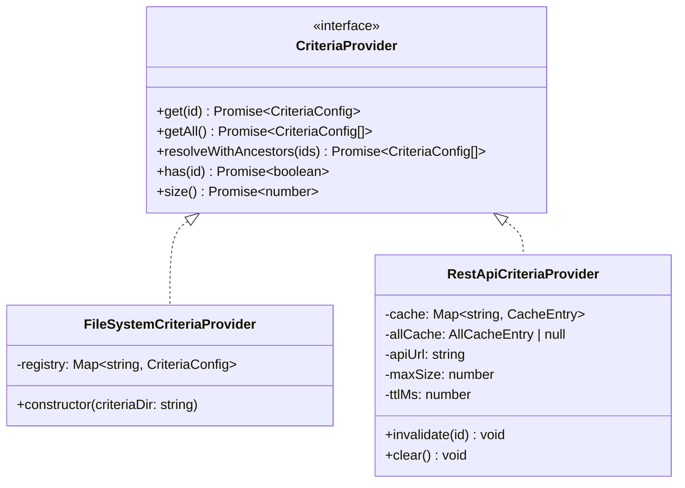
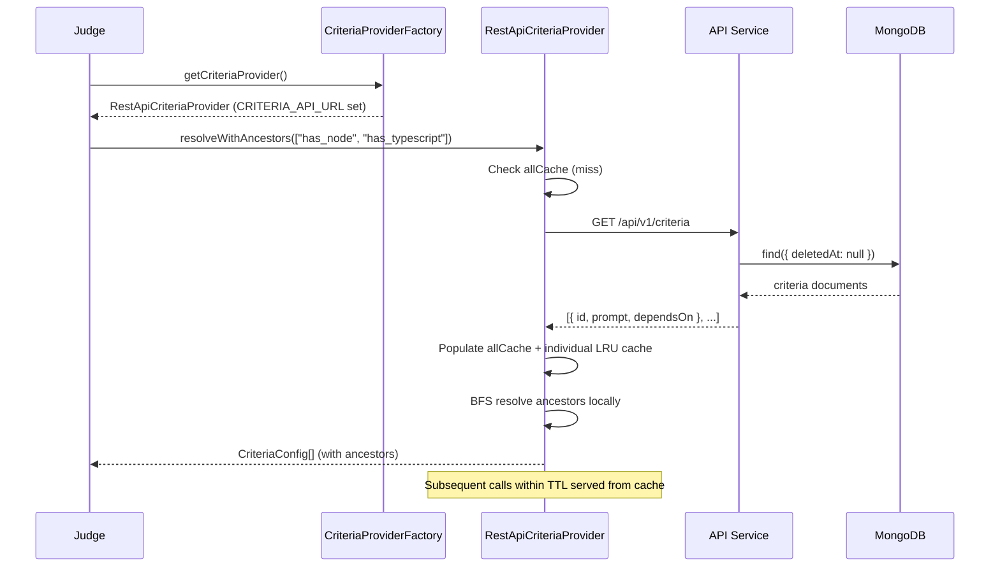
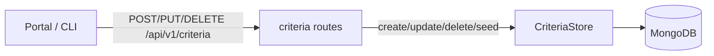

# CriteriaProvider — Unified Criteria Loading Architecture

## Overview

The **CriteriaProvider** abstraction unifies how the judge (and other consumers) load evaluation criteria. Instead of coupling the judge directly to a filesystem directory or a MongoDB collection, the provider interface allows transparent switching between different backends at runtime.

> **Evidence available to criteria at evaluation time.** This doc covers how
> criteria are *loaded*. When the judge *evaluates* a resolved criterion it can
> gather evidence from three sources: the
> workspace snapshot (always), the coding agent's captured tool outputs across the
> **whole run** (via `list_tool_calls` / `search_tool_outputs` / `get_tool_output`,
> when present — see issue #1255), and the coding agent's
> own response — its answer/explanation — via `read_agent_response` (issue #1136,
> when present). This makes criteria that grade what the agent *said* (Q&A /
> no-code-change deliverables) gradeable. See [gates §4.6](../design/gates.md) for
> the request contract and tool details.

## Interface

```typescript
interface CriteriaProvider {
  get(id: string): Promise<CriteriaConfig | undefined>;
  getAll(): Promise<CriteriaConfig[]>;
  resolveWithAncestors(ids: string[]): Promise<CriteriaConfig[]>;
  has(id: string): Promise<boolean>;
  size(): Promise<number>;
}
```

All methods are `async` so both synchronous (filesystem) and asynchronous (HTTP) backends can satisfy the same contract.

> Each `CriteriaConfig` carries an optional `gates: GateId[]` compatibility list
> (empty/undefined = compatible with all [gates](app-design.md#gates--multi-phase-evaluation-pipeline)).
> `resolveWithAncestors` is also how the gate pipeline pulls a criterion's
> dependencies into a gate's evaluation set; the compatibility list is
> downward-closed so a resolved ancestor is always compatible with its
> descendant's gates. See the [gates design doc](../design/gates.md).

## Implementations



### FileSystemCriteriaProvider

- Reads all `.yaml`/`.yml` files from a directory on construction
- Serves from an in-memory `Map` (zero latency after init)
- Same logic as the legacy `CriteriaRegistry`, adapted to the async interface
- Used for: local development, testing, backward compatibility

### RestApiCriteriaProvider

- Fetches criteria from the REST API (`GET /api/v1/criteria` and `GET /api/v1/criteria/:id`)
- LRU cache with configurable TTL (default 1 min) and max-size (default 200)
- `resolveWithAncestors` optimised: one `getAll()` call then local BFS (1 HTTP request, not N)
- Used for: production (K8s), docker-compose

## Runtime Flow



## Factory & Environment Selection

The `createCriteriaProvider()` factory selects the implementation based on environment variables:

| Priority | Env Var | Provider | Typical Use |
|----------|---------|----------|-------------|
| 1 | `CRITERIA_API_URL` | `RestApiCriteriaProvider` | Production (K8s), docker-compose |
| 2 | `CRITERIA_DIR` | `FileSystemCriteriaProvider` | Local dev with explicit path |
| 3 | *(default)* | `FileSystemCriteriaProvider` | Fallback: `./config/criteria` |

A singleton accessor (`getCriteriaProvider()`) ensures the provider is created once and reused.

## Why REST API over Direct DB Access?

| Concern | REST API (Approach D) | Direct MongoDB | ConfigMap sidecar |
|---------|----------------------|----------------|-------------------|
| **Coupling** | Judge depends only on API contract | Judge needs MongoDB driver + connection | Judge needs sidecar + shared volume |
| **Deployment** | No sidecar, no ConfigMap sync | No sidecar, but needs DB credentials | Extra container per pod |
| **Source of truth** | API (single writer/reader contract) | DB directly (bypasses API validation) | ConfigMap (stale copy) |
| **Latency** | ~1ms in-cluster HTTP (cached) | ~1ms direct DB | Zero (local file) |
| **Complexity** | Low | Medium (DB credentials in judge) | High (sidecar lifecycle) |

## Trade-offs

**Pros:**
- Simplest deployment topology (no sidecar, no ConfigMap generator)
- API is the single source of truth for criteria CRUD
- LRU cache minimises repeated HTTP calls
- Backward-compatible: filesystem provider still works for local dev

**Cons:**
- Judge depends on API availability during criteria resolution
- First evaluation after cache expiry incurs one HTTP round-trip
- If API is down, judge cannot resolve criteria (mitigated by cache TTL)

## Write Path — `CriteriaStore` as the Single Source of Truth

The `CriteriaProvider` abstraction above governs **reads**. All criteria **writes**
(create, update, delete, and bulk seed) go through a single class, `CriteriaStore`
(`packages/shared/src/criteria/criteria-store.ts`), which the API routes
(`apps/api/src/routes/criteria.ts`) delegate to:



`CriteriaStore` centralises every write-time invariant so the rules cannot be
bypassed or drift between callers:

- **ID format** — must match `^[a-z][a-z0-9_]*$` (aligned with the route zod schema).
- **Uniqueness** — duplicate active ids are rejected.
- **Dependency existence** — every `dependsOn` id must resolve to an active criterion.
- **Acyclicity** — a proposed change is rejected if it would introduce a cycle
  (validated by building a temporary `DependencyGraph` over the resulting set).
  This closes a prior gap where the inline route logic skipped the transitive
  cycle check, letting cyclic dependencies be written and only failing later at
  judge time.
- **Gate-compatibility invariant** — enforced from both sides: a child's gates must
  be a subset of every parent's gates, and narrowing a parent may not strand an
  existing dependent.
- **Referential integrity on delete** — deleting a criterion that still has
  dependents is rejected.

### Typed errors → HTTP status

`CriteriaStore` throws typed errors (`packages/shared/src/criteria/criteria-errors.ts`)
that the routes map to HTTP responses, avoiding fragile string matching:

| Error class | HTTP | Notes |
|-------------|------|-------|
| `CriteriaValidationError` | 400 | Bad id, missing dependency, cycle, gate-invariant violation |
| `CriteriaNotFoundError` | 404 | Update/delete of an unknown id |
| `CriteriaDuplicateError` | 409 | Create with an existing id |
| `CriteriaHasDependentsError` | 409 | Delete blocked; carries `dependents: string[]` |

### Cosmos index dependency for `getAll()`

Every write invariant that inspects the existing set (`validateNoCycles`,
`validateGateCompatibility`) calls `CriteriaStore.getAll()`, which lists active
criteria with `.find({ deletedAt: { $exists: false } }).sort({ id: 1 })`. On
Azure Cosmos DB for MongoDB (RU-based) an `ORDER BY` is only served by a **range
index** on the sort path. The `criteria` collection's `unique { id: 1 }` index
(migration `002`) is a uniqueness *constraint*, not a range index, so it does
**not** satisfy `ORDER BY id` — the sort fails with `BadRequest (400) … "The
index path corresponding to the specified order-by item is excluded."`

Migration `024-add-criteria-sort-index.ts` adds a 2-field compound index
`{ deletedAt: 1, id: 1 }` (distinct key pattern, so it coexists with the unique
index) that matches the query shape and serves the sort. This is what makes
creating a criterion with dependencies (#1192) and updating a criterion's
dependencies (#1103) work on int/prod; locally Azurite/Mongo does not enforce
Cosmos index semantics, so the bug only reproduced against real Cosmos. The fix
was validated end-to-end against the shared dev Cosmos account (see
[docs/shared-dev-infra.md](../shared-dev-infra.md)). Any future `.sort()` added
to a `CriteriaStore` read must be backed by a matching Cosmos index.

### Bulk seed (`POST /api/v1/criteria/seed`)

Seeding keeps its insert-if-missing semantics (existing ids are skipped, not
overwritten) but first validates that the **resulting** active set is acyclic by
constructing a `DependencyGraph` over the merge of existing criteria and the new
batch. Edges to ids not present in the set are tolerated (partial/forward
references), so only a genuine cycle rejects the whole batch with `400`.

> Reads (`GET /api/v1/criteria`, `/graph`, `/:id`) and unrelated endpoints
> (`/generate-prompt`, `/mdp`) remain inline — they carry no write-time
> invariants. Only the four write paths route through `CriteriaStore`.
