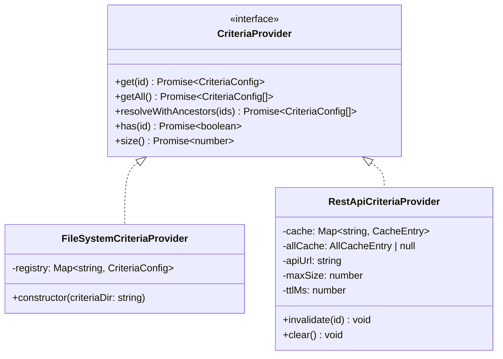
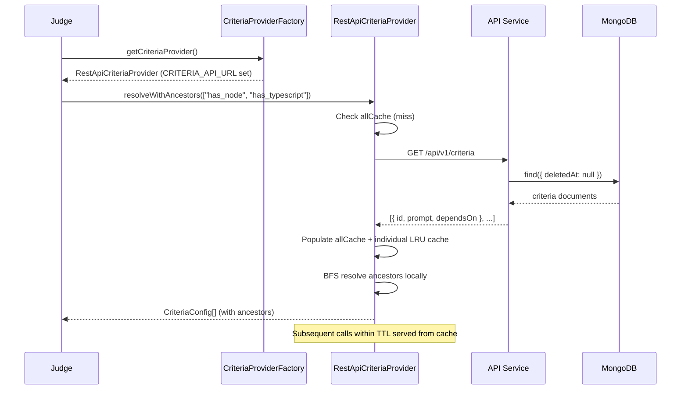

# CriteriaProvider — Unified Criteria Loading Architecture

## Overview

The **CriteriaProvider** abstraction unifies how the judge (and other consumers) load evaluation criteria. Instead of coupling the judge directly to a filesystem directory or a MongoDB collection, the provider interface allows transparent switching between different backends at runtime.

## Interface

```typescript
interface CriteriaProvider {
  get(id: string): Promise<CriteriaConfig | undefined>;
  getAll(): Promise<CriteriaConfig[]>;
  resolveWithAncestors(ids: string[]): Promise<CriteriaConfig[]>;
  has(id: string): Promise<boolean>;
  size(): Promise<number>;
}
```

All methods are `async` so both synchronous (filesystem) and asynchronous (HTTP) backends can satisfy the same contract.

> Each `CriteriaConfig` carries an optional `gates: GateId[]` compatibility list
> (empty/undefined = compatible with all [gates](app-design.md#gates--multi-phase-evaluation-pipeline)).
> `resolveWithAncestors` is also how the gate pipeline pulls a criterion's
> dependencies into a gate's evaluation set; the compatibility list is
> downward-closed so a resolved ancestor is always compatible with its
> descendant's gates. See the [gates design doc](../design/gates.md).

## Implementations



### FileSystemCriteriaProvider

- Reads all `.yaml`/`.yml` files from a directory on construction
- Serves from an in-memory `Map` (zero latency after init)
- Same logic as the legacy `CriteriaRegistry`, adapted to the async interface
- Used for: local development, testing, backward compatibility

### RestApiCriteriaProvider

- Fetches criteria from the REST API (`GET /api/v1/criteria` and `GET /api/v1/criteria/:id`)
- LRU cache with configurable TTL (default 1 min) and max-size (default 200)
- `resolveWithAncestors` optimised: one `getAll()` call then local BFS (1 HTTP request, not N)
- Used for: production (K8s), docker-compose

## Runtime Flow



## Factory & Environment Selection

The `createCriteriaProvider()` factory selects the implementation based on environment variables:

| Priority | Env Var | Provider | Typical Use |
|----------|---------|----------|-------------|
| 1 | `CRITERIA_API_URL` | `RestApiCriteriaProvider` | Production (K8s), docker-compose |
| 2 | `CRITERIA_DIR` | `FileSystemCriteriaProvider` | Local dev with explicit path |
| 3 | *(default)* | `FileSystemCriteriaProvider` | Fallback: `./config/criteria` |

A singleton accessor (`getCriteriaProvider()`) ensures the provider is created once and reused.

## Why REST API over Direct DB Access?

| Concern | REST API (Approach D) | Direct MongoDB | ConfigMap sidecar |
|---------|----------------------|----------------|-------------------|
| **Coupling** | Judge depends only on API contract | Judge needs MongoDB driver + connection | Judge needs sidecar + shared volume |
| **Deployment** | No sidecar, no ConfigMap sync | No sidecar, but needs DB credentials | Extra container per pod |
| **Source of truth** | API (single writer/reader contract) | DB directly (bypasses API validation) | ConfigMap (stale copy) |
| **Latency** | ~1ms in-cluster HTTP (cached) | ~1ms direct DB | Zero (local file) |
| **Complexity** | Low | Medium (DB credentials in judge) | High (sidecar lifecycle) |

## Trade-offs

**Pros:**
- Simplest deployment topology (no sidecar, no ConfigMap generator)
- API is the single source of truth for criteria CRUD
- LRU cache minimises repeated HTTP calls
- Backward-compatible: filesystem provider still works for local dev

**Cons:**
- Judge depends on API availability during criteria resolution
- First evaluation after cache expiry incurs one HTTP round-trip
- If API is down, judge cannot resolve criteria (mitigated by cache TTL)
