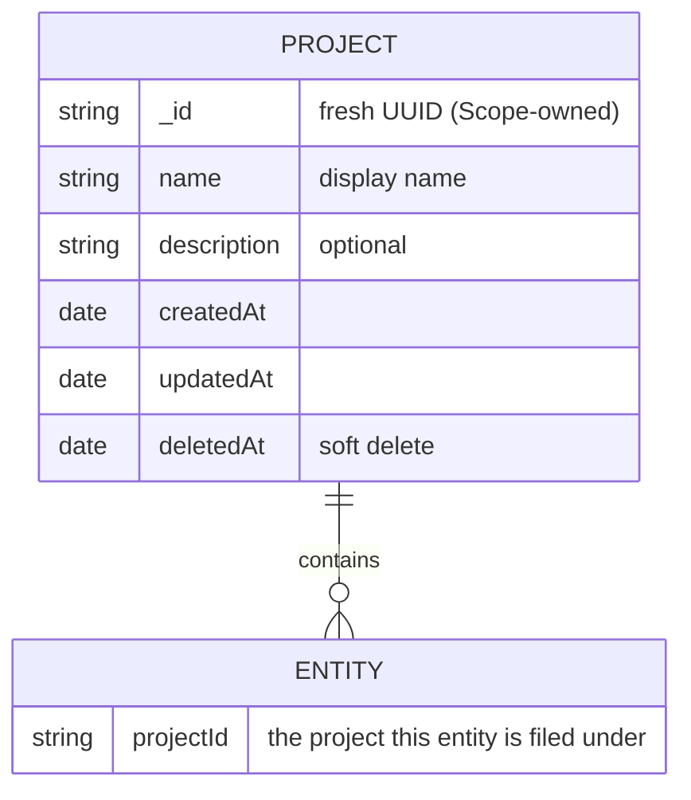
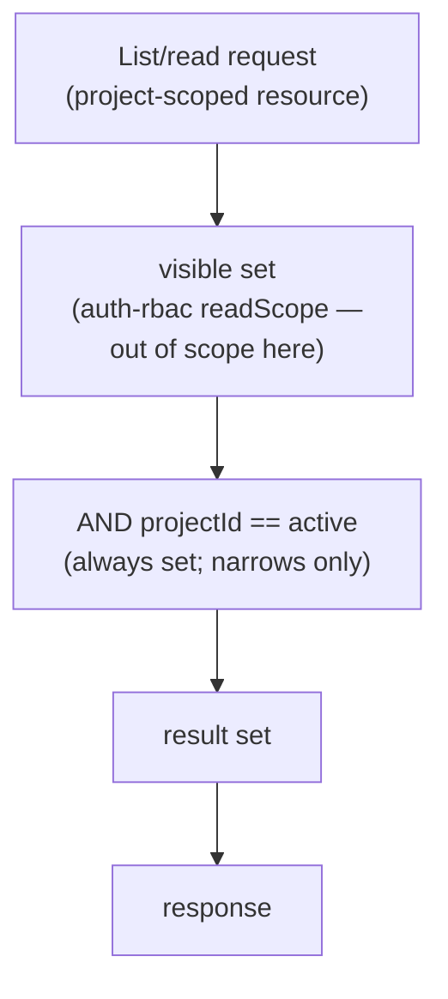
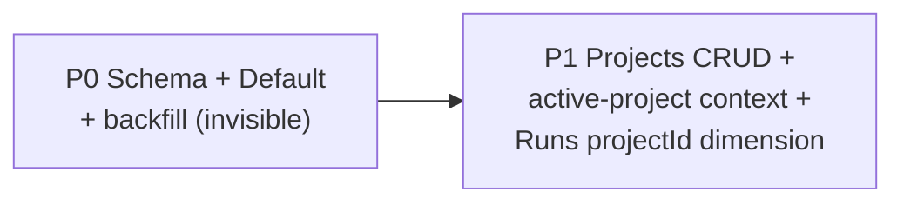

# Data Organization: Projects

> **Status:** Proposed — design proposal. Date: 2026-06-30.

Scope currently stores all user-facing data in one flat, global namespace. This document
proposes a first-class way to **organize** that data **within a single Kubernetes cluster** by
introducing **the project** — a named container data is filed under.

This is the **data-organization layer** only. It defines the `projects` container plus the
`projectId` field, and how data is **filed, filtered, and grouped** by it. **Access control —
ownership, membership, groups, visibility, and authorization — is out of scope and owned by
[auth-rbac.md](auth-rbac.md).** The two are orthogonal layers: this design populates the
`projectId` field auth-rbac already reserved, and auth-rbac's access model can later key off that
field to enforce project-scoped visibility. This doc adds **no** permissions, roles, ownership, or
enforcement, and re-models **no** existing data.

> **Landing order — independent of auth-rbac.** auth-rbac.md is itself `Proposed`. Because this
> layer adds only organization (a container + one field + filtering) and **no** access control,
> it can land **before, after, or alongside** auth-rbac with no dependency in either direction —
> the `projectId` field is simply inert until an access layer chooses to read it. See
> [Landing order](#landing-order-independent). Where project-scoped *access* is concerned, this
> doc defers to auth-rbac **Open Question B** ("Sharing, groups & projects").

---

## Problem

All Scope data — runs (`requests`), profiles, criteria, prompts, personas, scenarios,
codebases, reports, insights, MCP servers — lives in **one shared, flat space** with no
organizing container. Consequences as adoption grows:

- Users can't find their own work (scope-core#677 _"How can I find back 'my' runs?"_,
  scope-core#766 _"Improve UX when listing all runs"_).
- There is no way to say _"these runs, profiles, and criteria belong together"_ (a scenario,
  an experiment, a team's workstream).
- Everything shares one namespace, so listings mix unrelated work together and there is no
  durable grouping to file work under.

auth-rbac.md governs **who can see and edit** each item (ownership + visibility). What it does
**not** provide is a **durable container** to file related work under and organize/filter by.
That container is what this document adds. Access control stays entirely with auth-rbac; this
layer only decides how data is *organized*, not who may *see* it.

### Goals

1. A **first-class organizing container** ("project") that gives data a durable home so related
   runs, profiles, criteria, etc. can be **filed together** and **filtered/grouped** as a unit,
   instead of floating in one flat namespace.
2. **Purely additive & non-breaking**: existing flat/global data keeps working unchanged; the
   feature is opt-in and reversible phase-by-phase.
3. **Clean composition with access control**: expose the `projectId` dimension that auth-rbac's
   access model can later key off — without this layer defining any ownership, membership, or
   enforcement itself.

### Non-goals

- **Access control — out of scope, owned by auth-rbac.** Ownership (`ownerId`/`ownerType`/
  `sharedWith`), **membership** (who belongs to a project), **groups/teams**, **visibility**
  (`private`/`shared`), permissions, roles, and the `readScope`/`writeScope` enforcement path are
  **all** defined by [auth-rbac.md](auth-rbac.md), not here. This layer neither adds nor changes
  any of them; it only adds the `projectId` organizing dimension they can compose with.
- **Cross-cutting tags/labels** — a companion organizing layer, specified in
  [data-tags.md](data-tags.md), not here. This doc covers only the project container.
- **Moving / re-filing entities between projects** — `projectId` is assigned once at creation and
  stays fixed; changing an entity's project is out of scope for this design.
- **Multi-cluster / cross-cluster** organization — explicitly out of scope. This is about
  organizing data *within a single cluster*.
- **Code changes** — this document is a design proposal only. Schema/migration/route work is
  sequenced in [Phased rollout](#phased-rollout) for follow-up PRs.
- A new billing/quota/tenant-isolation boundary — projects are an *organizing* boundary, not a
  security or tenant boundary (tenant isolation stays with auth-rbac).

---

## Current state

Every user-facing collection is global and flat. Relevant collections today (see
[db.md](db.md)):

| Collection | Entity | Kind |
|------------|--------|------|
| `requests` | Runs (the core entity) | Durable |
| `profiles` / `profile-versions` | Run configuration profiles | Durable |
| `criteria` | Evaluation criteria (a DAG) | Durable |
| `task-prompts` | Content-addressed prompts (`task` / `agents.md`) | Content-addressed (immutable) |
| `mcp-servers` | MCP server configs | Durable |
| `codebases` / `codebase-revisions` | Source snapshots | Durable (codebase) / content-addressed (revision) |
| `reports` / `insights` | Judge output, derived from a run | Derived (follows parent) |
| `prompt-features` / `-extractions` | Extracted features | Content-addressed (immutable) |
| `skills` / `skill-revisions` | Agent skills | Durable (skill) / content-addressed (revision) |

auth-rbac.md **reserves** (optional, ignored by its v1 logic) a `projectId?` field on entities,
plus a future `projects` collection keyed by Scope-owned ids, precisely so an organization layer
can slot in later. **This document is that layer**: it fills in `projectId` and introduces the
`projects` container. (auth-rbac's other reserved fields — `ownerType`, `groupId`, `sharedWith` —
belong to its access model and are **not** touched here.)

### Landing order (independent)

This design and auth-rbac are **orthogonal layers**. This layer adds only *organization* — a
container plus the `projectId` field plus filtering — and defines **no** identity, ownership,
visibility, or enforcement. So it has **no** dependency on auth-rbac in either direction, and
auth-rbac has none on it:

| Layer | Owned by | Needs caller identity? | Depends on the other? |
|-------|----------|------------------------|-----------------------|
| **Organization** (`projects`, `projectId`; filing, `groupBy:"project"`, active-project filter) | **This doc** | No — filing and filtering only *narrow* result sets | No |
| **Access** (ownership, membership, groups, visibility, `readScope`/`writeScope` enforcement) | **auth-rbac** | Yes | No — its access model **may** additionally key off `projectId`, but need not |

The only integration point is one-way and optional: **auth-rbac's `readScope` MAY read
`projectId`** (e.g. to make data discoverable to a project's members) once both layers exist. That
integration is specified in auth-rbac (Open Question B), **not** here. Until then the field is
inert — present and filterable, but unenforced. The [phased rollout](#phased-rollout) therefore
needs no identity layer for any of its phases.

---

## Recommended primitive

**The single organizing primitive is the Project** — a named container that data is *filed under*
and filtered/grouped by. It ships first and satisfies the "file related work together / stop mixing
everyone's data into one list" goal on its own, with no dependency on the access layer.

| Primitive | Job | First lands | Cardinality |
|-----------|-----|-------------|-------------|
| **Project** | Primary **organizing container**; the thing data is *filed under* and filtered/grouped by | **P1** | Each entity has **one** `projectId` |

Cross-cutting, many-to-many labelling (a run belonging to several efforts) is deliberately **not**
folded into the project — that keeps the singular `projectId` a scalar rather than an array (see
[Alternatives considered](#alternatives-considered)).

> **Groups / teams are deliberately not a primitive here.** A "team that owns a workstream" is an
> *access* concept (ownership + membership), which this layer leaves entirely to
> [auth-rbac.md](auth-rbac.md). A project is just a named bucket; *who* may see or administer it is
> auth-rbac's to decide. See [Non-goals](#non-goals).

### Why the Project

- **Project alone satisfies the core goal.** A single `projectId` gives every entity a durable
  home and makes "show me only this workstream" a one-clause filter — with **no** dependency on
  the access layer. It is the MVP that resolves the "find my work / stop mixing everything
  together" pain. This is the "start with one structure, phase the rest" spine of the
  [rollout](#phased-rollout).
- **Single `projectId` keeps everything cheap.** The reserved field is singular, so filing is one
  scalar write and filtering is one `{ projectId: { $in: […] } }` clause — no per-entity fan-out,
  no array-membership index gymnastics on Cosmos DB. It also hands the access layer a single scalar
  to key off later, should it choose to.
- **Organization ≠ access, so this layer stays small.** By leaving ownership, membership, groups,
  and visibility to auth-rbac, this design reduces to a container + one field + filtering —
  shippable in any order (see [Landing order](#landing-order-independent)).

Trade-offs and the rejected shapes (many-to-many projects, nested projects) are in
[Alternatives considered](#alternatives-considered).

---

## Data model

> The `projects` collection carries **no** owner or member fields, and there are **no**
> `project-memberships`, `groups`, or `group-memberships` collections. *Who* owns or may access a
> project is an [access concern owned by auth-rbac](#non-goals), not modelled here. `ENTITY` is any
> [project-scoped collection](#which-entities-are-project-scoped); auth-rbac separately adds its
> own `ownerId`/`visibility` fields to the same documents.

### New collection: `projects`

Mirrors the first-class-entity pattern established by `codebases` (fresh-UUID `_id`, timestamps,
soft-delete `deletedAt`) — minus any ownership field:

| Field | Type | Notes |
|-------|------|-------|
| `_id` | `string` | Fresh Scope-owned UUID; the seeded **Default** project uses the reserved id `"default"` |
| `name` | `string` | Display name |
| `description?` | `string` | |
| `createdAt` / `updatedAt` / `deletedAt?` | `Date` | Soft-delete like `codebases` |

There is intentionally **one** new collection. Ownership, membership, and group collections, if
ever needed, are introduced by [auth-rbac.md](auth-rbac.md), which owns access — not here.

### Fields added to existing entities

Every [project-scoped](#which-entities-are-project-scoped) entity gains a single field:

- `projectId?: string` — the project this entity is **filed under** (exactly one). Missing ⇒
  **coalesces to the Default project** (see [Migration](#migration)); after backfill every
  project-scoped doc carries one, so none is ever project-less.

For the immutable [content-addressed](#content-addressed-entities-per-project-copies) copies,
`projectId` comes with an identity change (below).

This design adds **nothing else** to existing documents. Access fields (`ownerId`, `visibility`, …)
are added separately by [auth-rbac.md](auth-rbac.md); the field sets are disjoint and independent (see
[Landing order](#landing-order-independent)).

### Which entities are project-scoped

The scoping boundary is deliberately **broad**: nearly all user-facing data is project-scoped, and
only platform infrastructure stays global.

- **Project-scoped, single-copy** (durable, mutable — carry `projectId`): runs (`requests`),
  profiles, criteria, personas, scenarios, MCP servers, codebases, reports, insights, **skills**,
  **extensions**, **report templates**.
- **Project-scoped, content-addressed** (immutable — carry `projectId`): `task-prompts`,
  `prompt-features`/`-extractions`, `skill-revisions`, `codebase-revisions`. Scoping these to a
  project means **each project keeps its own copy**, which trades away cluster-wide deduplication
  and changes how they are keyed — see
  [Content-addressed entities](#content-addressed-entities-per-project-copies).
- **Global platform catalog** (not project-scoped): **agents** and **models** — the platform-level
  registry of available coding agents and LLMs, shared by every project. Whether either ever needs
  project scoping (e.g. a project-private model endpoint) is an [open question](#open-questions).

### Content-addressed entities: per-project copies

`task-prompts`, `prompt-features`/`-extractions`, `skill-revisions`, and `codebase-revisions` are
**content-addressed**: today one physical document per content hash is shared by every run that
references it (`_id = hash(content)`), deduplicating identical prompts and snapshots cluster-wide.

Making them project-scoped means **each project keeps its own copy** — the same task prompt used in
two projects becomes two documents. This is the deliberate cost of strict project isolation (chosen
over a shared doc spanning multiple projects; see [Alternatives](#alternatives-considered)):

- **Identity becomes per-project.** `_id` can no longer be the bare content hash (it would collide
  across projects). Identity is either a composite `_id` (`{projectId}:{contentHash}`) or a fresh
  `_id` with a unique index on `{ projectId, contentHash }`. The content hash is retained as a field
  for equality/lookup **within** a project.
- **Dedup narrows from cluster-wide to per-project.** Identical content is still deduplicated for
  runs **inside the same project**, but no longer across projects — write amplification and storage
  grow with cross-project reuse (notably for large `codebase-revisions`).
- **Filed directly, not via a parent.** Each copy carries its own `projectId`, so these entities are
  filed and filtered like any other project-scoped data; the previous "reach through the parent run"
  indirection is gone.
- **Migration stays trivial.** At backfill time all data is in the single Default project, so each
  existing shared doc maps to exactly one project (Default) — no forking. Per-project copies only
  begin to diverge **after** migration, as the same content is reused inside newly created projects.

### Shape decisions

- **One project per entity — including copies.** An entity is filed under a single project;
  cross-cutting grouping is a separate concern, not multi-project
  filing. Content-addressed entities preserve this invariant by keeping a
  [per-project copy](#content-addressed-entities-per-project-copies) rather than one shared doc.
  (Multi-project filing is an [alternative considered](#alternatives-considered).)
- **Flat projects.** Nested/hierarchical projects (org → team → project) are deferred; a flat list
  covers the near-term need without path-scoping cost.
- **No owner/member fields.** A project is a bucket; its access model (owner, members, roles,
  visibility) is [auth-rbac's](#non-goals), added later without re-modelling anything here.

---

## Organization semantics

Projects are an **organizational**, not access-control, construct. They decide how data is
*filed and found*, never *who may see it* (that is [auth-rbac's](#non-goals)).

- **`projectId` files an entity under exactly one project.** It is set at creation from the
  caller's **active project** (below) and stays fixed — moving an entity between projects is
  [out of scope](#non-goals). Filing has no effect on who can see the entity.
- **The active-project context is always set and acts as a narrowing filter.** A caller always
  operates inside exactly one project; that project adds an `AND { projectId }` clause to list/read
  queries, so you see only that project's data. It can only show **less**, never more — it does not
  grant access to anything. There is **no** "all projects" / cleared state; to reach other data you
  **switch** the active project (one at a time).
- **Only platform infra is global.** `agents` and `models` are the sole global catalog — they have
  no `projectId` and appear the same in every project. Everything else (including the
  content-addressed [per-project copies](#content-addressed-entities-per-project-copies)) carries a
  `projectId` and filters accordingly.

Because none of this is access control, **who can see across projects is entirely auth-rbac's
concern.** When the access layer exists, its `readScope` runs first (deciding *what the caller may
see*) and the always-set active-project filter narrows *within* that set:

> If this design lands **before** auth-rbac, the "visible set" step is simply "all data" (there is
> no enforcement yet); the project filter still works. auth-rbac later inserts real enforcement
> at that step without changing anything here.

---

## Relationship to access control (auth-rbac)

**This layer defines no authorization.** It introduces no permissions, no roles, no membership,
and no changes to `readScope`/`writeScope`. All of that is owned by [auth-rbac.md](auth-rbac.md)
(see [Non-goals](#non-goals)). Concretely, this design does **not** add:

- `scope/project:*` (or `scope/group:*`) permissions, project-admin roles, or any role bundles;
- a `project` visibility tier, or any change to `private`/`shared`;
- any clause in the `readScope`/`writeScope` chokepoint.

The **one** forward hook it leaves for the access layer is the `projectId` field itself. If and
when auth-rbac wants project-scoped visibility (e.g. "data is discoverable to a project's
members"), its `readScope` **may** add a clause keyed on `projectId` — for example
`{ projectId: { $in: myProjects } }`. Whether to do that, how membership is defined, and what
visibility tiers exist are **auth-rbac's decisions** (its Open Question B), not this doc's.

Until then, `projectId` is an **unenforced organizing dimension**: present, indexed, and
filterable, but it never widens or restricts access on its own.

---

## Migration

**We create a Default project and file existing data into it — "unset" never means "global / no
project."** Every project-scoped entity is assigned to a **Default project** so today's listings
keep working. This mirrors the *shape* of how auth-rbac backfills legacy data, but requires none of
its fields.

- **Create + migrate (canonical).** Create one **"Default"** project (reserved `_id: "default"`), then
  **backfill `projectId: "default"`** onto all existing docs in the project-scoped collections.
  After it runs, every project-scoped entity physically carries a `projectId` — there is no null/global bucket. The
  Default project has **no** owner and **no** members (those are access concepts, out of scope); it
  is simply the bucket everything starts in.
- **Unset coalesces to Default (safety net, not a second meaning).** Reads/lookups treat a missing
  `projectId` as `"default"` (`projectId ?? "default"`). This only covers the transient window
  between schema deploy and backfill completion (or a doc a batch misses), so nothing ever lands in
  a "global / no-project" limbo. Backfill is therefore an **indexing/filtering optimization**, not a
  correctness requirement.
- **Why it "keeps working."** This layer adds **no** enforcement, so filing data under Default
  changes *who can see what* not at all — every list simply gains a `projectId` it can now
  filter/group by. The active project defaults to **Default**, which holds all pre-existing data, so
  the first post-migration view is exactly today's list. Net: **behavior-preserving**.
- **Going forward**, new data lands in the caller's **active project**, which defaults to Default
  until they create or select another. Users can create projects and switch between them.
- **Landing order.** This Default backfill is **independent of** auth-rbac. It mirrors the *shape*
  of auth-rbac's legacy backfill but shares no field with it, so the two migrations can run in
  either order over the same data with no conflict.

Migration mechanics (`mongo-migrate-ts`, CosmosDB-RU constraints — see
[db-migrations.md](db-migrations.md)):

- A numbered migration creates the `projects` collection, inserts the Default project, and `$set`s
  `projectId` on scoped collections in **idempotent batches** (Cosmos RU-friendly; re-runnable).
  `down()` is log-only, per repo convention.
- Indexes (single-field + sparse + 2-field-for-sort, per the [CosmosDB skill](../../.agents/skills/cosmosdb-mongodb/SKILL.md) and app-design.md):

| Collection | Index | Purpose |
|------------|-------|---------|
| `projects` | `{ createdAt: -1 }`, `{ deletedAt: 1 }` | Newest-first list, active (non-deleted) filter |
| scoped entities (e.g. `requests`) | `{ projectId: 1 }` sparse | Project filter |
| scoped entities | `{ projectId: 1, _id: 1 }` | Project-scoped newest-first / cursor sort |

---

## Surfaces

Projects appear consistently in Portal, API, and CLI. Per the repo's **CLI↔Portal parity**
rule, every project capability in the Portal is also in the CLI.

### API

- **CRUD**: `GET/POST /api/v1/projects`, `GET/PATCH/DELETE /api/v1/projects/:id` (soft-delete). No
  member/role routes — membership is an
  [access concern](#relationship-to-access-control-auth-rbac).
- **Active-project context**: an ambient `X-Scope-Project: <id>` header (and/or `?projectId=`
  on list endpoints) selects the project. It resolves through the
  [resolution order](#default-project-resolution-order) and **always** yields exactly one project
  (falling back to the caller's configured active project, ultimately **Default**) — there is no
  "all projects" request. List handlers AND-filter to the resolved project.
- **Runs list integration**: `projectId` becomes a categorical **filter** + **facet** dimension and
  a new `groupBy: "project"` value, composing with the existing server-side
  filter/facet/group/cursor pipeline (app-design.md "Runs List Query API") — no new query engine,
  just another dimension.
- Entities accept `projectId` on **create only** (immutable thereafter — moving is
  [out of scope](#non-goals)); responses include it so clients can show the project and offer
  filtering.

### Portal

- A **project switcher** in the app shell (top nav) sets and persists the active project. Exactly
  one project is **always** selected — there is no "All projects" / cleared state; users **switch**
  between projects to change context. Runs and catalog lists always scope to the active project,
  shown as a context indicator (not a removable filter chip); other filters remain removable.
- Project management: **create / rename / describe / soft-delete** and list. (Members and roles are
  [out of scope](#non-goals) — added later by the access layer.)
- Project shown on list rows and detail pages.

### CLI

- `scope project list | create | use <id> | show`.
- Active project stored in CLI config (like `SCOPE_API_URL`); `--project <id>` per-command
  override; `SCOPE_PROJECT` env var. `scope run list` gains `--project` alongside its existing
  filters, keeping parity.

### Default-project resolution order

`--project` flag / `X-Scope-Project` header → configured active project → the global **Default**
project. The chain **always** resolves to exactly one project; there is no unscoped / "all
projects" request.

---

## Phased rollout

The sequence deliberately **starts with the single Project structure** (P0–P1), so the core
organize-and-group goal ships as one additive layer. Each phase is independently shippable,
reversible, and non-breaking; earlier phases change **no** behavior because everything defaults into
the Default project and unset `projectId` is treated as Default.

- **P0 — Schema + Default + backfill (invisible).** Add `projectId` (optional, ignored by
  logic); create the `projects` collection; create the Default project; backfill `projectId`. No
  behavior change.
- **P1 — Projects CRUD + context + Runs dimension.** `/api/v1/projects` CRUD; active-project context
  narrows lists; `projectId` as a Runs **filter/facet/`groupBy:"project"`**; Portal switcher + CLI
  `project` commands. Default is the initial active project ⇒ status quo preserved; new projects are
  opt-in.

> **Independent of auth-rbac.** No phase here needs an identity or access layer — every phase adds
> only organization (a container, one field, filtering) and can ship **before, after, or
> alongside** auth-rbac. Project-scoped *access enforcement* (making a project's data discoverable
> to its members) is **auth-rbac's** to deliver, keyed off the `projectId` this design exposes; it
> is out of scope here (see [Landing order](#landing-order-independent) and
> [Relationship to access control](#relationship-to-access-control-auth-rbac)).

---

## Open questions

Project-scoped **access** questions are deferred to auth-rbac **Open Question B**. The questions
that belong to *this* (organization) layer are:

- **Backfill target.** One global **Default** project for all legacy data (status-quo-preserving,
  **recommended**) vs per-user buckets (more separation, but reshuffles where legacy data shows up
  in listings). Recommendation: single Default for backfill.
- **Should the access layer key off `projectId`?** Whether project membership should drive
  visibility — and how membership is even defined — is **deferred to auth-rbac** (its Open
  Question B). This doc only guarantees `projectId` is present, indexed, and filterable.
- **Global platform catalog.** `agents` and `models` stay global platform infrastructure; confirm
  neither ever needs project scoping (e.g. a project-private custom model or agent endpoint).
- **Content-addressed dedup cost.** Per-project copies trade cluster-wide dedup for isolation;
  confirm the storage/write amplification is acceptable for high-volume `codebase-revisions`, or
  whether those specifically warrant a shared-with-`projectIds` exception.

---

## Alternatives considered

- **Tags as the only primitive (no container).** Cheapest to build, but a flat tag namespace gives
  no durable "home" to file work under and no default scope for new data — every list still mixes
  everything together until you remember to filter. Tags are kept as a **companion** cross-cutting
  layer ([data-tags.md](data-tags.md)), not the primary container.
- **Many-to-many project filing per entity.** More flexible ("this run is in three projects"), but
  turns the singular `projectId` into an array, complicates every filter and index, and blurs
  "which project this belongs to." Rejected; the cross-cutting need is met by
  [tags](data-tags.md) at far lower cost.
- **Shared content-addressed docs with a `projectIds` set.** Instead of copying content-addressed
  entities (`task-prompts`, revisions) per project, keep **one** deduplicated document carrying the
  *set* of projects that reference it. Preserves cluster-wide dedup and storage efficiency, but a
  single physical doc then spans multiple projects — breaking strict project isolation and the "one
  project per entity" invariant, and muddying project deletion (when may the shared doc be
  reclaimed?). Rejected in favour of **per-project copies** for clean isolation (see
  [Content-addressed entities](#content-addressed-entities-per-project-copies)).
- **Nested / hierarchical projects.** Appealing for org → team → project, but adds path-scoping
  complexity and Cosmos query cost. Deferred — a flat list covers the near-term need, and hierarchy
  can be added later without re-modelling (a project could gain an optional `parentId`).
- **Reuse `submissionId` / the Experiment grouping (scope-project#54).** Those are
  **batch/reporting** groupings, not a durable container. Projects generalize *above* them: a
  submission or experiment lives *within* a project.

---

## References

- [data-tags.md](data-tags.md) — the **companion** cross-cutting **tags** layer that composes on
  top of the project filter (same organization, not access; ships additively after projects).
- [auth-rbac.md](auth-rbac.md) — the **access-control layer** (ownership, visibility, membership,
  `readScope`/`writeScope`) that composes with this organization layer; it reserves the `projectId`
  field and owns project-scoped *access* (§5, Open Question B).
- [app-design.md](app-design.md) — Runs list query API (filters/facets/grouping/cursors) that
  the `projectId` dimension plugs into.
- [codebases.md](codebases.md) — the first-class-entity pattern (fresh-UUID `_id`, soft-delete,
  creator) that `projects` mirrors.
- [db.md](db.md) / [db-migrations.md](db-migrations.md) — collections, index strategy, and the
  migration framework.
- Tracking issue: growth-ecosystems/scope-project#142. Motivating pain: scope-core#677,
  scope-core#766. Related: scope-project#54 (Experiment), #55 (per-user isolation), #56
  (RBAC in Portal), #95 (shared run URLs).
