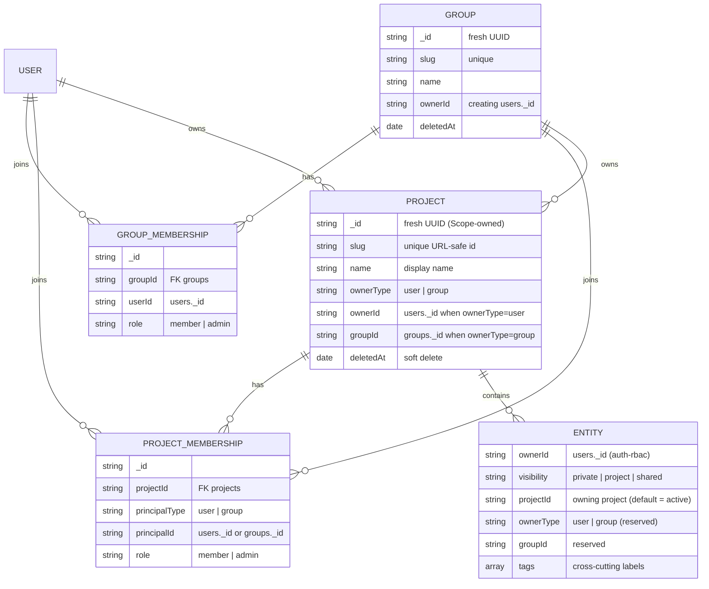
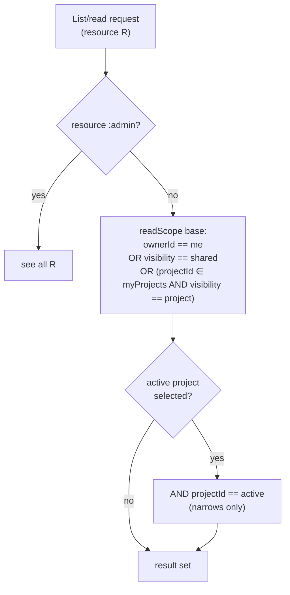
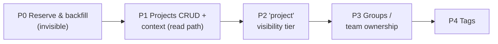

# Data Organization: Projects, Groups & Tags

> **Status:** Proposed — design proposal. Date: 2026-06-30.

Scope currently stores all user-facing data in one flat, global namespace. This document
proposes a first-class way to **isolate** and **group** that data **within a single Kubernetes
cluster** — **starting with a single structure, the project** (a shared container data is filed
under), and **phasing in groups** (teams that can own projects) and **tags** (lightweight
cross-cutting labels).

It is a **sibling proposal to [auth-rbac.md](auth-rbac.md)** and composes with it additively:
it populates the fields that spec already reserved (`ownerType`, `groupId`, `projectId`,
`sharedWith`) and routes all enforcement through the single `readScope`/`writeScope`
chokepoint (the seam auth-rbac defines — or that this design introduces if it lands first).
It does **not** re-model existing data or rewrite queries, and it does **not** replace
ownership, visibility, or RBAC — it layers on top of them.

> **Landing order — either direction.** auth-rbac.md is itself `Proposed`; its ownership
> fields (`ownerId`, `visibility`) are not yet in the schemas. This design is written to land
> **before, after, or alongside** auth-rbac: its schema is unconditionally additive, its
> *organization* value (filing, filtering, tags) needs no identity layer, and its *isolation*
> value composes with whichever release introduces caller identity + the `readScope`/
> `writeScope` seam. See [Landing order (either direction)](#landing-order-either-direction).
> Where this design needs a decision auth-rbac left open, it cross-references auth-rbac
> **Open Question B** ("Sharing, groups & projects").

---

## Problem

All Scope data — runs (`requests`), profiles, criteria, prompts, personas, scenarios,
codebases, reports, insights, MCP servers — lives in **one shared, flat space** with no
organizing container. Consequences as adoption grows:

- Users can't find their own work (scope-core#677 _"How can I find back 'my' runs?"_,
  scope-core#766 _"Improve UX when listing all runs"_).
- There is no way to say _"these runs, profiles, and criteria belong together"_ (a scenario,
  an experiment, a team's workstream).
- Different users/teams in the same cluster step on each other because everything shares one
  namespace.

auth-rbac.md gives us **ownership** (`ownerId`) and **two-level visibility**
(`private`/`shared`) plus read-only deep links. That isolates *per user* and shares *per
item or globally*, but it provides **no durable container** to group related work or to
scope a team's data. That container is what this document adds.

### Goals

1. A **first-class organizing container** ("project") that both **isolates** (keeps one
   user's/team's data from clashing with another's) and **groups** (files related runs,
   profiles, criteria, etc. together).
2. A **team** concept ("group") that can *own* a project, so a workstream is shared by a set
   of people rather than a single user.
3. **Cross-cutting labels** ("tags") for organizing data along axes that don't fit a single
   container.
4. **Purely additive & non-breaking**: existing flat/global data keeps working unchanged;
   the feature is opt-in and reversible phase-by-phase.
5. **One enforcement path**: all scoping flows through a single `readScope`/`writeScope`
   chokepoint (shared with auth-rbac); call sites and route guards are untouched.

### Non-goals

- **Multi-cluster / cross-cluster** organization — explicitly out of scope. This is about
  organizing data *within a single cluster*.
- **Replacing** ownership, visibility, or RBAC — projects **compose with** them.
- **Code changes** — this document is a design proposal only. Schema/migration/route work is
  sequenced in [Phased rollout](#phased-rollout) for follow-up PRs.
- A new billing/quota/tenant-isolation boundary — projects are an *organizing* boundary, not
  a hard security tenant (Entra tenant isolation stays at the App Registration, per
  auth-rbac §D).

---

## Current state

Every user-facing collection is global and flat. Relevant collections today (see
[db.md](db.md)):

| Collection | Entity | Owned/authored by a user? |
|------------|--------|---------------------------|
| `requests` | Runs (the core entity) | Yes (with the ownership layer) |
| `profiles` / `profile-versions` | Run configuration profiles | Yes |
| `criteria` | Evaluation criteria (a DAG) | Yes |
| `task-prompts` | Content-addressed prompts (`task` / `agents.md`) | Shared building block |
| `mcp-servers` | MCP server configs | Yes |
| `codebases` / `codebase-revisions` | Source snapshots | Yes (codebase) / immutable (revision) |
| `reports` / `insights` | Judge output, derived from a run | Derived (inherit parent) |
| `prompt-features` / `-extractions` | Extracted features | Shared building block |
| `skills` / `skill-revisions` | Agent skills | Catalog / immutable |

auth-rbac.md adds to the **owned** rows an `ownerId` (Scope `users._id`, set server-side) and
`visibility: "private" | "shared"`, and funnels reads/writes through:

```ts
// auth-rbac §5 — the chokepoint this design generalizes.
function readScope(user, resource): Filter {
  if (hasPermission(user, `scope/${resource}:admin`)) return {};
  return { $or: [{ ownerId: user.id }, { visibility: "shared" }] };
}
function writeScope(user, resource): Filter {
  if (hasPermission(user, `scope/${resource}:admin`)) return {};
  return { ownerId: user.id };
}
```

It also **reserves** (optional, ignored by v1 logic) exactly the shape this design fills in:
`ownerType: "user" | "group"` (default `"user"`), `groupId?`, `projectId?`, `sharedWith?[]`,
and future `groups`/`projects` collections keyed by Scope-owned ids. This design **is** that
future work.

### Landing order (either direction)

This design and auth-rbac are **orthogonal layers** that meet at one seam. Project *isolation*
needs three things from an **ownership layer**: (1) an authenticated caller identity
(`users._id`), (2) a per-entity `ownerId` + `visibility`, and (3) the single
`readScope`/`writeScope` seam every read/write already funnels through. auth-rbac supplies all
three. Because neither doc has shipped, this design is written to land in **any** order:

| Layer of this design | Needs identity? | If auth-rbac lands first | If this design lands first |
|----------------------|-----------------|--------------------------|----------------------------|
| **Schema** (`projectId`, `tags`, `ownerType`, `groupId`; `projects`/`project-memberships`) | No | Additive fields alongside `ownerId`/`visibility` | Additive fields; auth-rbac's `ownerId`/`visibility` slot in later |
| **Organization** (filing, active-project filter, `groupBy:"project"`, tags) | No | Works | Works — these only *narrow* result sets, so they need no identity |
| **Isolation** (`project` visibility tier + project clause in the chokepoint) | Yes | Add one OR-clause + one visibility value to the existing seam | This design **introduces** the seam (reduced, project-only form); auth-rbac later drops its `ownerId`/`visibility` clauses into the *same* seam — no call-site rework |

The reserved-field discipline is **symmetric**: auth-rbac reserved
`projectId`/`ownerType`/`groupId` for this design, and this design reserves the ownership
clauses of the seam for auth-rbac. Whichever ships first **owns** the seam; the other extends
it. The [phased rollout](#phased-rollout) marks which phases need the identity layer so they
can be sequenced after it, regardless of order.

---

## Recommended primitive

**Start with a single organizing structure — the Project — and phase the rest in.** The design
uses three primitives with clearly separated jobs, but they are deliberately **not** adopted at
once. **Project** is the foundational structure: it ships first and satisfies the isolate +
group goal on its own. **Groups** (team ownership) and **Tags** (cross-cutting labels) are
**additive layers phased in afterward** — each behind its own phase, none blocking the first.

| Primitive | Job | First lands | Cardinality | Carries authorization? |
|-----------|-----|-------------|-------------|------------------------|
| **Project** — _start here_ | Primary **isolation + grouping** container; the thing data is *filed under* | **P1–P2** | Each entity has **one** owning `projectId` | **Yes** — membership grants access |
| **Group** — _phased in_ | A **team** that can *own* a project (reuses reserved `ownerType:"group"`/`groupId`) | **P3** | A project is owned by one user **or** one group | **Yes** — group membership → project access |
| **Tag** — _phased in_ | **Cross-cutting**, many-to-many labels for filtering/organizing | **P4** | An entity has **many** `tags` | **No** — pure organization, never widens access |

### Why start with Project (and split the rest)

- **Project alone satisfies the core goal, so it ships first.** A single owning project delivers
  both isolation and grouping with **no** dependency on groups or tags — it is the MVP that
  resolves the "find my work / don't clash" pain in the first phase, while groups and tags are
  additive enhancements that follow without re-work. This is the "start with one structure,
  phase the rest" spine of the [rollout](#phased-rollout).
- **A container is required for real isolation.** Tags alone can't isolate — a label is
  visible to whoever can already see the item, so it can group but never *keep data from
  clashing*. The "don't step on each other" goal needs an ownership/membership boundary. That
  is a project.
- **Single owning `projectId` keeps the chokepoint cheap.** The reserved field is singular,
  and a single owning project makes `readScope` a simple `{ projectId: { $in: myProjects } }`
  — no per-entity ACL fan-out, no array-membership index gymnastics on Cosmos DB. Ownership
  (`ownerId`) also stays singular (auth-rbac B5).
- **Tags recover the cross-cutting need without the cost.** "This run belongs to three
  efforts" is real, but modelling it as multi-project membership forces ACL fan-out and
  conflicts with the singular reserved field. Tags give many-to-many organization **within
  what you can already see**, at the price of a multikey index only.
- **Groups map 1:1 onto reserved fields.** `ownerType:"group"` + `groupId` already exist in
  the reserved shape; a project owned by a group is the natural "team workstream." Nothing is
  re-modelled.

Trade-offs and the rejected shapes (tags-only, many-to-many projects, per-entity ACL as the
primary mechanism, nested projects) are in [Alternatives considered](#alternatives-considered).

---

## Data model



### New collections

Both mirror the first-class-entity pattern established by `codebases` (fresh-UUID `_id`,
unique `slug`, creator, timestamps, soft-delete `deletedAt`).

**`projects`**

| Field | Type | Notes |
|-------|------|-------|
| `_id` | `string` | Fresh Scope-owned UUID |
| `slug` | `string` | Unique, URL-safe (used in CLI/URLs) |
| `name` | `string` | Display name |
| `description?` | `string` | |
| `ownerType` | `"user" \| "group"` | Reuses the reserved enum; default `"user"` |
| `ownerId` | `string` | `users._id` of the owner (when `ownerType="user"`) |
| `groupId?` | `string` | `groups._id` (when `ownerType="group"`) |
| `createdAt` / `updatedAt` / `deletedAt?` | `Date` | Soft-delete like `codebases` |

**`project-memberships`** — who belongs to a project and their **project role**. A project can
have individual user members and (once groups land) whole groups as members.

| Field | Type | Notes |
|-------|------|-------|
| `_id` | `string` | |
| `projectId` | `string` | FK → `projects._id` |
| `principalType` | `"user" \| "group"` | |
| `principalId` | `string` | `users._id` or `groups._id` |
| `role` | `"member" \| "admin"` | Project-scoped role (distinct from global `scope/project:*`) |

**`groups`** and **`group-memberships`** (later phase) are analogous: a `groups` doc
(`_id`, `slug`, `name`, `ownerId`, soft-delete) plus `group-memberships`
(`groupId`, `userId`, `role`). **Membership lives in Scope, keyed on `users._id`** — any IdP
group claims are advisory only (auth-rbac §5, B4).

### Fields added to existing entities

Every **user-owned** entity (the "Yes" rows in [Current state](#current-state)) gains:

- `projectId?: string` — the **owning project** (exactly one). Missing ⇒ **coalesces to the
  Default project** (see [Migration](#migration)); after backfill every doc carries one, so no
  document is ever project-less or unreachable.
- `ownerType?: "user" | "group"` (default `"user"`) and `groupId?: string` — from the
  reserved shape; set when a group owns the data via its project.
- `tags?: string[]` — cross-cutting labels (no auth effect).

`ownerId` and `visibility` come from the **ownership layer** (auth-rbac); this design only
**extends `visibility`** with a third value (below). If this design ships first, that extension
activates when the ownership layer lands — see [Landing order](#landing-order-either-direction).

### Which entities are project-scoped

- **Project-scoped** (carry `projectId`): runs (`requests`), profiles, criteria, personas,
  scenarios, MCP servers, codebases, reports, insights.
- **Global building blocks** (stay unscoped): content-addressed / immutable dedup entities —
  `task-prompts`, `prompt-features`/`-extractions`, `skill-revisions`, `codebase-revisions`.
  A single content hash is referenced by runs across many projects, so scoping it to one
  project is wrong. These are authorized **through their owning/parent entity**, exactly as
  auth-rbac §5 already authorizes "associated data … through its parent request."
- **Admin-curated catalog** (agents, models, skills, extensions, report templates): remain
  global read-only catalog for now; whether any become project-scoped is an
  [open question](#open-questions) tied to auth-rbac OQ A1.

### Membership & shape decisions

- **One owning project per entity** (single-project membership). Cross-cutting grouping is
  **tags**, not multi-project membership.
- **Flat projects** for this design. Nested/hierarchical projects (org → team → project) are
  deferred; groups-as-owner covers the near-term team need without path-scoping cost.
- **`ownerId` stays singular** (auth-rbac B5); "a team owns this" is expressed via a
  group-owned **project**, not by overloading `ownerId`.

---

## Isolation & sharing semantics

Projects add a **third visibility tier** between `private` and `shared`, extending the
reserved union additively (auth-rbac §5: _"a future third visibility level … extends the union
additively"_):

```
visibility: "private" | "project" | "shared"
```

| Visibility | Who can discover/read | Who can edit/delete |
|------------|-----------------------|---------------------|
| `private` | Owner only (+ resource admin) — **even other project members cannot see it** | Owner (+ resource admin) |
| `project` | All **members of the entity's `projectId`** (read-only unless owner) | Owner, optionally project-admins (+ resource admin) |
| `shared` | **Everyone** (globally discoverable, read-only) | Owner (+ resource admin) |

Composition rules:

- **`projectId` (filing) is independent of `visibility` (exposure).** An entity is always
  *filed under* one project; `visibility` decides how far it's exposed. A `private` item filed
  under a team project is still owner-only; marking it `project` shares it with that team.
- **Default visibility stays `private`** at creation (unchanged from auth-rbac — safe by
  default). The **active project** only sets `projectId`; it does not silently widen exposure.
  As a **UX** default (not a schema default), the Portal/CLI **may** pre-select `project`
  visibility when a user creates collaborative catalog data (profile, criteria, persona,
  scenario, MCP server) inside a **group-owned** project — see [open questions](#open-questions).
- **Deep links are unchanged.** A deep link remains a signed, revocable, **read-only**,
  single-item capability that bypasses discovery; it never satisfies `writeScope` and is
  unaffected by projects. It's the escape hatch for sharing one item outside its project.
- **Active-project context narrows, never widens.** Selecting a project in the Portal/CLI/API
  adds an `AND { projectId }` *filter* on top of `readScope`; it can only show *less* than
  what you're authorized to see, never more.



---

## Authorization

### Permissions

Projects/groups slot into the existing namespaced `resource:action` model with **no
route-guard change** (auth-rbac §2/§4). New global permissions:

| Permission | Grants |
|------------|--------|
| `scope/project:read` | List/view projects you're a member of |
| `scope/project:write` | Create/update projects; file your data into a project |
| `scope/project:admin` | Manage **any** project (global admin) |
| `scope/group:read\|write\|admin` | Same, for groups (later phase) |

`admin` subsumption and the resource `*` wildcard work as specified in auth-rbac §2 (e.g.
`scope/*:admin` covers projects; `scope/project:admin` does **not** satisfy `scope/run:write`).

### Project-scoped roles

Distinct from the **global** `scope/project:*` permissions, each `project-memberships` row
carries a **project-level role** (`member` | `admin`) that applies **only within that
project** — mirroring auth-rbac B2 (_"reuse the same permission bundles, scoped to a
group"_):

- **member** — can read `project`-visible data in the project; can file their own data into it.
- **admin** — additionally manages membership and (optionally) may edit members' `project`-
  visible data (the second `writeScope` clause below — see [open questions](#open-questions)).

### Generalized chokepoint

Only these two functions change; **every existing call site is untouched** because they all
already merge `readScope`/`writeScope`:

```ts
// Resolved once per request from project-memberships (+ group memberships),
// and always includes the caller's default project. Cached on req.user.
function memberProjectIds(user): string[] { /* projects where user (or a group they're in) is a member */ }
function adminProjectIds(user): string[]  { /* subset where the user's project role is "admin" */ }

function readScope(user, resource): Filter {
  if (hasPermission(user, `scope/${resource}:admin`)) return {};
  return { $or: [
    { ownerId: user.id },                                              // your own — any visibility
    { visibility: "shared" },                                          // global read-only
    { projectId: { $in: memberProjectIds(user) },                     // team-visible in your projects
      visibility: "project" },
  ] };
}

function writeScope(user, resource): Filter {
  if (hasPermission(user, `scope/${resource}:admin`)) return {};
  return { $or: [
    { ownerId: user.id },                                              // owner edits
    { projectId: { $in: adminProjectIds(user) } },                    // OPTIONAL: project-admin edits members' data
  ] };
}
```

- **Legacy/unset docs stay owner-or-shared.** Missing `projectId` coalesces to the **Default**
  project (see [Migration](#migration)), and legacy data carries only `private`/`shared`
  visibility (the `project` tier is new) — so the added third clause is a **no-op** for it. The
  generalization is a **strict superset**; nothing that worked before breaks. Unset never means
  "global / no project."
- The active-project context is applied **outside** these functions (an extra `$and` clause on
  list handlers), keeping authorization and filtering cleanly separated.
- **Project/group identity is Scope-owned** and re-resolved server-side per request; it is
  never trusted from the client (same discipline as `ownerId`).
- **Landing order.** If auth-rbac has landed, this design adds only the third `readScope`
  OR-clause and the optional `writeScope` clause. If this design lands **first**, it introduces
  these two functions in reduced form (project clauses only; the `ownerId` / `visibility:"shared"`
  clauses are inert until auth-rbac adds them), so auth-rbac later extends the *same* seam with
  no call-site changes.

---

## Migration

**We create a Default container and migrate existing data into it — "unset" never means "global
/ no project."** Consistent with how auth-rbac backfills legacy `ownerId` to the reserved
`"system"` sentinel, every project-scoped entity is assigned to a **Default project** so today's
behavior is preserved.

- **Create + migrate (canonical).** Create one global **"Default"** project (`slug: "default"`,
  owned by the `"system"` sentinel) with **every user a member**, then **backfill
  `projectId: "default"`** onto all existing docs in the project-scoped collections. After it
  runs, every entity physically carries a `projectId` — there is no null/global bucket.
- **Unset coalesces to Default (safety net, not a second meaning).** `readScope`/lookups treat a
  missing `projectId` as `"default"` (`projectId ?? "default"`). This only covers the transient
  window between schema deploy and backfill completion (or a doc a batch misses), so nothing ever
  lands in a "global / no-project" limbo. Backfill is therefore an **indexing/filtering
  optimization**, not a correctness requirement.
- **Why it "keeps working."** Legacy data keeps its existing `visibility`, and the `project`
  visibility tier is new — so the added `readScope` project clause is a **no-op** for legacy
  docs (they stay owner-or-shared). Everyone being a Default member means even a later
  `project`-visible legacy doc hides from no one; and pre-identity there is no enforcement to
  change. Net: **behavior-preserving**.
- **Going forward**, each user gets a **personal default project** as their initial active
  context; they can create/switch to team (group-owned) or shared projects. New data lands in
  the active project rather than the global Default.
- **Landing order.** This Default-project backfill is **independent of** auth-rbac's `ownerId`
  backfill — it mirrors its *shape* but doesn't require it. The `"system"` sentinel owner is
  introduced by whichever design lands first and reused by the other. If this design ships
  before auth-rbac, Default is owned by `"system"` with every user a member; when auth-rbac
  lands, its `ownerId` backfill runs over the same data with no conflict.

Migration mechanics (`mongo-migrate-ts`, CosmosDB-RU constraints — see
[db-migrations.md](db-migrations.md)):

- A numbered migration creates `projects` + `project-memberships`, inserts the Default project,
  and `$set`s `projectId` on scoped collections in **idempotent batches** (Cosmos RU-friendly;
  re-runnable). `down()` is log-only, per repo convention.
- Indexes (single-field + sparse + 2-field-for-sort, per the [CosmosDB skill](../../.agents/skills/cosmosdb-mongodb/SKILL.md) and app-design.md):

| Collection | Index | Purpose |
|------------|-------|---------|
| `projects` | `{ slug: 1 }` unique | Slug lookup/uniqueness |
| `projects` | `{ ownerId: 1 }`, `{ createdAt: -1 }`, `{ deletedAt: 1 }` | Owner list, newest-first, active filter |
| `project-memberships` | `{ principalId: 1 }` | "my projects" lookup |
| `project-memberships` | `{ projectId: 1 }` | Project roster |
| `project-memberships` | `{ projectId: 1, principalType: 1, principalId: 1 }` unique | One membership row per principal |
| scoped entities (e.g. `requests`) | `{ projectId: 1 }` sparse | Project filter |
| scoped entities | `{ projectId: 1, _id: 1 }` | Project-scoped newest-first / cursor sort |
| scoped entities | `{ tags: 1 }` multikey | Tag filter |

---

## Surfaces

Projects appear consistently in Portal, API, and CLI. Per the repo's **CLI↔Portal parity**
rule, every project capability in the Portal is also in the CLI.

### API

- **CRUD**: `GET/POST /api/v1/projects`, `GET/PATCH/DELETE /api/v1/projects/:id`
  (soft-delete), and membership sub-routes
  `GET/POST/DELETE /api/v1/projects/:id/members`.
- **Active-project context**: an ambient `X-Scope-Project: <id|slug>` header (and/or
  `?projectId=` on list endpoints). Present ⇒ list handlers AND-filter to that project;
  absent ⇒ all projects the caller can read (bounded by `readScope`).
- **Runs list integration**: `projectId` becomes a categorical **filter** + **facet**
  dimension and a new `groupBy: "project"` value, composing with the existing server-side
  filter/facet/group/cursor pipeline (app-design.md "Runs List Query API") — no new query
  engine, just another dimension.
- Entities accept `projectId` and `tags` on create/update; responses include them so clients
  can show project/tags and gate affordances.

### Portal

- A **project switcher** in the app shell (top nav) sets and persists the active project; an
  **"All my projects"** option clears it. The Runs list and catalog lists scope to the active
  project with a removable filter chip.
- Project management: create/rename, manage members and their project roles, soft-delete.
- Per-entity **"Move to project"** action and a **tag editor**; project + tags shown on list
  rows and detail pages.

### CLI

- `scope project list | create | use <slug> | show | members …`.
- Active project stored in CLI config (like `SCOPE_API_URL`); `--project <slug|id>` per-command
  override; `SCOPE_PROJECT` env var. `scope run list` gains `--project` alongside its existing
  filters, keeping parity.

### Default-project resolution order

`--project` flag / `X-Scope-Project` header → configured active project → user's personal
default project → the global **Default** project.

---

## Phased rollout

The sequence deliberately **starts with the single Project structure** (P0–P2) and **phases in**
Groups (P3) and Tags (P4), so the core isolate + group goal ships before the additive layers.
Each phase is independently shippable, reversible, and non-breaking; earlier phases change
**no** behavior because everything defaults into the Default project and unset `projectId` is
treated as Default.



- **P0 — Reserve & backfill (invisible).** Add `projectId`/`ownerType`/`groupId`/`tags`
  (optional, ignored by logic); create `projects` + `project-memberships`; create the global
  Default project; backfill `projectId`. No behavior change.
- **P1 — Projects CRUD + context (read path).** `/api/v1/projects` + membership; generalize
  `readScope`/`writeScope` to include project membership; active-project context narrows lists;
  Portal switcher + CLI `project` commands. Everyone is still a Default member ⇒ status quo
  preserved; new projects are opt-in.
- **P2 — `project` visibility tier.** Add `visibility: "project"`; surfaces let owners file
  data under a project and mark it project-visible; Runs `projectId` filter/facet/`groupBy`.
- **P3 — Groups / team ownership.** `groups` + `group-memberships`; `ownerType:"group"`
  projects; `scope/group:*`; group principals in `project-memberships`.
- **P4 — Tags.** Cross-cutting `tags` filtering across Portal/API/CLI.

> **Interleaving with auth-rbac (either order).** P0 (schema) and the *organization* parts of
> P1/P2/P4 need no identity layer and can ship **before** auth-rbac. The **isolation** parts —
> the `readScope`/`writeScope` project clause (P1) and the `project` visibility tier (P2) —
> need caller identity + `visibility`, so sequence them **after** whichever release provides the
> ownership layer. If this design ships first, P1 stands up the seam and auth-rbac slots its
> ownership clauses in later (see [Landing order](#landing-order-either-direction)).

---

## Open questions

Cross-references auth-rbac **Open Question B**. These should be settled with stakeholders
before the corresponding phase is scheduled.

- **Backfill target.** One global **Default** project (status-quo-preserving, **recommended**)
  vs per-user **personal** defaults for legacy data (stronger isolation, but changes who can
  see legacy data). Recommendation: global Default for backfill; personal defaults for *new*
  data.
- **Collaborative-type default visibility.** Should profiles/criteria/personas/scenarios/MCP
  default to `project` visibility when created inside a **group-owned** project, while runs
  stay `private`? (A UX default, not a schema change.)
- **Catalog scoping.** Are admin-curated types (agents, models, skills, extensions, report
  templates) ever project-scoped, or always global? (Ties to auth-rbac OQ A1.)
- **Moving data between projects.** Is re-filing allowed post-hoc, and who may do it — the
  owner, the source project-admin, the destination project-admin, or all three?
- **Project-admin write.** Should a project-admin get **write** over members' `project`-visible
  data (the second `writeScope` clause), or read-only? Default recommendation: read-only unless
  explicitly enabled per project.
- **Owner of data: project vs group.** Confirm auth-rbac B1/B5 — keep `ownerId` singular and
  express teams via a group-owned **project**, rather than per-entity group ownership.
- **Building blocks.** Do content-addressed entities (`task-prompts`, revisions) ever need
  their own `projectId`, or is parent-authorization always sufficient? (Recommendation: keep
  global; authorize through parent.)

---

## Alternatives considered

- **Tags only (no container).** Cheapest to build, but a tag is visible to anyone who can
  already see the item, so it **cannot isolate** — it fails the "don't clash / keep teams'
  data apart" goal. Kept as the *secondary* primitive, not the primary one.
- **Many-to-many project membership per entity.** More flexible ("this run is in three
  projects"), but forces ACL fan-out in `readScope`, conflicts with the singular reserved
  `projectId`, and complicates ownership/`writeScope`. Rejected; **tags** cover the
  cross-cutting need at far lower cost.
- **Per-entity ACL (`sharedWith`) as the main mechanism.** Maximal flexibility but O(n) grants
  per item, hard to reason about, and expensive to query at scale on Cosmos DB. `sharedWith`
  stays **reserved** for targeted exceptions (auth-rbac already reserves it), not as the
  organizing primitive.
- **Nested / hierarchical projects.** Appealing for org → team → project, but adds
  path-scoping complexity and Cosmos query cost. Deferred — flat projects + groups-as-owner
  cover the near-term need; hierarchy can be added later without re-modelling (a project could
  gain an optional `parentId`).
- **Reuse `submissionId` / the Experiment grouping (scope-project#54).** Those are
  **batch/reporting** groupings, not durable ownership boundaries. Projects generalize *above*
  them: a submission or experiment lives *within* a project.

---

## References

- [auth-rbac.md](auth-rbac.md) — ownership, visibility, `readScope`/`writeScope`, and the
  reserved `ownerType`/`groupId`/`projectId`/`sharedWith` shape (§5, Open Question B).
- [app-design.md](app-design.md) — Runs list query API (filters/facets/grouping/cursors) that
  the `projectId` dimension plugs into.
- [codebases.md](codebases.md) — the first-class-entity pattern (`slug`, soft-delete, creator)
  that `projects` mirrors.
- [db.md](db.md) / [db-migrations.md](db-migrations.md) — collections, index strategy, and the
  migration framework.
- Tracking issue: growth-ecosystems/scope-project#142. Motivating pain: scope-core#677,
  scope-core#766. Related: scope-project#54 (Experiment), #55 (per-user isolation), #56
  (RBAC in Portal), #95 (shared run URLs).
