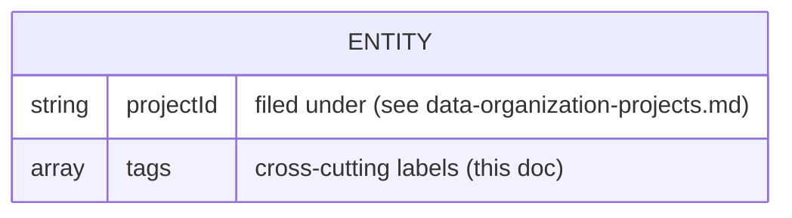
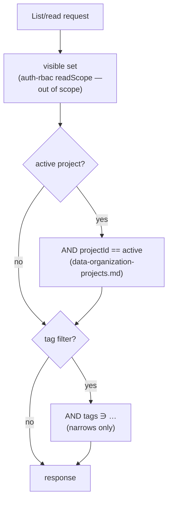
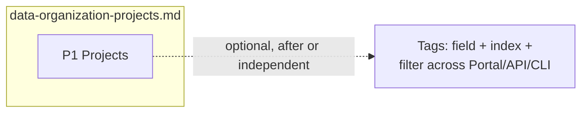

# Data Organization: Tags

> **Status:** Proposed — design proposal. Date: 2026-06-30.

The [project container](data-organization-projects.md) gives Scope data a durable home, but some organizing
axes cut **across** projects: a run may belong to several efforts, and labels like `regression`,
`q3-eval`, or `flaky` don't fit a single container. This document proposes **tags** — lightweight,
cross-cutting labels for filtering and grouping data along those axes.

Tags are a **companion** to [projects](data-organization-projects.md). Like projects, they are purely an
**organizing** dimension and carry **no** access meaning — access control stays entirely with
[auth-rbac.md](auth-rbac.md). Tags compose *on top of* the project filter but do **not** depend on
projects: they are an independent, additive field.

> **Landing order — independent.** Tags add a single optional array field plus a multikey index and
> **no** access control, so this layer can land **before, after, or alongside** both
> [projects](data-organization-projects.md) and [auth-rbac.md](auth-rbac.md) with no dependency in any
> direction. Unlike `projectId`, tags need **no backfill** — an absent/empty `tags` simply means
> "untagged."

---

## Problem

Even once data is filed under a [project](data-organization-projects.md), a single container can't express
every way users need to slice their work:

- **Cross-cutting efforts.** "This run belongs to the Q3 regression sweep *and* the flaky-tests
  investigation" — a many-to-many relationship a singular `projectId` can't hold.
- **Ad-hoc axes.** Users want to label and later retrieve work by transient, free-form dimensions
  (`baseline`, `demo`, `needs-review`) without creating a whole project for each.
- **No re-modelling budget.** These needs must be met additively — a label field and a filter —
  not by turning the project container into an array or inventing a second heavyweight structure.

Projects answer "where is this filed?"; tags answer "what else is this a part of?"

---

## Recommended primitive

**A single `tags` field of free-form string labels**, applied to project-scoped, user-authored
entities. Tags are many-to-many (an entity has many tags; a tag labels many entities) and compose
with — never replace — the project filter.

| Primitive | Job | Cardinality | Access effect |
|-----------|-----|-------------|---------------|
| **Tag** | **Cross-cutting** label for filtering/grouping across projects | An entity has **many** `tags` | **None** — narrowing filter only |

Tags are deliberately **free-form** in v1 (no pre-registered vocabulary): the cost of typing a new
tag should be zero, matching how labels work in issue trackers. A curated/validated vocabulary is
an [open question](#open-questions), not a v1 requirement.

---

## Data model

Tags add **one** optional field to existing documents — no new collection:

- `tags?: string[]` — cross-cutting labels for filtering/organizing (no access effect). Absent or
  empty ⇒ untagged. Normalized (trimmed, deduplicated; case-folding is an
  [open question](#open-questions)).

> `ENTITY` is any [taggable collection](#which-entities-can-be-tagged). The `projectId` field is
> owned by [data-organization-projects.md](data-organization-projects.md); `tags` is this doc's only addition. Both
> are organizing dimensions with no access meaning; auth-rbac separately adds its own access fields.

### Which entities can be tagged

Tags apply to the **durable, single-copy, user-authored** entities — the same set that is
[project-scoped single-copy](data-organization-projects.md#which-entities-are-project-scoped):

- **Taggable:** runs (`requests`), profiles, criteria, personas, scenarios, MCP servers, codebases,
  reports, insights, skills, extensions, report templates.
- **Not taggable — content-addressed copies.** `task-prompts`, `prompt-features`/`-extractions`,
  `skill-revisions`, `codebase-revisions` are immutable
  [per-project copies](data-organization-projects.md#content-addressed-entities-per-project-copies); they
  carry `projectId` only, and are identified by content, not by hand-applied labels. (A run that
  references them can itself be tagged.)
- **Not taggable — global platform catalog.** `agents` and `models` are global infrastructure with
  no per-user organizing state.

### Index

| Collection | Index | Purpose |
|------------|-------|---------|
| taggable entities (e.g. `requests`) | `{ tags: 1 }` multikey | Tag filter |

Per the [CosmosDB skill](../../.agents/skills/cosmosdb-mongodb/SKILL.md), a multikey index on a
small string array is inexpensive; tag filtering AND-composes with the existing `projectId` index
rather than needing a compound index for every combination.

---

## Semantics

Tags are an **organizational**, not access-control, construct — they decide how data is *found*,
never *who may see it* (that is [auth-rbac's](data-organization-projects.md#non-goals)).

- **Tags are cross-cutting filters.** `tags` label an entity along axes that cut across projects
  (e.g. `regression`, `q3-eval`, `flaky`). A tag filter adds an `AND tags ∋ "regression"` clause.
- **They compose with the project filter, narrowing only.** The active-project context filters
  first; a tag filter narrows *within* that set (`projectId == X AND tags ∋ "regression"`). Tags
  can only show **less**, never more — they grant access to nothing.
- **Tags are project-local in effect, global in namespace (v1).** A tag is just a string; the same
  string used in two projects is the "same" tag by name. Whether tags should be namespaced per
  project is an [open question](#open-questions).
- **No access meaning.** Like `projectId`, a tag never widens or restricts visibility. When
  [auth-rbac](auth-rbac.md) exists, its `readScope` decides the visible set first; the tag filter
  narrows within it.

---

## Migration

Tags need **no data migration**. The `tags` field is optional and additive:

- **No backfill.** An absent `tags` means "untagged" — a valid, complete state — so unlike
  `projectId` there is no Default value to assign. Existing documents are correct as-is.
- **Index only.** The one migration step is creating the `{ tags: 1 }` multikey index on taggable
  collections (idempotent, Cosmos RU-friendly per [db-migrations.md](db-migrations.md)); `down()`
  is log-only per repo convention.
- **Behavior-preserving.** Adding the field and index changes no existing listing until a user
  applies a tag or a tag filter.

---

## Surfaces

Per the repo's **CLI↔Portal parity** rule, every tag capability in the Portal is also in the CLI.

### API

- Entities accept `tags` on create/update; responses include them so clients can show and filter by
  tags.
- List endpoints gain a `?tags=` filter (repeatable ⇒ AND of tags) that composes with the existing
  filter/facet/group/cursor pipeline (app-design.md "Runs List Query API").
- `tags` becomes a categorical **facet** dimension on the Runs list, alongside `projectId`.

### Portal

- A **tag editor** on entity detail pages and inline on list rows (add/remove chips).
- Tag **filter chips** in list toolbars; multi-select composes with the active-project filter.
- Tags shown on list rows and detail pages next to the project.

### CLI

- `scope run list --tag regression --tag q3-eval` (repeatable, AND-composed), alongside
  `--project`.
- Tag add/remove on entities, e.g. `scope run tag <id> --add flaky --remove baseline`.

---

## Phased rollout

Tags are a **single additive phase** that follows the [projects rollout](data-organization-projects.md#phased-rollout)
(or ships independently). It is reversible and non-breaking.

- **Schema + index (invisible).** Add optional `tags`; create the `{ tags: 1 }` multikey index. No
  behavior change.
- **Surfacing.** Tag editor + tag filter/facet across Portal, API, and CLI.

> **Independent of auth-rbac and projects.** Tags add only organization (one field + one index +
> filtering) and can land in any order relative to both. Tags never gain access meaning — that
> stays with [auth-rbac.md](auth-rbac.md).

---

## Open questions

- **Tag governance.** Free-form tags (v1, **recommended**) vs a curated/validated vocabulary
  (per-project or global) to prevent drift (`q3`, `Q3`, `q-3`).
- **Case/normalization.** Case-fold and slugify on write (`Q3-Eval` → `q3-eval`), or preserve
  as-typed? Affects filter matching and facet counts.
- **Namespacing.** Are tags a single global string namespace, or scoped per project (so
  `regression` in project A is distinct from project B)? v1 treats them as global strings.
- **Rename / merge.** Do we need a tag-management operation to rename or merge tags across all
  entities, or is that deferred?
- **Tag facets & typeahead.** Should the API expose a tag-frequency facet (for typeahead and "top
  tags") — and is that per-project or global?

---

## Alternatives considered

- **Many-to-many project filing instead of tags.** Model "belongs to several efforts" by letting an
  entity carry multiple `projectId`s. Rejected in [data-organization-projects.md](data-organization-projects.md#alternatives-considered):
  it turns the singular container into an array and complicates every filter/index. Tags meet the
  cross-cutting need without overloading the container.
- **Key–value labels (`env=prod`) instead of flat strings.** More expressive, but adds parsing,
  a value namespace, and UI complexity for a need flat tags already cover. Deferred — a `key:value`
  convention can sit inside a flat tag string if ever wanted.
- **A `collections` container (a second heavyweight structure).** A named, saved set of entities.
  Rejected as redundant with projects (for filing) and tags (for cross-cutting grouping); a saved
  tag filter gives the same "collection" view without a new entity.
- **Curated tag vocabulary from day one.** More consistent, but adds registration friction that
  discourages labelling. Kept as an [open question](#open-questions); v1 favours zero-cost
  free-form tags.

---

## References

- [data-organization-projects.md](data-organization-projects.md) — the **project container** this tags layer composes
  with; owns `projectId`, the taggable-entity set, and the active-project filter.
- [auth-rbac.md](auth-rbac.md) — the **access-control layer**; tags carry no access meaning and
  defer all visibility/enforcement to it.
- [app-design.md](app-design.md) — Runs list query API (filters/facets/grouping/cursors) that the
  `tags` dimension plugs into.
- [db.md](db.md) / [db-migrations.md](db-migrations.md) — collections, index strategy, and the
  migration framework.
- Tracking issue: growth-ecosystems/scope-project#142. Motivating pain: scope-core#677,
  scope-core#766.
