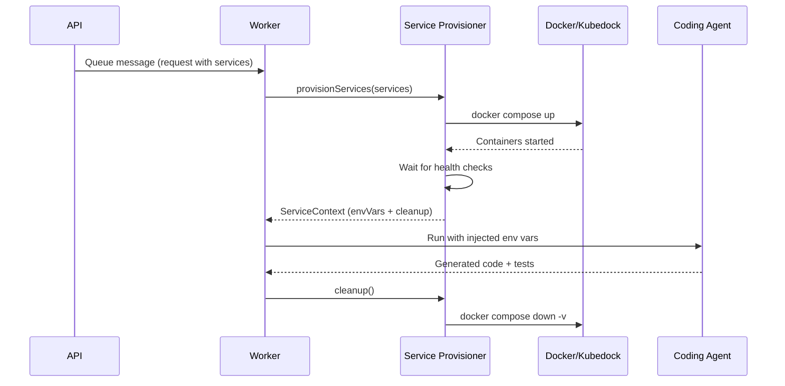

# Ephemeral Services

Ephemeral services are backing containers (databases, caches, message brokers) that are provisioned per scenario run and destroyed after evaluation. They enable **execution-based criteria** — tests that verify agent-generated code actually works against a live service, not just that it _looks_ correct.

## Overview



## Service Declarations

Scenarios declare required services in their YAML configuration:

```yaml
services:
  - name: cosmosdb
    image: mcr.microsoft.com/cosmosdb/linux/azure-cosmos-emulator:vnext-latest
    ports:
      - host: 8081
        container: 8081
    environment:
      AZURE_COSMOS_EMULATOR_ENABLE_DATA_PERSISTENCE: "false"
    healthCheck:
      test: ["CMD", "curl", "-f", "http://localhost:8080/health"]
      intervalSeconds: 5
      timeoutSeconds: 3
      retries: 30
      startPeriodSeconds: 30
    envVars:
      COSMOS_ENDPOINT: "https://localhost:${ports.8081}"
      COSMOS_KEY: "C2y6yDjf5/R+ob0N8A7Cgv30VRDJIWEHLM+4QDU5DE2nQ9nDuVTqobD4b8mGGyPMbIZnqyMsEcaGQy67XIw/Jw=="
      COSMOS_DATABASE: "conference-planner"
```

### Fields

| Field | Required | Description |
|-------|----------|-------------|
| `name` | Yes | Unique identifier within the scenario |
| `image` | Yes | Container image reference |
| `ports` | Yes | Port mappings (`host` → `container`) |
| `environment` | No | Env vars passed to the container itself |
| `healthCheck` | No | Health check configuration (recommended) |
| `envVars` | Yes | Env vars injected into the agent subprocess |

### Env Var Templates

The `envVars` field supports port template resolution:

- `${ports.<container_port>}` — resolves to the mapped host port

Example: `"https://localhost:${ports.8081}"` → `"https://localhost:8081"`

## Architecture

### Local (Docker Compose)

The current POC implementation uses Docker Compose:

1. Generates a temporary `docker-compose.yml` from service declarations
2. Runs `docker compose up -d` with a unique project name per run
3. Polls container health status until all services report healthy
4. Resolves env var templates with actual port mappings
5. Returns a `ServiceContext` with env vars and a `cleanup()` function
6. On cleanup: `docker compose down -v --remove-orphans`

### Production (Kubedock) — Future

The production path (tracked in [#1088](https://github.com/growth-ecosystems/scope-core/issues/1088)) will use [Kubedock](https://github.com/joyrex2001/kubedock):

1. Kubedock runs as a sidecar to the worker pod
2. Translates Docker API calls into Kubernetes pod creation
3. Services run as pods in the same namespace with namespace-scoped RBAC
4. No node-level changes required
5. Automatic cleanup via Kubernetes garbage collection

## Worker Integration

The `WorkerProcessorOptions` interface includes `serviceEnvVars`:

```typescript
export interface WorkerProcessorOptions {
  // ... existing fields ...
  serviceEnvVars?: Record<string, string>;
}
```

Workers merge these into the agent subprocess environment via `buildSubprocessEnv()`. The agent code uses standard environment variable access (e.g., `os.environ["COSMOS_ENDPOINT"]` in Python) with no awareness of the provisioning mechanism.

## Running Locally

```bash
# Start the Cosmos DB emulator standalone
docker compose --profile ephemeral-services up cosmosdb-emulator -d

# Wait for health
until curl -sf http://localhost:8080/health; do sleep 2; done

# Or use the service provisioner programmatically
import { provisionServices } from "shared";
const ctx = await provisionServices(scenario.services);
// ... use ctx.envVars ...
await ctx.cleanup();
```

## Integration Test

```bash
# Run the integration test (requires Docker)
EPHEMERAL_SERVICES_TEST=1 npx vitest run packages/shared/src/services/service-provisioner.integration.test.ts
```

## Type Definitions

- `ServiceDeclaration` — `packages/shared/src/types/types.ts`
- `ServiceHealthCheck` — `packages/shared/src/types/types.ts`
- `ServicePort` — `packages/shared/src/types/types.ts`
- `ServiceContext` — `packages/shared/src/services/service-provisioner.ts`

## Zod Schemas

- `ServiceDeclarationSchema` — `packages/shared/src/schemas/scenario.ts`
- `ServiceHealthCheckSchema` — `packages/shared/src/schemas/scenario.ts`
- `ServicePortSchema` — `packages/shared/src/schemas/scenario.ts`
