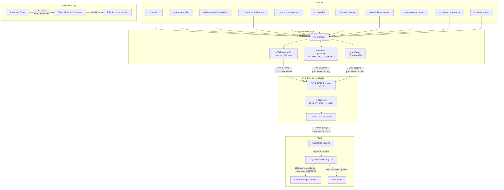

# Observability

Application-level telemetry for Scope services using Azure Application Insights with dual-mode export: either directly via `@azure/monitor-opentelemetry` or through an in-cluster OTel Collector gateway.

## Data Flow

The telemetry package supports two export modes. When `OTEL_COLLECTOR_ENDPOINT` is set, services send OTLP HTTP to the collector which forwards to App Insights. Otherwise, services export directly.

### Collector Mode (recommended for production)



### Direct Mode (fallback)

When `OTEL_COLLECTOR_ENDPOINT` is unset but `APPLICATIONINSIGHTS_CONNECTION_STRING` is set, services export directly to App Insights via `useAzureMonitor()`. This is the fallback mode — remove the `otel-collector` component from the overlay to use it.

## Transport Protocols

| Hop | Protocol | Format | Notes |
|-----|----------|--------|-------|
| Service → OTel Collector | OTLP HTTP POST (`:4318`) | OpenTelemetry JSON protobuf | In-cluster, no TLS |
| OTel Collector → App Insights | HTTPS POST to Breeze endpoint (`/v2.1/track`) | Azure Monitor `TelemetryItem` JSON | `azuremonitor` exporter in `otel-collector-contrib` |
| Service → App Insights (direct) | HTTPS POST to Breeze endpoint (`/v2.1/track`) | Azure Monitor `TelemetryItem` JSON | Only when collector is not configured |
| App Insights → Log Analytics | Internal Azure pipeline | — | Automatic, no user configuration |
| Log Analytics → Grafana | HTTPS | KQL queries via Azure Monitor data source plugin | Grafana polls on dashboard refresh interval |
| Log Analytics → Alert Rules | HTTPS | KQL scheduled query evaluation | Configured per alert rule |
| Key Vault → ESO | HTTPS | Azure Key Vault REST API | ESO polls on `refreshInterval` |
| ESO → Pod | K8s API | K8s Secret mounted as `envFrom` | kubelet injects as environment variable |

## Telemetry Module

Located at `packages/telemetry/`. All services import from `"telemetry"`.

### Initialization

```typescript
import { initTelemetry } from "telemetry";

// Must be called BEFORE any other imports that make HTTP calls
// (Express, MongoDB, etc.) so OTel auto-instrumentation hooks are applied.
initTelemetry("scope-api");
```

`initTelemetry(serviceName)` selects the export mode based on environment variables:

| Priority | Env Var | Mode | Behavior |
|----------|---------|------|----------|
| 1 | `OTEL_COLLECTOR_ENDPOINT` | Collector | OTLP HTTP to in-cluster OTel Collector |
| 2 | `APPLICATIONINSIGHTS_CONNECTION_STRING` | Direct | `useAzureMonitor()` to App Insights Breeze |
| 3 | Neither set | No-op | All helpers are no-ops, zero cost |

Use `getExportMode()` to check the active mode (`"collector"`, `"direct"`, or `"none"`).

### Graceful No-Op

When neither env var is set, `initTelemetry()` returns early. All helper functions (`trackMetric`, `trackTrace`, `trackEvent`) check `isTelemetryEnabled()` and return immediately — zero runtime cost, no errors, no conditional logic needed at call sites.

### Custom Metrics API

| Helper | OTel Instrument | Use Case |
|--------|----------------|----------|
| `trackMetric({ name, value, properties })` | Histogram | Timing and distribution metrics |
| `trackEvent({ name, properties })` | Counter | Occurrence counting |
| `trackTrace({ message, severityLevel, properties })` | Console JSON → auto-collector | Log forwarding (level-gated) |
| `trackDependency({ name, duration, success, ... })` | Histogram | External call tracking |

### Shutdown

```typescript
import { shutdownTelemetry } from "telemetry";

process.on("SIGTERM", async () => {
  await shutdownTelemetry(); // flushes pending telemetry
  process.exit(0);
});
```

## Worker Metrics


| Metric | Type | Description | Dimensions |
|--------|------|-------------|------------|
| `worker.run_duration_ms` | Histogram | Total run processing time | `runId`, `workerType`, `stopReason` |
| `worker.first_ai_call_ms` | Histogram | Time from run start to first AI interaction | `runId`, `workerType` |
| `worker.cold_start_ms` | Histogram | Container uptime at first run (`process.uptime() * 1000`) | `workerType` |
| `worker.subprocess_idle_s` | Histogram | Gap between subprocess protocol events (hang detection) | `runId`, `workerType` |
| `worker.run_started` | Counter | Run start event | `runId`, `workerType`, `model` |


### Idle Monitoring

A `setInterval(30s)` timer runs during active runs. If the gap since the last subprocess protocol event exceeds 60 seconds, a `worker.subprocess_idle_s` metric is emitted. This enables real-time detection of subprocess hangs before the run times out. The interval is cleared in both success and error paths.

### First AI Call Detection

`isFirstAiCallSignal(msg)` detects the first AI interaction by checking for:
- `"createTurn"` string in the message
- JSON-parseable messages with a `type` field

## API Instrumentation

The API calls `initTelemetry("scope-api")` at startup. No custom metrics — relies entirely on auto-instrumentation for:
- HTTP request/response traces (Express routes)
- Dependency tracking (MongoDB, Redis, Azure Storage, outgoing HTTP)
- Unhandled exception capture

## Judge Metrics

Emitted by the `scope-judge` Express service in the POST `/api/v1/evaluate` handler.

| Metric | Type | Description | Dimensions |
|--------|------|-------------|------------|
| `judge.evaluation_duration_ms` | Histogram | Total time for one evaluation request | `requestId` |
| `judge.blob_download_ms` | Histogram | Time to download + extract workspace snapshot | `requestId` |
| `judge.criteria_count` | Histogram | Number of criteria evaluated per request | `requestId` |
| `judge.evaluation_started` | Counter | Evaluation started event | `requestId`, `strategy` |
| `judge.evaluation_completed` | Counter | Evaluation completed event | `requestId` |

## Scheduler Metrics

Emitted by the `scope-scheduler` service from its three independent loops.

| Metric | Type | Description | Dimensions |
|--------|------|-------------|------------|
| `scheduler.dispatch_cycle_ms` | Histogram | Request dispatch poll cycle duration | `service` |
| `scheduler.requests_dispatched` | Histogram | Requests dispatched per cycle | `service` |
| `scheduler.pp_dispatch_cycle_ms` | Histogram | Post-processor dispatch cycle duration | `service` |
| `scheduler.pp_requests_dispatched` | Histogram | Post-processor requests dispatched per cycle | `service` |
| `scheduler.reaper_sweep_ms` | Histogram | Stuck-run reaper sweep duration | `service` |
| `scheduler.reaper_runs_failed` | Histogram | Runs failed by reaper per sweep | `service` |
| `scheduler.cold_start_ms` | Histogram | Process startup time | `service` |
| `scheduler.dispatch_started` | Counter | Service startup event | `workerTypes` |

## Token Manager Metrics

Emitted by the `scope-token-manager` Express service. HTTP route latencies are auto-instrumented; custom metrics cover the periodic validation scheduler.

| Metric | Type | Description | Dimensions |
|--------|------|-------------|------------|
| `token_manager.validation_cycle_ms` | Histogram | Periodic token validation sweep time | `service` |
| `token_manager.tokens_validated` | Histogram | Tokens checked per validation cycle | `service` |
| `token_manager.tokens_invalidated` | Histogram | Tokens found invalid per cycle | `service` |
| `token_manager.cold_start_ms` | Histogram | Process startup time | `service` |
| `token_manager.service_started` | Counter | Service startup event | — |

## Post-Processor Metrics

Emitted by the `scope-post-processor` queue processor.

| Metric | Type | Description | Dimensions |
|--------|------|-------------|------------|
| `post_processor.processing_duration_ms` | Histogram | Handler execution time | `service`, `handlerType` |
| `post_processor.cold_start_ms` | Histogram | First message processing time | `service` |
| `post_processor.processing_started` | Counter | Processing started event | `handlerType`, `requestId` |
| `post_processor.processing_completed` | Counter | Processing completed event | `handlerType`, `requestId` |

## Report Generator Metrics

Emitted by the `scope-report-generator` queue processor.

| Metric | Type | Description | Dimensions |
|--------|------|-------------|------------|
| `report_generator.generation_duration_ms` | Histogram | Total report generation time | `service` |
| `report_generator.llm_session_duration_ms` | Histogram | Copilot SDK LLM session time | `service` |
| `report_generator.cold_start_ms` | Histogram | First message processing time | `service` |
| `report_generator.generation_started` | Counter | Generation started event | `requestId`, `reportId`, `templateId` |
| `report_generator.generation_completed` | Counter | Generation completed event | `requestId`, `reportId` |

## Model Scanner Metrics

Emitted by both `model-scanner-copilot` and `model-scanner-anthropic` K8s Jobs. Short-lived processes — **must call `shutdownTelemetry()` before exit** to flush pending telemetry.

| Metric | Type | Description | Dimensions |
|--------|------|-------------|------------|
| `model_scanner.scan_duration_ms` | Histogram | Total scan time | `service`, `provider` |
| `model_scanner.token_acquisition_ms` | Histogram | Token Manager API latency | `service`, `provider` |
| `model_scanner.models_found` | Histogram | Models discovered | `service`, `provider` |
| `model_scanner.scan_completed` | Counter | Scan completed event | `provider`, `added`, `removed`, `unchanged` |

## Configuration

| Env Var | Default | Description |
|---------|---------|-------------|
| `OTEL_COLLECTOR_ENDPOINT` | *(none)* | OTLP HTTP endpoint of the in-cluster OTel Collector (e.g., `http://otel-collector.scoped.svc.cluster.local:4318`). When set, takes priority over direct export. |
| `APPLICATIONINSIGHTS_CONNECTION_STRING` | *(none — telemetry disabled)* | Connection string from App Insights resource. Used for direct export when collector is not configured. |
| `TELEMETRY_SAMPLING_RATIO` | `1.0` | Fraction of telemetry to sample (0.0–1.0). Only applies in direct mode. |
| `TELEMETRY_LOG_LEVEL` | `Warning` | Minimum severity for subprocess log forwarding to App Insights |

## Deployment

### OTel Collector Gateway

The collector is deployed as a Kustomize Component at `deploy/components/otel-collector/`. Enable it by adding to an overlay's `components:` list:

```yaml
components:
  - ../../components/otel-collector
```

The component deploys:
- **Deployment** — `otel-collector-contrib:0.115.0` with OTLP HTTP receiver on `:4318`
- **Service** — ClusterIP `otel-collector` on port `4318`
- **ConfigMap** — Collector pipeline config (OTLP receiver → memory_limiter → batch → azuremonitor exporter)
- **Env injection** — Patches all Deployments with `OTEL_COLLECTOR_ENDPOINT` pointing to the collector Service

The collector reads `APPLICATIONINSIGHTS_CONNECTION_STRING` from the `appinsights-secrets` K8s Secret.

#### Collector Pipeline

```
OTLP HTTP (:4318) → memory_limiter (400 MiB) → batch (1024/5s) → azuremonitor exporter → App Insights
```

Resource limits: 100m–500m CPU, 256Mi–512Mi memory.

### Secret Delivery

The connection string flows from Azure Key Vault to pods via External Secrets Operator:

1. **Key Vault** stores `appinsights-connection-string` (provisioned by `scope-core-infra`)
2. **ExternalSecret** `appinsights-secrets` references the KV secret via `ClusterSecretStore`
3. **Workers** get the env var via `worker-secrets` (shared ExternalSecret with `envFrom`)
4. **API** gets it via a separate `appinsights-secrets` secretRef (`optional: true`)

### Kubernetes Manifests

- `deploy/components/otel-collector/` — OTel Collector Kustomize Component (Deployment, Service, ConfigMap, env patches)
- `deploy/base/external-secret.yaml` — `appinsights-secrets` ExternalSecret
- `deploy/base/workers/worker-secrets.yaml` — adds `APPLICATIONINSIGHTS_CONNECTION_STRING` to shared worker secrets
- `deploy/base/api.yaml` — `appinsights-secrets` secretRef (optional)

### Infrastructure Dependency

Requires the App Insights resource and Key Vault secret to be provisioned by `scope-core-infra`. See the companion infrastructure changes in `growth-ecosystems/scope-core-infra`.

## Future: OpenTelemetry for AI

The OpenTelemetry `gen_ai.*` semantic conventions support tracking AI model interactions (token usage, model name, latency). Since Scope workers spawn agent subprocesses rather than making direct SDK calls, auto-instrumentation libraries like `@opentelemetry/instrumentation-openai` won't work.

The path forward is to create manual spans with `gen_ai` attributes after HAR parsing extracts token usage from captured HTTP traffic. This is tracked as future work.
