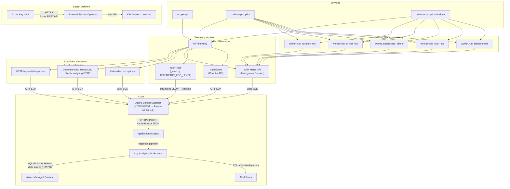

# Observability

Application-level telemetry for Scope services using Azure Application Insights and the modern `@azure/monitor-opentelemetry` OpenTelemetry distro.

## Data Flow



## Transport Protocols

| Hop | Protocol | Format | Notes |
|-----|----------|--------|-------|
| OTel SDK → App Insights | HTTPS POST to Breeze endpoint (`/v2.1/track`) | Azure Monitor `TelemetryItem` JSON (not OTLP) | Endpoint URL from connection string `IngestionEndpoint` |
| App Insights → Log Analytics | Internal Azure pipeline | — | Automatic, no user configuration |
| Log Analytics → Grafana | HTTPS | KQL queries via Azure Monitor data source plugin | Grafana polls on dashboard refresh interval |
| Log Analytics → Alert Rules | HTTPS | KQL scheduled query evaluation | Configured per alert rule |
| Key Vault → ESO | HTTPS | Azure Key Vault REST API | ESO polls on `refreshInterval` |
| ESO → Pod | K8s API | K8s Secret mounted as `envFrom` | kubelet injects as environment variable |

> **Note:** Despite being built on OpenTelemetry, the Azure Monitor distro does **not** use the standard OTLP protocol (gRPC or HTTP/protobuf). The `@azure/monitor-opentelemetry-exporter` converts OTel spans, metrics, and logs into Azure's proprietary `TelemetryItem` JSON envelope and POSTs them to the Breeze ingestion endpoint.

## Telemetry Module

Located at `packages/shared/src/telemetry/`. All services import from `shared`.

### Initialization

```typescript
import { initTelemetry } from "shared";

// Must be called BEFORE any other imports that make HTTP calls
// (Express, MongoDB, etc.) so OTel auto-instrumentation hooks are applied.
initTelemetry("scope-api");
```

`initTelemetry(serviceName)` calls `useAzureMonitor()` with:
- Connection string from `APPLICATIONINSIGHTS_CONNECTION_STRING`
- Sampling ratio from `TELEMETRY_SAMPLING_RATIO` (default 1.0)
- Live Metrics enabled
- `OTEL_SERVICE_NAME` set to `serviceName`

### Graceful No-Op

When `APPLICATIONINSIGHTS_CONNECTION_STRING` is unset, `initTelemetry()` returns early. All helper functions (`trackMetric`, `trackTrace`, `trackEvent`) check `isTelemetryEnabled()` and return immediately — zero runtime cost, no errors, no conditional logic needed at call sites.

### Custom Metrics API

| Helper | OTel Instrument | Use Case |
|--------|----------------|----------|
| `trackMetric({ name, value, properties })` | Histogram | Timing and distribution metrics |
| `trackEvent({ name, properties })` | Counter | Occurrence counting |
| `trackTrace({ message, severityLevel, properties })` | Console JSON → auto-collector | Log forwarding (level-gated) |
| `trackDependency({ name, duration, success, ... })` | Histogram | External call tracking |

### Shutdown

```typescript
import { shutdownTelemetry } from "shared";

process.on("SIGTERM", async () => {
  await shutdownTelemetry(); // flushes pending telemetry
  process.exit(0);
});
```

## Worker Metrics

Emitted by `coder-acp-copilot` and `coder-acp-copilot-windows` during `processMessage()`.

| Metric | Type | Description | Dimensions |
|--------|------|-------------|------------|
| `worker.run_duration_ms` | Histogram | Total run processing time | `runId`, `workerType`, `stopReason` |
| `worker.first_ai_call_ms` | Histogram | Time from run start to first AI interaction | `runId`, `workerType` |
| `worker.cold_start_ms` | Histogram | Container uptime at first run (`process.uptime() * 1000`) | `workerType` |
| `worker.subprocess_idle_s` | Histogram | Gap between subprocess protocol events (hang detection) | `runId`, `workerType` |
| `worker.run_started` | Counter | Run start event | `runId`, `workerType`, `model` |

### Idle Monitoring

A `setInterval(30s)` timer runs during active runs. If the gap since the last subprocess protocol event exceeds 60 seconds, a `worker.subprocess_idle_s` metric is emitted. This enables real-time detection of subprocess hangs before the run times out. The interval is cleared in both success and error paths.

### First AI Call Detection

`isFirstAiCallSignal(msg)` detects the first AI interaction by checking for:
- `"createTurn"` string in the message
- JSON-parseable messages with a `type` field

## API Instrumentation

The API calls `initTelemetry("scope-api")` at startup. No custom metrics — relies entirely on auto-instrumentation for:
- HTTP request/response traces (Express routes)
- Dependency tracking (MongoDB, Redis, Azure Storage, outgoing HTTP)
- Unhandled exception capture

## Configuration

| Env Var | Default | Description |
|---------|---------|-------------|
| `APPLICATIONINSIGHTS_CONNECTION_STRING` | *(none — telemetry disabled)* | Connection string from App Insights resource |
| `TELEMETRY_SAMPLING_RATIO` | `1.0` | Fraction of telemetry to sample (0.0–1.0) |
| `TELEMETRY_LOG_LEVEL` | `Warning` | Minimum severity for subprocess log forwarding to App Insights |

## Deployment

### Secret Delivery

The connection string flows from Azure Key Vault to pods via External Secrets Operator:

1. **Key Vault** stores `appinsights-connection-string` (provisioned by `scope-core-infra`)
2. **ExternalSecret** `appinsights-secrets` references the KV secret via `ClusterSecretStore`
3. **Workers** get the env var via `worker-secrets` (shared ExternalSecret with `envFrom`)
4. **API** gets it via a separate `appinsights-secrets` secretRef (`optional: true`)

### Kubernetes Manifests

- `deploy/base/external-secret.yaml` — `appinsights-secrets` ExternalSecret
- `deploy/base/workers/worker-secrets.yaml` — adds `APPLICATIONINSIGHTS_CONNECTION_STRING` to shared worker secrets
- `deploy/base/api.yaml` — `appinsights-secrets` secretRef (optional)

### Infrastructure Dependency

Requires the App Insights resource and Key Vault secret to be provisioned by `scope-core-infra`. See the companion infrastructure changes in `growth-ecosystems/scope-core-infra`.

## Future: OpenTelemetry for AI

The OpenTelemetry `gen_ai.*` semantic conventions support tracking AI model interactions (token usage, model name, latency). Since Scope workers spawn agent subprocesses rather than making direct SDK calls, auto-instrumentation libraries like `@opentelemetry/instrumentation-openai` won't work.

The path forward is to create manual spans with `gen_ai` attributes after HAR parsing extracts token usage from captured HTTP traffic. This is tracked as future work.
