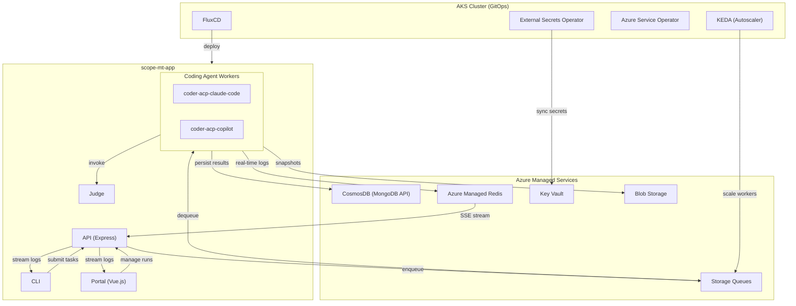

# System Overview

Scope MT is a platform for benchmarking AI coding agents. It orchestrates multiple coding agents (Claude Code, GitHub Copilot, VS Code Web), sends them tasks through configurable scenarios and personas, judges the quality of their output, and tracks everything with real-time logging.

The entire stack — application code, Azure infrastructure, and Kubernetes GitOps manifests — lives in a single monorepo.

## Architecture

## Repository Structure

| Folder | Purpose | Tech Stack |
|--------|---------|------------|
| `scope-mt-app/` | Application code: API, CLI, portal, judge, coding agent workers | TypeScript, pnpm workspaces, Docker |
| `scope-mt-deploy/` | FluxCD GitOps manifests for Kubernetes | Kustomize, Helm, FluxCD |
| `scope-mt-infra/` | Azure infrastructure provisioned via `azd up` | Bicep, Azure Developer CLI |
| `docs/` | Central documentation hub (this folder) | Markdown |

## Application Packages

| Package | Description |
|---------|-------------|
| `api` | Express.js REST API — routes requests to workers, streams logs via SSE |
| `cli` | CLI tool for submitting tasks, streaming logs, and running benchmarks |
| `portal` | Vue.js web UI for managing runs, viewing insights, and configuring criteria |
| `judge` | Evaluates coding agent output against scenario criteria |
| `shared` | Shared types and utilities |
| `workers/coder-acp-claude-code` | Claude Code agent via Agent Client Protocol (ACP) |
| `workers/coder-acp-copilot` | GitHub Copilot agent via Agent Client Protocol (ACP) |

## Data Flow

1. **Submit** — A user submits a task via CLI or Portal, selecting a worker, model, criteria, and optionally an agent version. The API validates the selection (model must be in `supportedModels`, version must be active, at least one criterion required), resolves the agent version's queue, creates a run record in CosmosDB, and enqueues a message.
2. **Execute** — KEDA scales the target worker pod from 0→N. The worker dequeues the message, spins up the coding agent, and executes the task. The worker stamps `workerVersion` (exact build identity) on the run.
3. **Stream** — Workers publish real-time log events to Redis Pub/Sub. The API relays these as SSE streams to the CLI/Portal.
4. **Judge** — After the agent completes, the worker invokes the Judge to evaluate output against criteria. Results (pass/fail per criterion, scores) are persisted to CosmosDB.
5. **Snapshot** — Each iteration's workspace is snapshotted to Blob Storage for later inspection.

## Benchmarking Configuration

| Config Folder | Description |
|---------------|-------------|
| `config/scenarios/` | Task definitions with acceptance criteria |
| `config/personas/` | Simulated user profiles (personality, experience level, verbosity) |
| `config/criteria/` | Reusable evaluation criteria with DAG dependencies |
| `config/traits.yaml` | Trait definitions for persona composition |

## Infrastructure Layers

| Layer | Location | Managed By | What |
|-------|----------|------------|------|
| **Azure Resources** | `scope-mt-infra/infra/bicep/` | `azd up` | AKS, VNet, Key Vault, CosmosDB, Redis, Storage, Private Endpoints, Managed Identities |
| **GitOps Infra** | `scope-mt-deploy/infra/` | FluxCD Phase 1 | ESO, ASO, KEDA, cert-manager (Helm releases) |
| **GitOps Apps** | `scope-mt-deploy/apps/` | FluxCD Phase 2 | SecretStores, ExternalSecrets, ASO Queues, Deployments, KEDA ScaledObjects |

All Azure services are deployed behind **Private Endpoints** within the AKS VNet.

For the detailed 5-layer architecture model, see [Architecture Layers](architecture-layers.md).
