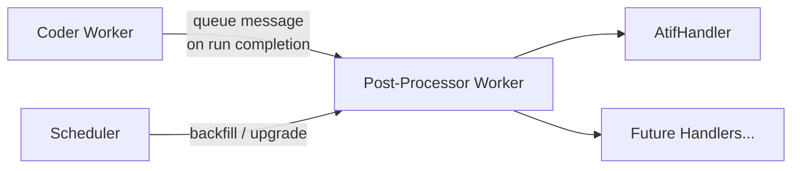
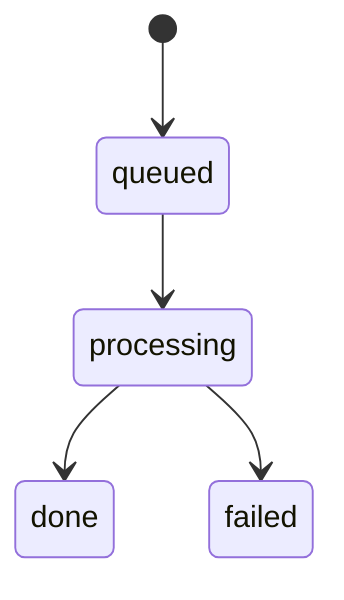

# Post-Processing Pipeline

The post-processing pipeline generates derived artifacts from completed benchmark runs. It is designed as an extensible handler-based system — currently it produces ATIF (AI Tool Interaction Format) trajectory files, but the architecture supports adding future post-processing steps without modifying the core framework.

## Architecture Overview



Two paths trigger post-processing:

1. **Event-driven (primary):** Coder workers enqueue a post-processing message immediately when a run completes, currently setting the deprecated `run.postProcessorStatus: "queued"` compatibility field atomically in the same DB write while the system migrates to per-handler status.
2. **Scheduler backfill:** The `PostProcessorDispatcher` polls every 30 seconds for runs that have `status: "done"` but no post-processing marker set (or a stale handler version). During the migration window this may consult the deprecated flat fields; the long-term source of truth is `run.handlerStatus[handlerId]`. This catches runs that completed before the event-driven dispatch was deployed, or that need re-processing after a version bump.
3. **Scheduler notify server:** The scheduler also exposes `GET /health`, `POST /notify/run-terminal`, and `POST /notify/handler-complete` on a lightweight `node:http` server. Workers and post-process handlers use these endpoints to notify the scheduler when terminal states are reached so it can re-evaluate which root or downstream handlers are ready to dispatch.

## ATIF Generation

[ATIF](https://github.com/AISafety-ATIF/specification) (AI Tool Interaction Format) is an open specification for recording AI agent tool interactions. The post-processor converts HAR (HTTP Archive) recordings captured during benchmark runs into ATIF trajectory files using the [`atifact`](https://github.com/waldekmastykarz/atifact) package.

### Flow

1. Queue message arrives: `{ type: "atif", requestId, runId }`
2. Worker fetches the request document from MongoDB
3. For each iteration turn with a `harUrl`:

    - Downloads the HAR blob from Azure Blob Storage
    - Calls `atifact`'s `parseHar()` to convert HAR → ATIF v1.7 trajectory
    - Uploads `atif.trajectory.json` to blob storage at `{requestId}/runs/{runId}/iteration-{N}/atif.trajectory.json`
    - Updates `run.turns.$.atifUrl` in the request document

4. On success, stamps `run.handlerStatus["pp-atif"] = { status: "done", version: N }` (while legacy `run.postProcessorVersion` / `run.postProcessorStatus` may still be mirrored during the transition)
5. Triggers downstream taxonomy/report handlers once the scheduler sees the dependency graph is satisfied

## Taxonomy Generation

The taxonomy handler (`apps/workers/taxonomy/`) consumes messages from the dedicated `pp-taxonomy-queue` and produces a structured JSON artifact for a completed run. It uses the GitHub Copilot SDK with a tool-backed session to fetch run metadata from the API and ATIF trajectories from blob storage, then validates the generated JSON against the shared taxonomy Zod schema.

### Flow

1. Queue message arrives: `{ type: "taxonomy", requestId, runId }`
2. Worker fetches the request document from MongoDB and marks `run.handlerStatus["pp-taxonomy"].status = "processing"`
3. Copilot SDK session calls:
   - `get_run_data` to fetch the request + active run from the API
   - `get_atif_trajectory` to fetch per-iteration ATIF JSON from blob storage
4. The worker validates the assistant response with `taxonomySchema.safeParse()`
5. If validation fails, the worker feeds the schema errors back into the same session and retries up to 3 total attempts
6. On success, the worker uploads `taxonomy.json` to `{requestId}/runs/{runId}/taxonomy.json`
7. The worker stamps `run.handlerStatus["pp-taxonomy"] = { status: "done", version: 1 }` and calls `POST /notify/handler-complete`

### Blob Storage Layout

```javascript
{requestId}/
  runs/{runId}/
    iteration-1/
      atif.trajectory.json
    iteration-2/
      atif.trajectory.json
```

### API Endpoints

| Endpoint | Description |
| --- | --- |
| `GET /api/v1/requests/:id/atif?iteration=N` | Download ATIF for the latest run |
| `GET /api/v1/requests/:id/runs/:runId/atif?iteration=N` | Download ATIF for a specific run |

The `iteration` query parameter is mandatory. ATIF files are also included in archive exports as `iteration-{N}.atif.trajectory.json`.

## Handler Interface

The post-processor uses a registry pattern for extensibility:

```typescript
interface PostProcessHandler {
  readonly type: string;
  process(message: PostProcessorMessage, ctx: HandlerContext): Promise<void>;
}

interface PostProcessorMessage {
  type: string;        // Handler type to invoke ("atif" | future types)
  requestId: string;
  runId: string;
  iteration?: number;  // If omitted, process all iterations
}

interface HandlerContext {
  blobStorage: BlobStorage;
  collection: Collection;
  log: (level: string, msg: string) => Promise<void>;
}
```

Handlers are registered at startup in `index.ts`:

```typescript
const processor = new PostProcessor(config);
processor.registerHandler(new AtifHandler());
processor.start();
```

### Adding a New Handler

1. Create a new file in `apps/workers/post-processor/src/handlers/`
2. Implement the `PostProcessHandler` interface
3. Register it in `index.ts` via `processor.registerHandler(new MyHandler())`
4. Update the dispatcher (if needed) to send messages with the new `type`

## Version Management

The post-processor uses a version-based re-processing scheme:

- Each handler is registered independently in the `services` collection using a `post-process-handler` document keyed by handler ID (for example `pp-atif`, `pp-taxonomy`, `pp-report`)
- Each registration stores the handler `version`, queue name, selector, `autoBackfill` behavior, and `dependsOn` DAG edges
- The scheduler compares each request's per-handler status/version state (for example `run.handlerStatus["pp-atif"]`) against the registered handler entry for that selector
- Requests with missing or outdated handler state are re-dispatched for that specific handler once its dependencies are satisfied

This allows deploying handler improvements and having them automatically applied to historical data.

## Status Lifecycle



| Status | Meaning |
| --- | --- |
| *(absent)* | Run hasn't been dispatched for post-processing yet |
| `queued` | Message sent to queue, awaiting pickup |
| `processing` | Worker is actively processing |
| `done` | Post-processing completed successfully |
| `failed` | Handler threw an error (may be retried by scheduler on next poll) |

## Configuration

| Environment Variable | Default | Description |
| --- | --- | --- |
| `AZURE_STORAGE_QUEUE_POSTPROCESSOR` | `post-processor-queue` | Queue name for ATIF post-processor messages |
| `AZURE_STORAGE_QUEUE_TAXONOMY` | `pp-taxonomy-queue` | Queue name for taxonomy-generation jobs |
| `SCHEDULER_PP_POLL_INTERVAL_MS` | `30000` | Scheduler backfill polling interval |
| `BATCH_SIZE` | `1` | Messages to process per poll (worker-side) |
| `POLL_INTERVAL_MS` | `5000` | Worker queue polling interval |
| `SCOPE_MT_API_URL` / `API_BASE_URL` | `http://localhost:3001` | API URL used by report/taxonomy Copilot tools |
| `TAXONOMY_MODEL` | `gpt-4.1` | Copilot SDK model used by the taxonomy handler |
| `SESSION_TIMEOUT_MS` | `300000` | Timeout for report/taxonomy Copilot SDK sessions |
| `SCHEDULER_URL` | _(unset)_ | Optional scheduler notify base URL for downstream handler dispatch |

## Infrastructure

- **Queues:** Azure Storage Queues (`post-processor-queue` for ATIF, `pp-taxonomy-queue` for taxonomy, `report-queue` for reports)
- **Blob Storage:** `snapshots` container (shared with HAR, tool-calls, and other artifacts)
- **Database:** MongoDB `requests` collection (`run.handlerStatus` map keyed by handler ID, with deprecated `run.postProcessorStatus` / `run.postProcessorVersion` compatibility fields during migration)
- **KEDA:** ScaledObject scales the worker to zero when queue is empty
- **Version registration:** Kubernetes Job runs on each deploy; Docker Compose uses an init service