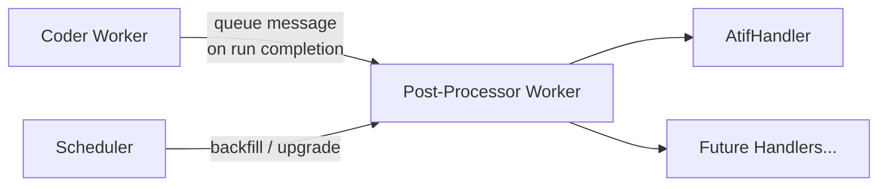
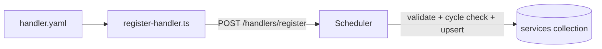
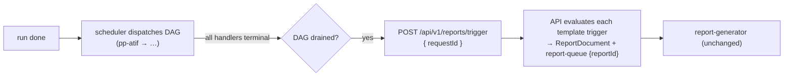
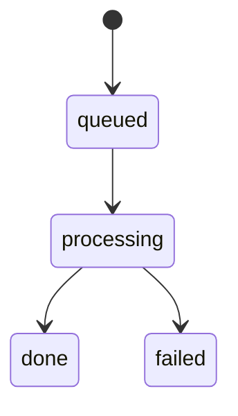

# Post-Processing Pipeline

The post-processing pipeline generates derived artifacts from completed benchmark runs. It is designed as an extensible handler-based system — currently it produces ATIF (AI Tool Interaction Format) trajectory files, but the architecture supports adding future post-processing steps without modifying the core framework.

## Architecture Overview



Two paths trigger post-processing:

1. **Event-driven (primary):** Coder workers enqueue a post-processing message immediately when a run completes, currently setting the deprecated `run.postProcessorStatus: "queued"` compatibility field atomically in the same DB write while the system migrates to per-handler status.
2. **Scheduler backfill:** The `PostProcessorDispatcher` polls every 30 seconds for runs that have `status: "done"` but no post-processing marker set (or a stale handler version). During the migration window this may consult the deprecated flat fields; the long-term source of truth is `run.handlerStatus[handlerId]`. This catches runs that completed before the event-driven dispatch was deployed, or that need re-processing after a version bump.
3. **Scheduler notify & registration server:** The scheduler also exposes `GET /health`, `POST /notify/run-terminal`, `POST /notify/handler-complete`, and `POST /handlers/register` on a lightweight `node:http` server. Workers and post-process handlers use the notify endpoints to signal terminal states so the scheduler can re-evaluate which root or downstream handlers are ready to dispatch. The `/handlers/register` endpoint is the single writer to the `services` collection — see [Handler Registration](#handler-registration).

## ATIF Generation

[ATIF](https://github.com/AISafety-ATIF/specification) (AI Tool Interaction Format) is an open specification for recording AI agent tool interactions. The post-processor converts HAR (HTTP Archive) recordings captured during benchmark runs into ATIF trajectory files using the [`atifact`](https://github.com/waldekmastykarz/atifact) package (pinned to `^0.10.1`, which extracts trajectories from both HTTP/SSE exchanges and WebSocket exchanges in a HAR).

### Flow

1. Queue message arrives: `{ type: "atif", requestId, runId }`
2. Worker fetches the request document from MongoDB
3. For each iteration turn with a `harUrl`:

    - Downloads the HAR blob from Azure Blob Storage
    - Calls `atifact`'s `parseHar()` to convert HAR → ATIF v1.7 trajectory
    - Uploads `atif.trajectory.json` to blob storage at `{requestId}/runs/{runId}/iteration-{N}/atif.trajectory.json`
    - Updates `run.turns.$.atifUrl` in the request document

4. On success, stamps `run.handlerStatus["pp-atif"] = { status: "done", version: N }` (while legacy `run.postProcessorVersion` / `run.postProcessorStatus` may still be mirrored during the transition)
5. Triggers any downstream handlers once the scheduler sees the dependency graph is satisfied. (Reports are **not** a DAG handler — see [Report Triggering](#report-triggering-on-dag-drain).)

### Blob Storage Layout

```javascript
{requestId}/
  runs/{runId}/
    iteration-1/
      atif.trajectory.json
    iteration-2/
      atif.trajectory.json
```

### API Endpoints

| Endpoint | Description |
| --- | --- |
| `GET /api/v1/requests/:id/atif?iteration=N` | Download ATIF for the latest run |
| `GET /api/v1/requests/:id/runs/:runId/atif?iteration=N` | Download ATIF for a specific run |

The `iteration` query parameter is mandatory for the ATIF endpoints. ATIF files are also included in archive exports as `iteration-{N}.atif.trajectory.json`.

## Handler Interface

The post-processor uses a registry pattern for extensibility:

```typescript
interface PostProcessHandler {
  readonly type: string;
  readonly version: number;
  readonly autoBackfill: boolean;
  process(message: PostProcessorMessage, ctx: HandlerContext): Promise<void>;
}

interface PostProcessorMessage {
  type: string;        // Handler type to invoke ("atif" | future types)
  requestId: string;
  runId: string;
  iteration?: number;  // If omitted, process all iterations
}

interface HandlerContext {
  blobStorage: BlobStorage;
  collection: Collection;
  log: (level: string, msg: string) => Promise<void>;
}
```

Handlers are registered at startup in `index.ts`:

```typescript
const processor = new PostProcessor(config);
processor.registerHandler(new AtifHandler());
processor.start();
```

## Idempotency and Dispatch Semantics

Post-processing delivery is treated as **at-least-once**. Queue messages may be duplicated or redelivered, and the scheduler may enqueue a handler message before the corresponding `queued` marker is durably written back to MongoDB.

To keep this safe, idempotency is enforced at the **post-processor worker entrypoint**, not inside each individual handler:

1. The scheduler decides whether work is needed from `run.handlerStatus[handlerId]` + handler metadata (`version`, `autoBackfill`).
2. The worker re-checks that same eligibility when a message is dequeued, scoped to the specific `runId`.
3. The worker atomically claims the handler by transitioning its status to `processing`.
4. If the message is stale, duplicated, or the handler is already current, the worker deletes the queue message and no-ops.

This means:

- A crash after queue send but before the scheduler writes `queued` no longer wedges the run forever.
- Duplicate queue messages are harmless.
- Handler implementations can stay simple; correctness does not depend on each handler re-implementing duplicate guards.

### Adding a New Handler

1. Create a new file in `apps/workers/post-processor/src/handlers/`
2. Implement the `PostProcessHandler` interface
3. Register it in `index.ts` via `processor.registerHandler(new MyHandler())`
4. Update the dispatcher (if needed) to send messages with the new `type`

## Testing

The `AtifHandler` has two complementary test suites:

- `atif-handler.test.ts` — unit tests for the handler's orchestration logic (iteration selection, blob download/upload, `atifUrl` update, and the skip/error branches). It mocks `atifact`'s `parseHar`, so it does not exercise the real HAR conversion.
- `atif-handler.websocket.test.ts` — runs the **real** `parseHar` against a committed fixture (`__fixtures__/websocket-capture.har.json`) to pin the WebSocket-in-HAR trajectory extraction added in atifact 0.10.0. The fixture mirrors the `_webSocketMessages` envelope the AI gateway produces, so a future `atifact` upgrade that regresses WebSocket parsing fails this test.

## Version Management

The post-processor uses a version-based re-processing scheme:

- Each handler is registered independently in the `services` collection using a `post-process-handler` document keyed by handler ID (for example `pp-atif`)
- Each registration stores the handler `version`, queue name, selector, `autoBackfill` behavior, and `dependsOn` DAG edges
- The scheduler compares each request's per-handler status/version state (for example `run.handlerStatus["pp-atif"]`) against the registered handler entry for that selector
- Requests with missing or outdated handler state are re-dispatched for that specific handler once its dependencies are satisfied

This allows deploying handler improvements and having them automatically applied to historical data.

## Handler Registration

Each post-process handler declares its DAG metadata in a `handler.yaml` file colocated with the worker (e.g. `apps/workers/post-processor/handler.yaml`). This mirrors the coding-agent `agent.yaml` registration pattern.

```yaml
# apps/workers/post-processor/handler.yaml
_id: pp-atif
type: post-process-handler
version: 1
queue: post-processor-queue
selector: atif
autoBackfill: true
dependsOn: []
```

On deploy, a generic registration script — `packages/shared/src/scripts/register-handler.ts` — reads the `handler.yaml` pointed to by `HANDLER_YAML_PATH`, waits for the scheduler's `/health`, and POSTs the parsed document to `${SCHEDULER_URL}/handlers/register` (with retry). The scheduler validates the document, runs a cycle check against the existing topology, and upserts it into the `services` collection via `HandlerDispatcher.registerHandler`. **Workers never write to the `services` collection directly** — the scheduler is the sole owner.

Because handler topology is read on the dispatch hot path (every notify reads it 2–3 times, and every poll cycle once) but only changes on deploys, the scheduler caches it in-memory with a TTL (default 5 min, `SCHEDULER_HANDLER_CACHE_TTL_MS`). Coherence comes primarily from invalidation, not expiry: `registerHandler` invalidates the cache immediately after upserting, and since the scheduler is a singleton (`replicas: 1`, `Recreate`) and the sole writer of the `services` collection, a change is reflected at once regardless of TTL. The TTL is therefore only a defensive backstop for out-of-band writes or a future scale-out to more than one replica, and is deliberately kept well above the poll interval so the poll loop doesn't force a fresh read every cycle. Cycle-check validation always reads fresh (bypassing the cache).



**Where it runs:**

- **Docker Compose:** one `register-handler-<worker>` init service per handler (e.g. `pp-atif`) runs the generic script via `tsx`, gated on the scheduler being up. The worker waits for its registration service to complete.
- **Kubernetes:** a `register-handler-post-processor` Job runs the compiled script (`node packages/shared/dist/scripts/register-handler.js`) on each deploy. Only `pp-atif` is registered in K8s today because it is the only post-process handler deployed to the cluster. The scheduler exposes a `Service` (`scheduler.scoped.svc.cluster.local:8080`) so Jobs and workers can reach `/handlers/register` and the notify endpoints.

To **add or change a handler**, edit its `handler.yaml` (bump `version`, adjust `dependsOn`, etc.) — no code or migration changes are needed for registration.

## Report Triggering on DAG Drain

Reports are intentionally **not** modeled as a DAG handler. The report-generator
worker is keyed by `reportId` and requires a `templateId`, whereas the DAG
dispatches a generic `{ type, requestId, runId }` message — so a report node
could never process a DAG message. Reports are also fundamentally different from
post-process handlers: they are parameterized (per `templateId`), N-per-run (one
per matching template), and trigger-gated (each template has its own
`ReportTrigger`).

Instead, the scheduler watches for a run's handler DAG to **drain** and then
calls the existing `POST /api/v1/reports/trigger` endpoint, which evaluates every
active template's trigger and creates the properly-templated `ReportDocument`(s).



**Drain definition.** A handler is _terminal_ when its status is `done` or
`failed`, **or** when its status is absent but a transitive dependency `failed`
(so it can never run — effectively blocked). The DAG is drained when every
registered handler is terminal. A run with **zero** registered handlers is
vacuously drained, so reports trigger immediately on run completion.

**Trigger regardless of handler success.** A flaky handler must not block report
generation (reports analyze the run/ATIF), so the scheduler triggers reports
whenever the DAG drains — not only when every handler succeeded.

**Exactly-once, attempt-scoped.** Before POSTing, the scheduler atomically claims
a per-attempt guard (`run.reportsTriggeredAt`) via `findOneAndUpdate` filtered by
`{ _id: requestId, "run._id": runId, "run.status": "done", "run.reportsTriggeredAt": { $exists: false } }`.
Scoping by `run._id` ensures a stale notify or a concurrent retry can never fire
reports for — or roll back the guard of — a different attempt. If the POST fails,
the guard is rolled back (also `run._id`-scoped) so the 30s poll safety net
retries.

**Where it fires.** `maybeTriggerReports(requestId, runId)` runs at the end of
`onRunTerminal` (handles zero-handler / already-drained runs), both branches of
`onHandlerComplete` (success **and** the failure early-return, since a failure can
drain the DAG by blocking descendants), and a `pollTriggerReports()` scan in the
scheduler's 30s poll loop (durable backstop for dropped notifications).

The scheduler reaches the API via the `API_URL` env var (`http://api:80` in
Compose, `http://api.scoped.svc.cluster.local:80` in K8s).

## Status Lifecycle



| Status | Meaning |
| --- | --- |
| *(absent)* | Run hasn't been dispatched for post-processing yet |
| `queued` | Message sent to queue, awaiting pickup (best-effort marker; the worker entrypoint is authoritative) |
| `processing` | Worker is actively processing |
| `done` | Post-processing completed successfully |
| `failed` | Handler threw an error (may be retried by scheduler on next poll) |

## Configuration

| Environment Variable | Default | Description |
| --- | --- | --- |
| `AZURE_STORAGE_QUEUE_POSTPROCESSOR` | `post-processor-queue` | Queue name for ATIF post-processor messages |
| `SCHEDULER_PP_POLL_INTERVAL_MS` | `30000` | Scheduler backfill polling interval |
| `BATCH_SIZE` | `1` | Messages to process per poll (worker-side) |
| `POLL_INTERVAL_MS` | `5000` | Worker queue polling interval |
| `SCOPE_MT_API_URL` / `API_BASE_URL` | `http://localhost:3001` | API URL used by report Copilot tools |
| `SESSION_TIMEOUT_MS` | `300000` | Timeout for report Copilot SDK sessions |
| `SCHEDULER_URL` | _(unset)_ | Scheduler base URL — used by handlers to notify completion and by the register-handler script to reach `/handlers/register` |
| `API_URL` | `http://api:80` | API base URL the **scheduler** uses to call `POST /api/v1/reports/trigger` when a run's handler DAG drains |
| `HANDLER_YAML_PATH` | _(unset)_ | Path to a handler's `handler.yaml`, read by the generic `register-handler` script |

## Infrastructure

- **Queues:** Azure Storage Queues (`post-processor-queue` for ATIF, `report-queue` for reports)
- **Blob Storage:** `snapshots` container (shared with HAR, tool-calls, and other artifacts)
- **Database:** MongoDB `requests` collection (`run.handlerStatus` map keyed by handler ID, with deprecated `run.postProcessorStatus` / `run.postProcessorVersion` compatibility fields during migration)
- **KEDA:** ScaledObject scales the worker to zero when queue is empty
- **Handler registration:** declarative `handler.yaml` per worker → generic `register-handler` script → scheduler `POST /handlers/register` (sole writer to the `services` collection). A Kubernetes Job runs the script on each deploy; Docker Compose uses per-handler init services. See [Handler Registration](#handler-registration).