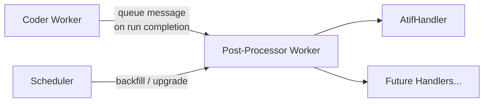
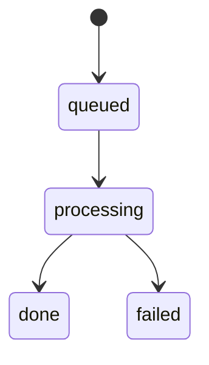

# Post-Processing Pipeline

The post-processing pipeline generates derived artifacts from completed benchmark runs. It is designed as an extensible handler-based system — currently it produces ATIF (AI Tool Interaction Format) trajectory files, but the architecture supports adding future post-processing steps without modifying the core framework.

## Architecture Overview



Two paths trigger post-processing:

1. **Event-driven (primary):** Coder workers enqueue a post-processing message immediately when a run completes, setting `run.postProcessorStatus: "queued"` atomically in the same DB write.
2. **Scheduler backfill:** The `PostProcessorDispatcher` polls every 30 seconds for runs that have `status: "done"` but no `postProcessorStatus` set (or a `postProcessorVersion` below the current target). This catches runs that completed before the event-driven dispatch was deployed, or that need re-processing after a version bump.

## ATIF Generation

[ATIF](https://github.com/AISafety-ATIF/specification) (AI Tool Interaction Format) is an open specification for recording AI agent tool interactions. The post-processor converts HAR (HTTP Archive) recordings captured during benchmark runs into ATIF trajectory files using the [`atifact`](https://github.com/waldekmastykarz/atifact) package (pinned to `^0.10.1`, which extracts trajectories from both HTTP/SSE exchanges and WebSocket exchanges in a HAR).

### Flow

1. Queue message arrives: `{ type: "atif", requestId, runId }`
2. Worker fetches the request document from MongoDB
3. For each iteration turn with a `harUrl`:

    - Downloads the HAR blob from Azure Blob Storage
    - Calls `atifact`'s `parseHar()` to convert HAR → ATIF v1.7 trajectory
    - Uploads `atif.trajectory.json` to blob storage at `{requestId}/runs/{runId}/iteration-{N}/atif.trajectory.json`
    - Updates `run.turns.$.atifUrl` in the request document

4. On success, stamps `run.postProcessorVersion` and sets `run.postProcessorStatus: "done"`
5. Triggers report generation via the API (best-effort, with retry)

### Blob Storage Layout

```javascript
{requestId}/
  runs/{runId}/
    iteration-1/
      atif.trajectory.json
    iteration-2/
      atif.trajectory.json
```

### API Endpoints

| Endpoint | Description |
| --- | --- |
| `GET /api/v1/requests/:id/atif?iteration=N` | Download ATIF for the latest run |
| `GET /api/v1/requests/:id/runs/:runId/atif?iteration=N` | Download ATIF for a specific run |

The `iteration` query parameter is mandatory. ATIF files are also included in archive exports as `iteration-{N}.atif.trajectory.json`.

## Handler Interface

The post-processor uses a registry pattern for extensibility:

```typescript
interface PostProcessHandler {
  readonly type: string;
  process(message: PostProcessorMessage, ctx: HandlerContext): Promise<void>;
}

interface PostProcessorMessage {
  type: string;        // Handler type to invoke ("atif" | future types)
  requestId: string;
  runId: string;
  iteration?: number;  // If omitted, process all iterations
}

interface HandlerContext {
  blobStorage: BlobStorage;
  collection: Collection;
  log: (level: string, msg: string) => Promise<void>;
}
```

Handlers are registered at startup in `index.ts`:

```typescript
const processor = new PostProcessor(config);
processor.registerHandler(new AtifHandler());
processor.start();
```

### Adding a New Handler

1. Create a new file in `apps/workers/post-processor/src/handlers/`
2. Implement the `PostProcessHandler` interface
3. Register it in `index.ts` via `processor.registerHandler(new MyHandler())`
4. Update the dispatcher (if needed) to send messages with the new `type`

## Testing

The `AtifHandler` has two complementary test suites:

- `atif-handler.test.ts` — unit tests for the handler's orchestration logic (iteration selection, blob download/upload, `atifUrl` update, and the skip/error branches). It mocks `atifact`'s `parseHar`, so it does not exercise the real HAR conversion.
- `atif-handler.websocket.test.ts` — runs the **real** `parseHar` against a committed fixture (`__fixtures__/websocket-capture.har.json`) to pin the WebSocket-in-HAR trajectory extraction added in atifact 0.10.0. The fixture mirrors the `_webSocketMessages` envelope the AI gateway produces, so a future `atifact` upgrade that regresses WebSocket parsing fails this test.

## Version Management

The post-processor uses a version-based re-processing scheme:

- The worker declares its version in `src/version.ts` (e.g., `export const POST_PROCESSOR_VERSION = 1`)
- On each deploy, a registration Job writes `{ _id: "post-processor", version: N }` to the `services` collection
- The scheduler's `PostProcessorDispatcher` compares each request's `run.postProcessorVersion` against the registered version
- Requests with a lower version are re-dispatched for processing with the new handler logic

This allows deploying handler improvements and having them automatically applied to historical data.

## Status Lifecycle



| Status | Meaning |
| --- | --- |
| *(absent)* | Run hasn't been dispatched for post-processing yet |
| `queued` | Message sent to queue, awaiting pickup |
| `processing` | Worker is actively processing |
| `done` | Post-processing completed successfully |
| `failed` | Handler threw an error (may be retried by scheduler on next poll) |

## Configuration

| Environment Variable | Default | Description |
| --- | --- | --- |
| `AZURE_STORAGE_QUEUE_POSTPROCESSOR` | `post-processor-queue` | Queue name for post-processor messages |
| `SCHEDULER_PP_POLL_INTERVAL_MS` | `30000` | Scheduler backfill polling interval |
| `BATCH_SIZE` | `1` | Messages to process per poll (worker-side) |
| `POLL_INTERVAL_MS` | `5000` | Worker queue polling interval |
| `SCOPE_MT_API_URL` / `API_BASE_URL` | `http://localhost:3001` | API URL for report generation trigger |

## Infrastructure

- **Queue:** Azure Storage Queue (`post-processor-queue`)
- **Blob Storage:** `snapshots` container (shared with HAR, tool-calls, and other artifacts)
- **Database:** MongoDB `requests` collection (`run.postProcessorStatus`, `run.postProcessorVersion` fields)
- **KEDA:** ScaledObject scales the worker to zero when queue is empty
- **Version registration:** Kubernetes Job runs on each deploy; Docker Compose uses an init service