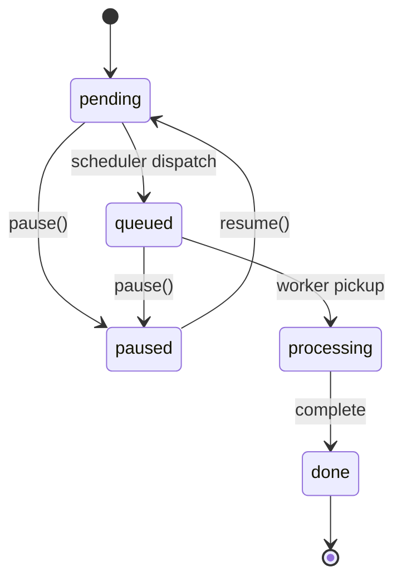

# Queue Scheduling & Back Pressure

## Overview

The scheduling system decouples request ordering from message delivery. MongoDB is the scheduling brain — it stores priority, enforces pause/resume state, and determines dispatch order. Azure Storage Queues remain the notification channel that wakes workers, but are kept deliberately shallow so scheduling decisions in MongoDB take effect within seconds.

## Architecture

```
┌────────────────────────────────────────────────────────────────────────┐
│                          MongoDB (requests)                            │
│                                                                        │
│  priority: number (root, request-scoped)                               │
│  run.status: pending | queued | paused | processing | done             │
│  run.pausedAt / run.resumedAt (per-attempt)                            │
│                                                                        │
│  Compound index: run.status + workerType + deletedAt + priority + date │
└──────────────────────────────┬─────────────────────────────────────────┘
                               │
               ┌───────────────▼───────────────┐
               │     Request Scheduler          │
               │     (apps/scheduler/)          │
               │     1 replica, polls every 2s  │
               │                                │
               │  findOneAndUpdate              │
               │    filter: status=pending      │
               │    sort: priority DESC,        │
               │          createdAt ASC         │
               │    set: status → queued        │
               │                                │
               │  Caps queue at targetDepth     │
               │  via getProperties() count     │
               └───────────────┬───────────────┘
                               │
               ┌───────────────▼───────────────┐
               │   Azure Storage Queues         │
               │   (shallow buffer, ≤5 msgs)    │
               │   queue-coder-acp-copilot      │
               │   queue-coder-acp-claude-code  │
               │   queue-coder-vscode-electron… │
               └───────────────┬───────────────┘
                               │
               ┌───────────────▼───────────────┐
               │   Workers                      │
               │   Poll queue → fetch doc →     │
               │   check status (skip paused)   │
               │   → process                    │
               └───────────────────────────────┘
```

## Data Model

### Priority

`priority` is a root-level integer on `RequestDocument`. Higher values are dispatched first. Default is `0`.

| Value | Use case |
|-------|----------|
| 100 | Critical / demo |
| 50 | High / blocking PR |
| 0 | Normal (default) |
| −50 | Low / nightly batch |

Priority is request-scoped (survives retries). The range is unrestricted but the portal offers −10 to +10 via the bulk dialog, with ±1/±5 increment buttons.

Priority can only be changed on `pending` and `paused` requests — the API endpoints enforce this server-side. Changing priority on a `queued` request is not allowed because the message is already in the Azure queue where ordering cannot be changed. `processing` and `done` requests are immutable.

### Status Lifecycle



| Status | Meaning |
|--------|---------|
| `pending` | Awaiting scheduler dispatch. Can be paused. |
| `queued` | Dispatched to Azure queue, awaiting worker pickup. Can be paused. |
| `processing` | Worker actively running. Cannot be paused. |
| `paused` | Held — scheduler skips. Resume returns to `pending`. |
| `done` | Terminal (outcome: succeeded / failed / finished). |

`pausedAt` and `resumedAt` are per-attempt fields in `RunState`. On retry, a fresh `RunState` is created with `status: "pending"`.

## Request Scheduler

**Location**: `apps/scheduler/` — standalone K8s Deployment (1 replica, `Recreate` strategy).

### Dispatch Loop

Every 2 seconds (configurable via `SCHEDULER_POLL_INTERVAL_MS`):

1. For each worker type, read Azure queue depth via `getProperties().approximateMessagesCount`
2. Compute available slots: `targetQueueDepth − currentDepth`
3. For each slot, `findOneAndUpdate` the highest-priority pending request:
   - Filter: `run.status: "pending"`, matching `workerType`, no `deletedAt`
   - Sort: `priority: -1, createdAt: 1`
   - Update: set `run.status: "queued"`
4. Send `{ requestId, runId }` message to Azure Storage Queue (base64-encoded JSON)

### Configuration

Environment variables in `deploy/base/scheduler.yaml`:

| Variable | Value | Purpose |
|----------|-------|---------|
| `SCHEDULER_QUEUE_DEPTH_<TYPE>` | 3–5 | Target queue depth per worker type |
| `SCHEDULER_POLL_INTERVAL_MS` | 2000 | Polling interval in ms |

Queue names follow the convention `queue-<workerType>` (e.g. `queue-coder-acp-copilot`).

### Why Keep the Queue Shallow?

Once a message is in Azure Storage Queue, it cannot be reordered or removed. By capping queue depth at 3–5 messages per worker type:

- **Priority takes effect immediately**: high-priority requests get dispatched on the next tick
- **Pause takes effect immediately**: paused requests are never dispatched
- **Priority changes are respected**: pending requests re-sort on the next tick

### Back Pressure

The scheduler provides natural back pressure. When workers are busy, messages sit in the queue and `approximateMessagesCount` stays at or above `targetQueueDepth`. The scheduler sees zero available slots and stops dispatching — pending requests accumulate in MongoDB where they remain re-prioritizable and pausable.

When workers finish and drain messages, slots open up and the scheduler fills them on the next tick (≤2s). This creates a pull-based flow: workers pull work at their own pace, and the scheduler never overwhelms them regardless of how many requests are pending in MongoDB.

If worker replicas scale up, increase `SCHEDULER_QUEUE_DEPTH_<TYPE>` to match. The target depth should roughly equal the number of worker replicas so each has a message ready when it finishes its current job.

## Worker Behavior

Workers are unchanged except for one guard: after fetching a document from MongoDB, if `run.status === "paused"`, the worker deletes the queue message and moves on. This handles the race where a request was paused after being queued but before the worker picked it up.

### Liveness Heartbeat & Redelivery

Azure Storage Queues guarantee at-least-once delivery, so a worker may receive a duplicate of a message that another worker is already processing (e.g. transient visibility-extension miss, throttling). To distinguish a spurious redelivery from a genuine worker crash, every in-flight run carries:

| Where | Field | Type | Meaning |
|-------|-------|------|---------|
| Mongo (`run.*`) | `worker` | `{ instanceId, podName? }` | Identity of the worker process currently processing the run. `instanceId` is a per-process UUID; `podName` is the K8s pod name (`HOSTNAME`) when running in a pod. Stamped atomically at the `queued → processing` pickup. Persisted for forensics; never updated by heartbeat ticks. |
| Mongo (`run.*`) | `startedAt` | `Date` | Wall-clock time of the pickup. Used as the missing-heartbeat fallback (see below). |
| Redis | `run-heartbeat:<runId>` | `Date` (ISO string, TTL ≈ 5×visibility) | Wall-clock time the owning worker last beat. Refreshed every 15s by the per-run heartbeat callback wired into [`startVisibilityHeartbeat`](../../packages/shared/src/queue/visibility-heartbeat.ts). |

**Why Redis for the heartbeat?** The previous design wrote `run.lastHeartbeatAt` to Mongo on every beat. With CosmosDB-compatible Mongo each beat costs ~10 RU, so an active run burns ~40 RU/min just to stay alive. The heartbeat is inherently ephemeral — it has no value past its TTL — so it lives in Redis. The API enriches `processing` runs on response with an MGET so the portal still sees `run.lastHeartbeatAt` (transient, not persisted in Mongo).

When a worker dequeues a message whose `run.status === "processing"`, it consults Redis:

- **Fresh** (last beat ≤ `staleThresholdMs` ago): the original worker is alive. Drop the duplicate message, leave the run untouched, log a `warn`.
- **Stale** (last beat older than threshold): the worker is presumed dead. Mark the run failed via an atomic `findOneAndUpdate` filtered on `run.worker.instanceId === <currentOwnerId>` — if a peer has already taken over (rewriting the worker identity) between our read and write, our claim no-ops and we drop the dupe. Drop the Redis key. The user retries explicitly via `POST /requests/:id/retry`.
- **Missing** (no Redis key — first dequeue race, or Redis blip, or key TTL'd out): fall back to `run.startedAt`. If the run was picked up *recently* (≤ `staleThresholdMs` ago), treat as the "no first beat yet" race and drop the dupe — this prevents a transient Redis outage from mass-failing healthy just-picked-up runs. Otherwise, treat as stale and mark failed.

The default threshold is `2 × HEARTBEAT_VISIBILITY_SECONDS` (= 120s). Override with the `SCOPE_RUN_HEARTBEAT_STALE_MS` env var (milliseconds). The Redis TTL defaults to `5 × HEARTBEAT_VISIBILITY_SECONDS` (= 300s); override with `SCOPE_RUN_HEARTBEAT_REDIS_TTL_MS`.

## API Endpoints

### Single Request

```
POST /api/v1/requests/:id/pause       Pause (pending/queued → paused)
POST /api/v1/requests/:id/resume      Resume (paused → pending)
POST /api/v1/requests/:id/priority    Set priority { priority: number }
```

### Bulk Operations

```
POST /api/v1/requests/bulk-pause      { ids: string[] }
POST /api/v1/requests/bulk-resume     { ids: string[] }
POST /api/v1/requests/bulk-priority   { ids: string[], priority: number }
```

All endpoints use POST. Bulk endpoints return `{ updated, skipped }` counts. Priority endpoints filter server-side to only update `pending` and `paused` requests.

### Submit

`POST /api/v1/requests` accepts an optional `priority` field (default: 0). The API inserts with `run.status: "pending"` — it no longer sends directly to the queue. The scheduler handles dispatch.

## Portal UI

### Runs List Toolbar

The bulk action bar appears when runs are selected. Buttons progressively collapse labels at narrower viewports (icons always visible, tooltips on all buttons):

| Breakpoint | Visible |
|------------|---------|
| ≥ 2xl | Section labels + all button text |
| xl–2xl | Button text only (section labels hidden) |
| lg–xl | Core action text (Pause/Resume/Retry); Export text hidden |
| md–lg | Only Pause/Resume/Retry text; Priority/Re-submit icon-only |
| < md | All icon-only |

Buttons are disabled (not hidden) when the action doesn't apply to the selection. `selectionCaps` computes pausable/resumable/prioritizable/retryable counts from either the flat `runs` array (flat mode) or group-level `statusCounts` (grouped mode).

The bulk priority dialog has −5/−1/input/+1/+5 increment controls and pre-fills with the current priority of selected runs.

### Run Detail Page

The header shows context-sensitive schedule actions alongside existing Retry/Archive buttons:

- **Pause** — visible when status is `pending` or `queued`
- **Resume** — visible when status is `paused`
- **Priority** dropdown — visible when `pending` or `paused`, with preset levels (−10 to +10)

All actions are hidden when viewing a historical attempt.

### Per-Row Actions

Each row in the runs table has inline icon buttons for Pause (pending/queued), Resume (paused), Priority dropdown (pending/paused), and Retry (done).

### Status Display

- `queued` → purple badge
- `paused` → warning/amber badge
- Group rows show stacked status progress bars with all 5 states

## Infrastructure

### Kubernetes Resources

| Resource | File |
|----------|------|
| Scheduler Deployment | `deploy/base/scheduler.yaml` |
| Azure Storage Queues (ASO) | `deploy/base/queues.yaml` |
| Scheduler in docker-compose | `docker-compose.yml` (service: `scheduler`) |

### Queue Inventory

| Queue | Worker Type |
|-------|-------------|
| `queue-coder-acp-copilot` | GitHub Copilot CLI |
| `queue-coder-acp-claude-code` | Claude Code |

## Key Files

| File | Role |
|------|------|
| `apps/scheduler/src/request-scheduler.ts` | Scheduler core: dispatch loop, queue depth management |
| `apps/scheduler/src/index.ts` | Entry point: config parsing, MongoDB/Queue setup, health server |
| `apps/api/src/routes/requests.ts` | Pause/resume/priority endpoints (single + bulk) |
| `packages/shared/src/types/types.ts` | `priority`, `queued`/`paused` status, `pausedAt`/`resumedAt` |
| `packages/shared/src/queue/base-queue-processor.ts` | Worker paused-check guard |
| `apps/portal/src/pages/RunsList.tsx` | Bulk actions toolbar, per-row actions |
| `apps/portal/src/pages/RunDetail.tsx` | Detail page schedule actions |
| `apps/api/src/grouping.ts` | Group aggregates (includes `llmCalls`) |
| `deploy/base/scheduler.yaml` | K8s Deployment manifest |
| `deploy/base/queues.yaml` | ASO StorageQueue resources |
