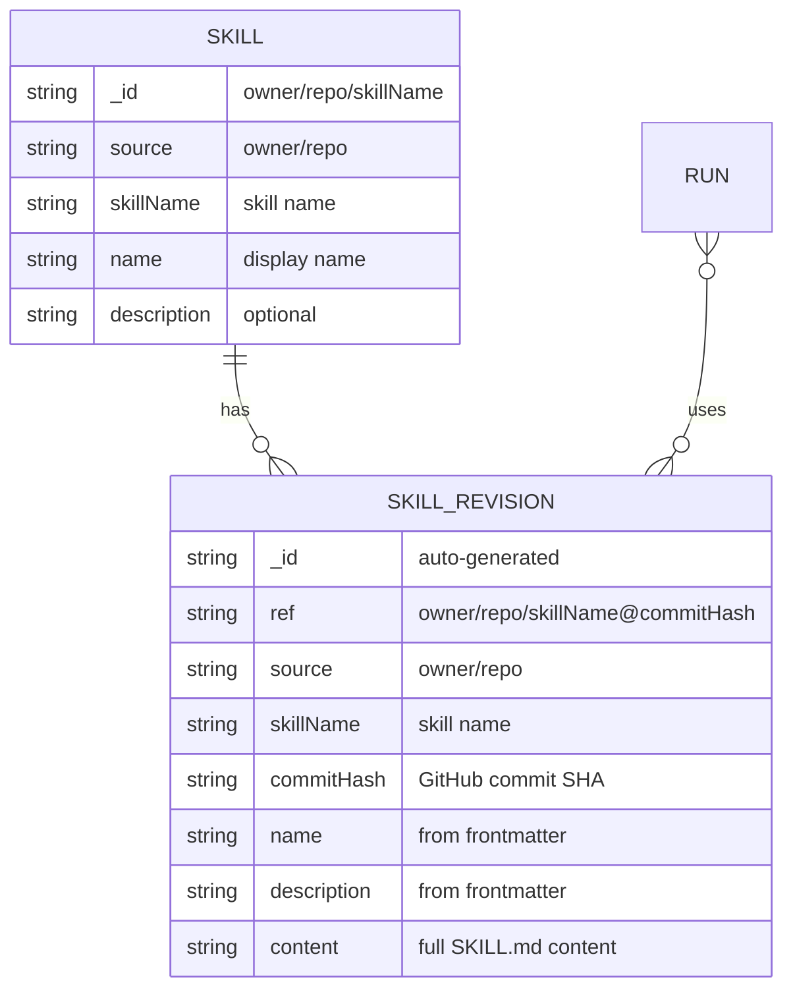
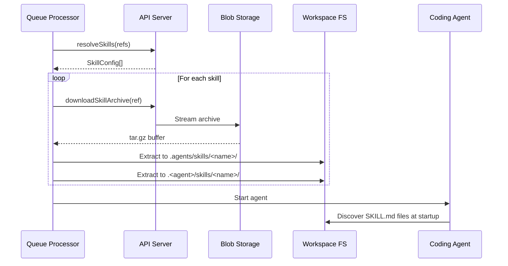

# Skills Architecture

> **Status:** Current as of February 2026.

Skills are reusable instruction packages that enhance coding agents with domain-specific knowledge. Scope integrates the [Agent Skills specification](https://agentskills.io/specification) to let benchmarks include skills alongside scenarios, personas, and MCP servers.

## Overview

```mermaid
flowchart TB
    subgraph Registration["Skill Registration"]
        GitHub["GitHub Repository<br/>(contains SKILL.md)"]
        API["API: POST /skills"]
        DB["MongoDB<br/>skills + skillRevisions"]
    end

    subgraph Resolution["Skill Resolution (Submit)"]
        CLI["CLI / Portal"]
        Resolve["API: resolve slug → ref"]
        Queue["Azure Storage Queue"]
    end

    subgraph Delivery["Skill Delivery (Worker)"]
        Worker["Queue Processor"]
        Archive["Blob Storage<br/>(skill-archives)"]
        Extract["Skill Extractor"]
        Workspace["Workspace Filesystem"]
        Agent["Coding Agent"]
    end

    GitHub -->|register| API
    API -->|store| DB
    CLI -->|submit with skills| Resolve
    Resolve -->|enqueue skillRevisions[]| Queue
    Queue -->|dequeue| Worker
    Worker -->|download archive| Archive
    Worker -->|extract| Extract
    Extract -->|write to disk| Workspace
    Agent -->|discover at startup| Workspace
```

## Data Model



- **Skill** — A registered skill, identified by `owner/repo/skillName`. Points to a GitHub repository containing a `SKILL.md` file.
- **SkillRevision** — An immutable, content-addressed snapshot of a skill at a specific commit. The `ref` format is `owner/repo/skillName@commitHash`.
- **Run.skillRevisions** — Array of skill revision refs attached to a run. These are resolved at submit time and remain immutable throughout the run lifecycle.

## Lifecycle

### 1. Registration

Skills are registered via the API by providing a GitHub source (`owner/repo`) and skill name. The API stores the skill record and immediately attempts to auto-resolve it: it fetches `SKILL.md` from GitHub at the latest commit, parses its YAML frontmatter (name, description, license, compatibility, etc.), uploads a tar.gz archive of the skill directory to Blob Storage, and creates the first `SkillRevision`. If auto-resolution fails (e.g., GitHub 404, network error), the skill record is still saved and the user can retry via `POST /api/v1/skills/:id/resolve`.

### 2. Resolution (Submit Time)

When a run is submitted with skill slugs (e.g., `owner/repo/skillName`), the API resolves each slug to the latest `skillRevision` ref (`owner/repo/skillName@commitHash`). These immutable refs are stored on the run document.

### 3. Archiving

Each skill revision has a tar.gz archive stored in Azure Blob Storage (`skill-archives` container). The archive contains the full skill directory contents. Archives are served via:

```
GET /api/v1/skill-revisions/by-ref/:ref(*)/archive
```

### 4. Delivery (Worker)

When a worker picks up a queued run, the queue processor:

1. **Resolves** skill revision refs to `SkillConfig` objects via the API
2. **Downloads** each skill's tar.gz archive via `SkillClient.downloadSkillArchive(ref)`
3. **Extracts** to the workspace filesystem using `extractSkillsToWorkspace()`

The agent then discovers skills natively from the filesystem at startup.



### Filesystem Layout

Skills are extracted to well-known directories per the Agent Skills spec:

```
/workspace/
├── .agents/skills/           # Universal (Agent Skills spec)
│   └── <skillName>/
│       └── SKILL.md
├── .claude/skills/           # Claude Code specific
│   └── <skillName>/
│       └── SKILL.md
└── .copilot/skills/          # Copilot specific
    └── <skillName>/
        └── SKILL.md
```

Agent-specific directories are populated based on the worker type. The universal `.agents/skills/` directory is always populated.

## Agent Discovery

Coding agents automatically discover skills from well-known filesystem directories at startup:

- **GitHub Copilot** scans `.copilot/skills/` and `.agents/skills/`
- **Claude Code** scans `.claude/skills/` and `.agents/skills/`

No prompt injection or discovery hints are needed — the skill extractor places files on disk and agents find them natively per the [Agent Skills specification](https://agentskills.io/specification).

## Resubmit Behavior

When runs are resubmitted:

- **Default**: `skillRevisions` from the original run are copied to the new run
- **Override**: The resubmit dialog supports three modes:
  - **Keep** — retain the original run's skills
  - **Clear** — remove all skills (`skillRevisions: null`)
  - **Choose** — select specific skills from the union of all selected runs' skill revisions

## Key Files

| File | Purpose |
|------|---------|
| `packages/shared/src/skills/skill-client.ts` | API client for skill resolution and archive download |
| `packages/shared/src/skills/skill-extractor.ts` | Download + extract skill archives to workspace |
| `packages/shared/src/skills/skill-prompt.ts` | Discovery prompt generation (`<available_skills>` XML) |
| `packages/shared/src/skills/skill-resolver.ts` | Resolve skill slugs → revision refs via GitHub |
| `packages/shared/src/queue/queue-processor.ts` | Orchestrates skill extraction before agent processing |
| `apps/api/src/index.ts` | REST endpoints for skills, revisions, archives |
| `apps/portal/src/pages/RunsList.tsx` | Skills column + resubmit override UI |
