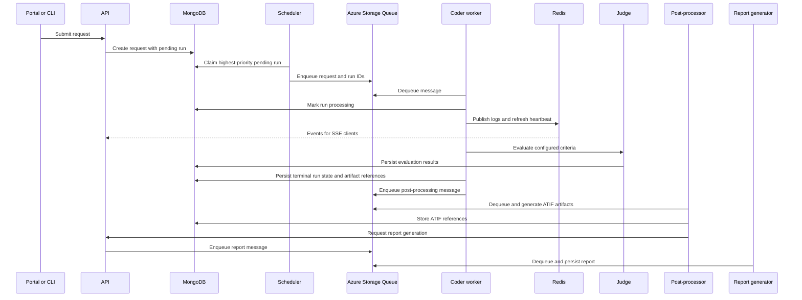

# System Architecture

Scope benchmarks coding agents against configured tasks, profiles, criteria,
skills, and codebases. This page describes the architecture represented by the
current source tree and Kubernetes manifests. It distinguishes deployed
components from local development services and from in-progress migrations.

For component-level details, see [app design](./app-design.md),
[queue scheduling](./queue-scheduler.md), [AI gateway](./ai-gateway.md),
[post-processing](./post-processing.md), and [deployment](./deployment.md).

## Runtime topology

```mermaid
flowchart TB
    classDef client fill:#e3f2fd,stroke:#1565c0,color:#000
    classDef service fill:#fff3e0,stroke:#e65100,color:#000
    classDef worker fill:#f3e5f5,stroke:#6a1b9a,color:#000
    classDef store fill:#e8f5e9,stroke:#2e7d32,color:#000
    classDef external fill:#eceff1,stroke:#37474f,color:#000

    subgraph Clients
        Portal[Portal]:::client
        CLI[CLI]:::client
    end

    subgraph Core["Core services"]
        API[API]:::service
        Scheduler[Scheduler]:::service
        Judge[Judge]:::service
        Tokens[Token Manager]:::service
        Gateway[AI Gateway]:::service
    end

    subgraph Workers["Queue consumers"]
        Copilot[ACP Copilot]:::worker
        CopilotWindows[ACP Copilot Windows]:::worker
        Claude[ACP Claude Code]:::worker
        VSCodeWeb[VS Code Web]:::worker
        VSCodeElectron[VS Code Electron]:::worker
        PostProcessor[Post-processor]:::worker
        Reports[Report generator]:::worker
    end

    subgraph Storage["State and artifacts"]
        Mongo[(Cosmos DB for MongoDB)]:::store
        Queues[Azure Storage Queues]:::store
        Redis[(Azure Managed Redis)]:::store
        Blobs[(Azure Blob Storage)]:::store
        KeyVault[(Azure Key Vault)]:::store
    end

    subgraph Providers["External providers"]
        CopilotAPI[GitHub Copilot API]:::external
        Anthropic[Anthropic API]:::external
        Models[GitHub Models or Azure AI inference]:::external
    end

    Portal -->|REST and SSE| API
    CLI -->|REST and SSE| API
    API --> Mongo
    API <-->|log relay and run heartbeats| Redis
    API --> Tokens

    Scheduler -->|claims pending requests| Mongo
    Scheduler -->|shallow dispatch| Queues
    Queues --> Copilot & CopilotWindows & Claude & VSCodeWeb & VSCodeElectron
    Queues --> PostProcessor & Reports

    Copilot & CopilotWindows & Claude & VSCodeWeb & VSCodeElectron --> Mongo
    Copilot & CopilotWindows & Claude & VSCodeWeb & VSCodeElectron --> Redis
    Copilot & CopilotWindows & Claude & VSCodeWeb & VSCodeElectron --> Blobs
    Copilot & CopilotWindows & Claude & VSCodeWeb & VSCodeElectron --> Judge
    Copilot & CopilotWindows & Claude & VSCodeWeb & VSCodeElectron --> Tokens

    Judge --> Mongo
    Judge --> Tokens
    Judge --> Models
    PostProcessor --> Mongo & Blobs
    PostProcessor -->|request report generation| API
    Reports --> Mongo
    Reports --> Tokens

    Copilot & CopilotWindows & VSCodeElectron -->|proxy sessions| Gateway
    Gateway --> Redis & Blobs
    Gateway --> Tokens
    Gateway --> CopilotAPI & Anthropic
    Claude -->|DevProxy sidecar| CopilotAPI & Anthropic
    Tokens <--> KeyVault
```



## Request lifecycle

The scheduler, not the API, dispatches coder work. This keeps Azure queues
short so request priority and pause state remain controllable in MongoDB.



Coder queues use at-least-once delivery. Workers record a Redis heartbeat for
an in-flight run. A duplicate delivery with a fresh heartbeat is deferred; a
stale delivery can mark the previous run attempt failed. The scheduler also has
an optional stuck-run reaper. See [queue scheduling](./queue-scheduler.md) for
the status model and recovery rules.

## Services and workers

| Component | Responsibility | Deployment model |
| --- | --- | --- |
| `api` | REST API, SSE log streaming, configuration and run management | Two Linux replicas |
| `scheduler` | Priority-aware dispatch from MongoDB to shallow coder queues | One Linux replica |
| `judge` | Criteria DAG evaluation using configured LLM providers | Two Linux replicas |
| `token-manager` | Token storage, validation, and round-robin allocation | One Linux replica with Azure Workload Identity |
| `gateway` | Shared Rust TLS-intercepting proxy, proxy sessions, HAR capture | One Linux replica |
| `portal` | React web application | Linux deployment |
| `coder-acp-copilot` | GitHub Copilot through ACP | KEDA scaled, Linux |
| `coder-acp-copilot-windows` | Windows ACP Copilot variant | KEDA scaled, Windows |
| `coder-acp-claude-code` | Claude Code through ACP | KEDA scaled, Linux |
| `post-processor` | HAR to ATIF conversion and future derived artifacts | KEDA scaled, Linux |
| `report-generator` | LLM-generated reports | KEDA scaled, Linux |
| Model scanners | Discover model capabilities for Copilot and Anthropic | Long-running deployments |
| Version checkers and cookie updater | Detect upstream versions and maintain VS Code Web auth state | Workspace services, configured per environment |

KEDA watches the matching Azure queue for each coder and post-run worker.
Current manifest limits range from two Claude Code replicas to ten ACP Copilot
replicas. The exact limits, polling intervals, and cooldowns are defined next
to each worker in `deploy/base/workers/`.

## Worker connectivity and capture status

The gateway migration is intentionally mixed at this point:

| Worker | AI traffic capture | MCP sidecar |
| --- | --- | --- |
| ACP Copilot | Shared `gateway` service | MCPJungle |
| ACP Copilot Windows | Shared `gateway` service | No Linux sidecar |
| VS Code Electron | Shared `gateway` service | MCPJungle |
| ACP Claude Code | Per-pod DevProxy sidecar | MCPJungle |
| VS Code Web | No proxy configured in its base manifest | No sidecar configured in its base manifest |

The gateway keeps proxy session state in Redis and writes captured HAR data to
Blob Storage. Claude Code remains on DevProxy, with an init container that sets
permissions for its HAR volume. This is the only deployed coder manifest that
currently defines a DevProxy sidecar.

MCPJungle provides a localhost streamable HTTP endpoint for workers that need
both stdio MCP servers, which share the worker workspace, and remote HTTP MCP
servers. The Linux ACP Copilot, ACP Claude Code, and VS Code Electron manifests
mount or configure it. See [MCP gateway](./mcp-gateway.md).

## Data and configuration

| Store | Contents and use |
| --- | --- |
| Cosmos DB for MongoDB | Requests and runs, criteria, profiles, agents, models, skills, codebases, reports, and other configuration records |
| Azure Storage Queues | Coder dispatch, post-processing, and report-generation messages |
| Azure Blob Storage | HAR captures, workspace snapshots, ATIF trajectories, and other run artifacts |
| Azure Managed Redis | SSE fan-out, gateway sessions, and ephemeral run heartbeats |
| Azure Key Vault | Token material and secrets managed by the token manager |

MongoDB is the source of truth for requests and configuration. Blob URLs and
derived-artifact status are stored back on the corresponding run record. The
full collection list and index rationale live in [database schema and
indexes](./db.md).

## Deployment

The repository contains both application code and Kustomize manifests:

```text
apps/                  API, UI, scheduler, judge, gateway, token manager, and workers
packages/              Shared libraries, database migrations, auth, evaluations, and tooling
deploy/base/           Shared Kubernetes resources and workload definitions
deploy/overlays/       Environment-specific Kustomize overlays
deploy/image-automation/ Flux image policies and image updates
config/                Portable YAML examples for benchmark configuration
```

Production-style deployments use AKS with separate Linux system, Linux worker,
and Windows worker pools. FluxCD applies the Kustomize configuration. External
Secrets Operator supplies Kubernetes secrets from Key Vault, Azure Service
Operator declares queues, blob containers, and MongoDB collections, and KEDA
scales queue consumers. The portal exposure strategy varies by environment, so
the base manifests alone are not a statement that all environments use the
same ingress path.

## Local development

`docker-compose.yml` replaces managed dependencies with MongoDB, Redis,
Azurite, and Lowkey Vault. It also provides local API, scheduler, judge, token
manager, gateway, portal, worker, and support-service profiles. The local
composition includes compatibility services that are not necessarily present
as Kubernetes workloads, so the deployment manifests remain the source of
truth for the cluster topology.

## Workspace structure

The repository is a pnpm workspace. Shared runtime dependencies are concentrated
in `packages/shared`, which supplies domain types, Mongoose models, queue,
blob, Redis, configuration, and criteria-provider clients. Other packages
provide database migrations, GitHub authentication, model scanning, version
checking, the VS Code driver extension, and the LLM evaluation harness.

The portal, API, CLI, and workers are separate applications. The CLI is not a
cluster workload: it is the automation and command-line entry point that calls
the API. The portal is the browser entry point. Both receive live run events
from the API over SSE.
