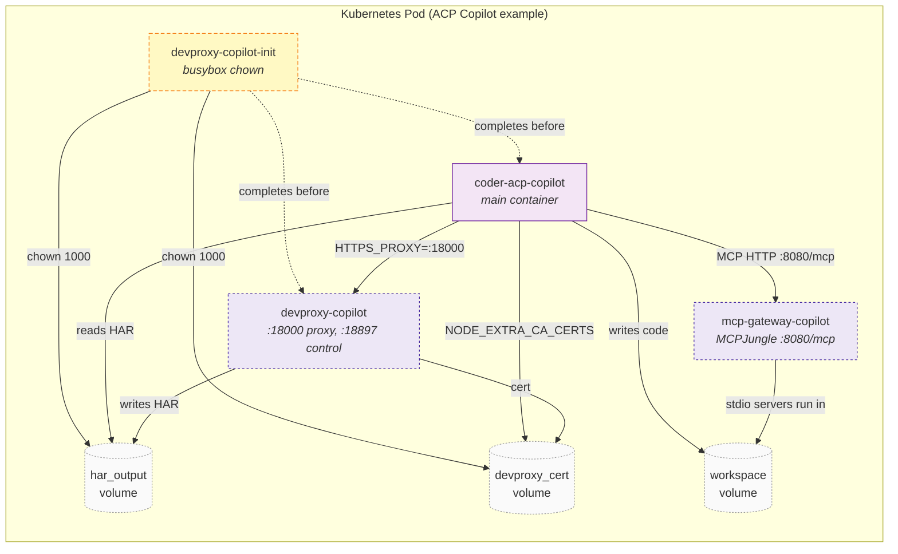
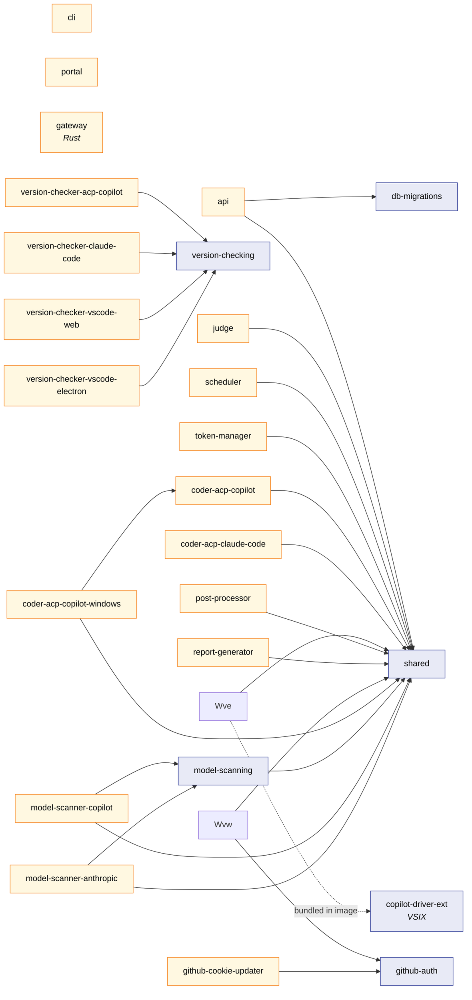
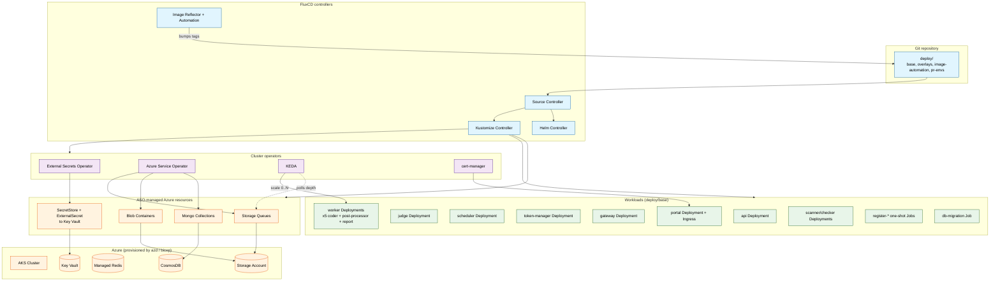
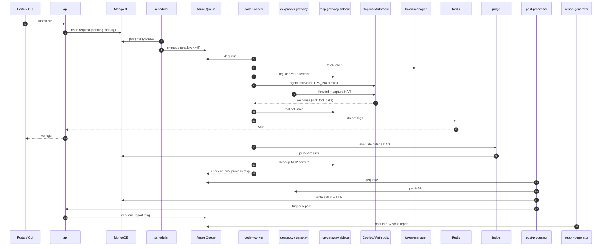
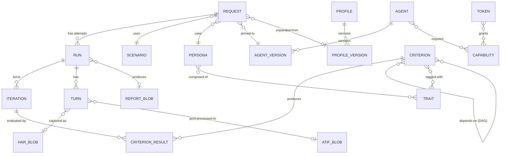
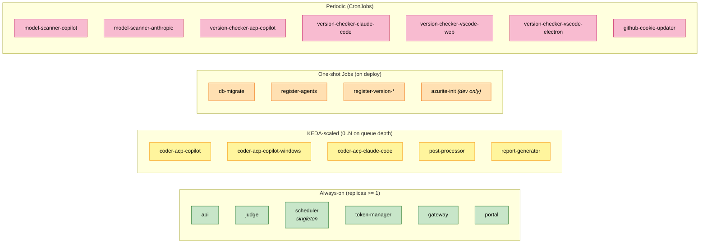

# System Architecture

How Scope is put together end to end — every app, worker, sidecar,
init container, queue, blob, operator, and AI provider, with visual
dependency diagrams.

This page describes the full Scope architecture in seven diagrams,
grounded in this repository: `apps/*`, `packages/*`,
`docker-compose.yml`, and the `deploy/` GitOps manifests. If anything
below drifts from the source, the source wins — open an issue or PR.

The audience is engineers building, operating, or extending Scope.
For deeper, per-subsystem detail see the sibling docs in this
directory (e.g. [queue-scheduler.md](./queue-scheduler.md),
[ai-gateway.md](./ai-gateway.md), [mcp-gateway.md](./mcp-gateway.md),
[vscode-electron-worker.md](./vscode-electron-worker.md)).

## Diagrams

- [Full runtime topology](#full-runtime-topology)
- [Per-pod sidecar layout](#per-pod-sidecar-layout)
- [Workspace dependency graph (pnpm build-time)](#workspace-dependency-graph-pnpm-build-time)
- [Kubernetes / GitOps platform](#kubernetes--gitops-platform)
- [Run lifecycle (sequence)](#run-lifecycle-request-flow)
- [Data model (ER)](#data-model-er)
- [Component matrix (deployment & scaling)](#component-matrix-deployment--scaling)

A flat inventory of every component lives at the bottom under
[Component inventory](#component-inventory).

## Full runtime topology

Every container, sidecar, queue, blob container, AI provider and
emulator, with the runtime edges between them.

```mermaid
flowchart TB
    classDef client fill:#e3f2fd,stroke:#1565c0,color:#000
    classDef core fill:#fff3e0,stroke:#e65100,color:#000
    classDef worker fill:#f3e5f5,stroke:#6a1b9a,color:#000
    classDef sidecar fill:#ede7f6,stroke:#4527a0,color:#000,stroke-dasharray:3 3
    classDef oneshot fill:#fff9c4,stroke:#f57f17,color:#000,stroke-dasharray:5 3
    classDef cron fill:#fce4ec,stroke:#ad1457,color:#000
    classDef infra fill:#e8f5e9,stroke:#2e7d32,color:#000
    classDef emu fill:#e0f2f1,stroke:#00695c,color:#000
    classDef ext fill:#eceff1,stroke:#37474f,color:#000
    classDef vol fill:#fafafa,stroke:#9e9e9e,color:#000,stroke-dasharray:2 2

    subgraph Clients["Clients"]
        Portal[portal]:::client
        CLI[cli]:::client
    end

    subgraph Core["Core services"]
        API[api]:::core
        Judge[judge]:::core
        Sched[scheduler]:::core
        TM[token-manager]:::core
        GW[gateway<br/><i>Rust TLS MITM</i>]:::core
    end

    subgraph OneShots["One-shot / Jobs"]
        DBM[db-migrate]:::oneshot
        AzInit[azurite-init]:::oneshot
        RegAg[register-agents]:::oneshot
        RegVer[register-version-*]:::oneshot
    end

    subgraph CopPod["ACP Copilot pod"]
        Cop[coder-acp-copilot]:::worker
        DPcop[devproxy-copilot]:::sidecar
        DPcopInit[devproxy-copilot-init]:::sidecar
        MCPcop[mcp-gateway-copilot<br/><i>MCPJungle</i>]:::sidecar
    end

    subgraph CCPod["ACP Claude Code pod"]
        CC[coder-acp-claude-code]:::worker
        DPcc[devproxy-claude-code]:::sidecar
        DPccInit[devproxy-claude-code-init]:::sidecar
        MCPcc[mcp-gateway-claude-code]:::sidecar
    end

    subgraph VEPod["VS Code Electron pod"]
        CDE[copilot-driver-ext<br/><i>VSIX</i>]:::sidecar
        MCPve[mcp-gateway-vscode-electron]:::sidecar
    end

    subgraph VWPod["VS Code Web pod"]
    end

    subgraph CopWin["ACP Copilot Windows pod"]
        CopW[coder-acp-copilot-windows]:::worker
    end

    subgraph Post["Post-run workers"]
        PP[post-processor]:::worker
        RG[report-generator]:::worker
    end

    subgraph Cron["Background services"]
        MSCc[model-scanner-copilot]:::cron
        MSCa[model-scanner-anthropic]:::cron
        VCc[version-checker-acp-copilot]:::cron
        VCcc[version-checker-claude-code]:::cron
        VCvw[version-checker-vscode-web]:::cron
        VCve[version-checker-vscode-electron]:::cron
        KU[github-cookie-updater]:::cron
    end

    subgraph Infra["Infrastructure"]
        Mongo[(MongoDB<br/>CosmosDB API)]:::infra
        Redis[(Redis<br/>pub/sub + sessions)]:::infra
        Q[Azure Storage Queues<br/><i>queue-coder-*, report-queue,<br/>post-processor-queue</i>]:::infra
        Blob[(Blob Storage<br/>har, snapshots, reports)]:::infra
        KV[(Key Vault)]:::infra
    end

    subgraph Emu["Local emulators"]
        Azurite[Azurite]:::emu
        Lowkey[Lowkey Vault]:::emu
    end

    subgraph Vols["Volumes / PVCs"]
        VHar[/har volumes/]:::vol
        VWs[/workspace volumes/]:::vol
        VCert[/cert volumes/]:::vol
    end

    subgraph AI["AI providers"]
        GHC[GitHub Copilot API]:::ext
        AN[Anthropic API]:::ext
        GHM[GitHub Models]:::ext
        Foundry[Azure AI Foundry]:::ext
    end

    Portal & CLI -->|REST/SSE| API

    API --> Mongo
    API <-->|SSE relay| Redis
    API -->|invoke| Judge
    API -->|tokens| TM
    Judge -->|tokens| TM
    Judge --> Mongo
    Judge --> GHM & Foundry

    Sched -->|priority poll| Mongo
    Sched -->|enqueue shallow| Q

    DBM --> Mongo
    AzInit --> Azurite
    RegAg --> API
    RegVer --> API
    API -.->|reads after| DBM

    Q --> Cop & CC & VE & VW & CopW
    Q --> PP & RG

    Cop & CC & VE & VW & CopW --> Mongo
    Cop & CC & VE & VW & CopW --> Blob
    Cop & CC & VE & VW & CopW -->|logs| Redis
    Cop & CC & VE & VW & CopW -->|tokens| TM
    Cop & CC & VE & VW & CopW -->|invoke| Judge
    Cop & CC & VE & VW & CopW -.->|enqueue| Q

    Cop -->|HTTPS_PROXY| DPcop
    CC  -->|HTTPS_PROXY| DPcc
    Cop -->|MCP /mcp| MCPcop
    CC  -->|MCP /mcp| MCPcc
    VE  -->|MCP /mcp| MCPve
    VE  -->|HTTPS_PROXY override| GW
    DPcopInit -->|chown| VHar & VCert
    DPccInit  -->|chown| VHar & VCert
    DPcop & DPcc -->|HAR write| VHar
    Cop & CC -->|HAR read| VHar
    MCPcop & MCPcc & MCPve <-->|stdio| VWs
    VE <-.->|installs| CDE

    DPcop & DPcc --> GHC & AN
    GW --> GHC & AN
    GW -->|HAR upload| Blob
    GW <-->|session state| Redis
    GW -->|tokens| TM
    GW --> VCert

    PP --> Mongo & Blob
    PP -->|trigger report| API
    RG --> Mongo & Blob
    RG --> GHM

    MSCc & MSCa --> Mongo
    MSCc --> GHC
    MSCa --> AN
    VCc & VCcc & VCvw & VCve --> API
    KU --> KV

    TM <--> KV
    KV -.dev only.-> Lowkey
    Q -.dev only.-> Azurite
    Blob -.dev only.-> Azurite
```

## Per-pod sidecar layout

Coder worker pods are not single containers. Each ACP worker pod
ships with a DevProxy sidecar (HAR capture), a busybox init container
(volume permissions), and an MCPJungle sidecar (MCP server aggregator).
The VS Code Electron pod uses the shared `gateway` service instead of
a per-pod DevProxy.

## Workspace dependency graph (pnpm build-time)

The build-time graph between pnpm workspace packages. Edges are
`dependencies` / `devDependencies` declared in each `package.json`.
This is independent of runtime traffic.

## Kubernetes / GitOps platform

The platform layer. Application images are deployed by FluxCD,
secrets are pulled from Key Vault by External Secrets Operator,
Azure resources (queues, blob containers, Mongo collections) are
declared via Azure Service Operator, workers are autoscaled by KEDA
based on queue depth, and the portal Ingress is TLS-terminated by
cert-manager.

## Run lifecycle (request flow)

End-to-end sequence from a `POST /api/v1/requests` to a generated
report. The scheduler decouples MongoDB-ordered dispatch from the
shallow Azure Storage Queue that wakes workers.

## Data model (ER)

The persistent entities and how they relate. `Request` is the central
record; a request has one or more `Run` attempts; each run has
iterations and evaluation results against criteria (which form a
DAG). Profiles and agents are independently versioned.

## Component matrix (deployment & scaling)

Every component grouped by how it is operated: always-on,
KEDA-scaled from a queue, one-shot job on deploy, or periodic
CronJob.

## Component inventory

### Clients (entry points)

- **portal** — React + Tailwind + Radix; React Query and XYFlow for
  the criteria DAG editor.
- **cli** — Commander + Ink; bundled as a standalone binary for CI/CD.

### Core application services (long-running)

- **api** — Express REST + SSE, OpenAPI 3.1 (Zod), criteria CRUD,
  run orchestration.
- **judge** — LLM-driven evaluation; `bundled` or `independent`
  strategy across the criteria DAG.
- **scheduler** — MongoDB-priority poller; keeps Azure Storage Queues
  shallow so scheduling decisions take effect within seconds.
- **token-manager** — Capability-based token storage, validation,
  round-robin distribution; backed by Azure Key Vault.
- **gateway** — Rust TLS-MITM proxy; HAR-capture and CopilotToken
  plugins; per-session CA leaf certificates.

### Coder workers (queue consumers, KEDA-scaled)

- **coder-acp-copilot** — GitHub Copilot via the ACP SDK.
- **coder-acp-copilot-windows** — Windows variant.
- **coder-acp-claude-code** — Anthropic Claude Code via the ACP SDK.
  Playwright + XState. Deprecated for user-facing surfaces.
  `copilot-driver-ext` VSIX bridging HTTP to `vscode.commands`.

### Post-run workers

- **post-processor** — Converts captured HAR to ATIF v1.7 trajectories.
- **report-generator** — Generates LLM-powered run reports via the
  Copilot SDK.

### Per-worker sidecars

- **devproxy-{worker}** — Microsoft DevProxy for HAR capture (being
  superseded by `gateway`).
- **devproxy-{worker}-init** — busybox; fixes UID 1000 volume
  ownership for the main container and DevProxy.
- **mcp-gateway-{worker}** — MCPJungle aggregator exposing stdio and
  remote-HTTP MCP servers behind `:8080/mcp`.

### One-shot / Job containers

- **db-migrate** — Runs `db-migrations` `migrate:up` before the API
  starts.
- **azurite-init** — Creates the `har` blob container in Azurite (dev
  only).
- **register-agents** — POSTs each worker's `agent.yaml` to the API
  on startup.
- **register-version-{worker}** — Registers the deployed worker
  version with the API.

### Background / cron services

- **model-scanners/copilot**, **model-scanners/anthropic** — feature
  detection for Copilot and Anthropic models.
- **version-checkers/acp-copilot**, **claude-code**, **vscode-web**,
  **vscode-electron** — poll upstreams for new agent releases.
- **key-updaters/github-cookie-updater** — refresh GitHub OAuth
  cookies used by the VS Code Web worker.

### Shared TypeScript packages (build-time only)

- **shared** — types, Mongoose models, queue/blob/redis clients, Zod
  schemas.
- **db-migrations** — `mongo-migrate-ts` framework.
- **github-auth** — OAuth + device-code utilities.
- **model-scanning** — shared scanner logic.
- **version-checking** — version comparison.
- **copilot-driver-ext** — VS Code extension VSIX bundled into the
  Electron worker image.

### Infrastructure (production and emulator)

| Production (Azure / cluster) | Local emulator |
| --- | --- |
| CosmosDB (MongoDB API) | MongoDB 7 |
| Azure Managed Redis | Redis 7.4 |
| Azure Storage Queues | Azurite (queue) |
| Azure Blob Storage | Azurite (blob) |
| Azure Key Vault | Lowkey Vault |

### Storage volumes / PVCs

- `gateway_cert` — Rust gateway CA root for clients.
- `{worker}_har_output` — HAR files written by DevProxy, read by the
  worker and post-processor.
- `{worker}_devproxy_cert` — DevProxy CA root.
- `{worker}_workspace` — shared workspace between the worker and the
  MCPJungle sidecar.
- `mongodb_data`, `azurite_data`, `lowkey_vault_data` — emulator
  persistence (dev only).

### Kubernetes / GitOps platform (AKS only)

- **FluxCD** — Source, Kustomize, Helm, and Image controllers.
- **ImageUpdateAutomation + ImagePolicy** — auto-bump image tags.
- **External Secrets Operator** — SecretStores + ExternalSecrets
  pulling from Key Vault.
- **Azure Service Operator** — declarative Azure Queues, Blob
  containers, and Mongo collections.
- **KEDA** — `ScaledObject`s watching queue depth, scaling workers
  `0..N`.
- **cert-manager** — TLS certs for the portal Ingress.

### External AI providers

- GitHub Copilot API (`api.githubcopilot.com`).
- Anthropic API (`api.anthropic.com`).
- GitHub Models (`models.github.ai`) — fallback for the API and judge.
- Azure AI Foundry — optional judge LLM provider.
