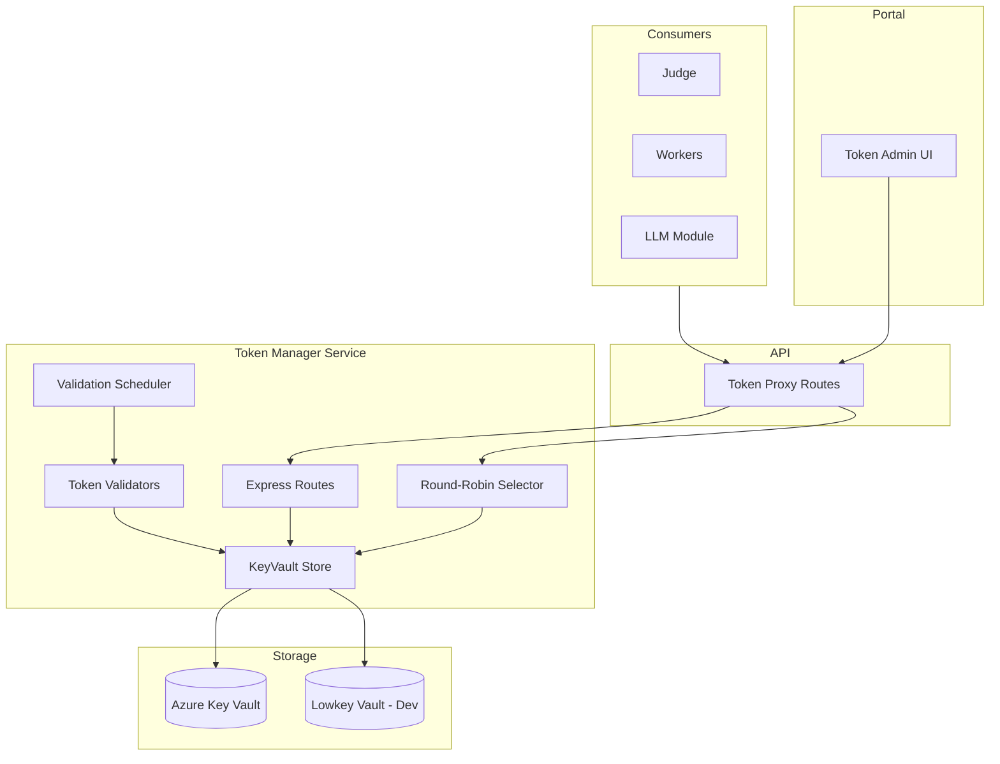
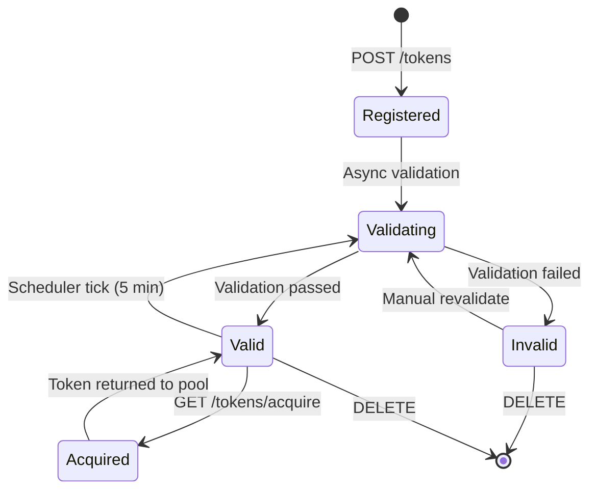

# Token Manager

The Token Manager is a centralized service for managing API tokens used by workers and services. It provides secure storage, automatic validation, and round-robin distribution of tokens.

## Architecture



## Capability-Based Model

The Token Manager uses a **capability-based model** where tokens are associated with the features they enable, rather than being tied to specific worker types. This allows flexible token reuse across services.

### Token Types

| Type | Prefix | Description |
|------|--------|-------------|
| `github-pat-classic` | `ghp_` | Classic GitHub Personal Access Token |
| `github-pat-fine-grained` | `github_pat_` | Fine-grained GitHub PAT with scoped permissions |
| `github-oauth` | `gho_` / `ghu_` | OAuth token from `gh auth login` |
| `github-oauth-cookie-state` | `{` (JSON) | Browser-extracted session cookies |
| `anthropic-api-key` | `sk-ant-` | Anthropic API key for Claude |

### Capabilities

| Capability | Description |
|------------|-------------|
| `github-models` | Access to GitHub Models API (GPT-4o, etc.) |
| `copilot-sdk` | GitHub Copilot SDK integration |
| `copilot-cli` | GitHub Copilot CLI authentication |
| `claude-code-cli` | Anthropic Claude Code CLI |

### Token Type + Permissions → Capabilities Matrix

| Token Type | Permissions / Scope | How to Obtain | Validity | GitHub Models | Copilot SDK | Copilot CLI | Claude Code CLI | VS Code Copilot |
|------------|---------------------|---------------|----------|:-------------:|:-----------:|:-----------:|:---------------:|:---------------:|
| **GitHub PAT (classic)** `ghp_` | `copilot` | Settings → Tokens (classic) | No expiry or custom | ❌ | ✅¹ | ✅¹ | ❌ | ✅¹ |
| **GitHub PAT (fine-grained)** `github_pat_` | `models:read` | Settings → Fine-grained tokens | Max 1 year | ✅ | ❌ | ❌ | ❌ | ❌ |
| **GitHub OAuth** `gho_` | (all via OAuth flow) | `gh auth login` → `gh auth token` | Until revoked | ✅ | ✅¹ | ✅¹ | ❌ | ✅¹ |
| **GitHub OAuth cookie state** | (browser session) | Browser DevTools → cookies | Session-bound | ❌ | ❌ | ❌ | ❌ | ✅² |
| **Anthropic API Key** `sk-ant-` | (full access) | console.anthropic.com | Until revoked | ❌ | ❌ | ❌ | ✅ | ❌ |

¹ Requires active GitHub Copilot license.  
² Injected into VS Code Web browser context.

## Token Lifecycle



### States

| Status | Description |
|--------|-------------|
| `unknown` | Just registered, validation pending |
| `valid` | Token validated successfully, available for acquisition |
| `invalid` | Validation failed (wrong permissions, expired, etc.) |
| `expired` | Token has expired (detected during validation) |
| `error` | Validation encountered an error (network, rate limit, etc.) |

## API Endpoints

### Token Management

| Method | Endpoint | Description |
|--------|----------|-------------|
| `GET` | `/api/v1/tokens` | List all tokens (optionally filter by capability) |
| `POST` | `/api/v1/tokens` | Register a new token |
| `POST` | `/api/v1/tokens/preview` | Preview capabilities without registering |
| `GET` | `/api/v1/tokens/:id` | Get token details (excludes secret) |
| `DELETE` | `/api/v1/tokens/:id` | Delete a token |
| `POST` | `/api/v1/tokens/:id/validate` | Trigger manual validation |

### Token Acquisition

| Method | Endpoint | Description |
|--------|----------|-------------|
| `GET` | `/api/v1/tokens/acquire?capability=X` | Acquire a token for given capability |

The acquire endpoint uses round-robin selection among valid, enabled tokens that provide the requested capability.

## Usage Tracking

Each token tracks:

| Field | Description |
|-------|-------------|
| `acquireCount` | Number of times token has been acquired |
| `lastAcquiredAt` | Timestamp of most recent acquisition |

This helps identify heavily-used tokens and detect potential issues with token distribution.

## Configuration

### Environment Variables

| Variable | Default | Description |
|----------|---------|-------------|
| `TOKEN_MANAGER_URL` | `http://token-manager:3003` | Token Manager service URL |
| `KEYVAULT_URL` | - | Azure Key Vault URL for token storage |
| `VALIDATION_INTERVAL_MS` | `300000` (5min) | Interval between validation runs |

### Local Development

For local development, the Token Manager uses [Lowkey Vault](https://github.com/nagyesta/lowkey-vault), an Azure Key Vault emulator. It's configured in `docker-compose.yml`:

```yaml
lowkey-vault:
  image: nagyesta/lowkey-vault:2.8.59
  ports:
    - "8443:8443"
  environment:
    LOWKEY_VAULT_NAMES: "scope-mt-vault"
```

## Integration Examples

### Acquiring a Token (Worker)

```typescript
import { TokenManagerClient } from "shared";

const client = new TokenManagerClient(process.env.TOKEN_MANAGER_URL);
const result = await client.acquireToken("copilot-sdk");

if (result) {
  console.log(`Using token ${result.id} for Copilot SDK`);
  // Use result.secret for API calls
}
```

### LLM Module Integration

The API's LLM module acquires tokens with this priority:

1. `GITHUB_MODELS_API_KEY` environment variable (explicit override)
2. Token Manager → acquire `github-models` capability
3. `GITHUB_TOKEN` fallback (for backward compatibility)

```typescript
import { acquireGitHubModelsToken } from "./llm-token";

const token = await acquireGitHubModelsToken();
if (!token) {
  throw new Error("No GitHub Models token available");
}
```
