# Plan: Integrate Turborepo & Split `packages/shared`

## Problem

Every change to `packages/shared` triggers a full rebuild of **all Docker images** because:

1. No build orchestration — `pnpm -r build` rebuilds everything sequentially
2. `shared` is a monolithic package (\~20 submodules, 304 exported symbols) consumed by 12 apps
3. Each Dockerfile runs `pnpm --filter shared build` independently — no caching between images
4. No TypeScript project references — no incremental compilation

## Dependency Analysis

Analysis method: custom symbol-level tracer resolving all 304 exports through barrel re-exports in `packages/shared/src/index.ts`, mapped to each consumer app.

### Full Monorepo App/Package Inventory

**12 apps depend on `shared`:**

**8 apps do NOT depend on `shared`** (already decoupled):
cli, gateway (Rust), portal, github-cookie-updater, version-checker-acp, version-checker-claude, version-checker-vscode-web, version-checker-vscode-electron

**Existing packages:**

- `packages/model-scanning` → depends on `shared`
- `packages/github-auth` → independent (used by key-updaters)
- `packages/version-checking` → independent (used by version-checkers)
- `packages/db-migrations` → independent
- `packages/copilot-driver-ext` → independent

### Submodule → Consumers (by reach)

| Submodule | # Consumers | Consumers |
| --- | --- | --- |
| **token-manager** | 10 | api, judge, token-manager, all workers, both scanners |
| **types** | 9 | api, judge, scheduler, token-manager, all workers |
| **queue** | 6 | api, all workers (not judge/scanners) |
| **mcp** | 4 | api, coder-acp-copilot, coder-acp-claude-code, coder-vscode-electron |
| **devproxy** | 3 | coder-acp-copilot, coder-acp-claude-code, coder-vscode-electron |
| **skills** | 2 | api, coder-vscode-electron |
| **storage** | 2 | api, judge |
| **report-templates** | 2 | api, report-generator |
| **schemas** | 1 | api only |
| **extensions** | 1 | api only |
| **task-prompts** | 1 | api only |
| **cursor** | 1 | api only |
| **graph** | 1 | judge only |
| **logging** | 1 | judge only |
| **criteria** | 1 | judge only (via criteria-provider-factory subpath) |
| **chat-export** | 1 | coder-vscode-electron only |
| **resolve-agent-version** | 1 | api only |
| **har** | 0 | unused in apps |
| **prompt-features** | 0 | unused in app imports |

### Co-occurrence (submodules always imported together)

```javascript
token-manager + types:  8 apps (near-universal pair)
queue + token-manager:  6 apps
queue + types:          6 apps
mcp + queue:            4 apps
mcp + token-manager:    4 apps
queue + utils:          4 apps
devproxy + mcp:         3 apps
devproxy + queue:       3 apps
```

### Per-App Import Footprint

| App | # Submodules | Submodules Used |
| --- | --- | --- |
| **api** | 12 | cursor, extensions, mcp, queue, report-templates, resolve-agent-version, schemas, skills, storage, task-prompts, token-manager, types |
| **coder-vscode-electron** | 9 | chat-export, devproxy, mcp, queue, skills, token-manager, types, utils, workers |
| **coder-acp-copilot** | 6 | devproxy, mcp, queue, token-manager, types, utils |
| **coder-acp-copilot-windows** | 6 | devproxy, mcp, queue, token-manager, types, utils (same as copilot) |
| **coder-acp-claude-code** | 6 | devproxy, mcp, queue, token-manager, types, utils |
| **judge** | 6 | criteria-provider-factory, graph, logging, storage, token-manager, types |
| **report-generator** | 4 | queue, report-templates, token-manager, types |
| **token-manager** | 2 | token-manager, types |
| **scheduler** | 1 | types |
| **model-scanner-copilot** | 1 | token-manager |
| **model-scanner-anthropic** | 1 | token-manager |

---

## Solution Overview

**Phase 1: Integrate Turborepo** — add build caching and task graph
**Phase 2: Split `packages/shared`** — data-driven decomposition
**Phase 3: Optimize Docker builds** — leverage Turbo's pruning

---

## Phase 1: Integrate Turborepo

### 1.1 Install Turborepo

```bash
pnpm add -Dw turbo
```

Add `.turbo/` to `.gitignore`.

### 1.2 Create `turbo.json`

```jsonc
{
  "$schema": "https://turbo.build/schema.json",
  "tasks": {
    "build": {
      "dependsOn": ["^build"],
      "inputs": ["src/**", "tsconfig.json", "package.json"],
      "outputs": ["dist/**"]
    },
    "dev": {
      "cache": false,
      "persistent": true
    },
    "lint": {
      "dependsOn": ["^build"]
    },
    "test": {
      "dependsOn": ["build"]
    }
  }
}
```

### 1.3 Update root `package.json` scripts

```json
{
  "build": "turbo run build",
  "lint": "turbo run lint",
  "test": "turbo run test",
  "dev:api": "turbo run dev --filter=api",
  "dev:portal": "turbo run dev --filter=portal"
}
```

### 1.4 Enable Remote Caching (optional, for CI)

Configure Vercel Remote Cache or self-hosted cache for CI builds to share cache across runs.

### 1.5 ✅ Run all tests

```bash
pnpm build && pnpm test
```

Verify the Turborepo integration doesn't break any existing behavior before proceeding to Phase 2.

---

## Phase 2: Split `packages/shared` — Data-Driven Decomposition

### Proposed Split (6 new packages)

Based on co-occurrence analysis and consumer groups:

| New Package | Folder | Submodules (from `shared/src/`) | Rationale |
| --- | --- | --- | --- |
| **`@scope/types`** | `packages/types/` | `types/`, `schemas/`, `cursor.ts`, `agent-version.ts`, `resolve-agent-version.ts` | Universal (9+ consumers). Leaf package, changes rarely. |
| **`@scope/secrets`** | `packages/secrets/` | `token-manager/` | Universal (10 consumers) but changes independently. Small surface (23 symbols). |
| **`@scope/worker-infra`** | `packages/worker-infra/` | `queue/`, `workers/`, `utils/`, `logging/` | Co-occurrence: queue+utils in 4 apps. The "worker runtime" layer. |
| **`@scope/agent-protocol`** | `packages/agent-protocol/` | `mcp/`, `devproxy/`, `skills/`, `chat-export/` | Agent-interaction layer. mcp+devproxy co-occur in 3 apps. |
| **`@scope/criteria`** | `packages/criteria/` | `criteria/`, `graph/` | Judge-specific. Only 1 consumer. |
| **`@scope/platform`** | `packages/platform/` | `extensions/`, `task-prompts/`, `report-templates/`, `storage/`, `prompt-features/`, `har/` | API/platform domain. Low-consumer modules grouped. |

### Complete Dependency Graph

```mermaid
graph TD
    subgraph "New Packages (from shared split)"
        types["@scope/types<br/>(packages/types/)"]
        secrets["@scope/secrets<br/>(packages/secrets/)"]
        worker-infra["@scope/worker-infra<br/>(packages/worker-infra/)"]
        agent-protocol["@scope/agent-protocol<br/>(packages/agent-protocol/)"]
        criteria["@scope/criteria<br/>(packages/criteria/)"]
        platform["@scope/platform<br/>(packages/platform/)"]
    end

    subgraph "Existing Packages (unchanged)"
        github-auth["github-auth<br/>(packages/github-auth/)"]
        version-checking["version-checking<br/>(packages/version-checking/)"]
        model-scanning["model-scanning<br/>(packages/model-scanning/)"]
        db-migrations["db-migrations<br/>(packages/db-migrations/)"]
        copilot-driver-ext["copilot-driver-ext<br/>(packages/copilot-driver-ext/)"]
    end

    %% Inter-package deps (new)
    secrets --> types
    worker-infra --> types
    worker-infra --> secrets
    agent-protocol --> types
    agent-protocol --> secrets
    criteria --> types
    platform --> types
    platform --> secrets

    %% Existing package deps
    model-scanning --> secrets

    subgraph "Apps depending on shared (12)"
        api["api"]
        judge["judge"]
        scheduler["scheduler"]
        token-mgr["token-manager"]
        copilot["coder-acp-copilot"]
        copilot-win["coder-acp-copilot-windows"]
        claude["coder-acp-claude-code"]
        vscode-electron["coder-vscode-electron"]
        report-gen["report-generator"]
        scanner-c["model-scanner-copilot"]
        scanner-a["model-scanner-anthropic"]
    end

    subgraph "Apps already decoupled (8)"
        cli["cli"]
        gateway["gateway (Rust)"]
        portal["portal"]
        key-updater["github-cookie-updater"]
        vc-acp["version-checker-acp"]
        vc-claude["version-checker-claude"]
        vc-vsweb["version-checker-vscode-web"]
        vc-vselec["version-checker-vscode-electron"]
    end

    %% Apps -> new packages
    api --> types
    api --> secrets
    api --> worker-infra
    api --> agent-protocol
    api --> platform

    judge --> types
    judge --> secrets
    judge --> criteria
    judge --> platform

    scheduler --> types

    token-mgr --> types
    token-mgr --> secrets

    copilot --> types
    copilot --> secrets
    copilot --> worker-infra
    copilot --> agent-protocol

    copilot-win --> types
    copilot-win --> secrets
    copilot-win --> worker-infra
    copilot-win --> agent-protocol

    claude --> types
    claude --> secrets
    claude --> worker-infra
    claude --> agent-protocol

    vscode-web --> types
    vscode-web --> secrets
    vscode-web --> worker-infra

    vscode-electron --> types
    vscode-electron --> secrets
    vscode-electron --> worker-infra
    vscode-electron --> agent-protocol

    report-gen --> types
    report-gen --> secrets
    report-gen --> worker-infra
    report-gen --> platform

    scanner-c --> secrets
    scanner-c --> model-scanning
    scanner-a --> secrets
    scanner-a --> model-scanning

    %% Decoupled apps -> existing packages
    key-updater --> github-auth
    vc-acp --> version-checking
    vc-claude --> version-checking
    vc-vsweb --> version-checking
    vc-vselec --> version-checking
```



### Blast Radius Analysis (after split)

| Package Changed | # Images Rebuilt | Which Images |
| --- | --- | --- |
| `@scope/criteria` | **1** | judge |
| `@scope/platform` | **3** | api, judge, report-gen |
| `@scope/agent-protocol` | **5** | api, copilot, copilot-win, claude, vscode-electron |
| `@scope/worker-infra` | **8** | api, copilot, copilot-win, claude, vscode-web, vscode-electron, report-gen |
| `@scope/secrets` | **12** | all shared consumers (via model-scanning → scanners too) |
| `@scope/types` | **12** | all shared consumers |
| `model-scanning` | **2** | scanner-copilot, scanner-anthropic |
| `github-auth` | **1** | github-cookie-updater |
| `version-checking` | **4** | all version-checkers |

**vs. today**: ANY change to `shared` rebuilds ALL 12+ images.

### Folder Layout (post-split)

```javascript
packages/
├── types/                          # @scope/types
│   ├── package.json
│   ├── tsconfig.json
│   └── src/
│       ├── types/                  # from shared/src/types/
│       ├── schemas/                # from shared/src/schemas/
│       ├── cursor.ts
│       ├── agent-version.ts
│       ├── resolve-agent-version.ts
│       └── index.ts
│
├── secrets/                        # @scope/secrets
│   ├── package.json
│   ├── tsconfig.json
│   └── src/
│       ├── token-manager/          # from shared/src/token-manager/
│       └── index.ts
│
├── worker-infra/                   # @scope/worker-infra
│   ├── package.json
│   ├── tsconfig.json
│   └── src/
│       ├── queue/                  # from shared/src/queue/
│       ├── workers/                # from shared/src/workers/
│       ├── utils/                  # from shared/src/utils/
│       ├── logging/                # from shared/src/logging/
│       └── index.ts
│
├── agent-protocol/                 # @scope/agent-protocol
│   ├── package.json
│   ├── tsconfig.json
│   └── src/
│       ├── mcp/                    # from shared/src/mcp/
│       ├── devproxy/               # from shared/src/devproxy/
│       ├── skills/                 # from shared/src/skills/
│       ├── chat-export/            # from shared/src/chat-export/
│       └── index.ts
│
├── criteria/                       # @scope/criteria
│   ├── package.json
│   ├── tsconfig.json
│   └── src/
│       ├── criteria/               # from shared/src/criteria/
│       ├── graph/                  # from shared/src/graph/
│       └── index.ts
│
├── platform/                       # @scope/platform
│   ├── package.json
│   ├── tsconfig.json
│   └── src/
│       ├── extensions/             # from shared/src/extensions/
│       ├── task-prompts/           # from shared/src/task-prompts/
│       ├── report-templates/       # from shared/src/report-templates/
│       ├── storage/                # from shared/src/storage/
│       ├── prompt-features/        # from shared/src/prompt-features/
│       ├── har/                    # from shared/src/har/
│       └── index.ts
│
├── model-scanning/                 # (unchanged, updates dep: shared → @scope/secrets)
├── github-auth/                    # (unchanged)
├── version-checking/               # (unchanged)
├── db-migrations/                  # (unchanged)
└── copilot-driver-ext/             # (unchanged)
```

### Migration Strategy (Big-Bang, Two Commits)

**Commit 1: Move files + shim (validate correctness)**

1. Create new packages with their own `package.json` and `tsconfig.json`
2. **`git mv`** source files from `packages/shared/src/<module>/` → `packages/<new-pkg>/src/` (preserves git history)
3. Make `shared` a thin re-export shim that depends on the new packages:
   ```ts
   // packages/shared/src/index.ts (shim)
   export * from '@scope/types';
   export * from '@scope/secrets';
   export * from '@scope/worker-infra';
   export * from '@scope/agent-protocol';
   export * from '@scope/criteria';
   export * from '@scope/platform';
   ```
4. Update `packages/shared/package.json` to add new packages as dependencies
5. **✅ Run all tests** (`pnpm test`) — everything must pass. The shim ensures zero consumer breakage.

**Commit 2: Remove shim + update all consumers (unlock build optimization)**

6. Update all 12 consumer apps to import directly from `@scope/<pkg>` instead of `shared`
7. Update `packages/model-scanning` to depend on `@scope/secrets` instead of `shared`
8. Remove `shared` from all consumer `package.json` dependencies
9. Delete `packages/shared/` entirely
10. Update `pnpm-workspace.yaml` to remove `shared` and add new packages
11. **✅ Run all tests** (`pnpm test`) — everything must pass with direct imports.

This two-commit approach gives a safe checkpoint: if anything breaks after the shim, we fix it before proceeding. Once tests pass with direct imports (commit 2), we get full Turborepo build-graph optimization.

---

## Phase 3: Optimize Docker Builds

### 3.1 Use `turbo prune` for Minimal Docker Contexts

Replace manual COPY statements with Turbo's pruning:

```dockerfile
FROM node:22-alpine AS pruner
RUN corepack enable
COPY . .
RUN turbo prune api --docker

FROM node:22-alpine AS installer
COPY --from=pruner /app/out/json/ .
RUN pnpm install --frozen-lockfile

FROM node:22-alpine AS builder
COPY --from=pruner /app/out/full/ .
COPY --from=installer /app/node_modules ./node_modules
RUN turbo run build --filter=api
```

**Benefit**: Only packages in the app's dependency tree are in the Docker context. A change to `@scope/criteria` won't invalidate the `api` image since `api` doesn't depend on it.

### 3.2 Update `docker-compose.dev.yml` Watch Paths

Replace the blanket `packages/shared/src` watch with specific package paths per service:

```yaml
# api service watches:
- action: sync
  path: ./packages/types/src
  target: /app/packages/types/src
- action: sync
  path: ./packages/secrets/src
  target: /app/packages/secrets/src
- action: sync
  path: ./packages/worker-infra/src
  target: /app/packages/worker-infra/src
- action: sync
  path: ./packages/agent-protocol/src
  target: /app/packages/agent-protocol/src
- action: sync
  path: ./packages/platform/src
  target: /app/packages/platform/src
```

### 3.3 Update `build-acr.sh`

Use `turbo prune` to generate minimal build contexts per image before pushing to ACR. This reduces upload size and improves cache hit rates.

### 3.4 ✅ Run all tests + Docker build validation

```bash
pnpm build && pnpm test
docker compose -f docker-compose.yml -f docker-compose.dev.yml build
```

Verify Docker images build correctly with the new `turbo prune` approach.

---

## Implementation Order

1. **Phase 1** (Turborepo) — immediate wins, no breaking changes
2. **Phase 2** (split packages) — incremental, backward-compatible migration
3. **Phase 3** (Docker optimization) — after split is complete

## Expected Impact Summary

| Metric | Before | After |
| --- | --- | --- |
| Change to criteria logic | Rebuilds 12+ images | Rebuilds **1 image** (judge) |
| Change to agent protocol code | Rebuilds 12+ images | Rebuilds **5 images** |
| Change to platform domain logic | Rebuilds 12+ images | Rebuilds **3 images** |
| Local rebuild (cached) | Full recompile | Turbo cache hit — instant |
| CI rebuild (remote cache) | All images | Only affected images |

## Risks & Mitigations

- **Risk**: Circular dependencies during split → **Mitigation**: Strict DAG with `@scope/types` as leaf; validated by Turbo's task graph
- **Risk**: Import path churn across 12 consumers → **Mitigation**: Re-export shim keeps old imports working during transition
- **Risk**: Docker build complexity increases → **Mitigation**: Standardize Dockerfile template using `turbo prune`
- **Risk**: pnpm workspace resolution issues → **Mitigation**: Use `workspace:*` protocol, test with `pnpm install --frozen-lockfile`