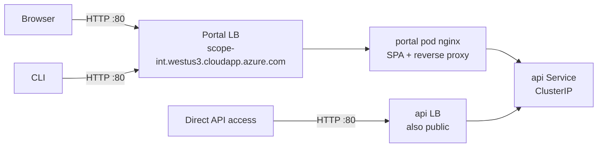
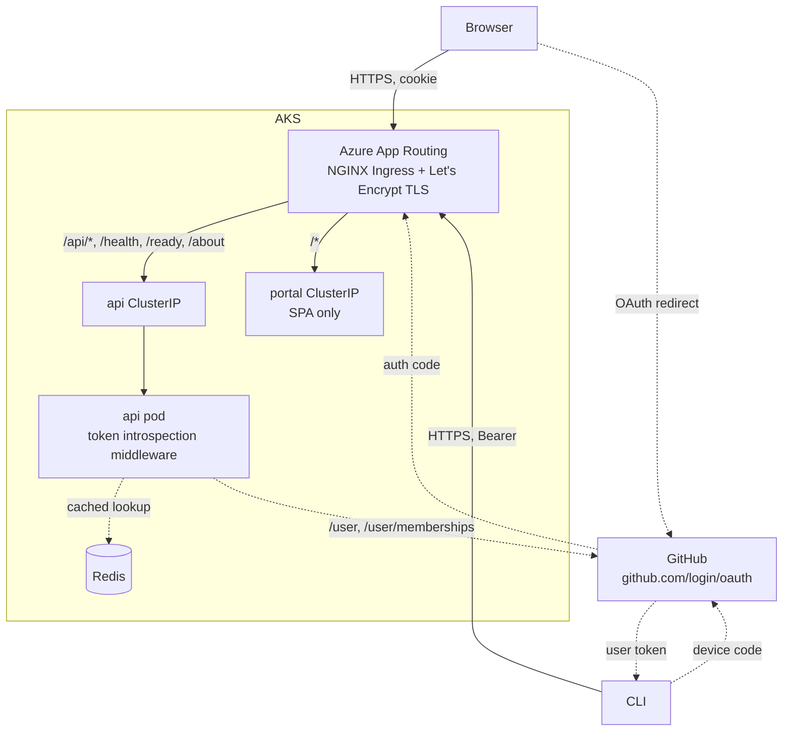
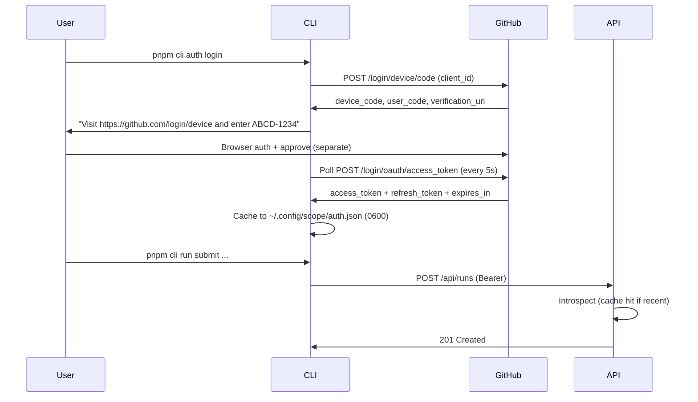
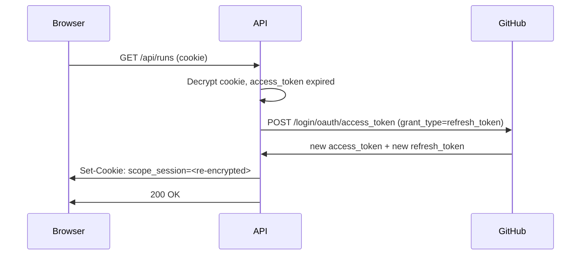

# User Authentication (GitHub App)

> **Status:** Design — not yet implemented. Tracked in [scope-project#83](https://github.com/growth-ecosystems/scope-project/issues/83).
>
> **Alternative considered:** [user-auth.md](user-auth.md) describes the same problem solved with Microsoft Entra ID. This document is the GitHub App alternative. Pick one before implementation phases begin.

The Scope Portal, API, and CLI currently expose every endpoint without identity. This document specifies how we add user authentication using a **GitHub App** as the identity provider, with org-membership in `growth-ecosystems` as the authorization rule.

## Why GitHub (vs Entra)

- Engineers using Scope are GitHub users by definition (they consume Copilot/Claude Code via GitHub-issued credentials).
- "Member of `growth-ecosystems` org" is a meaningful identity boundary that maps cleanly to "should have access to Scope". No tenant-admin negotiation, no group-membership setup.
- A GitHub App issues short-lived user access tokens **with refresh tokens** (OAuth Apps don't), giving us modern token hygiene without bespoke refresh logic.
- Reuses an identity our users already have. No "new account to create" onboarding step.

Tradeoffs vs Entra:

| | Entra | GitHub App |
|---|---|---|
| Token format | JWT (offline verify) | Opaque (introspection + cache) |
| Client secrets | None | One (server-side, Key Vault) |
| Browser SDK | MSAL.js | None — server-side callback |
| CLI flow | New (`@azure/msal-node`) | Pattern from [scripts/get-copilot-token.ts](../../scripts/get-copilot-token.ts) |
| Personal accounts | Blocked by tenant | Blocked by org membership |
| Tenant-admin negotiation | Yes | None |

**The introspection-vs-JWT tradeoff is the main cost.** GitHub user access tokens are opaque, so the API can't verify them locally — it must call GitHub. Mitigated by Redis caching (already a stack dependency); the cache caps GitHub API calls to ~12/min per user even under heavy load.

## Goals

- Require an authenticated GitHub identity for every Portal page and every API call (with a small allow-list for `/health`, `/ready`, `/about`).
- Restrict access to active members of `growth-ecosystems`.
- Preserve frictionless local development via an `AUTH_DISABLED` escape hatch.
- Maintain CLI ↔ Portal feature parity (per [AGENTS.md](../../AGENTS.md)).
- Lay groundwork for finer-grained authorization (teams, allowlists) without implementing it now.

## Non-goals (v1)

- Role-based authorization. v1 is **single-tier**: any active org member can perform any action.
- Per-resource ownership / ACLs.
- Replacing agent-side or worker-side auth flows (Copilot tokens, MCP secrets, GitHub cookies for VS Code Web).
- Supporting multiple identity orgs.

## Current state



Two `LoadBalancer` Services ([deploy/base/portal.yaml](../../deploy/base/portal.yaml), [deploy/base/api.yaml](../../deploy/base/api.yaml)). Plain HTTP. The portal pod's nginx ([apps/portal/nginx.conf](../../apps/portal/nginx.conf)) reverse-proxies `/api/*` to the in-cluster API Service so the browser sees same-origin. The API LB is independently reachable.

Problems:
- No identity on any request.
- HTTP only; GitHub OAuth requires HTTPS callback URLs.
- API exposed on its own LB, bypassing any future Portal-side checks.

## Target state



Single public hostname per environment. App Routing terminates TLS and routes by path. API is `ClusterIP` only. Portal's nginx becomes a static SPA server. The API holds the GitHub App client secret and exchanges OAuth codes server-side; the browser never sees a GitHub token.

## Components

### GitHub App registration

A single GitHub App in the `growth-ecosystems` org (or owned by the maintainer and installed into it).

| Property | Value |
|---|---|
| Name | `Scope` (or `Scope Portal`) |
| Homepage URL | `https://scope.westus3.cloudapp.azure.com` |
| Callback URLs | `https://scope-int.westus3.cloudapp.azure.com/api/auth/github/callback`, `https://scope.../callback`, plus preview hosts |
| Request user authorization (OAuth) during installation | Yes |
| Expire user authorization tokens | Yes (8h access, 6mo refresh) |
| Webhook | Disabled (not needed for v1) |
| Permissions | `User → Email addresses (read)`, `Organization → Members (read)` |

Authorization rule (enforced by API): user must be an active member of `growth-ecosystems`.

### API: token introspection middleware

In [apps/api/src/](../../apps/api/src/), an Express middleware mounted before all routes except `/health`, `/ready`, `/about`.

Library: `@octokit/rest` (or plain `fetch` — the surface is small).

Per request:

1. Read token from `Cookie: scope_session=<token>` (browser) or `Authorization: Bearer <token>` (CLI). For SSE, also accept `?access_token=<token>` query param **on SSE routes only**.
2. Compute `key = "auth:" + sha256(token)`.
3. Look up `key` in Redis. Cache value:

   ```ts
   { id: number, login: string, name: string | null, orgs: string[], expiresAt: number }
   ```

   TTL: shorter of (token expiry, 5 minutes).
4. On miss:
   - `GET https://api.github.com/user` with `Authorization: Bearer <token>`.
   - `GET https://api.github.com/user/memberships/orgs/growth-ecosystems` — must return `state: "active"`.
   - On 401/403: clear cookie if present, return 401.
   - On success: cache and proceed.
5. Attach `req.user = { id, login, name }` (typed in [packages/shared/](../../packages/shared/)).

Redis is already wired ([packages/shared/](../../packages/shared/) exports a redis client used by the SSE pub/sub layer).

### API: OAuth web flow endpoints

Three new routes under `/api/auth/github`:

| Route | Method | Purpose |
|---|---|---|
| `/login` | `GET` | Generate `state` (CSRF-safe random), store in short-lived Redis key, 302 to `https://github.com/login/oauth/authorize?client_id=...&state=...&redirect_uri=...` |
| `/callback` | `GET` | Validate `state`, exchange `code` for token at `https://github.com/login/oauth/access_token` (POST with client secret), check org membership, encrypt token, set `Set-Cookie: scope_session=...; HttpOnly; Secure; SameSite=Lax; Max-Age=28800; Path=/`, 302 to `/` |
| `/logout` | `POST` | Clear cookie, evict Redis cache entry |

Cookie payload is the GitHub access token encrypted with AES-256-GCM using a key from Key Vault (`SESSION_COOKIE_KEY`). On every request the middleware decrypts before introspection. Refresh token is stored alongside; on access-token expiry, middleware refreshes silently and updates the cookie.

`SameSite=Lax` (not `Strict`) so the OAuth redirect from `github.com` back to our domain carries the cookie.

### Portal: thin login UX

In [apps/portal/](../../apps/portal/), no SDK. The flow is entirely server-driven:

- Unauthenticated request → API returns 401 → fetch wrapper redirects browser to `/api/auth/github/login`.
- After `/callback` redirects back to `/`, the SPA fetches `/api/auth/me` (new endpoint, returns `req.user`) to render the signed-in badge.
- Sign-out button calls `POST /api/auth/github/logout` then redirects to `/`.

No tokens in JS. No localStorage. No MSAL. The SPA codepath shrinks to a fetch interceptor + a small `<UserBadge>` component.

### CLI: device-code flow

Reference implementation: [scripts/get-copilot-token.ts](../../scripts/get-copilot-token.ts) already does the GitHub device-code dance. We extract a shared helper into [packages/github-auth/](../../packages/github-auth/) and consume it from both the CLI and that script.

> Note: today [packages/github-auth/](../../packages/github-auth/) is Playwright-based cookie capture for the VS Code Web worker. Adding device-code support is additive; no breaking change to existing exports.

New CLI subcommands:

- `pnpm cli auth login` — runs device code with the GitHub App's client ID, prints user code + verification URL, polls until success, caches token in `~/.config/scope/auth.json` (mode `0600`, schema `{ accessToken, refreshToken, expiresAt, scope }`).
- `pnpm cli auth logout` — wipes the cache.
- `pnpm cli auth status` — prints `gh login`, token expiry, and the org-membership check result.

Token refresh: before each API call, if `expiresAt` is within 60s, exchange the refresh token for a new access token (`POST /login/oauth/access_token` with `grant_type=refresh_token`). The CLI does this client-side because it has the refresh token in its cache.

CI override: `SCOPE_TOKEN=<gh_token>` — accepts any valid GitHub token (fine-grained PAT, GitHub App installation token, or a user access token). Bypasses the cache and refresh logic.

Local-dev override: `SCOPE_AUTH_DISABLED=true` skips `auth login` and sends no `Authorization` header.

The CLI HTTP client attaches `Authorization: Bearer <token>` from the cache (or `SCOPE_TOKEN`) to every request. SSE commands append `?access_token=` to the SSE URL.

### Local-dev bypass

Setting `AUTH_DISABLED=true` short-circuits the API middleware and injects `{ id: 0, login: "local-dev", name: "Local Dev" }`. Default `true` in [docker-compose.dev.yml](../../docker-compose.dev.yml). Default `false` everywhere else. Logged loudly at startup when enabled.

### Ingress: Azure App Routing

Identical to the Entra design — TLS is required regardless of IdP. See [user-auth.md § Ingress: Azure App Routing](user-auth.md) for the full breakdown. Summary:

- One-time `az aks approuting enable` per cluster (probably owned by [scope-core-infra](https://github.com/growth-ecosystems/scope-core-infra)).
- Drop both `LoadBalancer` Services to `ClusterIP`.
- New `Ingress` (`webapprouting.kubernetes.azure.com`) + `ClusterIssuer` (Let's Encrypt HTTP01).
- Path rules: `/api/*`, `/health`, `/ready`, `/about`, `/openapi.json`, `/api-docs` → api; `/*` → portal.
- SSE annotations on the Ingress:

  ```yaml
  nginx.ingress.kubernetes.io/proxy-buffering: "off"
  nginx.ingress.kubernetes.io/proxy-read-timeout: "3600"
  nginx.ingress.kubernetes.io/proxy-send-timeout: "3600"
  ```

- DNS cutover: single-step for int (brief downtime ok), zero-downtime for prod.
- Slim [apps/portal/nginx.conf](../../apps/portal/nginx.conf) to SPA fallback only.

## Sequence diagrams

### Portal login

```mermaid
sequenceDiagram
    participant U as User
    participant B as Browser
    participant A as API
    participant G as GitHub
    participant R as Redis

    U->>B: Open https://scope.../
    B->>A: GET /api/runs
    A->>B: 401
    B->>A: GET /api/auth/github/login
    A->>R: SET state:<rand> ttl=5m
    A->>B: 302 to github.com/login/oauth/authorize?state=<rand>
    B->>G: Authorize
    U->>G: Sign in + approve
    G->>A: GET /api/auth/github/callback?code=...&state=<rand>
    A->>R: GET state:<rand> (validate, delete)
    A->>G: POST /login/oauth/access_token (code + client secret)
    G->>A: access_token + refresh_token
    A->>G: GET /user, /user/memberships/orgs/growth-ecosystems
    G->>A: { login, id }, { state: "active" }
    A->>R: SET auth:<sha256(token)> { user, orgs } ttl=5m
    A->>B: Set-Cookie: scope_session=<encrypted>; 302 to /
    B->>A: GET /api/auth/me
    A->>B: { login, name }
    B->>U: Render signed-in UI
```

### CLI device-code login



### Refresh on expiry (API path, browser session)



## Configuration reference

To be added to [ENV_VARIABLES.md](../../ENV_VARIABLES.md) when API/Portal/CLI phases land.

| Variable | Component | Purpose |
|---|---|---|
| `AUTH_DISABLED` | api | When `true`, bypass and inject local-dev user. Default `false`. |
| `GITHUB_APP_CLIENT_ID` | api | OAuth client ID. |
| `GITHUB_APP_CLIENT_SECRET` | api (secret) | OAuth client secret. From Key Vault. |
| `GITHUB_REQUIRED_ORG` | api | Org membership required (default `growth-ecosystems`). |
| `SESSION_COOKIE_KEY` | api (secret) | 32-byte AES-256-GCM key for cookie encryption. From Key Vault. |
| `SESSION_COOKIE_DOMAIN` | api | Cookie `Domain` attribute (e.g. `scope.westus3.cloudapp.azure.com`). |
| `VITE_AUTH_DISABLED` | portal (build) | Skip API redirect on 401 in local dev. |
| `SCOPE_AUTH_DISABLED` | cli | Skip `auth login` and send no Authorization header. |
| `SCOPE_TOKEN` | cli | Override token cache (used in CI). |
| `SCOPE_GITHUB_CLIENT_ID` | cli | GitHub App client ID for device-code flow. |

## Phased rollout

Each phase is a separate worktree + PR off `main`.

| # | Branch | Description |
|---|---|---|
| 0a | `docs/user-auth-github-design` | This document. |
| 0b | `infra/app-routing-ingress` | Enable App Routing on AKS, add `Ingress` + `ClusterIssuer`, switch API/Portal Services to `ClusterIP`, slim down [apps/portal/nginx.conf](../../apps/portal/nginx.conf), DNS cutover for int. **No auth yet** — cluster runs HTTPS but unauthenticated. Shared with the Entra design — same prerequisite either way. |
| 1 | `feat/api-github-auth` | Token introspection middleware, Redis cache, `/api/auth/github/{login,callback,logout}`, `/api/auth/me`, encrypted session cookie, refresh-on-expiry, org-membership check, `AUTH_DISABLED` bypass. Updates [ENV_VARIABLES.md](../../ENV_VARIABLES.md). |
| 2 | `feat/portal-github-login` (parallel with 3) | Fetch interceptor that redirects on 401, `<UserBadge>` component, sign-out button. |
| 3 | `feat/cli-github-auth` (parallel with 2) | Extract device-code helper from [scripts/get-copilot-token.ts](../../scripts/get-copilot-token.ts) into [packages/github-auth/](../../packages/github-auth/), add `pnpm cli auth login/logout/status`, token cache with refresh, `SCOPE_TOKEN` override. |
| 4 | `chore/auth-deploy-cutover` | GitHub App client secret + cookie encryption key in Key Vault (via `external-secret.yaml`), configmap with client ID + required org, flip `AUTH_DISABLED=false` int → prod via promotion workflow. Prod ingress DNS cutover with zero-downtime sequence. |

Dependency order: **0a → 0b → 1 → (2 ∥ 3) → 4**.

## Migration story

If we ever want to swap GitHub for Entra (or add Entra alongside), the touch points are small:

- API middleware swaps token introspection for JWT validation.
- Portal swaps the 401-redirect target.
- CLI swaps the device-code provider.

The session cookie shape, `req.user` shape, SSE pattern, and all consumer code are IdP-agnostic. We're not painting ourselves into a corner.

## Open questions

- **Cookie encryption key handling.** `SESSION_COOKIE_KEY` rotation strategy — one active + one previous to allow zero-downtime rotation? Or accept brief mass re-login on rotation?
- **GitHub App ownership.** Who owns the App registration in `growth-ecosystems`? Same admin should own the client secret in Key Vault.
- **App Routing enablement.** Same as Entra design — does scope-core or [scope-core-infra](https://github.com/growth-ecosystems/scope-core-infra) own the AKS Bicep that enables App Routing?
- **CI tokens.** A fine-grained PAT scoped to "no permissions, just identity" works for `SCOPE_TOKEN`, but it carries the human owner's identity. Better: a GitHub App installation token, scoped to a service-account-like installation. Decide before Phase 4.
- **`packages/github-auth/` naming.** It currently means "Playwright cookie capture". After we add device-code helpers, the name fits better but the existing exports might warrant a sub-namespace (`./playwright`, `./oauth`).

## References

- Issue: [scope-project#83](https://github.com/growth-ecosystems/scope-project/issues/83)
- Alternative design: [docs/architecture/user-auth.md](user-auth.md) (Entra ID)
- Architecture overview: [docs/architecture/overview.md](overview.md)
- Deployment model: [docs/architecture/deployment.md](deployment.md)
- Existing device-code reference: [scripts/get-copilot-token.ts](../../scripts/get-copilot-token.ts)
- GitHub Apps user-to-server: <https://docs.github.com/apps/creating-github-apps/authenticating-with-a-github-app/generating-a-user-access-token-for-a-github-app>
- Device flow: <https://docs.github.com/apps/creating-github-apps/authenticating-with-a-github-app/generating-a-user-access-token-for-a-github-app#using-the-device-flow-to-generate-a-user-access-token>
- Azure App Routing: <https://learn.microsoft.com/azure/aks/app-routing>
