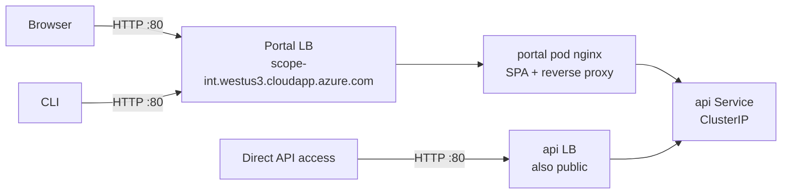
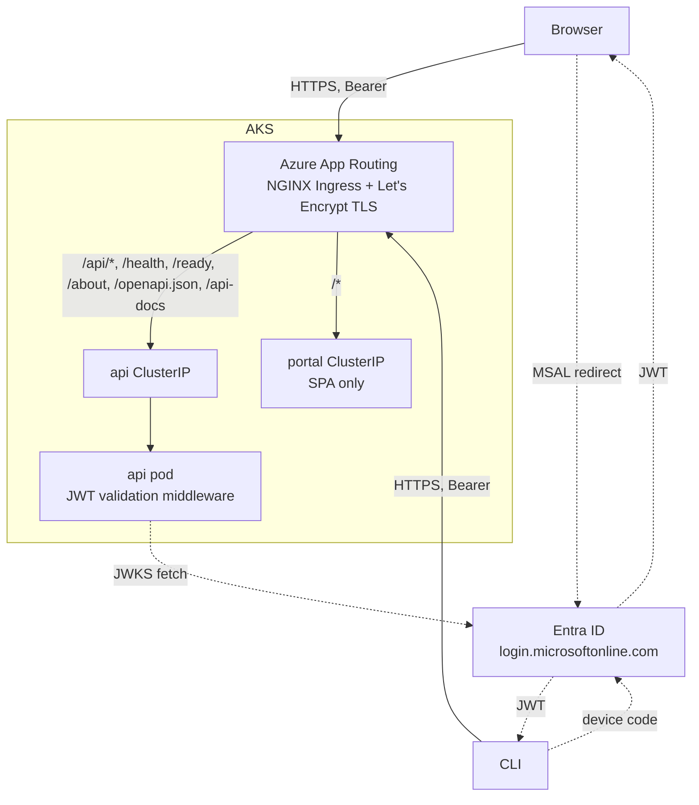
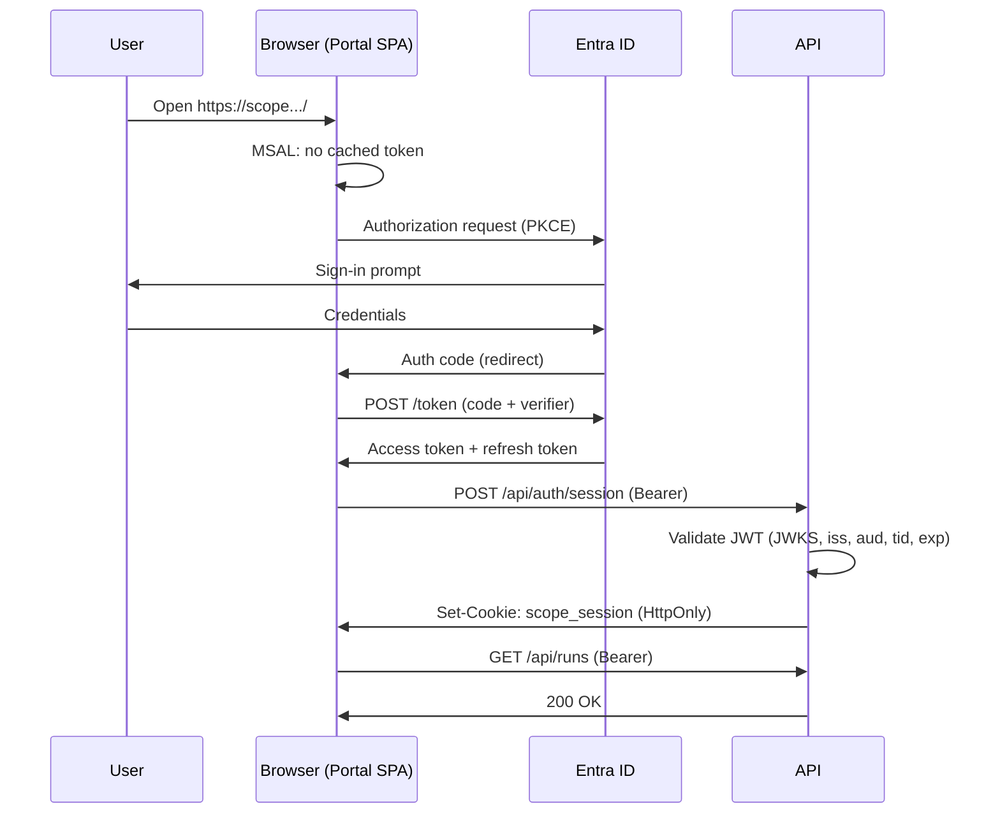
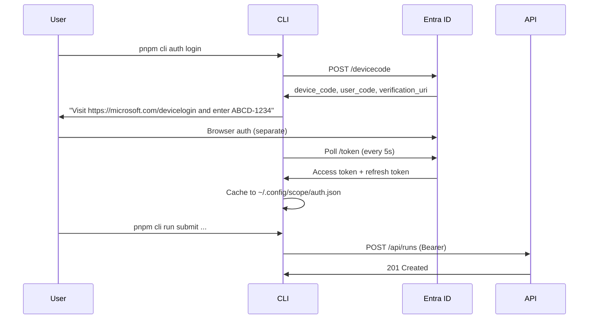

# User Authentication

> **Status:** Design — not yet implemented. Tracked in [scope-project#83](https://github.com/growth-ecosystems/scope-project/issues/83).

The Scope Portal, API, and CLI currently expose every endpoint without identity. Anyone who can resolve the public hostname can submit runs, view results, mutate criteria, and register agents. This document specifies how we add user authentication using Microsoft Entra ID (formerly Azure AD).

## Goals

- Require an authenticated Entra identity for every Portal page and every API call (with a small, documented allow-list for `/health`, `/ready`, `/about`).
- Preserve frictionless local development via an `AUTH_DISABLED` escape hatch.
- Maintain CLI ↔ Portal feature parity (per [AGENTS.md](../../AGENTS.md)).
- Lay groundwork for authorization (roles, per-resource ownership) without implementing it now.

## Non-goals (v1)

- Role-based authorization. v1 is **single-tier**: any signed-in tenant member can perform any action.
- Per-resource ownership / ACLs. Defer.
- Replacing agent-side or worker-side auth flows (Copilot tokens, MCP secrets, GitHub cookies). Those have separate issues.
- Multi-tenant support. Single Entra tenant only.

## Current state



Two `LoadBalancer` services ([deploy/base/portal.yaml](../../deploy/base/portal.yaml), [deploy/base/api.yaml](../../deploy/base/api.yaml)). Plain HTTP. The portal pod's nginx ([apps/portal/nginx.conf](../../apps/portal/nginx.conf)) reverse-proxies `/api/*` to the in-cluster API Service so the browser sees same-origin. The API LB is independently reachable.

Problems:
- No identity on any request.
- HTTP only; Entra rejects non-`https` redirect URIs.
- API exposed on its own LB, bypassing any future Portal-side checks.

## Target state



Single public hostname per environment. App Routing terminates TLS and routes by path. API is `ClusterIP` only — no longer publicly reachable on its own. Portal pod's nginx becomes a static SPA server.

## Components

### Entra app registrations

Three apps in a single Entra tenant. All single-tenant.

| Registration | Type | Purpose | Auth flow |
|---|---|---|---|
| `scope-api` | Web API | Token audience. Exposes scope `api://<api-app-id>/access_as_user`. | n/a — only validates tokens. |
| `scope-portal` | SPA (public client) | Acquires tokens for browser users. Redirect URIs: `https://scope-int.../`, `https://scope.../`, plus preview hosts. | Authorization Code + PKCE via `@azure/msal-browser`. |
| `scope-cli` | Public client | Acquires tokens for CLI users. Redirect URI: `http://localhost`. | Device code via `@azure/msal-node`. |

Both `scope-portal` and `scope-cli` are granted the delegated `access_as_user` permission on `scope-api`. Tenant-admin consent done once.

Tenant ID and the three app IDs are **not secret** and live in [deploy/base/configmap.yaml](../../deploy/base/configmap.yaml) plus Vite build args. No client secrets are needed (all flows are public clients).

### API: token validation middleware

In [apps/api/src/](../../apps/api/src/), an Express middleware mounted before all routes except `/health`, `/ready`, `/about`.

Libraries: `jsonwebtoken` + `jwks-rsa`. (Avoid `passport-azure-ad` — heavy and stale.)

On startup the API caches the tenant JWKS from `https://login.microsoftonline.com/<tenant-id>/discovery/v2.0/keys`.

Per request, validate:
- Signature against JWKS (rotate on `kid` miss).
- `iss == https://login.microsoftonline.com/<tenant-id>/v2.0`
- `aud == api://<api-app-id>` (or the app-id GUID — depends on `accessTokenAcceptedVersion` in the manifest).
- `tid == <tenant-id>`.
- `exp` not passed (with small clock skew tolerance).

On success, attach `req.user = { oid, upn, name }` (typed in [packages/shared/](../../packages/shared/)). On failure, return `401`.

#### SSE auth

`EventSource` cannot send custom headers. The API supports two carriers for SSE:

1. **HttpOnly session cookie** for the Portal. After MSAL acquires a token, Portal calls `POST /api/auth/session` with the bearer; the API validates it once and sets a short-lived (≤ token TTL) `HttpOnly Secure SameSite=Strict` cookie. SSE requests carry it automatically.
2. **`?access_token=` query param** for the CLI's `pnpm cli logs` command. The middleware accepts a bearer from this query param **only on SSE routes** to limit exposure to access logs.

#### Local-dev bypass

Setting `AUTH_DISABLED=true` short-circuits the middleware and injects `{ oid: "local-dev", upn: "dev@scope.local", name: "Local Dev" }`. Default `true` in [docker-compose.dev.yml](../../docker-compose.dev.yml). Default `false` everywhere else. Logged loudly at startup when enabled.

### Portal: MSAL flow

In [apps/portal/](../../apps/portal/), `@azure/msal-browser` with `PublicClientApplication`. Auth provider wraps the app, drives `loginRedirect` on first load, then `acquireTokenSilent({ scopes: ["api://<api-app-id>/access_as_user"] })` before each request.

A fetch wrapper used by TanStack Query attaches `Authorization: Bearer <token>`. SSE consumers call `POST /api/auth/session` first, then open `EventSource`.

UI additions: signed-in badge with display name + sign-out button.

Build-time config via Vite env:
- `VITE_ENTRA_TENANT_ID`
- `VITE_ENTRA_PORTAL_CLIENT_ID`
- `VITE_ENTRA_API_SCOPE` (e.g. `api://.../access_as_user`)
- `VITE_AUTH_DISABLED` (mirrors API's `AUTH_DISABLED` for local dev)

### CLI: device-code flow

In [apps/cli/](../../apps/cli/), `@azure/msal-node` with `PublicClientApplication.acquireTokenByDeviceCode`. New subcommands:

- `pnpm cli auth login` — prints device code + verification URL, polls until success, caches access + refresh tokens.
- `pnpm cli auth logout` — wipes the cache.
- `pnpm cli auth status` — prints signed-in identity and token expiry.

Token cache: `~/.config/scope/auth.json` (mode `0600`). Refresh tokens used for silent renewal on subsequent commands.

CI override: `SCOPE_TOKEN=<jwt>` env var bypasses the cache and is used directly. CI obtains a JWT via a service principal client-credentials flow (out of scope for this doc — covered when CI integration lands).

Local-dev override: `SCOPE_AUTH_DISABLED=true` skips `auth login` and sends no `Authorization` header.

The existing CLI HTTP client is augmented to attach `Authorization: Bearer` from the token cache (or `SCOPE_TOKEN`) on every request. SSE commands append `?access_token=` to the SSE URL.

### Ingress: Azure App Routing

Cluster-level: enable Azure's managed NGINX Ingress + cert-manager add-on once per AKS cluster:

```bash
az aks approuting enable --resource-group <rg> --name <cluster>
```

This is **not** a FluxCD-managed change — it's a one-time Bicep update (probably in [growth-ecosystems/scope-core-infra](https://github.com/growth-ecosystems/scope-core-infra) — to be confirmed) or a manual `az` step.

Manifest changes in this repo:

| File | Change |
|---|---|
| [deploy/base/api.yaml](../../deploy/base/api.yaml) | `type: LoadBalancer` → `type: ClusterIP`; remove DNS annotations. |
| [deploy/base/portal.yaml](../../deploy/base/portal.yaml) | `type: LoadBalancer` → `type: ClusterIP`; remove `azure-dns-label-name` annotation. |
| `deploy/base/ingress.yaml` (new) | Single `Ingress` resource, `ingressClassName: webapprouting.kubernetes.azure.com`, path rules below, SSE annotations, `cert-manager.io/cluster-issuer` annotation. |
| `deploy/base/cluster-issuer.yaml` (new) | Let's Encrypt `ClusterIssuer` (HTTP01 solver — works for `cloudapp.azure.com` since the LB has a public IP). |
| [deploy/overlays/integration/](../../deploy/overlays/integration/), [prod/](../../deploy/overlays/prod/), [preview/](../../deploy/overlays/preview/) | Patch the Ingress host per env. |
| [apps/portal/nginx.conf](../../apps/portal/nginx.conf) | Strip the `/api/*`, `/health`, `/ready`, `/about`, `/api-docs`, `/openapi.json` reverse-proxy blocks. Keep only the SPA fallback. |

Path rules on the Ingress:

```
/api/*         → api Service:80
/health        → api Service:80
/ready         → api Service:80
/about         → api Service:80
/openapi.json  → api Service:80
/api-docs      → api Service:80
/*             → portal Service:80
```

SSE-critical annotations:

```yaml
nginx.ingress.kubernetes.io/proxy-buffering: "off"
nginx.ingress.kubernetes.io/proxy-read-timeout: "3600"
nginx.ingress.kubernetes.io/proxy-send-timeout: "3600"
```

#### DNS cutover

Azure DNS labels are sticky to a Service. App Routing brings its own LB, so `scope-int.westus3.cloudapp.azure.com` must be released from the current Portal LB and assigned to the App Routing LB.

- **Int**: hostname swap with brief downtime is acceptable. Single-step cutover.
- **Prod**: introduce `scope-v2.westus3.cloudapp.azure.com` on App Routing first, validate, then swap. Zero-downtime.

## Sequence diagrams

### Portal login



### CLI device-code login



## Configuration reference

To be added to [ENV_VARIABLES.md](../../ENV_VARIABLES.md) when the API/Portal/CLI phases land.

| Variable | Component | Purpose |
|---|---|---|
| `AUTH_DISABLED` | api | When `true`, bypass JWT validation and inject local-dev user. Default `false`. |
| `ENTRA_TENANT_ID` | api | Tenant GUID used for issuer + JWKS. |
| `ENTRA_API_AUDIENCE` | api | Expected `aud` claim (`api://<api-app-id>` or app-id GUID). |
| `VITE_AUTH_DISABLED` | portal (build) | Skip MSAL flow in local dev. |
| `VITE_ENTRA_TENANT_ID` | portal (build) | MSAL `authority`. |
| `VITE_ENTRA_PORTAL_CLIENT_ID` | portal (build) | MSAL `clientId`. |
| `VITE_ENTRA_API_SCOPE` | portal (build) | Scope requested for API tokens. |
| `SCOPE_AUTH_DISABLED` | cli | Skip `auth login` and send no Authorization header. |
| `SCOPE_TOKEN` | cli | Override token cache (used in CI). |
| `SCOPE_ENTRA_TENANT_ID` | cli | Tenant GUID. |
| `SCOPE_ENTRA_CLI_CLIENT_ID` | cli | CLI app-registration client ID. |
| `SCOPE_ENTRA_API_SCOPE` | cli | Scope requested for API tokens. |

## Phased rollout

Each phase is a separate worktree + PR off `main`.

| # | Branch | Description |
|---|---|---|
| 0a | `docs/user-auth-design` | This document. |
| 0b | `infra/app-routing-ingress` | Enable App Routing on AKS, add `Ingress` + `ClusterIssuer`, switch API/Portal Services to `ClusterIP`, slim down [apps/portal/nginx.conf](../../apps/portal/nginx.conf), DNS cutover for int. **No Entra yet** — cluster runs HTTPS but unauthenticated. |
| 1 | `feat/api-auth-middleware` | Entra JWT validation, `req.user`, SSE cookie route, `AUTH_DISABLED` bypass. Updates [ENV_VARIABLES.md](../../ENV_VARIABLES.md). |
| 2 | `feat/portal-login` (parallel with 3) | MSAL SPA flow, fetch wrapper, signed-in UI. |
| 3 | `feat/cli-auth` (parallel with 2) | `pnpm cli auth login/logout/status`, token cache, `SCOPE_TOKEN` override. |
| 4 | `chore/auth-deploy-cutover` | Configmap with tenant + app IDs in int and prod overlays, flip `AUTH_DISABLED=false` int → prod via promotion workflow. Prod ingress DNS cutover with zero-downtime sequence. |

Dependency order: **0a → 0b → 1 → (2 ∥ 3) → 4**.

## Open questions

- **App Routing enablement ownership.** Does scope-core or [scope-core-infra](https://github.com/growth-ecosystems/scope-core-infra) own the AKS Bicep that enables the App Routing add-on? If the latter, Phase 0b splits across two repos.
- **App registration ownership.** Who creates and admins the three Entra app registrations? Need a tenant admin to grant consent on `access_as_user`.
- **Allowed users.** v1 lets any tenant member sign in. Do we want to restrict to a specific Entra security group's `groups` claim before exposing to a wider tenant?
- **CI service principal.** Phase 4 (or a follow-up) needs a service principal for headless CI calls to the API. Decide between client-credentials (preferred) vs a long-lived PAT-style scope token.
- **Existing public endpoints in CLI examples and docs.** A grep + sweep is needed to update `http://scope-int.../` references to `https://`.

## References

- Issue: [scope-project#83](https://github.com/growth-ecosystems/scope-project/issues/83)
- Architecture overview: [docs/architecture/overview.md](overview.md)
- Deployment model: [docs/architecture/deployment.md](deployment.md)
- Token Manager (agent-side auth, distinct from this): [docs/architecture/token-manager.md](token-manager.md)
- MSAL.js: <https://learn.microsoft.com/entra/identity-platform/msal-overview>
- Azure App Routing: <https://learn.microsoft.com/azure/aks/app-routing>
