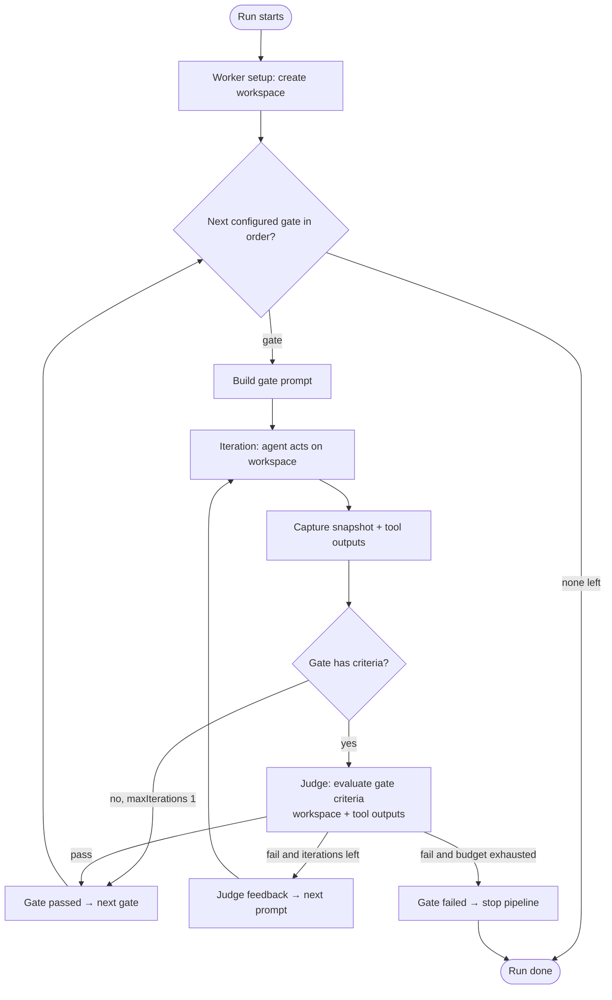
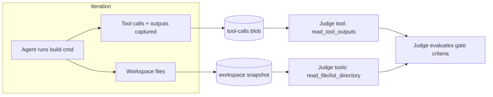

# Gates — Multi-Phase Evaluation Pipeline

> Status: **Draft / Proposal**
> Issue: [growth-ecosystems/scope-project#97 — Taxonomy Build gate support](https://github.com/growth-ecosystems/scope-project/issues/97)
> Milestone: Self-service MVP

## 1. Summary

Today a benchmark run evaluates an agent's output against a single flat set of
criteria (a DAG) after the agent edits the workspace. This proposal generalises
that into a **sequential pipeline of gates**:

```javascript
Select → Build → Test → Run → Deploy
```

Each gate has:

- its **own set of selected criteria** — at least one, chosen at submit time and
  restricted to criteria *compatible* with that gate (a gate may have **no**
  criteria only when its `maxIterations` is 1, same rule as today),
- its **own iteration budget** (`maxIterations`, same control as today, one per gate),
- access to **richer evaluation context** — not just the workspace files, but
  also the **tool outputs** (e.g. build/test/run command output) produced during
  the gate.

The current criteria system becomes the **Select gate** with no behavioural
change for existing runs. Gates are **hard-coded** (an ordered enum), not a new
configurable entity.

## 2. Goals & Non-Goals

### Goals

- Introduce an ordered, hard-coded set of gates: `select`, `build`, `test`, `run`, `deploy`.
- Let each criterion declare which gates it is **compatible** with (default: all).
- At submit time, let the user pick criteria **per gate**, filtered to compatible criteria.
- Give each gate its own `maxIterations`.
- Give the judge (criteria-evaluation agent) a tool to read **tool outputs** captured during the gate, in addition to the workspace.
- Preserve full backward compatibility: existing requests/scenarios keep working as a single Select gate.

### Non-Goals (for this iteration)

- Making gates user-configurable entities (CRUD, custom gates, reordering). Gates stay hard-coded.
- Parallel gate execution. Gates run strictly sequentially.
- Defining the full Run / Deploy semantics beyond what Build/Test need. The
  data model accommodates all five gates, but only Select + Build + Test are
  exercised end-to-end in the first milestone.
- Changing the criteria DAG semantics *within* a gate (ancestor resolution,
  bundled/independent strategies stay as-is, scoped to the gate's criteria).

## 3. Background — current architecture

See [overview](../architecture/overview.md), [app-design](../architecture/app-design.md),
and [criteria-provider](../architecture/criteria-provider.md).

```mermaid
flowchart LR
    Req[Request: scenario.task + criteria[] + maxIterations] --> QP[queue-processor]
    QP --> Loop[runMultiTurnLoop]
    Loop -->|per iteration| Agent[Coding agent edits workspace]
    Agent --> Snap[Snapshot workspace → blob]
    Snap --> Judge[Judge /evaluate: criteria DAG]
    Judge -->|fail → feedback becomes next prompt| Loop
    Judge -->|pass| Done
```

Key facts the design builds on:

- **Criteria** = `{ id, prompt, dependsOn? }`, stored in MongoDB, served via
  `CriteriaProvider`. A scenario references criteria by id (`scenario.criteria: string[]`).
- **`runMultiTurnLoop`** (`packages/shared/src/judge/multi-turn-loop.ts`) drives
  iterations: agent → snapshot → judge → (feedback | done). `maxIterations` is a
  single request-level value.
- **Judge** (`apps/judge`) resolves criteria + ancestors, builds a `DependencyGraph`,
  and runs a strategy (`bundled` | `independent`). Its evaluation agent currently
  has **filesystem tools only** (`read_file`, `list_directory`) scoped to the
  downloaded snapshot (`judge-strategies.ts → createFileTools`).
- **Tool outputs** are already partially captured: the loop extracts tool calls
  from the HAR (`extractToolCalls`) and writes them to a per-iteration blob
  (`blobStorage.writeToolCalls` → `toolCallsUrl`). Each entry carries
  `{ name, arguments, response }`. This is **HAR-derived** today and is *not*
  surfaced to the judge.
- **`ConversationTurn`** records per-iteration artifacts (snapshot, HAR, tool
  calls, tokens). Turns live under `run.turns` on the request document.

## 4. Proposed design

### 4.1 Gate taxonomy (hard-coded)

```ts
// packages/shared/src/types/types.ts
export const GATES = ["select", "build", "test", "run", "deploy"] as const;
export type GateId = (typeof GATES)[number];

// Ordered execution sequence — index defines run order.
export const GATE_ORDER: readonly GateId[] = GATES;
```

Each gate carries hard-coded metadata: a human label and a description. Each
gate also requires a **prompt** that instructs the agent when the gate starts —
but prompts are *data*, not hard-coded: they are typed prompt entities, one per
gate type (see §4.5).

| Gate | Purpose | Example criteria |
| --- | --- | --- |
| `select` | Agent implements the task (current behaviour) | "Implements a /health endpoint", "Uses Express" |
| `build` | Project builds/compiles successfully | "`npm run build` exits 0", "No TypeScript errors" |
| `test` | Tests pass | "Unit tests pass", "Coverage ≥ 80%" |
| `run` | App runs / serves correctly | "Server starts", "GET / returns 200" |
| `deploy` | Deploys to target environment | "azd up succeeds", "Resource provisioned" |

#### 4.1.1 Portal visibility flags (Run / Deploy)

The **Run** and **Deploy** gates are functionally complete end-to-end but not yet
ready to surface to users. Two DB-backed feature flags hide them from the **portal
authoring surfaces only**, each defaulting **off** so they can be revealed
independently when ready:

| Flag key | Label | Default | Hides |
| --- | --- | --- | --- |
| `gates-run` | Run Gate | `false` | Run gate |
| `gates-deploy` | Deploy Gate | `false` | Deploy gate |

Both are seeded by the API on startup (`apps/api/src/index.ts`, idempotent via
`$setOnInsert`) and toggled from the portal **Admin** page like any other flag.

Scope and semantics:

- **Portal authoring/selection surfaces only.** Submit Run, the criteria
  compatibility picker, the criteria list/graph gate filters, and the task-prompt
  type/gate filters all hide a flag-gated gate when its flag is off. The **backend,
  Judge, and CLI stay fully permissive** — the gates remain runnable via API/CLI so
  they can be tested before launch.
- **Run-state surfaces always show every gate.** Run Detail (gate status strip,
  per-gate turns, Logs DAG tabs) reflects an *actual run's* gates. Because the
  backend stays permissive, a run may legitimately include Run/Deploy, so those
  surfaces are never filtered.
- **Fail-closed.** Visibility is driven by `useVisibleGates()` (portal), which reads
  the raw flags list (not the fail-open `isFeatureEnabled`) and shows a flag-gated
  gate **only** when its flag is explicitly `true`. While flags load or if a flag is
  missing, the gate stays hidden. The pure helper `visibleGateOrder(enabledFlags)`
  and the mapping `GATE_FEATURE_FLAGS = { run: "gates-run", deploy: "gates-deploy" }`
  live in `apps/portal/src/lib/gates.ts`.
- **No data loss.** The compatibility picker renders only visible gates but
  **preserves** any pre-existing hidden-gate values on a criterion when toggling or
  using "Unselect all" — it never silently strips a Run/Deploy compatibility the user
  can't see to re-add.

### 4.2 Criterion ↔ gate compatibility

Add an optional `gates` field to the criterion model. Semantics:

- `gates` **absent or empty** → criterion is compatible with **all** gates. This is
  the data-model fallback only; the portal always writes an explicit, non-empty list
  (see §4.6), and migration 018 backfills any absent/empty/null rows to `["select"]`,
  so stored criteria never actually rely on the empty=all fallback.
- `gates: ["build", "test"]` → only selectable for the Build and Test gates.

> **Existing criteria are not left as "all gates".** Every criterion authored
> before this feature was written for the current (Select) behaviour, so a
> data migration backfills `gates: ["select"]` on all existing criteria whose
> `gates` field is absent, empty (`[]`), or null (see §4.2.1). Combined with the
> portal requiring an explicit selection, the "absent/empty = all gates" fallback
> is never produced by normal flows — it remains only as a defensive default in
> the shared compatibility helpers.

```ts
export interface CriteriaConfig {
  id: string;
  prompt: string;
  dependsOn?: string[];
  gates?: GateId[];   // NEW — compatibility list; empty/undefined = all gates
}
```

- Stored on `CriteriaDocument`, exposed through `CriteriaStore`, both
  `CriteriaProvider` implementations, the criteria REST API, and YAML import/export.
**DAG + compatibility invariant (downward-closed).** Selecting a criterion for a gate drags in all its ancestors (they are evaluated within the gate as part of the sub-DAG). To prevent an incompatible ancestor from being evaluated in a gate it was explicitly excluded from, compatibility must be closed along dependency edges: for every edge `child → parent` (child `dependsOn` parent),

`compat(parent) ⊇ compat(child)`

i.e. a parent must be compatible with at least every gate its child is compatible with (treating empty/undefined = all gates as the universal set). Equivalently: a criterion may only declare a gate it is compatible with if all its ancestors are also compatible with that gate.

- **Consequence:** ancestor resolution can never pull a criterion into a gate it is incompatible with — the situation is impossible by construction.
- **Enforcement:** validated at criteria create/update (alongside the existing cycle check in `CriteriaStore`) and again at request submit. A violation is a clear validation error, e.g. `"builds_clean is compatible with build but its dependency uses_express is not (compatible with: select)."`
- **Authoring (portal):** the criteria creation wizard never offers a dependency that would violate the invariant. **Gate compatibility is chosen in Step 1** (alongside behavior + ID), so the very first AI generation — which fires on the Step 1 → Step 2 transition — is already gate-aware. In the Review & Create step (Step 2) the gates are shown **read-only** and the **Parents** picker only lists criteria whose compatibility ⊇ the criterion's selected gates, while the **Children** picker only lists criteria whose compatibility ⊆ those gates. The two pickers also **cross-exclude**: a criterion already selected as a parent is removed from the Children picker's options and vice-versa, so the user can never select the same criterion as both a parent and a child (a contradictory 2-cycle). The same criterion may still be *displayed* as a suggestion in both lists — only *selection* in both is blocked. AI-suggested parents/children are filtered through the same predicates; to change gates after generation the user steps Back to Step 1 and continues again (re-generating). The reactive prune in `useCriteriaWizard` drops any now-incompatible parent/child as a backstop. This keeps the wizard from ever submitting a request the API would reject.
- **AI generation (server):** `generateCriteriaPrompt` (`apps/api/src/llm.ts`) is itself gate-aware so the model never even *proposes* an incompatible dependency. The wizard sends the criterion's selected gates with the generate-prompt request; the route projects each existing criterion's `gates` and the generator runs **three single-responsibility LLM calls in parallel** (`Promise.all`):
  1. **author** → `{prompt, suggestedId}` from the behavior alone.
  2. **suggest parents** → the parent pool, pre-filtered to `gatesSatisfyInvariant(candidate.gates, newGates)`.
  3. **suggest children** → the child pool, pre-filtered to `gatesSatisfyInvariant(newGates, candidate.gates)`.
  The two suggestion calls share one symmetric `suggestDeps(direction, pool)` path; only the candidate pool and the relationship wording differ. Because the pools are pre-filtered, no gate/invariant wording is ever sent to the model. **Both suggestion prompts demand a true prerequisite edge** (`A → B` means "B cannot be meaningfully evaluated unless A passes first" — equivalently, B can never be true while A is false) and apply an **independence test**: if each criterion can be true or false irrespective of the other's outcome, they are independent and there is **no edge in either direction**. This makes the **sibling rejection** rigorous — `has_unit_tests` and `has_integration_tests` are each true/false regardless of the other, so neither is ever offered as a parent or child of the other. The model is told to prefer an empty array over a weak or speculative edge. Each returned list is post-filtered against its pool's IDs as a backstop. The author call failing throws (the prompt is indispensable); a suggestion call failing degrades that list to `[]` so it never blocks creation. When the request omits `gates` (e.g. older clients) both pools fall back to the full criteria list — fully backward compatible. Client-side pruning remains the final guarantee for any post-generation gate edits.
- **Example:** if `builds_clean` (gates `[build]`) depends on `compiles`, then `compiles` must include `build` in its gates (or be unrestricted). A `select`-only `compiles` would be rejected.

YAML example (`config/criteria/builds_clean.yaml`):

```yaml
id: builds_clean
prompt: The project builds with no errors (build command exits 0).
gates: [build]
```

#### 4.2.1 Migration — backfill existing criteria to `select`

A migration (next sequence number `018`, e.g.
`018-backfill-criteria-gates.ts`) sets compatibility on every pre-existing
criterion to **Select only**, since that is the only behaviour they were
authored for:

```ts
// packages/db-migrations/src/migrations/018-backfill-criteria-gates.ts
import type { Db } from "mongodb";
import type { MigrationInterface } from "mongo-migrate-ts";
import { batchUpdate } from "../batch-update.js";

export class BackfillCriteriaGates implements MigrationInterface {
  async up(db: Db): Promise<void> {
    // Any criterion without an explicit, non-empty `gates` field predates the
    // gates feature (or was stored empty/null) and was written for the Select
    // gate — pin it to ["select"]. The portal always writes an explicit list,
    // so this eliminates the empty-gate case for all stored data.
    await batchUpdate(
      db.collection("criteria"),
      { $or: [{ gates: { $exists: false } }, { gates: { $size: 0 } }, { gates: null }] },
      { $set: { gates: ["select"] } },
      "[018] backfill criteria gates → [select]",
    );
  }

  async down(db: Db): Promise<void> {
    // Reverse only the rows this migration touched: those whose gates is
    // exactly ["select"]. Unset the field to restore the pre-migration shape.
    await batchUpdate(
      db.collection("criteria"),
      { gates: ["select"] },
      { $unset: { gates: "" } },
      "[018] revert criteria gates backfill",
    );
  }
}
```

Notes:

- Uses the existing CosmosDB-safe `batchUpdate` helper (429-retry batching),
  consistent with prior backfill migrations (e.g. `015`, `005`).
- **Soft-deleted criteria** (`deletedAt` set) are included in the backfill so
  they remain consistent if later restored — the filter matches any row whose
  `gates` is absent, empty, or null.
- The YAML seed files under `config/criteria/` that should be Select-only must
  also declare `gates: [select]` (or be updated in bulk) so a fresh
  seed/import matches the migrated state; criteria intended for other gates
  (e.g. `builds_clean`) declare their own `gates` list.
- The `down()` is best-effort: it cannot distinguish a backfilled `["select"]`
  from one a user later set by hand, but restoring to "absent" is the correct
  inverse of the forward operation.

### 4.3 Request shape — per-gate selection

Introduce a normalised `gates` array on the request describing, per gate, the
selected criteria and the iteration budget:

```ts
export interface GateConfig {
  gate: GateId;
  promptId?: string;       // resolved typed prompt entity (prompt.type must === gate);
                           // for the Select gate this is the request's task prompt
  promptText?: string;     // INPUT-ONLY free text; materialized server-side at submit
                           // into a typed prompt via findOrCreate(text, gate). Stripped
                           // after resolution; persisted gates always carry promptId.
  criteria: string[];      // criterion ids for THIS gate; ≥1 unless maxIterations === 1
  maxIterations?: number;  // per-gate budget; falls back to request default
}
```

**Free-text gate prompts (submit boundary).** A gate prompt may be supplied either
as a saved `promptId` **or** as free `promptText`, mirroring how the request's task
prompt is submitted as prose and content-addressed server-side. At submit, the API
resolves each non-Select gate's `promptText` (when non-empty) into a typed prompt via
`taskPromptStore.findOrCreate(text.trim(), gate)` and sets `promptId` to the result;
`promptText` wins when both are present (edited text supersedes a stale picked id) and
is stripped from the resolved config. This keeps the **persisted/runtime contract
unchanged** — gates always carry a resolved `promptId`, and the worker resolves
`promptId → text` at run time. The portal therefore renders an **editable textarea**
per gate (seeded by an optional library picker) instead of a read-only prompt hash;
newly typed prompts are added to the prompt library automatically. The CLI `--gates`
JSON accepts `promptId` **or** `promptText` for non-Select gates for parity.

`CreateRequestInput` / `RequestDocument` gain `gates?: GateConfig[]`.

- **A gate holds a *set* of criteria, not a single one.** `GateConfig.criteria`
  is a list, so each gate can have **multiple** criteria selected for it (e.g.
  the Build gate might select `builds_clean`, `no_type_errors`, and
  `no_lint_warnings`). Those criteria form a sub-DAG evaluated together within
  the gate, using the same bundled/independent strategy and ancestor resolution
  as today. A single criterion id may also be reused across more than one gate
  (subject to its compatibility list).

**Backward compatibility (normalisation rule):** if `gates` is absent, the
request is normalised to a single Select gate:

```ts
gates = [{ gate: "select",
           promptId: request.taskPromptId,   // the existing task prompt (type "select")
           criteria: scenario.criteria,
           maxIterations: request.maxIterations }]
```

- `scenario.criteria` + request-level `maxIterations` + `taskPromptId` are
  retained and continue to mean "the Select gate". No migration of existing
  requests required.
- **Every configured gate must reference a prompt** — either a resolved `promptId`
  whose `type` equals the gate, or free `promptText` that the API materializes into
  one (§4.5). For Select this is the request's task prompt.
- **Criteria count rule (per gate, mirrors today).** A gate must have **at least one** criterion unless its `maxIterations` is 1. A gate with `maxIterations === 1`
  and no criteria runs as a **pass-through**: the agent acts once for that phase
  and the gate auto-passes with no judge evaluation — exactly the current
  single-iteration, no-criteria behaviour in `runMultiTurnLoop`
  (*"Criteria is required when maxIterations > 1"*). A gate with `maxIterations > 1`
  and no criteria is a **validation error**.
- **Skipping a gate** is expressed by simply *not including it* in the submitted
  `gates` array (or, equivalently, normalising it away). An unconfigured gate is
  not run. Note this differs from a configured pass-through gate, which *does* run
  once.
- The submitted `gates` array is validated server-side: every criterion id must
  exist *and* be compatible with the gate it's assigned to (or have no `gates`
  restriction); each gate's `promptId` must resolve to a prompt whose
  `type === gate`; and the criteria-count rule above must hold for each gate.

### 4.4 Execution model — sequential gates, per-gate loop

`runMultiTurnLoop` is generalised so the **outer loop iterates gates in `GATE_ORDER`**, and the existing iteration loop runs **inside** each gate:



Key decisions:

- **Same workspace across gates.** The agent keeps operating on the workspace it
  built in earlier gates (Build runs against the code Select produced).
- **Stop-on-failure.** If a gate exhausts its budget without passing, downstream
  gates are **skipped** (you can't meaningfully Test a project that won't Build).
  This is recorded so the UI can show "Build gate failed; Test/Run/Deploy skipped".
- **Per-gate iteration budget.** Each gate consumes its own `maxIterations`.
- **Global iteration numbering.** Iterations are numbered globally and
  continuously across all gates: the judge labels them `iterationOffset + 1 ..`
  where `iterationOffset` accumulates the actual turns run in earlier gates, so a
  run with Select (2 iters), Build (1), Test (3) reads Iteration 1–6 end to end.
  Both Portal (Turns/Logs/Conversation) and CLI display the global number
  directly — no per-gate restart.
- **Unconfigured gate = skipped** (not in the `gates` array). A *configured*
  gate with no criteria is only valid at `maxIterations === 1` and runs once as
  a pass-through (auto-pass, no judge) — see §4.3.
- **Run outcome** = `succeeded` only if every executed gate passed; otherwise
  `failed`/`finished` mirroring current semantics, attributed to the failing gate.

### 4.5 Gate prompting — typed prompt entities

Every executed gate is driven by a **prompt**. Prompts are first-class entities
(the existing *task prompt* entity, generalised), now carrying a `type` discriminator with **one literal per gate**:

```ts
// type === GateId — one prompt type per gate
export type PromptType = GateId; // "select" | "build" | "test" | "run" | "deploy"

export interface PromptDocument {
  _id: string;            // content-addressed (see id note below)
  type: PromptType;       // NEW — which gate this prompt drives
  text: string;
  features?: PromptFeatureResult[];
  featuresExtractedAt?: Date;
  createdAt: Date;
  deletedAt?: Date;
}
```

Rules:

- **The Select gate's prompt *is* the request's task prompt.** The existing `request.taskPromptId` (the scenario task) is simply a prompt of `type: "select"`. No behavioural change for Select.
- **Each non-Select gate references a prompt of its matching type.** A Build gate uses a `type: "build"` prompt (e.g. *"Build the project and ensure it compiles. Run the build command, inspect the output, and fix any errors."*), and so on.
- `GateConfig` therefore carries a `promptId` (see §4.3 update below); validation
  enforces `prompt.type === gate`.

**Content-addressing note.** Task prompts are content-addressed today
(`computeTaskPromptId(text)` → UUIDv5 of the trimmed text). We keep content
addressing and fold `type` into the hash **for every gate except `select`**:

```ts
function computePromptId(type: PromptType, text: string): string {
  const trimmed = text.trim();
  return type === "select"
    ? uuidv5(trimmed)                  // unchanged — preserves existing task-prompt ids
    : uuidv5(`${type}\n${trimmed}`);   // build/test/run/deploy are namespaced by type
}
```

This is deliberately asymmetric so that **existing Select (task) prompts keep their exact ids** — no id rewrite, and every request/profile/report that already
references a `taskPromptId` stays valid. Only the new `type` field is backfilled
(to `"select"`, §4.7); the `_id` itself is untouched. The same text under, say,
`build` vs `test` still yields two distinct documents (both namespaced), and a
`build` prompt can never collide with a legacy `select` prompt of the same text.
`findOrCreate` becomes `findOrCreate(type, text)`.

**Prompt composition per iteration** (unchanged loop mechanics, scoped to gate):

1. **First iteration of a gate** → the gate's prompt `text` (for Select, the task).
2. **Subsequent iterations** → the judge's feedback for the failing gate criteria.

Because prompts are data, gate instructions are editable via the prompt
CRUD/UI rather than baked into code; the platform may ship **default** prompts
per non-Select gate type (seeded), which users can override or select among.

### 4.6 Judge changes — tool outputs in context

The judge must evaluate gate criteria that depend on **what happened when the agent ran tools** (build/test/run output), not just the resulting files.

**Request contract** (`JudgeEvaluateRequest`) gains:

```ts
gate: GateId;                 // which gate is being evaluated
toolCallsUrl?: string;        // blob with this iteration's captured tool calls/outputs
```

**New judge tool** — `read_tool_outputs` (added in `judge-strategies.ts`
alongside `createFileTools`):

- Lists the tool calls captured during the current gate iteration:
  `{ name, arguments, response }` (e.g. a `shell`/`bash` call with the build
  command and its stdout/stderr/exit code).
- Supports fetching the full output for a given call (outputs may be large, so
  the list view truncates and a `get_tool_output(index)` style accessor returns
  the full text on demand).
- Backed by the per-iteration tool-calls blob already produced by the loop
  (`writeToolCalls` / `toolCallsUrl`), downloaded next to the snapshot.

The judge agent's available tools therefore become workspace-scoped
(`read_file`, `list_directory`, `search_files`, `file_exists`) **plus**
`read_tool_outputs` / `get_tool_output`. When tool outputs are present, the
system prompt injects a generic guidance block (`TOOL_OUTPUTS_GUIDANCE` in
`judge-strategies.ts`, shared by both the bundled and independent strategies),
which renders as two sections: **`## Your Tools`** and **`## How to Judge`**.

The judge's opening framing is also gate-agnostic — it presents the judge as
"evaluating the tool calls, logs and generated code produced by a coding agent"
(against one specific criterion, in the independent strategy). The prompt no
longer announces which gate is being evaluated; gate scoping is handled entirely
by *which* criteria are passed in, so the wording stays identical across gates.

The system prompt is organized into balanced, single-purpose sections:

- **`## What to Evaluate`** — names the subject under review as the coding
  agent's work: *its generated code together with the captured outputs of the
  tools it ran*, and points at the criterion/criteria **provided in the user
  message** (see the system/user split below). It does not list tools or inline
  the criteria, so it stays invariant and does not back-couple to the tooling
  section.
- **`## Your Tools`** — names the judge's own read-only tools once (`read_file`,
  `list_directory`, `search_files`, `file_exists`, plus `read_tool_outputs` /
  `get_tool_output`) and states the hard limit: the judge cannot run any commands
  or coding-agent tools. This keeps the judge's tools unambiguous from the
  *coding agent's* tools/commands (whose output the judge only reads).
- **`## How to Judge`** — the evidence philosophy (below).

> **System / user prompt split.** The judge SDK session receives two distinct
> messages, and the division of content matters:
>
> - The **system prompt** carries only the invariant *method/role*: the opening
>   framing, `## Persona` (when set), `## Your Tools` + `## How to Judge` (when
>   tool outputs were captured), `## Instructions`, and `## Output Format`. It is
>   identical for every criterion and iteration in a run.
> - The **user prompt** carries the per-request *data*: the criterion (independent
>   strategy: `Evaluate criterion "<id>": <prompt>`) or the `## Criteria` list
>   (bundled strategy), followed by the `## Previous Iterations` context when this
>   is not the first iteration.
>
> Both strategies build these via `buildSystemPrompt(persona, hasToolOutputs)` and
> `buildUserPrompt(criteria, history)` in `judge-strategies.ts`. Keeping the
> criterion in the user message (not the system prompt) gives a clean trust
> boundary: the system prompt is the sole authority — including the override
> clause below — while the criterion is *data being evaluated* rather than an
> instruction that competes with the judge's rules. It also keeps the system
> prompt stable across criteria/iterations.

> **Gate-judge contract (issue #1125).** The guidance is deliberately generic —
> it is not specific to the build, test, or any single gate. It frames the
> **codebase** and the agent's **captured tool outputs** as two complementary,
> **equally authoritative** sources of evidence that must both be examined —
> neither is prioritized over the other, and they are not mutually exclusive. The
> files show the resulting state of the code; the captured outputs (logs,
> results, exit status) show what actually happened when the agent ran a command,
> which the files alone may not reveal. When a criterion concerns something the
> agent did or ran, the judge takes the captured output and exit status as the
> **record of what happened**, rather than asking the agent to **redo or
> re-prove** work the evidence already shows (e.g. it must not demand on-disk
> proof files like `build.log` when the command's captured output already shows
> it succeeded). **If a criterion's own wording tells the judge to
> run/execute/re-run a command, the judge must ignore that instruction** — it has
> no command-running ability — and judge the outcome from the captured outputs
> together with the codebase. This prevents the failure mode where the judge
> withheld a passing verdict for several iterations despite an exit-code-0 build
> being present in the captured outputs.

> **Tool isolation (scope #1117).** The judge session is restricted to its own
> custom tools only — `createSession` is called with `availableTools: ["custom:*"]`
> and `excludedTools: ["builtin:*", "mcp:*"]` (see `JUDGE_AVAILABLE_TOOLS` /
> `JUDGE_EXCLUDED_TOOLS` in `judge-strategies.ts`). The Copilot SDK defaults to
> `mode: "copilot-cli"`, which would otherwise inject the built-in CLI tools
> (`bash`, `edit`, ...). Those built-ins are not `skipPermission`, so when the
> headless judge model tries to *run* a build/test command itself instead of
> reading the captured output, the runtime denies it with "could not request
> permission from user" and the judge mis-reports that as the coder's result
> (a bogus, non-deterministic "permission denied" failure even when the coder's
> command actually succeeded). Locking the session to `custom:*` removes that
> escape hatch and forces the judge to evaluate from `read_tool_outputs`.

> **All judge tools must be `skipPermission` (scope #1125).** The same headless
> permission rule that applies to the built-ins above applies to the judge's *own*
> custom tools: under the v3 runtime, any tool the model calls that is not marked
> `skipPermission: true` is denied non-interactively with "Permission denied and
> could not request permission from user". The file-inspection tools
> (`read_file`, `list_directory`, `search_files`, `file_exists`) set this flag,
> but `read_tool_outputs` / `get_tool_output` originally did not — so every judge
> attempt to read the coder's captured build/test output was silently denied. The
> judge then fell back to demanding on-disk proof (a `dist/` directory, a
> `build-output.log`, a README), which forced the coding agent to *fabricate*
> build-evidence files and made the build/test gates loop for many iterations.
> Both tool-output tools are now `skipPermission: true`, so the judge can read the
> captured command output (and trust an exit-code-0 build) on the first iteration.
> A regression test in `judge-strategies.test.ts` asserts every tool returned by
> `createToolOutputTools` skips the permission prompt.



### 4.7 Data / persistence

- **Prompt entity** gains `type: PromptType` (§4.5). Content addressing is
  retained; `type` is folded into the id hash for all gates **except `select`**,
  so existing task-prompt `_id`s are unchanged. A migration backfills
  `type: "select"` on all existing (task) prompts — a **field-only** backfill,
  no id rewrite.
- **`ConversationTurn`** gains `gate: GateId` so turns can be grouped per gate in
  the UI and history. Turns remain appended to `run.turns` in execution order.
- **Run summary** records per-gate status (`passed` / `failed` / `skipped`) and
  which gate (if any) failed. This can be derived from `run.turns` or stored
  explicitly as `run.gates: { gate, status, iterations }[]` for cheap querying.
- No change to blob layout; tool-calls/snapshot blobs are already per
  `requestId/runs/runId/iteration-N/...`.

### 4.8 Surfaces — Portal & CLI (parity required)

Per the CLI ↔ Portal parity rule, both must expose gate selection.

- **Criteria editor** (Portal + CLI): edit a criterion's `gates` compatibility list.
- **Prompt editor** (Portal + CLI): prompts are now typed; allow creating/editing
  prompts per gate `type` and seeding default Build/Test/Run/Deploy prompts.
- **Submit Run** (Portal `/runs/new` + CLI submit): a per-gate section. For each
  gate: an **editable prompt textarea** (free text content-addressed on submit;
  optionally seeded from a library picker filtered to prompts of that gate's `type`;
  Select uses the task prompt), a criteria multiselect **filtered to compatible
  criteria** with an inline **New…** action that defaults the new criterion's gate
  compatibility to that gate, and a `maxIterations` input. Gates left unconfigured are
  omitted (skipped). The portal shows no prompt hash; a hint notes that new prompts are
  added to the library automatically (mirroring the task prompt).
    - Follows the Portal UX v2 patterns (explicit composition, action counts).
    - **Gate compatibility selection is always explicit.** The picker has no "All
      gates" shortcut — the user must select at least one gate, and an empty
      selection is not emitted. When creating a criterion inline from a gate's
      **New…** action, that originating gate is **locked** (rendered checked and
      disabled so it cannot be unchecked), and an **Unselect all** convenience
      reduces the selection to just the locked gate.
    - **Flag-hidden gates** (Run/Deploy when their flag is off — §4.1.1) are omitted
      from every authoring surface here, but Run Detail still renders them for runs
      that used them.
- **Run detail** (Portal + CLI): group turns by gate; show per-gate status and
  the "downstream skipped" state. On the Portal **Logs** tab, the criteria DAG is
  shown per gate behind a gate tab strip (one tab per configured gate, labelled with
  the gate name and a status icon from `gateSummaries`); the selected tab renders that
  gate's criteria with node status scoped to that gate's log events (events without a
  `gate` tag are treated as Select). Legacy/single-gate runs render a single diagram
  with no tab strip.
- **Profiles**: gate config (prompts + criteria + budgets) should be persistable
  on a profile so it can be reused/varied across submissions (follow-up, aligned
  with existing profile flow).

## 5. Backward compatibility

| Concern | Behaviour |
| --- | --- |
| Existing requests (no `gates`) | Normalised to a single Select gate from `scenario.criteria` + `maxIterations` + `taskPromptId`. Identical behaviour. |
| Existing criteria (no `gates`) | Backfilled to `["select"]` by migration 018 (§4.2.1) — which matches absent, empty (`[]`), and null — so they stay selectable only for the Select gate. The portal always writes an explicit, non-empty list, so the empty=all fallback is never produced by normal flows. |
| Existing prompts (no `type`) | Backfilled to `type: "select"` (field-only, no id rewrite — §4.7). `select` prompts keep text-only hashing; only build/test/run/deploy namespace `type` into the id. |
| Judge requests without `gate`/`toolCallsUrl` | Treated as Select gate; `read_tool_outputs` returns empty. |
| YAML scenarios/criteria | New fields are optional; old files load unchanged. |

## 6. Open questions & risks

1. **Where do build/test/run/deploy commands execute?** This design assumes the
   **coding agent** runs them during its turn (driven by the gate prompt), and
   their outputs are captured as tool calls for the judge — consistent with the
   issue's "criteria evaluation agent needs a tool to access tool outputs". An
   alternative is a platform-run build step. *Recommendation: agent-driven.*
   Needs confirmation.
2. **Tool-output capture coverage.** Structured tool outputs are currently
   **HAR-derived** (`extractToolCalls`). ACP workers (copilot, claude-code) only
   *log* tool calls (`acp-client.ts`) — they are not persisted as structured
   outputs. Reliable per-iteration capture across **all** worker types is a
   prerequisite for Build/Test/Deploy gates and may need worker changes.
3. **Default gate prompts.** Non-Select gates are driven by typed prompt entities
   (§4.5); the platform should seed sensible defaults. Open: exact default text,
   and whether prompts can be parameterised by scenario (e.g. build command).
4. **Stop-on-failure vs. continue** — proposed stop. Could be made a per-run
   option later (e.g. "evaluate all gates regardless").
5. **Deploy gate side effects** — real deploys cost money / mutate cloud state.
   Likely needs sandboxing / teardown; out of scope for the first milestone but
   the taxonomy reserves the slot.
6. **Per-gate persona/model?** Out of scope; gates share the run's model/persona.

## 7. Alternatives considered

- **Criteria "phase" tags only, single loop.** Tag criteria with a phase but keep
  one flat evaluation pass. Rejected: doesn't give per-phase iteration budgets,
  ordering, stop-on-failure, or phase-specific prompting that Build/Test need.
- **Gates as a first-class configurable entity.** More flexible but heavier;
  the issue explicitly scopes gates as hard-coded for now.
- **Separate judge call per criterion with tool context baked in.** Higher cost;
  the existing bundled/independent strategies already cover per-criterion needs
  within a gate.