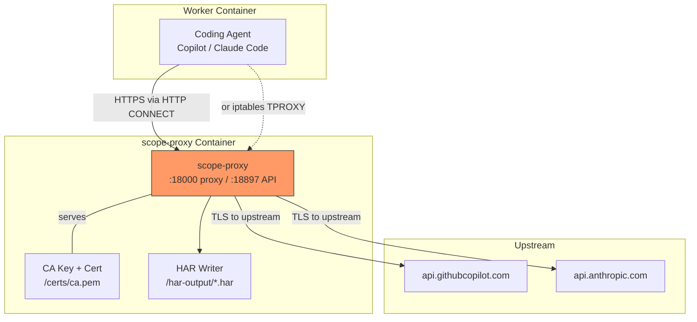
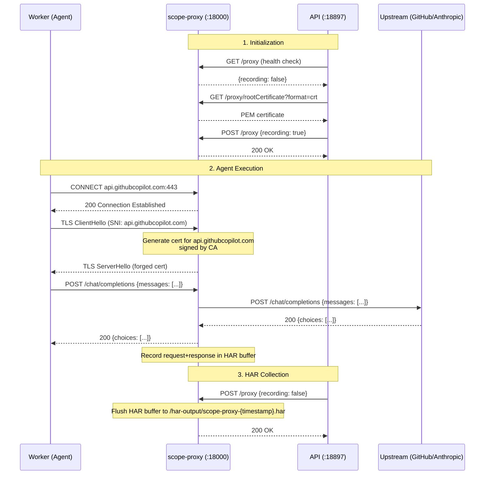
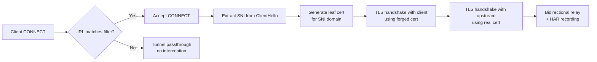
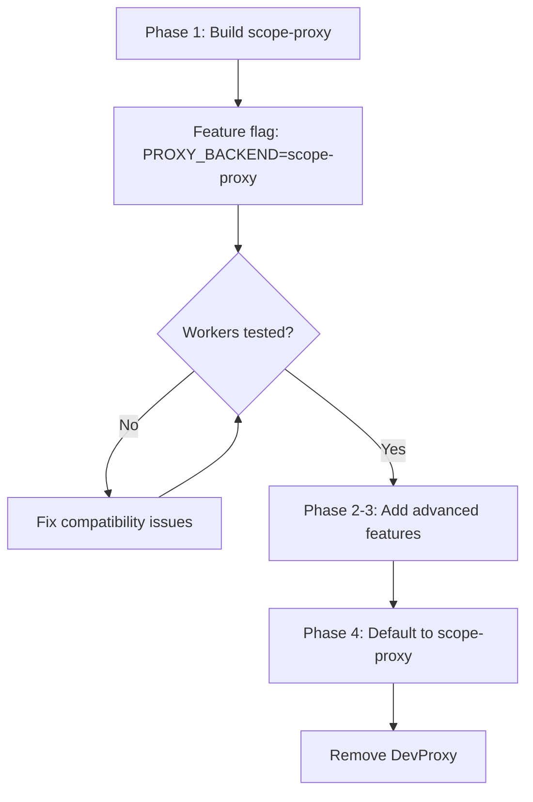

# Design: Rust TLS Intercepting HTTP Proxy (`scope-proxy`)

> **Status:** Draft  
> **Date:** 2026-04-27  
> **Branch:** `feat/rust-tls-proxy`

## Problem

Scope uses [Microsoft DevProxy](https://github.com/dotnet/dev-proxy) (a .NET tool) as a sidecar to intercept HTTPS traffic from coding agents and record it as HAR files. This works but has drawbacks:

| Issue | Detail |
|-------|--------|
| **Image size** | `ghcr.io/dotnet/dev-proxy:2.1.0` pulls ~200 MB; requires .NET runtime |
| **Init container** | Needs a busybox init sidecar to fix UID 1000 volume permissions |
| **Control API surface** | Only exposes start/stop recording + cert download; no hooks for real-time inspection |
| **Opacity** | Closed-source plugin model (HarGeneratorPlugin DLL); hard to extend or debug |
| **No transparent mode** | Only works as an explicit HTTP proxy (`HTTP_PROXY` env var); cannot intercept traffic from binaries that ignore proxy settings |

A purpose-built Rust proxy (`scope-proxy`) can solve all of these while remaining **API-compatible** with the existing `DevProxyClient` TypeScript code, enabling a zero-change migration path.

## Goals

1. **Drop-in replacement** for DevProxy — same control API endpoints, same HAR output format
2. **TLS interception** with on-the-fly certificate generation (MITM via custom CA)
3. **Transparent proxy mode** via iptables `TPROXY`/`REDIRECT` — intercept traffic from binaries that don't honor `HTTP_PROXY`
4. **Tiny footprint** — static Rust binary, ~10 MB Docker image (distroless/scratch)
5. **Extensible** — plugin hooks for real-time request/response inspection (future: rate limiting, fault injection, token counting)
6. **HAR 1.2 output** — identical format to DevProxy, consumed by existing `har-parser.ts`

## Non-Goals

- Replacing the HAR parser in `packages/shared/src/har/` (it stays in TypeScript)
- Caching or CDN behavior
- Acting as a reverse proxy

## Architecture

### Component Diagram



### Traffic Flow



## Detailed Design

### 1. Project Layout

```
apps/
  scope-proxy/                    # New Rust crate
    Cargo.toml
    Dockerfile
    README.md
    src/
      main.rs                     # Entry point, CLI args, signal handling
      config.rs                   # Configuration (ports, URL filters, cert paths)
      proxy/
        mod.rs
        handler.rs                # HTTP CONNECT + plain HTTP forwarding
        tls.rs                    # TLS interception, dynamic cert generation
        transparent.rs            # iptables TPROXY/REDIRECT support (Phase 2)
      api/
        mod.rs
        server.rs                 # Axum REST API on :18897
        routes.rs                 # /proxy, /proxy/rootCertificate
      har/
        mod.rs
        writer.rs                 # HAR 1.2 JSON writer
        types.rs                  # HAR data model (serde)
      ca/
        mod.rs
        generator.rs              # CA key pair generation + leaf cert signing
      filters/
        mod.rs
        url_matcher.rs            # Glob-based URL matching (urlsToWatch equivalent)
    tests/
      integration/
        proxy_test.rs             # End-to-end: proxy → upstream → HAR
        api_test.rs               # Control API tests
        tls_test.rs               # Certificate generation + validation
    config/
      default.json                # Default config (mirrors devproxy-config.json schema)
```

### 2. Rust Crate Dependencies

```toml
[dependencies]
tokio = { version = "1", features = ["full"] }
hyper = { version = "1", features = ["http1", "http2", "server", "client"] }
hyper-util = "0.1"
axum = "0.8"
rustls = "0.23"
tokio-rustls = "0.26"
rcgen = "0.13"                     # Dynamic certificate generation
webpki-roots = "0.26"             # Mozilla CA bundle for upstream TLS
serde = { version = "1", features = ["derive"] }
serde_json = "1"
chrono = "0.4"                     # HAR timestamps
glob = "0.3"                       # URL pattern matching
tracing = "0.1"
tracing-subscriber = "0.3"
clap = { version = "4", features = ["derive"] }  # CLI args
base64 = "0.22"
http = "1"
bytes = "1"

[dev-dependencies]
reqwest = { version = "0.12", features = ["rustls-tls"] }
tempfile = "3"
wiremock = "0.6"                   # Mock upstream servers in tests
```

### 3. Control API (DevProxy-Compatible)

The REST API on port 18897 must be wire-compatible with the existing `DevProxyClient`:

| Endpoint | Method | Request | Response | DevProxy Equivalent |
|----------|--------|---------|----------|---------------------|
| `/proxy` | `GET` | — | `{"recording": bool, "configFile": "..."}` | Same |
| `/proxy` | `POST` | `{"recording": true/false}` | `200` | Same |
| `/proxy/rootCertificate?format=crt` | `GET` | — | PEM certificate body | Same |

**Zero changes** needed in `DevProxyClient` TypeScript code.

### 4. TLS Interception



**Certificate generation strategy:**

- On startup, generate (or load from `/certs/`) a self-signed CA key pair
- For each intercepted TLS connection:
  1. Parse the SNI from the `ClientHello`
  2. Check an in-memory LRU cache for an existing leaf cert for that domain
  3. If miss: use `rcgen` to generate a leaf cert signed by the CA, with `subjectAltName` = SNI domain, short TTL (24h)
  4. Cache the cert (bounded LRU, ~1000 entries)
- The CA cert is served at `GET /proxy/rootCertificate?format=crt`

### 5. HAR Recording

**HAR 1.2 spec** (http://www.softwareishard.com/blog/har-12-spec/):

- Maintain an in-memory `Vec<HarEntry>` per recording session
- Each intercepted request/response pair → one `HarEntry`
- On `POST /proxy {recording: false}`:
  1. Serialize to JSON
  2. Write to `/har-output/scope-proxy-{ISO8601-timestamp}.har`
  3. Clear buffer
- File naming: `scope-proxy-` prefix (vs DevProxy's `devproxy-` prefix) — update `getLatestHarFile()` glob in `DevProxyClient` to match both

**Response body handling:**
- Buffer full response bodies (for HAR `content.text`)
- For large responses (>1 MB), store as base64 with `content.encoding: "base64"`
- SSE streams: accumulate full body (needed for token extraction from streaming responses)

### 6. URL Filtering

Match the DevProxy `urlsToWatch` config format:

```json
{
  "urlsToWatch": [
    "https://api.githubcopilot.com/*",
    "https://api.anthropic.com/*"
  ]
}
```

- Convert glob patterns to regex at startup
- Non-matching URLs: tunnel passthrough (no MITM, no HAR recording)
- Matching URLs: full interception + recording

### 7. Configuration

Support both CLI flags and a JSON config file (DevProxy-compatible schema):

```json
{
  "urlsToWatch": ["https://api.githubcopilot.com/*"],
  "port": 18000,
  "apiPort": 18897,
  "harOutputDir": "/har-output",
  "certDir": "/certs",
  "includeSensitiveInformation": false,
  "includeResponse": true,
  "logLevel": "info"
}
```

CLI:
```bash
scope-proxy --config /config/proxy.json
scope-proxy --port 18000 --api-port 18897 --har-dir /har-output
```

### 8. Docker Image

```dockerfile
# Build stage
FROM rust:1.86-alpine AS builder
RUN apk add --no-cache musl-dev
WORKDIR /build
COPY . .
RUN cargo build --release --target x86_64-unknown-linux-musl

# Runtime stage
FROM scratch
COPY --from=builder /build/target/x86_64-unknown-linux-musl/release/scope-proxy /scope-proxy
COPY --from=builder /etc/ssl/certs/ca-certificates.crt /etc/ssl/certs/
EXPOSE 18000 18897
ENTRYPOINT ["/scope-proxy"]
```

**Expected image size:** ~10-15 MB (vs ~200 MB for DevProxy)

No init container needed — the binary runs as any UID (no .NET runtime, no home directory requirements).

### 9. Docker Compose Integration

Replace the DevProxy sidecar with `scope-proxy`:

```yaml
# BEFORE (3 containers per worker)
devproxy-copilot:
  image: ghcr.io/dotnet/dev-proxy:2.1.0
  # ...
devproxy-copilot-init:
  image: busybox:1.37
  # ...

# AFTER (1 container per worker)
scope-proxy-copilot:
  build:
    context: ./apps/scope-proxy
    dockerfile: Dockerfile
  command: ["--config", "/config/proxy.json"]
  volumes:
    - ./apps/workers/coder-acp-copilot/proxy-config.json:/config/proxy.json:ro
    - copilot_har_output:/har-output
    - copilot_proxy_cert:/certs
  ports:
    - "${PROXY_COPILOT_API_PORT:-18800}:18897"
  healthcheck:
    test: ["/scope-proxy", "--health-check"]  # Built-in health check mode
    interval: 5s
    timeout: 3s
    retries: 10
```

**Per-worker savings:** 2 containers eliminated (DevProxy + init), replaced by 1 lightweight container.

## Implementation Phases

### Phase 1: Core Proxy + HAR (MVP)

**Goal:** Drop-in replacement for DevProxy in explicit proxy mode.

| Task | Description | Estimate |
|------|-------------|----------|
| 1.1 | Scaffold Rust crate (`apps/scope-proxy/`) with Cargo.toml, CI integration | — |
| 1.2 | Implement HTTP CONNECT tunnel handler (hyper) | — |
| 1.3 | Implement TLS interception with dynamic cert generation (rcgen + rustls) | — |
| 1.4 | Implement HAR 1.2 writer with request/response recording | — |
| 1.5 | Implement control API (axum): `/proxy` GET/POST, `/proxy/rootCertificate` | — |
| 1.6 | Implement URL glob filtering (`urlsToWatch`) | — |
| 1.7 | JSON config file loading (DevProxy-compatible subset) | — |
| 1.8 | Dockerfile (multi-stage, static musl binary) | — |
| 1.9 | Integration tests (proxy + TLS + HAR + API) | — |
| 1.10 | Update `DevProxyClient` HAR file glob to match `scope-proxy-*` prefix | — |
| 1.11 | Add `scope-proxy` Docker Compose service alongside DevProxy (feature-flagged) | — |
| 1.12 | End-to-end test: run a worker with `scope-proxy` instead of DevProxy | — |

**Done when:** A worker can run with `scope-proxy` as its sidecar and produce identical HAR files.

### Phase 2: Transparent Proxy Mode

**Goal:** Intercept traffic from binaries that ignore `HTTP_PROXY` (e.g., some native CLIs).

| Task | Description |
|------|-------------|
| 2.1 | Add `TPROXY`/`REDIRECT` iptables listener (requires `NET_ADMIN` capability) |
| 2.2 | Recover original destination from socket options (`SO_ORIGINAL_DST`) |
| 2.3 | Route transparently intercepted connections through the same TLS MITM path |
| 2.4 | Docker Compose: add `cap_add: [NET_ADMIN]` + iptables setup script |
| 2.5 | Integration tests with a non-proxy-aware binary |

### Phase 3: Real-Time Hooks & Observability

**Goal:** Enable plugins for live traffic inspection.

| Task | Description |
|------|-------------|
| 3.1 | WebSocket endpoint for real-time request/response streaming |
| 3.2 | Plugin trait (`RequestInterceptor`) for custom logic (rate limiting, fault injection) |
| 3.3 | Built-in token counter plugin (real-time token usage without HAR parsing) |
| 3.4 | Prometheus metrics endpoint (`/metrics`) |

### Phase 4: Retire DevProxy

**Goal:** Remove DevProxy dependency entirely.

| Task | Description |
|------|-------------|
| 4.1 | Switch all workers to `scope-proxy` |
| 4.2 | Remove DevProxy Docker images, init containers, and config files |
| 4.3 | Update documentation |

## Migration Strategy



**Feature flag:** `PROXY_BACKEND` env var in Docker Compose:
- `devproxy` (default) — current behavior
- `scope-proxy` — use the Rust proxy

This allows gradual rollout per worker without breaking existing deployments.

## TypeScript Client Changes

Minimal changes to `DevProxyClient`:

1. **HAR file glob** — update `getLatestHarFile()` to match both `devproxy-*.har` and `scope-proxy-*.har`
2. **No other changes** — the REST API is wire-compatible

## Risks & Mitigations

| Risk | Mitigation |
|------|------------|
| SSE streaming body accumulation mismatches | Replicate DevProxy's exact buffering behavior; compare HAR output byte-for-byte in integration tests |
| Certificate compatibility with Node.js / native CLIs | Test with `NODE_EXTRA_CA_CERTS` and `SSL_CERT_FILE`; validate cert chain with OpenSSL |
| HTTP/2 support gaps | Start with HTTP/1.1 only (DevProxy also uses HTTP/1.1); add HTTP/2 in Phase 3 |
| Large response bodies causing OOM | Cap per-response buffer at 50 MB; truncate with marker in HAR |
| `TPROXY` requires `NET_ADMIN` | Phase 2 only; explicit proxy mode (Phase 1) needs no special capabilities |

## Open Questions

1. **Should `scope-proxy` live in `scope-mt-app/apps/` or as a separate top-level repo?**  
   Proposal: `apps/scope-proxy/` — keeps the monorepo pattern; Dockerfile builds independently.

2. **Should we support HTTP/2 between client and proxy?**  
   DevProxy doesn't. Start without it; add later if agents use HTTP/2.

3. **Should the proxy support WASM plugins for extensibility?**  
   Defer to Phase 3+ — Rust trait-based plugins are simpler to start with.
