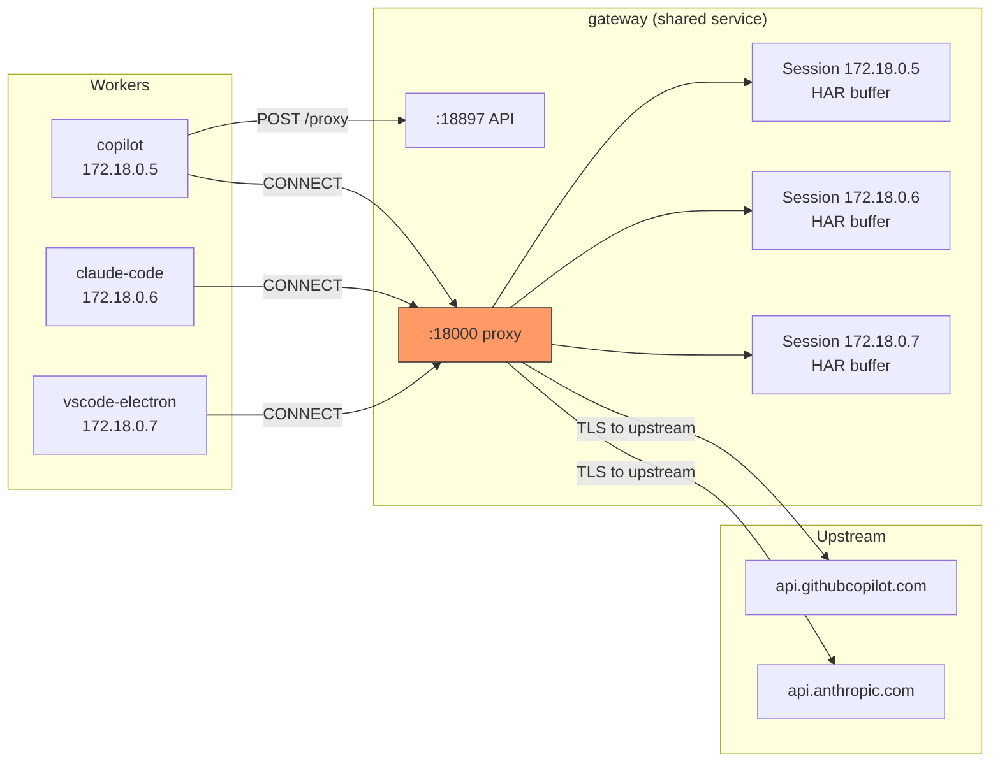
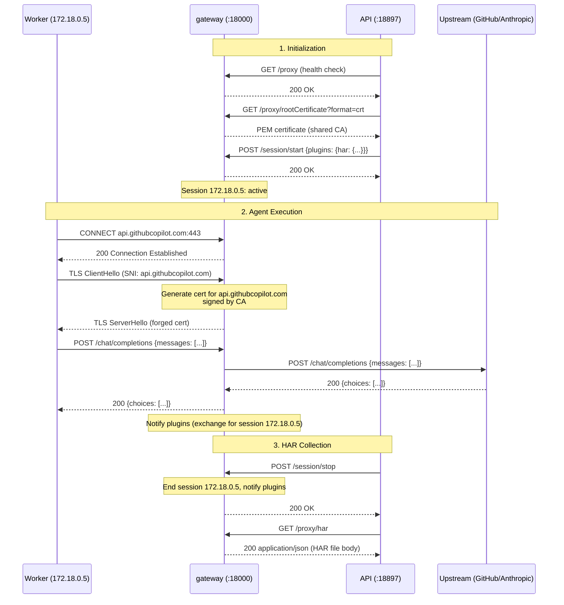
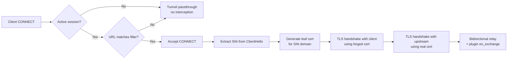
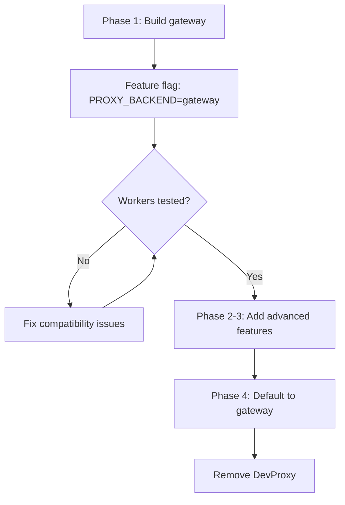

# Design: Rust TLS Intercepting HTTP Proxy (`gateway`)

> **Status:** Implemented (Phase 1.a — HAR plugin + VS Code Electron worker integration)  
> **Date:** 2026-04-27  
> **Branch:** `feat/rust-tls-proxy`  
> **PR:** [#702](https://github.com/growth-ecosystems/scope-core/pull/702)

## Problem

Scope uses [Microsoft DevProxy](https://github.com/dotnet/dev-proxy) (a .NET tool) as a sidecar to intercept HTTPS traffic from coding agents and record it as HAR files. This works but has drawbacks:

| Issue | Detail |
|-------|--------|
| **Image size** | `ghcr.io/dotnet/dev-proxy:2.1.0` pulls ~200 MB; requires .NET runtime |
| **Init container** | Needs a busybox init sidecar to fix UID 1000 volume permissions |
| **Sidecar sprawl** | 3 containers per worker (DevProxy + init + MCP gateway) × N workers |
| **Control API surface** | Only exposes start/stop recording + cert download; no hooks for real-time inspection |
| **Opacity** | Closed-source plugin model (HarGeneratorPlugin DLL); hard to extend or debug |
| **No transparent mode** | Only works as an explicit HTTP proxy (`HTTP_PROXY` env var); cannot intercept traffic from binaries that ignore proxy settings |

A purpose-built Rust proxy (`gateway`) can solve all of these while running as a **single shared service** instead of per-worker sidecars, using source-IP-based sessions to isolate traffic per worker.

## Goals

1. **Shared service** — one `gateway` instance serves all workers, with source-IP-keyed sessions
2. **API-compatible** with DevProxy — same control API endpoints, plus a new `GET /proxy/har` endpoint for HAR retrieval over HTTP (no shared volume needed)
3. **TLS interception** with on-the-fly certificate generation (MITM via custom CA)
4. **Transparent proxy mode** via iptables `TPROXY`/`REDIRECT` — intercept traffic from binaries that don't honor `HTTP_PROXY`
5. **Tiny footprint** — static Rust binary, ~10 MB Docker image (distroless/scratch)
6. **Extensible** — plugin hooks for real-time request/response inspection (future: rate limiting, fault injection, token counting)
7. **HAR 1.2 output** — identical format to DevProxy, consumed by existing `har-parser.ts`

## Non-Goals

- Replacing the HAR parser in `packages/shared/src/har/` (it stays in TypeScript)
- Caching or CDN behavior
- Acting as a reverse proxy

## Architecture

### Shared Proxy with Source-IP Sessions

Instead of N sidecar proxies (one per worker), `gateway` runs as a **single shared service**. Each worker container has a unique IP on the Docker/K8S network. The proxy uses the TCP source IP to key sessions — no explicit session IDs needed.



**Session isolation:** Every request — both proxy traffic (`:18000`) and control API calls (`:18897`) — is keyed by the caller's source IP. Workers don't need to know about sessions; the API behaves identically to DevProxy from their perspective.

**Localhost fallback:** When running outside Docker (all traffic from `127.0.0.1`), sessions all map to the same IP. For local development, use Docker Compose which assigns per-container IPs. A future enhancement could add an optional header-based session override if needed.

### Traffic Flow



## Detailed Design

### 1. Project Layout

```
apps/
  gateway/                    # New Rust crate
    Cargo.toml
    Dockerfile
    README.md
    src/
      main.rs                     # Entry point, CLI args, signal handling
      config.rs                   # Configuration (ports, URL filters, cert paths)
      session.rs                  # Source-IP session manager (HashMap<IpAddr, Session>)
      plugin.rs                   # Plugin trait + plugin registry
      proxy/
        mod.rs
        handler.rs                # HTTP CONNECT + plain HTTP forwarding
        tls.rs                    # TLS interception, dynamic cert generation
        transparent.rs            # iptables TPROXY/REDIRECT support (Phase 2)
      api/
        mod.rs
        server.rs                 # Axum REST API on :18897
        routes.rs                 # /proxy, /proxy/rootCertificate, /proxy/har
      plugins/
        mod.rs                    # Re-exports built-in plugins
        har/
          mod.rs
          plugin.rs               # HarPlugin: impl ProxyPlugin
          writer.rs               # HAR 1.2 JSON serializer
          types.rs                # HAR data model (serde)
      ca/
        mod.rs
        generator.rs              # CA key pair generation + leaf cert signing
      filters/
        mod.rs
        url_matcher.rs            # Glob-based URL matching (urlsToWatch equivalent)
    tests/
      integration/
        proxy_test.rs             # End-to-end: proxy → upstream → HAR
        api_test.rs               # Control API + session isolation tests
        tls_test.rs               # Certificate generation + validation
        plugin_test.rs            # Plugin lifecycle + custom plugin tests
    config/
      default.yaml                # Default config
```

### 2. Rust Crate Dependencies

```toml
[dependencies]
tokio = { version = "1", features = ["full"] }
hyper = { version = "1", features = ["http1", "http2", "server", "client"] }
hyper-util = "0.1"
axum = "0.8"
rustls = "0.23"
tokio-rustls = "0.26"
rcgen = "0.13"                     # Dynamic certificate generation
webpki-roots = "0.26"             # Mozilla CA bundle for upstream TLS
serde = { version = "1", features = ["derive"] }
serde_json = "1"
serde_yaml = "0.9"                  # Config file parsing
chrono = "0.4"                     # HAR timestamps
glob = "0.3"                       # URL pattern matching
tracing = "0.1"
tracing-subscriber = "0.3"
clap = { version = "4", features = ["derive"] }  # CLI args
base64 = "0.22"
http = "1"
bytes = "1"

[dev-dependencies]
reqwest = { version = "0.12", features = ["rustls-tls"] }
tempfile = "3"
wiremock = "0.6"                   # Mock upstream servers in tests
```

### 3. Control API

The REST API on port 18897 provides session management, certificate download, and plugin endpoints:

| Endpoint | Method | Request | Response | Notes |
|----------|--------|---------|----------|-------|
| `/proxy` | `GET` | — | `{"active": bool}` | Per-session status (is session active?) |
| `/proxy/rootCertificate?format=crt` | `GET` | — | PEM certificate body | Shared CA (same for all sessions) |
| `/session/start` | `POST` | `{"plugins": { ... }}` | `200` | Start session. Accepts per-plugin settings. |
| `/session/stop` | `POST` | — | `200` | Stop session. Notifies plugins to finalize. |
| `/proxy/har` | `GET` | — | `200` HAR JSON body | Returns the finalized HAR for the caller's session. |

**`POST /session/start` request body:**

```json
{
  "plugins": {
    "har": {
      "includeSensitiveInformation": false
    }
  }
}
```

Each key under `plugins` maps to a registered plugin name. The value is a `serde_json::Value` passed to that plugin's `on_session_start`. Unrecognized plugin keys are ignored. Omitted plugins receive an empty object `{}`.

**Session resolution:** Extract source IP from the TCP connection. If `X-Session-Id` header is present, use that instead (localhost dev fallback).

**`GET /proxy/har` semantics:**
- Returns `200 application/json` with the HAR body if the session has been stopped via `POST /session/stop`
- Returns `404` if no session exists or the session is still active
- Idempotent — the JSONL file remains on disk (deleted during session cleanup, not on read)

This eliminates the need for shared volumes between proxy and workers for HAR file exchange.

### 4. TLS Interception



**Certificate generation strategy:**

- On startup, generate (or load from `/certs/`) a self-signed CA key pair
- For each intercepted TLS connection:
  1. Parse the SNI from the `ClientHello`
  2. Check an in-memory LRU cache for an existing leaf cert for that domain
  3. If miss: use `rcgen` to generate a leaf cert signed by the CA, with `subjectAltName` = SNI domain, short TTL (24h)
  4. Cache the cert (bounded LRU, ~1000 entries)
- The CA cert is served at `GET /proxy/rootCertificate?format=crt`

### 5. Plugin Architecture

The proxy core knows nothing about HAR, metrics, or any specific observation format. All traffic observation is handled by **plugins** — Rust trait objects registered at startup.

#### Plugin Trait

```rust
/// Called by the proxy core for every intercepted request/response pair.
#[async_trait]
pub trait ProxyPlugin: Send + Sync {
    /// Unique name (used in config and API routes).
    fn name(&self) -> &str;

    /// Called when a session starts.
    /// `settings` is the plugin-specific JSON from the POST /session/start body
    /// (e.g., `{"includeSensitiveInformation": false}` for the HAR plugin).
    fn on_session_start(&self, session_id: &SessionId, settings: &serde_json::Value);

    /// Called for each intercepted request/response pair.
    fn on_exchange(&self, session_id: &SessionId, exchange: &HttpExchange);

    /// Called when a session stops (POST /session/stop). Plugin should finalize any buffered data.
    fn on_session_stop(&self, session_id: &SessionId);

    /// Called when a session is reaped (idle timeout or explicit clear).
    fn on_session_clear(&self, session_id: &SessionId);

    /// Optional: register additional API routes (e.g., GET /proxy/har).
    /// Returns an Axum Router that will be nested under `/proxy/plugins/{name}/`.
    fn api_routes(&self) -> Option<axum::Router> {
        None
    }
}
```

`HttpExchange` contains the full request (method, URL, headers, body) and response (status, headers, body) — bodies are `Bytes` so plugins can inspect or copy as needed.

#### Plugin Registry

```rust
pub struct PluginRegistry {
    plugins: Vec<Arc<dyn ProxyPlugin>>,
}

impl PluginRegistry {
    /// Broadcast to all plugins (non-blocking, parallel via tokio::spawn).
    pub async fn on_exchange(&self, session_id: &SessionId, exchange: &HttpExchange);
    pub fn on_session_start(&self, session_id: &SessionId, plugin_settings: &HashMap<String, serde_json::Value>);
    pub fn on_session_stop(&self, session_id: &SessionId);
    pub fn on_session_clear(&self, session_id: &SessionId);
}
```

Plugins are registered in `main.rs` at startup. The proxy core calls `registry.on_exchange()` after each intercepted request/response — plugins receive a shared reference and buffer internally.

#### Built-in: HAR Plugin (`plugins/har/`)

The HAR plugin is the first (and initially only) built-in plugin. It uses **disk-based buffering** to avoid memory pressure from large sessions.

- **Implements** `ProxyPlugin` trait
- **`on_session_start(settings)`** — reads `settings["includeSensitiveInformation"]` (default `false`) and stores it for the session. Creates a temp file (`{har_dir}/.session-{session_id}.jsonl`).
- **`on_exchange`** — serializes the `HarEntry` as a single JSON line and appends it to the session's temp file. **Redacts sensitive headers** (`authorization`, `x-github-token`, `x-api-key`, `cookie`, `set-cookie`) at write time when `includeSensitiveInformation` is `false`. Secrets never touch disk.
- **`on_session_stop`** — marks the session's JSONL as finalized (no more entries accepted). The JSONL temp file remains on disk.
- **`on_session_clear`** — deletes the temp JSONL file
- **`api_routes`** — registers `GET /proxy/har` (builds the HAR on the fly from the JSONL file for the caller's session)

**Disk layout** (`har_dir` defaults to `/har-output`):
```
/har-output/
  .session-172.18.0.5.jsonl           # Active/finalized session (append-only, one JSON line per exchange)
```

No separate `.har` file is written. The HAR envelope is assembled on the fly when `GET /proxy/har` is called by reading the JSONL entries and wrapping them in the HAR 1.2 structure.

**HAR 1.2 spec** (http://www.softwareishard.com/blog/har-12-spec/):

**Response body handling:**
- Each response body is serialized inline in the JSONL entry
- For large responses (>1 MB), store as base64 with `content.encoding: "base64"`
- SSE streams: accumulate full body before writing the entry (needed for token extraction from streaming responses)

**`GET /proxy/har` semantics** (registered by HAR plugin, served at `/proxy/har`):
- Reads the JSONL temp file, wraps entries in a HAR 1.2 envelope, and returns `200 application/json`
- Returns `404` if no session exists or the session is still active
- Idempotent — the JSONL file remains on disk and can be read multiple times (safe for client retries)
- The JSONL file is deleted during **session cleanup** (idle reap or next `on_session_start`)

#### Future Plugin: MetricsPlugin (Phase 3)

| Plugin | Purpose |
|--------|---------|
| `MetricsPlugin` | Prometheus `/metrics` endpoint — request count, latency histograms, bytes transferred, error rates, per-session and aggregate counters |

### 6. Session Lifecycle

- Sessions are created by `POST /session/start`; `POST /session/stop` ends a session
- **No session = passthrough.** Proxy traffic from an IP with no active session is forwarded directly to the upstream without TLS interception or plugin notification. This keeps the proxy transparent to workers that haven't started a session yet (or whose session was already reaped).
- Sessions are reaped after a configurable idle timeout (default: 5 min)
- Max concurrent sessions capped at 100 (safety valve)
- On session start/stop/clear, all plugins are notified via the registry with per-plugin settings

### 7. URL Filtering

Match the DevProxy `urlsToWatch` config format:

```json
{
  "urlsToWatch": [
    "https://api.githubcopilot.com/*",
    "https://api.anthropic.com/*"
  ]
}
```

- Convert glob patterns to regex at startup
- Non-matching URLs: tunnel passthrough (no MITM, no plugin notification)
- Matching URLs: full interception + plugin on_exchange

### 8. Configuration

Support both CLI flags and a YAML config file:

```yaml
urlsToWatch:
  - "https://api.githubcopilot.com/*"
port: 18000
apiPort: 18897
harOutputDir: /har-output
certDir: /certs
logLevel: info
defaultPluginSettings:
  har:
    includeSensitiveInformation: false
```

`defaultPluginSettings` provides defaults for each plugin. These can be overridden per-session in `POST /session/start`.

CLI:
```bash
gateway --config /config/proxy.yaml
gateway --port 18000 --api-port 18897 --har-dir /har-output
```

### 9. Docker Image

```dockerfile
# Build stage
FROM rust:1.86-alpine AS builder
RUN apk add --no-cache musl-dev
WORKDIR /build
COPY . .
RUN cargo build --release --target x86_64-unknown-linux-musl

# Runtime stage
FROM scratch
COPY --from=builder /build/target/x86_64-unknown-linux-musl/release/gateway /gateway
COPY --from=builder /etc/ssl/certs/ca-certificates.crt /etc/ssl/certs/
EXPOSE 18000 18897
ENTRYPOINT ["/gateway"]
```

**Expected image size:** ~10-15 MB (vs ~200 MB for DevProxy)

No init container needed — the binary runs as any UID (no .NET runtime, no home directory requirements).

### 9b. Build Integration (pnpm + CI)

#### pnpm script aliases

Add to root `package.json`:

```json
{
  "scripts": {
    "build:proxy": "cd apps/gateway && cargo build --release",
    "test:proxy": "cd apps/gateway && cargo test",
    "lint:proxy": "cd apps/gateway && cargo clippy -- -D warnings",
    "fmt:proxy": "cd apps/gateway && cargo fmt --check"
  }
}
```

Local dev: `pnpm build:proxy`, `pnpm test:proxy`. Requires Rust toolchain installed locally (via `rustup`).

#### CI pipeline (GitHub Actions)

Add a dedicated Rust job to the existing CI workflow (runs in parallel with the TypeScript jobs):

```yaml
rust-proxy:
  runs-on: ubuntu-latest
  defaults:
    run:
      working-directory: apps/gateway
  steps:
    - uses: actions/checkout@v4
    - uses: dtolnay/rust-toolchain@stable
      with:
        components: clippy, rustfmt
    - uses: Swatinem/rust-cache@v2
      with:
        workspaces: apps/gateway
    - run: cargo fmt --check
    - run: cargo clippy -- -D warnings
    - run: cargo test
    - run: cargo build --release --target x86_64-unknown-linux-musl
```

**Path filter:** Only trigger on changes to `apps/gateway/**` to avoid rebuilding Rust on TypeScript-only PRs.

#### Docker image CI

Extend the existing `build-acr.sh` / image build workflow to include `gateway`:

```bash
# In build-acr.sh or equivalent
docker build -t ${ACR_LOGIN_SERVER}/scoped/gateway:${TAG} apps/gateway/
docker push ${ACR_LOGIN_SERVER}/scoped/gateway:${TAG}
```

FluxCD image automation scans the ACR tag and auto-updates integration manifests (same pattern as existing workers).

### 10. Docker Compose Integration

Replace per-worker DevProxy sidecars with a single shared `gateway` service:

```yaml
# BEFORE (3 extra containers PER worker: DevProxy + init + volumes)
devproxy-copilot:
  image: ghcr.io/dotnet/dev-proxy:2.1.0
  # ...
devproxy-copilot-init:
  image: busybox:1.37
  # ...
devproxy-claude-code:
  image: ghcr.io/dotnet/dev-proxy:2.1.0
  # ...
devproxy-claude-code-init:
  image: busybox:1.37
  # ...

# AFTER (1 shared container for ALL workers)
gateway:
  build:
    context: ./apps/gateway
    dockerfile: Dockerfile
  command: ["--config", "/config/proxy.yaml"]
  volumes:
    - ./apps/gateway/config/default.yaml:/config/proxy.yaml:ro
    - gateway_cert:/certs
  ports:
    - "${SCOPE_PROXY_API_PORT:-18800}:18897"
  healthcheck:
    test: ["/gateway", "--health-check"]
    interval: 5s
    timeout: 3s
    retries: 10
```

Worker containers point to the shared proxy:

```yaml
coder-acp-copilot:
  environment:
    DEV_PROXY_ENABLED: "true"
    DEV_PROXY_API_URL: http://gateway:18897
    HTTP_PROXY: http://gateway:18000
    HTTPS_PROXY: http://gateway:18000
    NO_PROXY: "localhost,127.0.0.1,mongodb,redis,azurite,judge,api,token-manager,mcp-gateway-copilot"
    NODE_EXTRA_CA_CERTS: /tmp/dev-proxy-ca.crt
  depends_on:
    gateway: { condition: service_healthy }
```

**Savings:** For 3 workers with DevProxy, this eliminates **6 containers** (3 DevProxy + 3 init) → **1 shared container**.

### 11. Kubernetes Deployment Manifests

#### Deployment + Service

**File:** `deploy/base/gateway.yaml`

```yaml
---
apiVersion: apps/v1
kind: Deployment
metadata:
  name: gateway
  namespace: scoped
  labels:
    app: gateway
    app.kubernetes.io/part-of: scoped
spec:
  replicas: 1
  selector:
    matchLabels:
      app: gateway
  template:
    metadata:
      labels:
        app: gateway
      annotations:
        reloader.stakater.com/auto: "true"
    spec:
      containers:
        - name: gateway
          image: ${ACR_LOGIN_SERVER}/scoped/gateway  # {"$imagepolicy": "flux-system:gateway"}
          args: ["--config", "/config/proxy.yaml"]
          ports:
            - containerPort: 18000
              name: proxy
            - containerPort: 18897
              name: api
          resources:
            requests:
              cpu: 100m
              memory: 128Mi
            limits:
              cpu: 500m
              memory: 512Mi
          readinessProbe:
            httpGet:
              path: /proxy
              port: 18897
            initialDelaySeconds: 3
            periodSeconds: 5
          livenessProbe:
            httpGet:
              path: /proxy
              port: 18897
            initialDelaySeconds: 10
            periodSeconds: 15
          volumeMounts:
            - name: config
              mountPath: /config
              readOnly: true
            - name: certs
              mountPath: /certs
      volumes:
        - name: config
          configMap:
            name: gateway-config
        - name: certs
          emptyDir: {}
      terminationGracePeriodSeconds: 15

---
apiVersion: v1
kind: Service
metadata:
  name: gateway-service
  namespace: scoped
spec:
  selector:
    app: gateway
  ports:
    - name: proxy
      port: 18000
      targetPort: proxy
    - name: api
      port: 18897
      targetPort: api
```

#### ConfigMap

**File:** `deploy/base/gateway-config.yaml`

```yaml
apiVersion: v1
kind: ConfigMap
metadata:
  name: gateway-config
  namespace: scoped
data:
  proxy.yaml: |
    urlsToWatch:
      - "https://api.enterprise.githubcopilot.com/*"
      - "https://api.github.com/*"
      - "https://api.githubcopilot.com/*"
      - "https://*.githubcopilot.com/*"
      - "https://api.anthropic.com/*"
    port: 18000
    apiPort: 18897
    certDir: /certs
    logLevel: info
    defaultPluginSettings:
      har:
        includeSensitiveInformation: false
```

#### Worker Deployment Changes

Remove DevProxy sidecar, init container, and volumes from each worker. Point to the shared service:

```yaml
# In each worker Deployment (coder-acp-copilot, coder-acp-claude-code, etc.)
containers:
  - name: coder-acp-copilot
    env:
      - name: DEV_PROXY_ENABLED
        value: "true"
      - name: DEV_PROXY_API_URL
        value: "http://gateway-service.scoped.svc.cluster.local:18897"
      - name: HTTP_PROXY
        value: "http://gateway-service.scoped.svc.cluster.local:18000"
      - name: HTTPS_PROXY
        value: "http://gateway-service.scoped.svc.cluster.local:18000"
      - name: NO_PROXY
        value: "localhost,127.0.0.1,judge-service.scoped.svc.cluster.local,token-manager-service.scoped.svc.cluster.local,api-service.scoped.svc.cluster.local"
      - name: NODE_EXTRA_CA_CERTS
        value: "/tmp/dev-proxy-ca.crt"

# REMOVE from each worker:
# - initContainers[fix-permissions]
# - containers[devproxy]
# - volumes[devproxy-config, har-output, devproxy-cert]
```

**Per-worker pod savings:** 2 containers removed (devproxy sidecar + fix-permissions init), 3 volumes removed (devproxy-config, har-output, devproxy-cert).

#### Kustomize Integration

Add to `deploy/base/kustomization.yaml`:

```yaml
resources:
  # ...existing resources...
  - gateway.yaml
  - gateway-config.yaml
```

Add to `deploy/base/workers/kustomization.yaml`: remove references to `devproxy-config.yaml`, `devproxy-claude-code-config.yaml`, `devproxy-vscode-electron-driver-ext-config.yaml`.

FluxCD image automation in `deploy/overlays/integration/images.yaml`:

```yaml
- name: gateway
  newName: ${ACR_LOGIN_SERVER}/scoped/gateway  # {"$imagepolicy": "flux-system:gateway"}
  newTag: "latest"  # Overwritten by image automation
```

### 12. Unit Testing Strategy

#### Rust Unit Tests (`#[cfg(test)]` modules)

Each source module includes co-located unit tests:

| Module | Unit Tests |
|--------|------------|
| `session.rs` | Create session by IP, create by `X-Session-Id`, retrieve by IP, session idle reaping, max session cap, concurrent session access |
| `config.rs` | Parse YAML config, CLI flag overrides, default values, invalid config errors |
| `plugin.rs` | Register plugin, broadcast on_exchange to all plugins, on_session_start dispatches per-plugin settings, plugin API route mounting |
| `plugins/har/types.rs` | Serialize HAR entry, serialize full HAR log, base64 encoding for large bodies, timestamp formatting |
| `plugins/har/writer.rs` | Build HAR from entries, empty HAR, truncation at size limit |
| `plugins/har/plugin.rs` | on_session_start creates temp JSONL file with per-session settings, on_exchange appends entry to disk, on_session_stop marks finalized, GET /proxy/har builds HAR from JSONL on the fly, on_session_clear deletes JSONL, sensitive header redaction controlled by start settings |
| `ca/generator.rs` | Generate CA key pair, sign leaf cert for domain, leaf cert has correct SAN, leaf cert validates against CA, LRU cache eviction |
| `filters/url_matcher.rs` | Glob-to-regex conversion, match `https://api.github.com/foo`, reject `https://other.com/bar`, wildcard `*` semantics, edge cases (empty pattern, trailing slash) |
| `proxy/handler.rs` | Parse CONNECT request, extract host:port, reject malformed CONNECT, plain HTTP forwarding, passthrough when no active session |
| `proxy/tls.rs` | SNI extraction from ClientHello bytes, cert selection from cache, cache miss triggers generation |
| `api/routes.rs` | GET /proxy returns session state, POST /session/start creates session with plugin settings, POST /session/stop ends session, GET /proxy/rootCertificate returns PEM, GET /proxy/har returns HAR body, GET /proxy/har returns 404 when no stopped session, session isolation (two IPs see independent state) |

Run with `cargo test` (no external dependencies needed — all unit tests use in-memory state).

#### Rust Integration Tests (`tests/integration/`)

These test the full proxy stack end-to-end:

| Test | Description |
|------|-------------|
| `proxy_test::connect_and_record` | Start proxy → CONNECT to mock upstream → verify HAR contains request + response |
| `proxy_test::no_session_passthrough` | CONNECT before POST /session/start → verify traffic tunneled without interception, no HAR entry |
| `proxy_test::url_filter_passthrough` | CONNECT to non-matching URL → verify no HAR entry, traffic tunneled |
| `proxy_test::sse_streaming_body` | Upstream sends SSE stream → verify full body accumulated in HAR |
| `proxy_test::large_response_base64` | Response >1 MB → verify base64 encoding in HAR |
| `api_test::session_lifecycle` | POST /session/start → POST /session/stop → GET /proxy/har → verify HAR content |
| `api_test::multi_session_isolation` | Two clients (different source IPs via loopback aliases) → verify independent session state and HAR buffers |
| `api_test::x_session_id_header` | Requests with `X-Session-Id` header → sessions keyed by header value instead of IP |
| `tls_test::cert_generation_and_trust` | Generate CA → generate leaf for `example.com` → verify leaf validates against CA with `webpki` |
| `tls_test::sni_based_cert_selection` | Two CONNECT requests to different domains → verify different leaf certs |
| `tls_test::cert_cache_reuse` | Two CONNECT requests to same domain → verify same leaf cert returned |
| `plugin_test::har_plugin_lifecycle` | Register HAR plugin → POST /session/start with settings → proxy traffic → POST /session/stop → GET /proxy/har → verify HAR |
| `plugin_test::custom_plugin` | Register a test plugin implementing `ProxyPlugin` → verify `on_exchange` called for each request |
| `plugin_test::multiple_plugins` | Register HAR + test plugin → verify both receive all exchanges independently |

Run with `cargo test --test '*'` (uses `wiremock` for mock upstream, `reqwest` as HTTP client).

#### TypeScript Tests (DevProxyClient changes)

Update existing tests in `packages/shared/src/devproxy/devproxy-client.test.ts`:

| Test | Description |
|------|-------------|
| `startSession` sends plugin settings | Mock `POST /session/start` → verify plugin settings sent in request body |
| `stopAndCollectHar` via HTTP | `POST /session/stop` + `GET /proxy/har` → verify HAR parsed correctly |
| `stopAndCollectHar` fallback to filesystem | When `GET /proxy/har` returns 404, fall back to `getLatestHarFile()` (backward compat with DevProxy) |
| `X-Session-Id header` | When `WORKER_NAME` env var is set and source IP is `127.0.0.1`, verify header is sent on all API calls |

## Implementation Phases

### Phase 1: Core Proxy + HAR (MVP)

**Goal:** Shared proxy service with source-IP sessions, replacing DevProxy.

| Task | Description |
|------|-------------|
| 1.1 | Scaffold Rust crate (`apps/gateway/`) with Cargo.toml, CI integration |
| 1.2 | Add pnpm script aliases (`build:proxy`, `test:proxy`, `lint:proxy`, `fmt:proxy`) to root `package.json` |
| 1.3 | Add Rust CI job (fmt + clippy + test + build) with path filter to GitHub Actions workflow |
| 1.4 | Add `gateway` Docker image build to `build-acr.sh` / image CI pipeline |
| 1.5 | Implement `ProxyPlugin` trait and `PluginRegistry` (`plugin.rs`) |
| 1.6 | Implement source-IP session manager (`session.rs`) with idle reaping + plugin lifecycle hooks |
| 1.7 | Implement HTTP CONNECT tunnel handler (hyper) with session-aware routing + plugin `on_exchange` broadcast |
| 1.8 | Implement TLS interception with dynamic cert generation (rcgen + rustls) |
| 1.9 | Implement HAR plugin (`plugins/har/`) — first built-in plugin, registers `GET /proxy/har` |
| 1.10 | Implement control API (axum): `GET /proxy`, `POST /session/start`, `POST /session/stop`, `GET /proxy/rootCertificate` + plugin route mounting |
| 1.11 | Implement `X-Session-Id` header override for localhost dev |
| 1.12 | Implement URL glob filtering (`urlsToWatch`) |
| 1.13 | YAML config file loading |
| 1.14 | Unit tests for all modules (see [Unit Testing Strategy](#12-unit-testing-strategy)) |
| 1.15 | Integration tests (proxy + TLS + HAR + API + multi-session isolation + plugin lifecycle) |
| 1.16 | Dockerfile (multi-stage, static musl binary) |
| 1.17 | Docker Compose: add shared `gateway` service (feature-flagged alongside DevProxy) |
| 1.18 | K8S manifests: `gateway.yaml` Deployment + Service, `gateway-config.yaml` ConfigMap |
| 1.19 | Update `DevProxyClient`: add `startSession()` / `stopSession()` / `downloadHar()` methods, add `X-Session-Id` header support |
| 1.20 | End-to-end test: run a worker with `gateway` instead of DevProxy |

**Done when:** All workers can run with the shared `gateway` service and produce identical HAR output via `GET /proxy/har`.

### Phase 2: Transparent Proxy Mode

**Goal:** Intercept traffic from binaries that ignore `HTTP_PROXY` (e.g., some native CLIs).

| Task | Description |
|------|-------------|
| 2.1 | Add `TPROXY`/`REDIRECT` iptables listener (requires `NET_ADMIN` capability) |
| 2.2 | Recover original destination from socket options (`SO_ORIGINAL_DST`) |
| 2.3 | Route transparently intercepted connections through the same TLS MITM path (session by source IP) |
| 2.4 | Docker Compose: add `cap_add: [NET_ADMIN]` + iptables setup script |
| 2.5 | K8S: add `NET_ADMIN` capability to gateway container security context |
| 2.6 | Unit + integration tests for transparent mode |

### Phase 3: Metrics Plugin & Observability

**Goal:** Ship the MetricsPlugin using the plugin architecture from Phase 1.

| Task | Description |
|------|-------------|
| 3.1 | `MetricsPlugin` — Prometheus `/metrics` endpoint, per-session and aggregate counters (request count, latency histograms, bytes transferred, error rates) |
| 3.2 | Plugin enable/disable via config (`"plugins": ["har", "metrics"]`) |
| 3.3 | Unit + integration tests for MetricsPlugin |

### Phase 4: Retire DevProxy

**Goal:** Remove DevProxy dependency entirely.

| Task | Description |
|------|-------------|
| 4.1 | Switch all workers to `gateway` (remove feature flag) |
| 4.2 | Remove DevProxy sidecar containers, init containers, and ConfigMaps from K8S manifests |
| 4.3 | Remove DevProxy Docker Compose services and volumes |
| 4.4 | Remove filesystem-based HAR retrieval from `DevProxyClient` (keep only `GET /proxy/har`) |
| 4.5 | Remove per-worker devproxy-config.json files |
| 4.6 | Update documentation |

## Migration Strategy



**Feature flag:** `PROXY_BACKEND` env var in Docker Compose:
- `devproxy` (default) — current behavior
- `gateway` — use the Rust proxy

This allows gradual rollout per worker without breaking existing deployments.

## TypeScript Client Changes

Changes to `DevProxyClient` in `packages/shared/src/devproxy/devproxy-client.ts`:

1. **New `startSession(pluginSettings)` method** — `POST /session/start` with per-plugin settings (e.g., `{ har: { includeSensitiveInformation: false } }`). Replaces `startRecording()`.
2. **New `stopSession()` method** — `POST /session/stop`. Replaces `stopRecording()`.
3. **New `downloadHar()` method** — `GET /proxy/har` → returns parsed HAR object. Used by `stopAndCollectHar()` as the primary HAR retrieval path.
4. **Fallback to filesystem** — if `GET /proxy/har` returns 404 (running against DevProxy, not gateway), fall back to `getLatestHarFile()` for backward compatibility during migration.
5. **`X-Session-Id` header** — when `WORKER_NAME` env var is set, include `X-Session-Id: {WORKER_NAME}` on all API requests. Only needed for localhost dev (Docker/K8S uses source IP).
6. **Remove `DEV_PROXY_HAR_DIR` dependency** — no longer needed once `GET /proxy/har` is the primary path. Keep as fallback during Phase 1.

## Risks & Mitigations

| Risk | Mitigation |
|------|------------|
| SSE streaming body accumulation mismatches | Replicate DevProxy's exact buffering behavior; compare HAR output byte-for-byte in integration tests |
| Certificate compatibility with Node.js / native CLIs | Test with `NODE_EXTRA_CA_CERTS` and `SSL_CERT_FILE`; validate cert chain with OpenSSL |
| HTTP/2 support gaps | Start with HTTP/1.1 only (DevProxy also uses HTTP/1.1); add HTTP/2 in Phase 3 |
| Large response bodies causing OOM | HAR plugin uses disk-based buffering (JSONL append per exchange). Only the single response body being proxied is in memory at a time. Per-response body cap at 50 MB with truncation marker. |
| `TPROXY` requires `NET_ADMIN` | Phase 2 only; explicit proxy mode (Phase 1) needs no special capabilities |
| Single point of failure (shared proxy) | Liveness probe auto-restarts. Workers degrade gracefully (continue without HAR if proxy is down — already handled by `DevProxyClient`). Phase 3 adds `/metrics` for alerting. |
| Session memory leaks (workers crash without stopping session) | Idle session reaping with configurable timeout (default: 5 min). Max session cap (100). Temp JSONL files cleaned up on reap. |
| Localhost dev: all traffic from 127.0.0.1 | `X-Session-Id` header override keyed by `WORKER_NAME` env var |

## Open Questions

1. ~~**Should `gateway` live in `scope-mt-app/apps/` or as a separate top-level repo?**~~  
   **Decided:** `apps/gateway/` — keeps the monorepo pattern; Dockerfile builds independently.

2. ~~**Sidecar vs shared service?**~~  
   **Decided:** Shared service with source-IP sessions. Eliminates container sprawl; workers don't need code changes.

3. ~~**How do workers retrieve HAR files?**~~  
   **Decided:** `GET /proxy/har` HTTP endpoint. No shared volumes needed between proxy and workers.

4. **Should we support HTTP/2 between client and proxy?**  
   DevProxy doesn't. Start without it; add later if agents use HTTP/2.

5. **Should the proxy support WASM plugins for extensibility?**  
   Defer to Phase 3+ — Rust trait-based plugins are simpler to start with.
