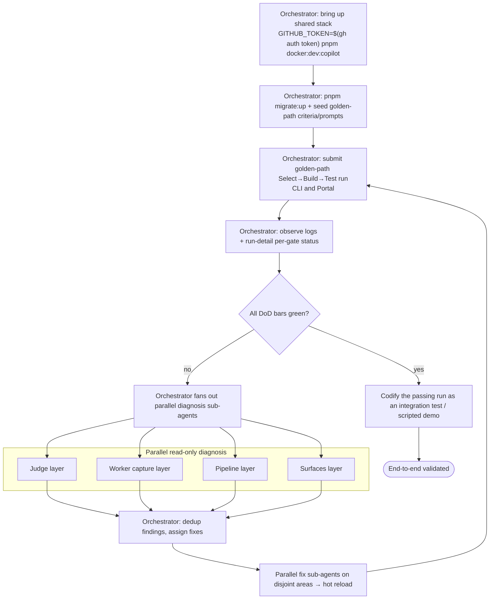
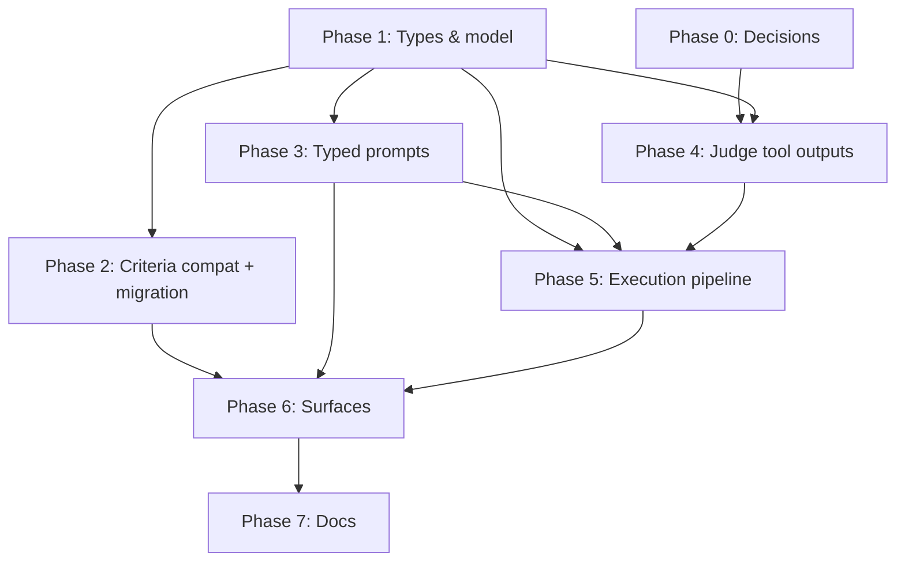

# Gates — Implementation Plan

> Status: **Draft**
> Design: [Gates — Multi-Phase Evaluation Pipeline](../design/gates.md)
> Issue: [growth-ecosystems/scope-project#97 — Taxonomy Build gate support](https://github.com/growth-ecosystems/scope-project/issues/97)
> Milestone: Self-service MVP

This plan sequences the work for building the gates pipeline. It is the *how/when*;
the *what/why* lives in the [design doc](../design/gates.md). Every phase below
links back to the design section it implements. Keep the design doc as the source
of truth for behaviour — if implementation forces a design change, update the
design doc first, then this plan.

## Scope for the first milestone

The data model accommodates all five gates (`select → build → test → run → deploy`),
but only **Select + Build + Test** are exercised end-to-end in the first milestone
(design §2 Non-Goals). Run / Deploy ride along in the schema and surfaces
but are not validated end-to-end yet.

## Definition of done — how we know it works

The milestone is **done** when all three bars below are green. Each phase has its
own exit criteria; these are the *holistic, observable* acceptance bars for the
whole effort. Prefer automated coverage (unit + integration); the golden-path
scenario should exist as an integration test or a scripted, repeatable demo run.

### Bar 1 — No regression (safety)

- An existing request with **no `gates`** produces an identical run to today: normalised to a single Select gate from `scenario.criteria` + `maxIterations` + `taskPromptId`, same criteria evaluated, same pass/fail outcome (design §4.3, §5).
- After migration `018`, every pre-existing criterion is Select-only and is **not** selectable for Build/Test/Run/Deploy (design §4.2.1).
- After the prompt backfill, every existing task prompt has `type: "select"` and its `_id` is **byte-for-byte unchanged**; every request/profile/report that referenced a `taskPromptId` still resolves (design §4.5, §4.7).
- Judge requests without `gate`/`toolCallsUrl` behave as Select; `read_tool_outputs` returns empty (design §5).

### Bar 2 — The new capability works (golden path)

A single end-to-end **Select → Build → Test** run demonstrates the feature:

1. Author a Build-compatible criterion (e.g. `builds_clean`, `gates: ["build"]`) and a Test-compatible criterion (e.g. `tests_pass`, `gates: ["test"]`).
2. Submit a run (from CLI **and** Portal) configuring three gates: Select (task prompt + its criteria), Build (a `type: "build"` prompt + `builds_clean`, `maxIterations > 1`), and Test (a `type: "test"` prompt + `tests_pass`, `maxIterations > 1`).
3. **Observe:** the agent implements the task; the Select gate's criteria pass; the pipeline advances to Build; the agent runs the build command; the judge calls `read_tool_outputs` and evaluates `builds_clean` against the captured build output (not just files); Build passes; the pipeline advances to Test; the agent runs the tests; the judge evaluates `tests_pass` against the captured test output; Test passes (design §4.4, §4.6).
4. **Run detail** (Portal + CLI) shows per-gate status — `Select: passed`, `Build: passed`, `Test: passed` — with turns grouped by gate (design §4.8, §4.7).

### Bar 3 — Edge rules hold

- **Stop-on-failure:** in a run where Build cannot pass, Build exhausts its budget and the pipeline halts; downstream gates are recorded/shown as **skipped** ("Build failed; Test/Run/Deploy skipped") (design §4.4).
- **Compatibility invariant:** making a `select`-only criterion a dependency of a `build` criterion is rejected at criteria create/update **and** at request submit, with a clear error (design §4.2).
- **Pass-through gate:** a configured gate with `maxIterations === 1` and no criteria runs once and auto-passes with **no judge call**; a gate with `maxIterations > 1` and no criteria is a validation error (design §4.3, §4.4).
- **Skipping:** a gate omitted from the submitted `gates` array is not run, distinct from a configured pass-through gate (design §4.4).
- **Parity:** every flow above is exercisable from both Portal and CLI (design §4.8).

### Verification matrix

| Design behaviour | Verified by |
| --- | --- |
| Request normalisation (no `gates` ⇒ Select) | Unit (Phase 1) |
| Migration 018 + prompt backfill (ids stable) | Unit + migration up/down (Phases 2–3) |
| Compatibility invariant enforcement | Unit (Phase 2) |
| `read_tool_outputs` judge tool | Unit w/ fixture blob (Phase 4) |
| Sequential gates, per-gate budget, stop-on-failure, pass-through | Integration (Phase 5) |
| Golden-path Select→Build→Test run | Integration / scripted demo (Phases 5–6) |
| Per-gate status in run detail; CLI⇄Portal parity | Component/Storybook + manual demo (Phase 6) |

## Local validation loop (orchestrated Ralph loop)

Implementation does not stop at "code compiles" or "unit tests pass" — it **iterates against a real local stack until the end-to-end design works as expected**, i.e. until the [Definition of done](#definition-of-done--how-we-know-it-works) bars are green. This is a tight, repeatable loop (a "Ralph loop"), run as an **outer orchestrator loop that delegates the inner work to sub-agents**: the orchestrator owns convergence and the shared stack; sub-agents do the parallelizable implementation, diagnosis, and fixes.

### Local stack

Per the [root README](../../README.md#run-locally), validate against the full
Copilot stack with hot reload:

```bash
pnpm install
GITHUB_TOKEN=$(gh auth token) pnpm docker:dev:copilot
```

This runs core services (MongoDB, Redis, Azurite, API, Judge, Token Manager) plus
the Copilot worker, report generator, and **portal**, all with hot reload — most
code fixes are picked up without a restart. The portal is at
`http://localhost:5100` (in a worktree the port is offset — check `PORTAL_PORT`
in `.env` or run `pnpm open:portal`). `GITHUB_TOKEN=$(gh auth token)` exports the
GitHub token the worker needs.

There is **one shared stack, owned by the orchestrator.** The golden-path
integration run is stateful (single MongoDB / queue / worker set), so concurrent
runs would interfere. Only the orchestrator submits and observes golden-path runs;
sub-agents never run concurrent golden-path runs against it (see guardrails).

### Orchestration model — outer loop delegates to sub-agents

- **Outer loop = orchestrator agent** (single, long-lived coordinator). Owns: the shared local stack; decomposing remaining work into disjoint tasks; dispatching sub-agents; integrating their branches and resolving conflicts; submitting the golden path and observing it; checking the [Definition of done](#definition-of-done--how-we-know-it-works) bars; deciding done-or-iterate. **Integration runs are serialized through the orchestrator.**
- **Inner loop = sub-agents** (stateless, scoped, dispatched per task). Three kinds:
    - **Implementation sub-agents** — each owns a disjoint slice (a phase/track), implements it, and self-verifies (typecheck + its unit tests green) before handing back.
    - **Diagnosis sub-agents** — on a failed golden-path run, fan out **read-only** across layers to find root cause; return a hypothesis + a minimal proposed patch.
    - **Fix sub-agents** — apply one specific fix to a disjoint area and self-verify.

### The loop



1. **Bring up** the shared stack (orchestrator).
2. **Migrate + seed** (`pnpm migrate:up`); seed the Build/Test criteria (`builds_clean`, `tests_pass`) and gate prompts the golden path needs.
3. **Submit** the golden-path Select→Build→Test run from **both** CLI and Portal (orchestrator only — Bar 2).
4. **Observe** via streamed logs and the run-detail per-gate status.
5. **Check** against the [Definition of done](#definition-of-done--how-we-know-it-works) bars (no regression, golden path, edge rules).
6. **Diagnose (parallel) & fix** on failure — the orchestrator dispatches read-only diagnosis sub-agents across the judge, worker-capture, pipeline, and surfaces layers; dedups their findings; assigns fixes to fix sub-agents on disjoint files; hot reload picks them up. Repeat from step 3.
7. **Codify** once green: capture the passing run as an automated **integration test** (or scripted demo) so the end-to-end behaviour can't silently regress.

### Parallelization map (waves)

Sub-agents fan out where the [dependency graph](#dependency-graph) allows; serial waves are integration points the orchestrator owns.

| Wave | Phases | Concurrency | Notes |
| --- | --- | --- | --- |
| A | Phase 0 + Phase 1 | **Serial** (single agent) | Resolve decisions; land types & model. **Freeze shared types/contracts before fan-out.** |
| B | Phases 2, 3, 4 | **Parallel** (3 sub-agents) | Disjoint areas: criteria store+migration / prompt entity+migration / judge tool+contract. Each green on unit tests before handback. |
| C | Phase 5 | **Serial** | Execution pipeline integrates B; touches the shared loop. Orchestrator runs the first integration golden-path here. |
| D | Phase 6 | **Parallel** (per-surface sub-agents) | Criteria editor / prompt editor / submit-run config / run detail / profiles + Storybook — mostly disjoint Portal+CLI files. |
| E | Phase 7 | **Serial** | Docs. |

### Concurrency guardrails

- **One integration run at a time.** Only the orchestrator submits/observes the golden path on the single shared stack; parallel agents never run concurrent golden-path runs against it.
- **Disjoint ownership.** Each parallel sub-agent owns a non-overlapping file set; the orchestrator integrates and resolves any conflicts.
- **Freeze foundations before fan-out.** Shared types (Phase 1) and cross-cutting contracts (`JudgeEvaluateRequest`, `GateConfig`) are frozen before Wave B; changes to them route back through the orchestrator.
- **Self-verify before handback.** Each sub-agent runs typecheck + its unit tests green before returning.
- **Hot reload.** Most fixes land on the running stack without a restart; schema/env/migration changes may need a restart or `pnpm migrate:up`.

### Loop exit criteria

- The golden-path run passes end-to-end on the local stack from both surfaces.
- The edge-rule scenarios (stop-on-failure, invariant rejection, pass-through) reproduce locally.
- Bar 1 (no regression) holds: a legacy `gates`-less request still runs identically.
- The passing golden path is committed as a repeatable automated test.

> The loop is run continuously **from Phase 4 onward** (once the judge and pipeline
> can execute gates), tightening each phase. It is the primary acceptance gate for
> Phases 5–6 — not a one-time check at the end.

## Phase 0 — Resolve gating decisions (blocks Build/Test/Deploy)

Two design open questions (design §6) must be answered before the dependent
phases can land. Select-only gates are unaffected and can proceed in parallel.

| Decision | Design ref | Blocks | Recommendation |
| --- | --- | --- | --- |
| Where build/test/run/deploy commands execute (agent-driven vs platform step) | §6 Q1 | Phases 4, 5 (Build onward) | Agent-driven |
| Reliable structured tool-output capture across **all** worker types | §6 Q2 | Phase 4 (and Build/Test/Deploy in 5) | Persist structured tool calls per iteration in every worker |

**Exit criteria:** Q1 confirmed; Q2 has an agreed capture approach (which workers
change, what shape is persisted). Until then, Phase 4 can only be built/tested for
the Select gate (empty tool outputs).

## Phase 1 — Types & model (foundational)

Implements design §4.1, §4.2, §4.3, §4.5 (type-level only).

- Add `GATES`, `GateId`, `GATE_ORDER` and per-gate metadata (`packages/shared/src/types/types.ts`).
- Add `CriteriaConfig.gates?: GateId[]` (design §4.2).
- Add `PromptType = GateId` to the prompt entity type (design §4.5).
- Add `GateConfig` (`gate`, `promptId`, `criteria[]`, `maxIterations?`) and `gates?: GateConfig[]` on request input/document (design §4.3).
- Add `ConversationTurn.gate: GateId` (design §4.7).
- Implement the **normalisation rule**: absent `gates` → single Select gate from `scenario.criteria` + `maxIterations` + `taskPromptId` (design §4.3, §5).

**Tests:** unit tests for normalisation (absent `gates` ⇒ one Select gate) and schema validation. **Exit:** types compile; existing requests normalise unchanged.

## Phase 2 — Criteria compatibility + migration

Implements design §4.2, §4.2.1.

- Thread `gates` through `CriteriaStore`, both `CriteriaProvider` implementations, the criteria REST API, and YAML import/export.
- Enforce the **downward-closed compatibility invariant** (`compat(parent) ⊇ compat(child)`) at criteria create/update (alongside the existing cycle check) and at request submit (design §4.2).
- Add migration **`018-backfill-criteria-gates.ts`** pinning existing criteria to `["select"]` via `batchUpdate` (design §4.2.1).
- Update `config/criteria/*.yaml` seeds so a fresh seed/import matches the migrated state (Select-only unless authored for another gate).

**Tests:** invariant validation (reject `select`-only parent of a `build` child), migration up/down, YAML round-trip. **Exit:** `pnpm migrate:up` backfills; new criteria default to all gates, legacy criteria are Select-only.

## Phase 3 — Typed prompts + backfill

Implements design §4.5, §4.7.

- Add `type: PromptType` to the prompt entity (`packages/shared/src/schemas/task-prompt.ts` + store).
- Implement asymmetric `computePromptId(type, text)`: `select` stays text-only (preserves existing ids); other gates namespace `type` into the hash (design §4.5).
- `findOrCreate(type, text)`; prompt CRUD/editor filtering by type.
- **Field-only** migration backfilling existing prompts to `type: "select"` (no id rewrite — design §4.7, §5).
- Seed default non-Select gate prompts (default text is design §6 Q3 — can ship a first cut).

**Tests:** existing `select` prompt ids unchanged after backfill; `build` vs `test` of same text produce distinct ids; `build` never collides with legacy `select`. **Exit:** typed prompts persist; legacy task prompts keep exact ids.

## Phase 4 — Judge tool outputs

Implements design §4.6. **Depends on Phase 0 Q2** for Build/Test/Deploy.

- Add `gate` + `toolCallsUrl` to `JudgeEvaluateRequest` (`packages/shared/src/judge/judge-client.ts`).
- Add the `read_tool_outputs` judge tool (in `apps/judge/src/judge-strategies.ts` alongside `createFileTools`), backed by the per-iteration tool-calls blob (`writeToolCalls` / `toolCallsUrl`).
- Gate-aware system prompt for non-Select gates (instruct the judge to consult tool outputs).
- Back-compat: requests without `gate`/`toolCallsUrl` behave as Select; `read_tool_outputs` returns empty (design §5).

**Tests:** judge reads tool outputs from a fixture blob; Select path unaffected when fields absent. **Exit:** judge can evaluate a Build criterion against captured build output (once Phase 0 Q2 capture is in place).

## Phase 5 — Execution pipeline

Implements design §4.4. Depends on Phases 1, 3, 4.

- Generalise `runMultiTurnLoop` (`packages/shared/src/judge/multi-turn-loop.ts`) so the outer loop iterates gates in `GATE_ORDER`; the existing iteration loop runs inside each gate.
- Per-gate prompt, per-gate `maxIterations`, criteria-count rule (≥1 unless `maxIterations === 1` pass-through), same workspace across gates.
- **Stop-on-failure:** a gate that exhausts its budget halts the pipeline; downstream gates recorded as skipped (design §4.4).
- Pass `gate` + `toolCallsUrl` to the judge per iteration.
- Persist per-gate run summary (`run.gates` and/or derived from `run.turns`) (design §4.7).

**Tests:** multi-gate run (Select → Build → Test), pass-through gate (maxIterations 1, no criteria), stop-on-failure skips downstream, unconfigured gate skipped. **Validation:** run the [local validation loop](#local-validation-loop-ralph-loop) — submit the golden path and iterate until it passes on the live stack. **Exit:** a Select+Build+Test run executes, evaluates, and reports per-gate status end-to-end locally.

## Phase 6 — Surfaces (Portal + CLI parity)

Implements design §4.8. Depends on Phases 2, 3, 5.

- **Criteria editor** (Portal + CLI): edit a criterion's `gates` list.
- **Prompt editor** (Portal + CLI): typed prompts; create/edit per gate `type`; seed defaults.
- **Submit Run** (Portal `/runs/new` + CLI submit): per-gate section — prompt picker (filtered by gate `type`; Select shows the task prompt), criteria multiselect filtered to compatible criteria, `maxIterations` input; unconfigured gates omitted. Follow Portal UX v2 patterns (explicit composition, action counts).
- **Run detail** (Portal + CLI): group turns by gate; show per-gate status and the "downstream skipped" state.
- **Profiles**: persist gate config (prompts + criteria + budgets) for reuse/variation.
- Update Storybook stories for new/changed portal components.

**Tests:** Submit Run composition reflects the real expanded run count; criteria multiselect respects compatibility; Storybook play tests for new components. **Validation:** run the [local validation loop](#local-validation-loop-ralph-loop) end-to-end from the Portal (and CLI) until the golden path and edge rules pass. **Exit:** a Select+Build+Test run is fully submittable and reviewable from both Portal and CLI.

## Phase 7 — Docs

- Update `docs/architecture/overview.md`, `app-design.md`, `criteria-provider.md` to reflect gates.
- Promote the [design doc](../design/gates.md) to architecture once shipped; keep this plan as the historical record.

## Dependency graph



Phases 2, 3, and 4 (Select-only parts) can proceed in parallel once Phase 1 lands.
Build/Test/Deploy behaviour in Phases 4–5 is gated on Phase 0. This maps to the
[parallelization waves](#parallelization-map-waves): A (Phase 0+1, serial) →
B (2/3/4, parallel) → C (5, serial) → D (6, parallel) → E (7, serial).

## Validation results — golden path verified end-to-end

Validated locally against the full Copilot stack (\`GITHUB\_TOKEN=$(gh auth token)
pnpm docker:dev:copilot`) with model` claude-sonnet-4.6\`. All three Definition of
Done bars are green:

- **Bar 1 — No regression.** A request submitted with \*\*no `gates`\*\* ran as a
  single normalised Select gate (`gateSummaries: [{ select, passed, 1 }]`),
  identical to legacy behaviour.
- **Bar 2 — Golden path.** A `Select → Build → Test` run had every gate pass:
  `gateSummaries: [{select,passed,1},{build,passed,1},{test,passed,1}]`, turns
  grouped per gate with globally-unique iteration offsets, and the judge loaded
  the per-gate captured tool outputs (`Loaded N tool call(s) for gate '<gate>'`)
  so Build/Test were evaluated against command output, not just files. Run detail
  shows per-gate status in both CLI (`run get`) and Portal.
- **Bar 3 — Edge rules.**
    - *Stop-on-failure:* a Build gate that could not pass exhausted its budget
    (`build: failed, 2 iters`) and downstream \*\*Test was recorded `skipped` (0
    iters)\*\*.
    - *Compatibility invariant:* rejected at criteria create (a `build` child may
    not depend on a `select`-only parent) **and** at request submit (a `build`
    gate may not select a `select`-only criterion).
    - *Prompt typing:* a gate referencing a prompt of the wrong `type` is rejected
    with a clear error.
    - *Pass-through rule:* a non-Select gate with `maxIterations > 1` and no
    criteria is a validation error; with `maxIterations === 1` it is accepted.

See the [design doc](../design/gates.md) for the behaviour specifications these
results verify.