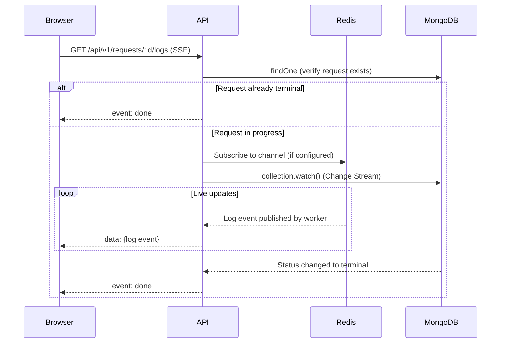

# Real-Time Data Flow: SSE, Change Streams & Polling

## Overview

The portal uses **two mechanisms** for real-time updates:

1. **SSE + MongoDB Change Streams** (+ optional Redis pub/sub) — for live log streaming on the run detail page
2. **React Query `refetchInterval` polling** — for periodic list/dashboard refreshes

## SSE Endpoint

```
GET /api/v1/requests/:id/logs?fromStart=true
```

Defined in `apps/api/src/index.ts`. Accepts an optional `fromStart=true` query param to replay existing logs from MongoDB before switching to live streaming.

### Server-Side Flow



### Key Behaviors

- **SSE heartbeat** every 30s (`:\n\n` comment) to prevent proxy/LB disconnects
- **Inactivity timeout** of 5 minutes — closes stream if no log messages forwarded
- **Redis pub/sub** is the primary log transport (workers publish per-run)
- **MongoDB Change Stream** is a **completion detector only** — watches for status field updates to `completed`/`failed`/`exhausted`
- Cleanup on client disconnect (`req.on("close")`)

### Portal Consumer

- `useLogStream` hook in `apps/portal/src/hooks/use-log-stream.ts` — uses browser `EventSource` API
- Used by `RunDetail.tsx` and `LogViewer.tsx`

## Append-Blob Artifacts

A few per-run artifacts follow the same append-only JSONL pattern as logs and are
read lazily by clients (no SSE stream — fetched on demand by ID/iteration):

| Artifact | Container | Path | Producer | Consumer |
|----------|-----------|------|----------|----------|
| Log events | `logs` | `{requestId}/runs/{runId}/run.jsonl` | `BlobStorage.appendLogEvent` (workers) | SSE replay + `GET /api/v1/requests/:id/logs` |
| Per-iteration tool calls | `snapshots` | `{requestId}/runs/{runId}/iteration-{n}/tool-calls.jsonl` | `BlobStorage.appendToolCall` (`multi-turn-loop`) | `GET /api/v1/requests/:id/tool-calls?iteration=N`, consumed by `useAllTurnsToolCalls` |

Tool-call JSONL was introduced (#812) to keep unbounded per-iteration tool-call
lists out of the `RequestDocument` (CosmosDB document size is capped at 2 MB).
The turn carries only `toolCallsUrl` + `toolCallCount`; legacy turns with an
inline `toolCalls[]` array remain readable for backwards compatibility.

## React Query Polling

[TanStack Query](https://tanstack.com/query) (formerly React Query) provides client-side polling via `refetchInterval`:

| Page | Interval | Behavior |
|------|----------|----------|
| `RunsList.tsx` | 10s | Always polls |
| `RunDetail.tsx` | Conditional | Stops polling once run reaches terminal state |
| `Insights.tsx` | 30s | Always polls |

React Query also provides:
- **Stale-while-revalidate** — returns cached data immediately, refetches in background
- **Window focus refetch** — refetches when browser tab regains focus
- **Cache with GC** — unused query data garbage-collected after 5 minutes

## CosmosDB Compatibility

The Change Stream in the API uses:

```typescript
collection.watch(
  [{ $match: { "documentKey._id": id, operationType: "update" } }],
  { fullDocument: "updateLookup" }
);
```

### Support by Product

| Product | Change Streams | `operationType` in output | Code works correctly? |
|---------|---------------|--------------------------|----------------------|
| **Native MongoDB** | Full support | Yes | Yes |
| **CosmosDB RU-based** (3.6+) | Supported with limits | **Not returned** | May not filter correctly |
| **Azure DocumentDB vCore** (5.0+) | Full compat (~99%) | Yes | Yes |

### CosmosDB RU-Based Limitations

Per [Microsoft docs](https://learn.microsoft.com/en-us/azure/cosmos-db/mongodb/change-streams):

- `operationType` and `updateDescription` are **not returned** in the output document
- Only `insert`, `update`, `replace` events — **no delete events**
- `$match`, `$project`, and `fullDocument` are **required**
- No Change Feed Processor library or Azure Functions triggers

The `$match` filter on `operationType: "update"` may silently fail on RU-based CosmosDB. The code handles this defensively:

- Entire Change Stream setup wrapped in try/catch
- Errors on the stream are caught without crashing
- The 5-minute inactivity timeout acts as the ultimate safety net

### Recommendation

If running on CosmosDB RU-based, ensure Redis is configured as the primary log transport. The Change Stream should be treated as best-effort for completion detection, not as a reliable event source.
